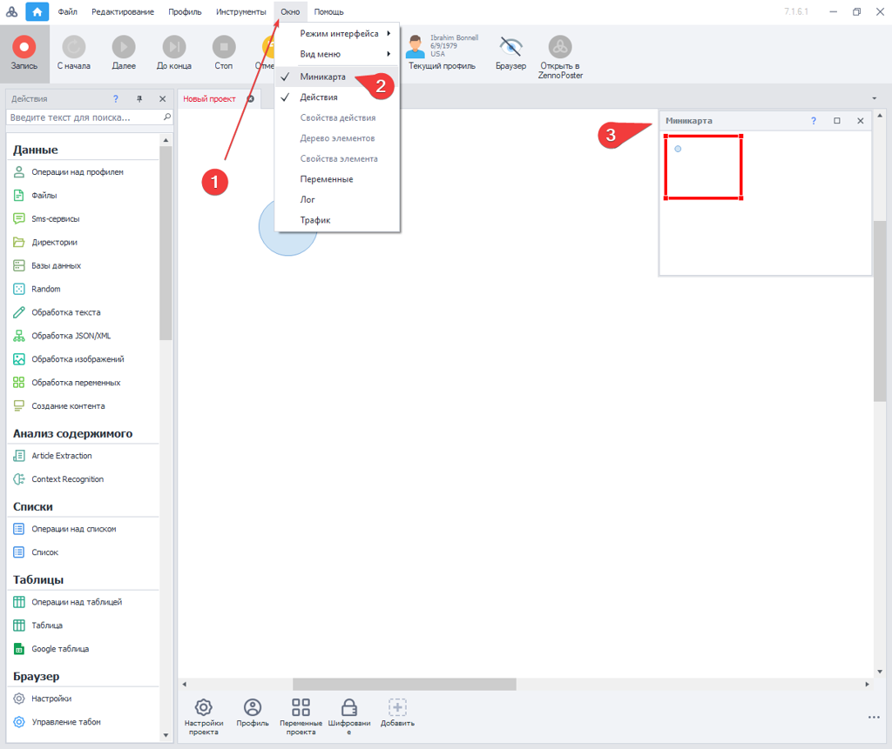
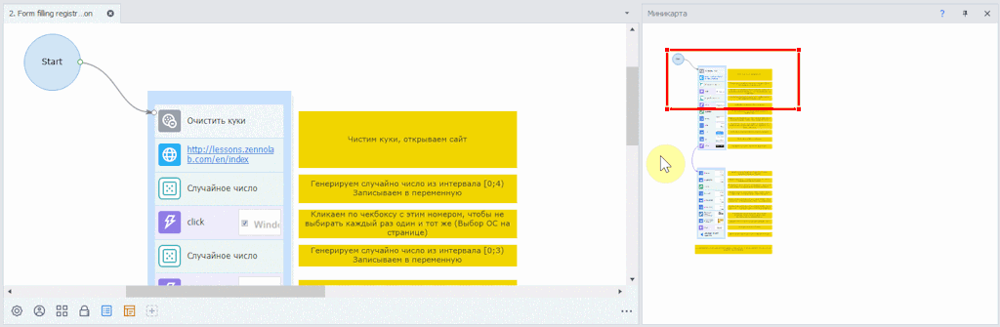
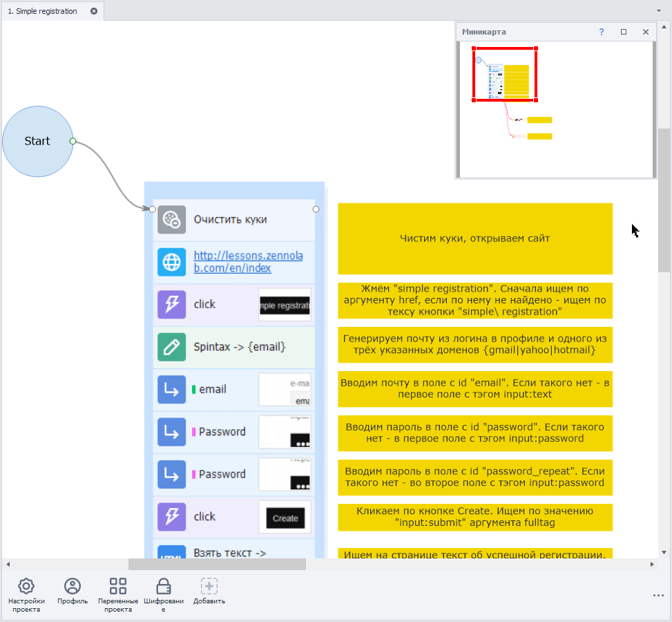
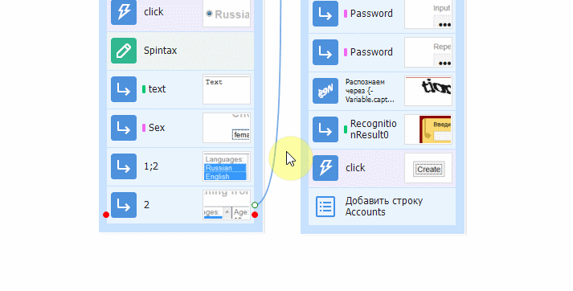
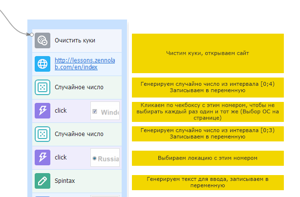
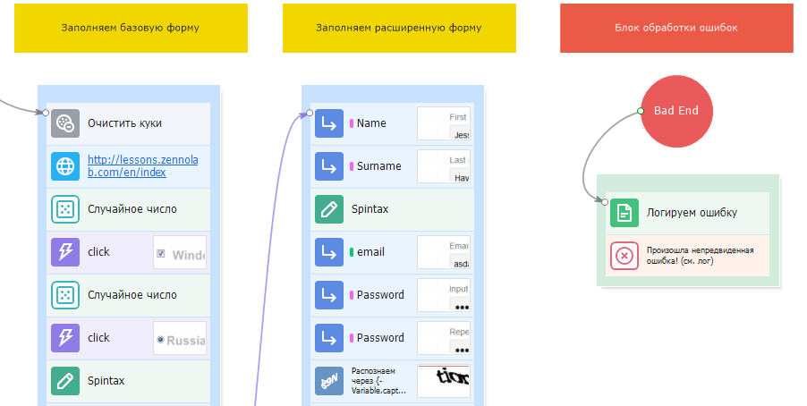
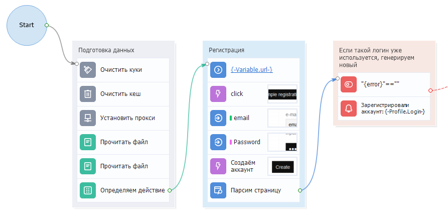

---
sidebar_position: 2
title: "Окно миникарты"
description: ""
date: "2025-07-19"
converted: true
originalFile: "Окно миникарты.txt"
targetUrl: "https://zennolab.atlassian.net/wiki/spaces/RU/pages/735772693"
---
:::info **Пожалуйста, ознакомьтесь с [*Правилами использования материалов на данном ресурсе*](../Disclaimer).**
:::

> 🔗 **[Оригинальная страница](https://zennolab.atlassian.net/wiki/spaces/RU/pages/735772693)** — Источник данного материала

_______________________________________________  
# Окно миникарты

## Описание

Чтобы вызвать данное окно в программе ProjectMaker, необходимо, в верхнем меню нажать:

“Окно” → “Миникарта“

## Область применения

Когда в рабочем пространстве шаблона появляется большое количество действий, миникарта позволит быстро ориентироваться и перемещаться по проекту за считанные секунды. Достаточно просто кликнуть на любую точку карты, чтобы отобразить нужный участок проекта.

## Дополнительные инструменты для удобной работы с проектом ** 

Помимо миникарты, для удобной навигации есть и другие полезные функции:

Изменение масштаба

Вы можете с легкостью менять масштаб проекта, чтобы увидеть всю картину целиком. Для этого вспользуйтесь горячей комбиминацией клавиш `Ctrl` + `Колесико мыши` или `Ctrl` + `+` для увеличения и `Ctrl` + `-` для уменьшения масшатаба.

Интерактивные подсказки для перехода к действию

Когда в шаблоне много стрелок или действия находятся на большом расстоянии друг от друга, это усложняет навигацию по проекту. Чтобы этого не происходило, воспользуйтесь функцией перехода к действию, которая перекинет Вас на нужный экшен.

Как это работает?

1. Наведите курсор на точку крепления кубика, путь которого нужно проследить.
2. Если действие находится за пределами холста, появится интерактивная подсказка.

Также, это актуально в ситуациях, когда к одному блоку подсоединено сразу несколько указателей.

Заметки

С помощью [❗→ заметок](/wiki/spaces/RU/pages/534020312 "/wiki/spaces/RU/pages/534020312") Вы можете прокомментировать определенный набор действий и сгруппировать их по какому-либо цветовому признаку.

Установка цвета для группы экшенов

Благодаря этому Вы сможете маркировать группы по цветам логически, например:
Настройки - **серый**, блок авторизации - **оранжевый**, регистрации - **красный** и т.п.

Также, есть Адаптивный цвет, который окрашивает группу в цвет доминирующих экшенов.

