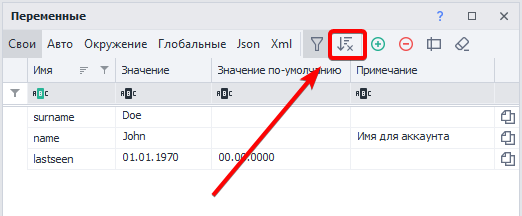
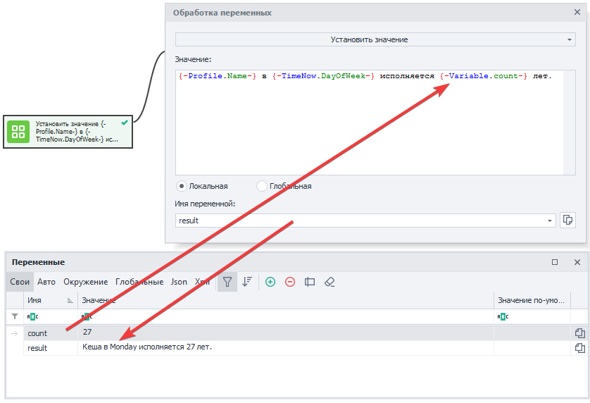

:::info **Пожалуйста, ознакомьтесь с [*Правилами использования материалов на данном ресурсе*](../Disclaimer).**
:::

> 🔗 **[Оригинальная страница](https://zennolab.atlassian.net/wiki/spaces/RU/pages/735608872)** — Источник данного материала

_______________________________________________  
# Окно переменных

## Описание

Окно переменных служит для создания, удаления, переименования переменных проекта и редактирования их значений. По сути это окно представляет собой таблицу с возможностью редактирования и сортировки переменных.

:::note На заметку
Данное окно удобно использовать при отладке.Во время выполнения проекта изменять значения переменных можно с помощью экшена Обработка переменных
:::

  

## Для чего это используется?

- Различные манипуляции с переменными.
- Отслеживание изменений происходящих с переменными в процессе отладки проекта.

  

## Как открыть окно?

- Один из способов открыть “**Окно переменных**” - это нажать на соответствующую кнопку в [❗→ панели статических блоков](/wiki/spaces/RU/pages/534053179 "/wiki/spaces/RU/pages/534053179").

:::warning Внимание
Если вы не видите панель статических блоков, то кликните правой клавишей мыши на пустом пространстве рабочего окна и установите чекбокс “Показать статические блоки” в контекстном меню.
:::

- Второй способ - через меню **Окно =&gt; Переменные**.

  

## Элементы управления

Рассмотрим каждый элемент окна переменных:

### Типы переменных

По сути это таб переключающий отображение выбранного типа переменных. Имеет шесть вариантов: 

#### **Свои**

Это переменные, которые пользователь сам создаёт в процессе написания шаблона. Переменные должны быть обязательно на английском языке. Не допускается использование пробелов и других символов, кроме символа нижнего подчеркивания `_`. В названии переменной разрешается использование цифр, но не в начале слова.

#### **Авто**

Авто-переменные генерируются автоматически в режиме записи проекта, а также при добавлении некоторых [❗→ кубиков](https://zennolab.atlassian.net/wiki/spaces/RU/pages/486342706/ProjectMaker "https://zennolab.atlassian.net/wiki/spaces/RU/pages/486342706/ProjectMaker"), например при автоматическом добавлении кубика [❗→ Взятие значения](/wiki/spaces/RU/pages/534315124 "/wiki/spaces/RU/pages/534315124") . Автосгенерированные переменные имеют примерно такие названия - `Variable1, RecognitionResult0,` однако вы всегда можете переместить авто-переменные в **Свои** и там задать им любое желаемое имя.

##### **Как переместить автоматически созданную переменную в Свои?**

Для этого надо перейти во вкладку **Авто**, выделить переменную и нажать кнопку “Переместить в Свои“:

:::note На заметку
После перемещения переменной в Свои её можно переименовать, дав более понятное имя.
:::

#### Окружение

В этом табе отображаются переменные окружения проекта: различные параметры страницы инстанса (URL, DOM, текст, домен, текст нотификаций и алертов и т. д.), переменные времени и даты, переменные проекта (имя, папка, правила прокси, id последней ошибки и т. д.) , многочисленные переменные профиля (почта, пол, имя, юзерагент и т. д.)

:::note На заметку
С полным списком доступных переменных окружения можно ознакомиться в статье Переменные окружения ZennoPoster
:::

#### Глобальные

Обычные переменные видны только в пределах одного потока проекта (если проект работает в многопоточном режиме, то каждый поток будет иметь свою локальную, независимую переменную)

Глобальные же переменные **доступны для всех проектов и их потоков** в ZennoPoster. 

Для того, чтобы избежать путаницы у глобальных переменных есть дополнительное свойство - *Пространство имён.

:::warning Внимание
У ProjectMaker и ZennoPoster раздельные глобальные переменные. Иными словами изменения внесённые в глобальную переменную в PM не будут видны в ZP, и наоборот.
:::

#### Json

Эти переменные также генерируются автоматически, но в процессе парсинга JSON. В режиме “Парсинг” у экшена “[❗→ Обработка JSON/XML](https://zennolab.atlassian.net/wiki/spaces/RU/pages/488964124/ "https://zennolab.atlassian.net/wiki/spaces/RU/pages/488964124/")“ можно из JSON текста сразу разложить значения по автоматически созданным переменным с соответствующими узлами.

Далее в проекте можно использовать эти переменные через префикс `{ -Json….- }`, либо в [❗→ C#](/wiki/spaces/RU/pages/492011596 "/wiki/spaces/RU/pages/492011596") посредством объекта `project.Json;` Подробнее: [❗→ Обработка JSON и XML](/wiki/spaces/RU/pages/488964124 "/wiki/spaces/RU/pages/488964124") 

#### Xml

Переменные XML автоматически создаются в соответствующем табе после парсинга XML документа. В режиме “**Парсинг**” у экшена “[❗→ Обработка JSON/XML](https://zennolab.atlassian.net/wiki/spaces/RU/pages/488964124/ "https://zennolab.atlassian.net/wiki/spaces/RU/pages/488964124/")“ разбираем XML, который, в свою очередь, тоже может находиться в переменной.

Также как и JSON переменные XML переменные можно использовать через префикс `{ -XML….- }`, либо в [❗→ C#](/wiki/spaces/RU/pages/492011596 "/wiki/spaces/RU/pages/492011596") через свойства объекта `project.XML`;
 Подробнее: [❗→ Обработка JSON и XML](/wiki/spaces/RU/pages/488964124 "/wiki/spaces/RU/pages/488964124") 

### Фильтр

Открывает и закрывает поле фильтрации

#### Поле фильтрации

Если проект имеет большое количество переменных, то поиск нужной переменной может занимать много времени. Поэтому в окне переменных предусмотрена многофункциональная фильтрация. Каждый столбец можно отфильтровать по разному одним из 12-ти способов. 

:::note На заметку
Подробнее о фильтрах можно почитать в статье описывающей Окно лога.
:::

### Очистка сортировки

Сбрасывает отсортированные переменные.

:::note На заметку
Кнопка отображается только в том случае, если переменные отсортированы по одной из колонок. Чуть подробнее о сортировке написано в абзаце про Заголовки.
:::

### Добавить

Открывает диалоговое окно в которое можно ввести имя создаваемой переменной. 

:::note На заметку
Имя переменной может состоять из букв латинского алфавита, цифр и символа нижнего подчёркивания. Но обязательно должно начинаться с буквы.
:::

### Удалить

Удаляет выделенную переменную, предварительно выведя подтверждающее окно. Чтобы выделить переменную достаточно кликнуть по любому месту в строке этой переменной.

### Переименовать

Выводит диалоговое окно с возможностью отредактировать имя переменной. 

:::note На заметку
Быстрый доступ к переименованию - двойной клик по строке переменной в области столбца “Имя”.
:::

:::note На заметку
Переименование доступно только для типов Свои и Глобальные.
:::

:::warning Внимание
Имя переменной изменится так же во всех экшенах, где она используется!
:::

### Очистка неиспользуемых переменных

Часто в больших проектах создаются переменные, которые позднее никак не участвуют в работе шаблона. Чтобы не занимать место в памяти и визуально не занимать ценное рабочее пространство, можно периодически удалять такие переменные. ZennoPoster найдёт все неиспользуемые переменные и выведет их список с предложением удалить их. Каждую очистку необходимо делать для каждого типа переменных.

### Ручная сортировка переменных (Drag & Drop)

:::info Информация
Добавлено в ZennoPoster 7.2.1.0
:::

Вы можете расположить переменные так как Вам удобно с помощью кнопок “Вверх” и “Вниз”, либо с помощью мыши (Drag & Drop). Свой порядок работает тогда, когда выключена сортировка по столбцам (для этого нажмите на кнопку "Очистка сортировки").

Пример

:::note На заметку
Чтобы сбросить ручную расстановку можно отсортировать переменные по одному из столбцов.
:::

### Заголовки столбцов

Одновременно служат как для фильтрации переменных, так и для сортировки. Достаточно кликнуть по заголовку столбца и произойдёт сортировка как по возрастанию имени переменной, так и по убыванию, как по возрастанию значения переменной, так и по убыванию. Повторный клик меняет направление сортировки.

Кликнув ПКМ по заголовку любого столбца появится меню в котором можно выбрать отображаемые колонки.

#### Колонка “Имя”

Здесь отображаются имена переменных используемых в проекте

:::note На заметку
Если дважды кликнуть по имени переменной, то появится диалоговое окно для переименования.
:::

:::warning Внимание
Имена переменных регистрозависимы: Name, NAME, name - три разных переменных!
:::

#### Колонка “Значение”

Выводит текущие значения переменных. Кликнув по значению выбранной переменной можно прямо в поле ввода отредактировать данные.

#### Колонка “Значение по-умолчанию”

Если требуется чтобы при запуске проекта переменная уже имела какое-то значение (при старте проекта все переменные пустые), то необходимо ввести в это поле нужное значение. 

:::note На заметку
Переменные окружения, Json и Xml не имеют значений по умолчанию и поэтому в их представлении этот столбец отсутствует.
:::

#### Колонка “Примечание”

По умолчанию данная колонка скрыта. 

Можно использовать для пометок к переменным (тут можно указать для какой цели используется эта переменная)

:::note На заметку
У глобальных переменных есть дополнительный столбец с пространством имён.
:::

### Скопировать макрос переменной в буфер обмена

Быстрый способ скопировать макрос типа 
`{ -Variable.value- }` кликнуть по такой иконке в строке переменной.

### Контекстное меню

Кликнув ПКМ напротив переменной появится контекстное меню.

:::note На заметку
Доступно для вкладок Свои, Авто и Глобальные.
:::

Вкладки *Свои, Глобальные*

Вкладка *Авто*

* * *

## Копирование переменных из проекта в проект

Нередко требуется создать новый проект используя переменные из старого шаблона. Копировать переменные по одной крайне неэффективное занятие. поэтому можно скопировать сразу все переменные одного проекта и вставить их в другом.

- Откройте старый проект.
- Кликните правой клавишей мыши на кнопке “**Переменные проекта**” в “[❗→ **Панели Статических блоков**](/wiki/spaces/RU/pages/534053179 "/wiki/spaces/RU/pages/534053179")” и нажмите “**Скопировать переменные**”.

- Затем откройте новый проект и опять кликните правой клавишей мыши на кнопке “**Переменные проекта**” в “[❗→ **Панели Статических блоков**](/wiki/spaces/RU/pages/534053179 "/wiki/spaces/RU/pages/534053179")” и нажмите “**Вставить переменные**”.

- В появившемся окне выберите чекбоксами переменные какого типа нужно вставить в проект и подтвердите вставку переменных. Переменные копируются вместе с их значениями по умолчанию.

* * *

## Работа с переменными

### Макросы переменных

В ProjectMaker использовать переменные можно посредством макросов, которые имеют вид `{ -Variable.myVariable- }`- этот макрос при исполнении проекта передаст значение переменной `myVariable`. Достаточно вставить макрос переменной в любое поле свойств экшена (там где это возможно) и при исполнении экшена в поле подставится значение соответствующей переменной.

У глобальных переменных нужно указать в макросе область видимости - `{ -GlobalVariable.someNamespace.text- }`

Операции с переменными с помощью C# и JS экшенов

В основном переменные в ZennoPoster бывают трёх типов:

- **Числовые** (
`0, 1, 12.652, 10500`).
- **Текстовые** (`"Hello World"`, `"
Hello World
"`).
- **Логические** (`True`, `False`).

Производить различные операции с переменными можно как в кубике **C#**, так и в кубике **JavaScript**, но нужно иметь в виду, что в **C#** все переменные попадают в текстовом виде и, чтобы их конвертировать в числа или в логические переменные, потребуется конвертация или приведение в нужный тип. 

Например, вот так выглядит приведение строковых переменных в **C#** к целочисленному (**int**) типу двумя разными способами, сложение их и возврат в строковую переменную для дальнейшего использования в проекте:

Для операций со строками в кубике **JavaScript** необходимо текстовые переменные обернуть в кавычки - `'{ -Variable.value1- }'`

### Рекомендации по именованию переменных

Старайтесь давать переменным названия по которым сразу становится понятна задача и область применения переменной. Не нужно называть переменные короткими и бессмысленными именами - 
`f1`, `qwerty` - этим вы значительно усложните исправление и поддержку проекта как для себя, так и для других разработчиков, которые будут иметь доступ к шаблону. 
Если переменная часто используется в проекте, то желательно назвать её коротко, но понятно - `counter`, `username`, `proxy`. 
Для названий имеющих в основе два и более слова старайтесь разделять их либо заглавной буквой (`secondPassword`), либо символом нижнего подчеркивания (`page_html`). 

Это общепринятые практики, которые значительно улучшат читабельность и эффективность работы с вашим проектом. 

### Присвоение значения

Простейший пример использования переменных заключается в комбинации статического текста, своих переменных и переменных окружения с помощью экшена [❗→ Обработка переменных](/wiki/spaces/RU/pages/486309922 "/wiki/spaces/RU/pages/486309922").

В данном примере имя берется из переменной окружения `{ -Profile.Name- }`, день недели из `{ -TimeNow.DayOfWeek- }`, а возраст из своей переменной `count`. После запуска кубика результат сохраняется в переменной `result`.

### Арифметические операции над числами

Используя синтаксис языка JavaScript и соответствующий кубик можно производить различные математические операции над числами.

В данном случае в переменных `value1` и `value2` находятся целые числа, которые нужно сложить и потом умножить на 10. Результат вычислений попадает в переменную `result`.

### Использование переменных

Старайтесь использовать переменные вместо жёстко прописанного текста в тех местах, где значение может когда-то измениться.

В качестве примера можно привести пути файлов - на Вашем компьютере путь один, а у клиента он другой. Если необходимый файл находится в одной директории с проектом (или в одной из его поддиректорий) то хорошим решением будет использовать макрос `{ -Project.Directory- }` - путь к директории где сохранён шаблон. Вот как может выглядеть путь - `{ -Project.Directory- }file.txt`

  

## Полезные ссылки

- [❗→ Работа с переменными](/wiki/spaces/RU/pages/486309922 "/wiki/spaces/RU/pages/486309922")
- [❗→ Обработка JSON и XML](/wiki/spaces/RU/pages/488964124 "/wiki/spaces/RU/pages/488964124")