---
sidebar_position: 8
title: "Окно профиля"
description: ""
date: "2025-07-19"
converted: true
originalFile: "Окно профиля.txt"
targetUrl: "https://zennolab.atlassian.net/wiki/spaces/RU/pages/735903758"
---
:::info **Пожалуйста, ознакомьтесь с [*Правилами использования материалов на данном ресурсе*](../Disclaimer).**
:::

> 🔗 **[Оригинальная страница](https://zennolab.atlassian.net/wiki/spaces/RU/pages/735903758)** — Источник данного материала

_______________________________________________  
# Окно профиля

## Описание

*Окно профиля служит для отображения информации по текущей личности.

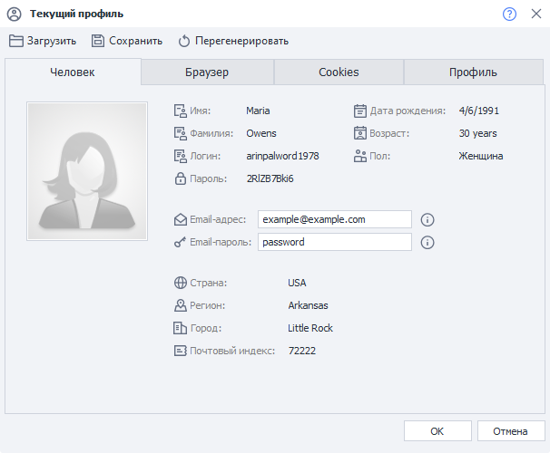


Профиль - это виртуальная личность, данные для которой генерирует ProjectMaker. Вы [❗→ можете произвести более тонкую настройку](/wiki/spaces/RU/pages/483426308 "/wiki/spaces/RU/pages/483426308") для каждого проекта отдельно - выбрать браузер, ОС, платформу, национальность, пол, возраст, эмулируемые данные и др.

  

## Как открыть окно?

Для активации окна необходимо кликнуть по кнопке *Текущий профиль

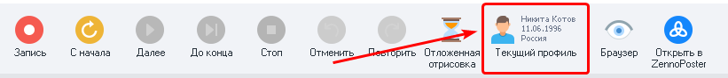


  

## Для чего это используется?

Очень удобно использовать функционал данного окна во время создания или отладки проекта: есть возможность быстро перегенерировать профиль, либо загрузить другой, чтоб посмотреть как проект будет выполняться с разными наборами данных профиля.

:::note На заметку
При сохранении\загрузке профиля, помимо прочего, так же подтягиваются куки и кэш браузера.
:::

  

## Работа с окном

### Загрузка, сохранение и генерация

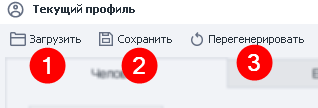


1. **Загрузить -** с помощью данной функции Вы можете загрузить ранее сохранённый профиль. После клика по кнопке откроется стандартное окно выбора файлов.
2. **Сохранить -** сохранение текущего профиля по указанному пути.
3. **Перегенерировать -** полное обновление всех параметров профиля.

:::note На заметку
Во время выполнения проекта загрузить и сохранить профиль можно с помощью экшена Операции над профилем . Так же с его помощью можно изменить некоторые из полей (но не все).
:::

  

### Вкладка “Человек”

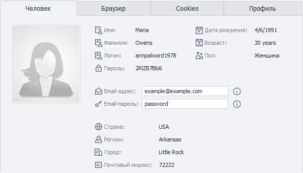


В данной вкладке отображается базовая информация по текущему профилю.

Почти все параметры доступны только для чтения и копирования. Для того чтобы скопировать тот или иной параметр дважды кликните на него, а затем ПКМ по выделению и появится привычное контекстное меню:

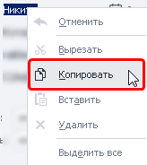


Изменить можно только email и пароль от него. И изменятся они только для текущего профиля. 

:::note На заметку
В настройках программы Вы можете установить email по умолчанию для всех профилей. Так же там можно выставить и национальность профилей.
:::

  

### Вкладка “Браузер”

На данной вкладке можно изменить некоторые параметры, которые будут влиять на поведение браузера.

:::note На заметку
Многие из этих настроек можно включить\выключить с помощью экшена Установки браузера
:::

:::warning Внимание
При перегенерировании профиля эти настройки не сбрасываются!
:::

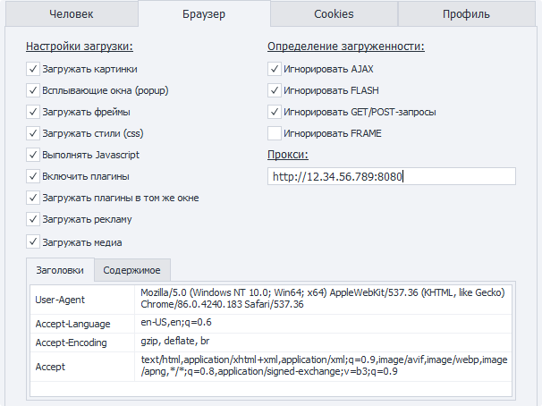


#### Настройки загрузки

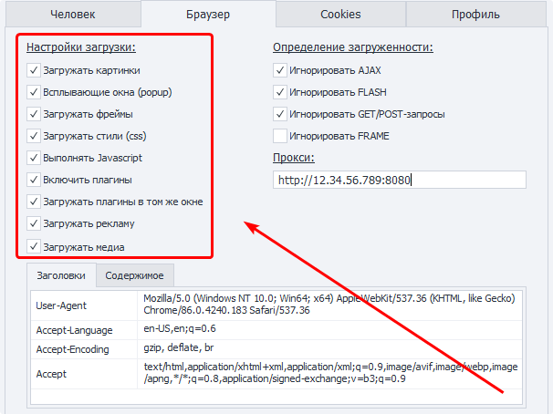


С помощью данных настроек можно отключить\включить загрузку\выполнение тех или иных компонентов веб-страницы. Это может увеличить скорость загрузки страницы, уменьшить потребление трафика. 

:::warning Внимание
Может повлиять на работоспособность сайтов (особенно отключение JavaScript)!
:::

***Загружать картинки** - для некоторых сайтов работа проектов возможна без картинок. Их отключение значительно экономит трафик.

***Всплывающие окна** - эта настройка запрещает открывать новые вкладки в браузере. 
Если по клику по ссылке она должна открыться в новой вкладке, и включена эта настройка, то открытие не произойдёт.

***Загружать фреймы** - если отключено, элементы внутри фреймов (`iframe`) загружаться не будут.

***Загружать стили** - этой опцией можно отключать CSS стили на странице. Данный метод поможет несколько уменьшить потребляемые ресурсы, но также может изменить верстку страницы и привести к ошибкам на ней. Используйте метод отключения аккуратно.

***Выполнять JavaScript** - если отключено, скрипты на странице выполняться не будут. Для большинства современных ресурсов это может сказаться на работоспособности функций сайта.

***Включить плагины** - отключение или включение популярных когда-то браузерных плагинов Flash/Java/Silverlight. Поможет в работе со старыми сайтами, уменьшив нагрузку на ресурсы, и объем передаваемого трафика.

***Загружать плагины в том же окне** - опция позволяет делать скриншоты flash и других плагинов, если загружать в другом окне, вместо изображения плагина будет выводиться пустой квадрат.

***Загружать рекламу** - отключает рекламные баннеры с целью экономии трафика.

***Загружать медиа** - включение/выключение медиа контента с HTML элементами ```xml
<video></video>
```, ```xml
<audio></audio>
``` и т. д. Тоже помогает экономить трафик и ресурсы.

#### Определение загруженности

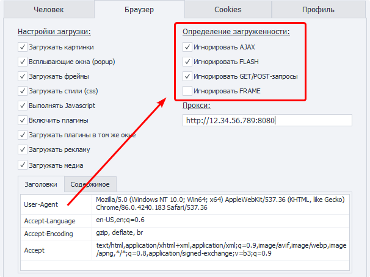


В данных настройках регулируется будет ли браузер игнорировать или ждать загрузки тех или иных компонентов (экшены не выполняются пока браузер ожидает загрузку). 

- Например современные ресурсы любят использовать AJAX и догружать данные уже после загрузки сайта. Отключив опцию “Игнорировать AJAX” ProjectMaker будет ждать завершения каждого такого запроса. Использовать данную опцию необходимо аккуратно, так как некоторые сайты <u data-renderer-mark="true">постоянно</u> отправляют AJAX запросы, что может парализовать работу Вашего шаблона!
- Либо же браузер в течении долгого времени ждёт загрузки фрейма с контентом “упавшего” сайта. В результате тратится время и ресурсы на ожидание.

#### Прокси

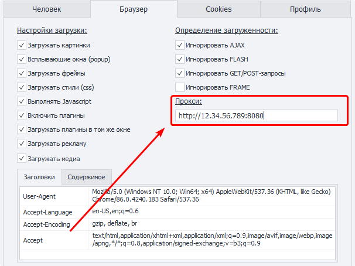


Тут можно указать прокси для данного профиля. Формат с авторизацией `protocol://username:password@ip:port`, без авторизации `protocol://ip:port`. Если `protocol `не указан, то по умолчанию используется `http://`.

#### Заголовки

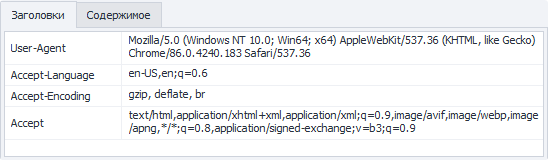


На этой вкладке отображены [заголовки (Headers) браузера](https://developer.mozilla.org/ru/docs/Web/HTTP/%D0%97%D0%B0%D0%B3%D0%BE%D0%BB%D0%BE%D0%B2%D0%BA%D0%B8 "https://developer.mozilla.org/ru/docs/Web/HTTP/%D0%97%D0%B0%D0%B3%D0%BE%D0%BB%D0%BE%D0%B2%D0%BA%D0%B8"). Их значения можно менять прямо в этом окне. 

:::warning Внимание
Если включена Запись, то после внесения каких-либо изменений в настройках описанных выше (начиная с Настроек загрузки и заканчивая Заголовками) и нажатия кнопки ОК на холсте будут созданы соответствующие экшены.
:::

#### Содержимое

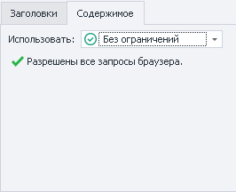


На данной вкладке можно регулировать какие адреса и домены браузер будет игнорировать, а какие загружать. Более подробно этот функционал описан в статье про [❗→ Окно траффика](/wiki/spaces/RU/pages/735805465 "/wiki/spaces/RU/pages/735805465") , в частности в разделе про [❗→ Политику содержимого](https://zennolab.atlassian.net/wiki/spaces/RU/pages/735805465#%D0%9F%D0%BE%D0%BB%D0%B8%D1%82%D0%B8%D0%BA%D0%B0-%D1%81%D0%BE%D0%B4%D0%B5%D1%80%D0%B6%D0%B8%D0%BC%D0%BE%D0%B3%D0%BE.-%D0%91%D0%B5%D0%BB%D1%8B%D0%B9-%D0%B8-%D1%87%D1%91%D1%80%D0%BD%D1%8B%D0%B9-%D1%81%D0%BF%D0%B8%D1%81%D0%BA%D0%B8 "https://zennolab.atlassian.net/wiki/spaces/RU/pages/735805465#%D0%9F%D0%BE%D0%BB%D0%B8%D1%82%D0%B8%D0%BA%D0%B0-%D1%81%D0%BE%D0%B4%D0%B5%D1%80%D0%B6%D0%B8%D0%BC%D0%BE%D0%B3%D0%BE.-%D0%91%D0%B5%D0%BB%D1%8B%D0%B9-%D0%B8-%D1%87%D1%91%D1%80%D0%BD%D1%8B%D0%B9-%D1%81%D0%BF%D0%B8%D1%81%D0%BA%D0%B8")

:::warning Внимание
Независимо от того включена Запись или нет, после внесения изменений и нажатия ОК будет создан экшен Политика содержимого со всеми внесёнными данными.
:::

### Вкладка “Cookies”

:::info Информация
Добавлено в версии 7.2.1.1
:::

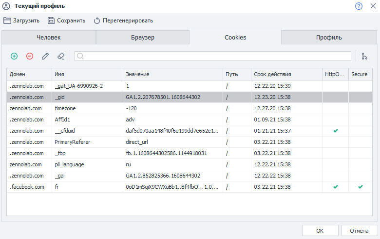


В данной вкладке отображаются все куки, которые есть у текущего профиля.

**Редактирование**

В данном окне вы можете не только просматривать куки, но и редактировать их.

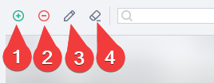


1. Добавить новую куку.
2. Удалить выделенную.
3. Редактировать.
4. С помощью кнопки “Очистить” вы можете удалить сразу все куки.

**Поиск**

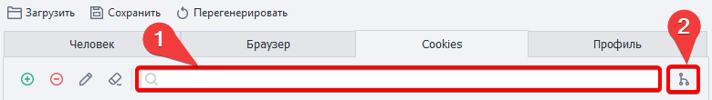


Вы можете отфильтровать отображаемые куки используя соответствующее поле (1).

Так же можно сгруппировать куки по домену (2).

Эти инструменты можно комбинировать.

### Вкладка “Профиль”

В данной вкладке отображается подробная информация как по сгенерированной личности (имя, фамилия, дата рождения, логин и т.д.) так и по браузеру и системе (более подробно об этих параметрах можно почитать [❗→ в этой статье](https://zennolab.atlassian.net/wiki/spaces/RU/pages/483426308#%D0%92%D0%BA%D0%BB%D0%B0%D0%B4%D0%BA%D0%B0-%D0%91%D1%80%D0%B0%D1%83%D0%B7%D0%B5%D1%80 "https://zennolab.atlassian.net/wiki/spaces/RU/pages/483426308#%D0%92%D0%BA%D0%BB%D0%B0%D0%B4%D0%BA%D0%B0-%D0%91%D1%80%D0%B0%D1%83%D0%B7%D0%B5%D1%80"))

  

## Доступ к данным профиля через переменные

### Окно переменные

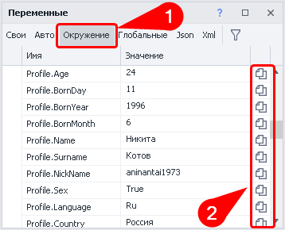


Список доступных для работы переменных можно найти в [❗→ окне переменных](/wiki/spaces/RU/pages/735608872 "/wiki/spaces/RU/pages/735608872") на вкладке *Окружение^(1)^ (надо пролистать до переменных, которые начинаются с *Profile), там же можно сразу скопировать макрос переменной^(2)^

### Вручную

В любом поле, которое поддерживает макросы переменных (например в действии [❗→ Оповещение](/wiki/spaces/RU/pages/534053050 "/wiki/spaces/RU/pages/534053050")) нажимаем комбинацию клавиш ctrl+пробел, из выпадающего списка выбираем *Profile. Затем ставим точку и появится ещё один выпадающий список со всеми переменными профиля, двойной клик по необходимому полю и макрос автоматически вставится.

**CTRL+пробел**

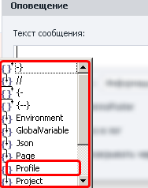


**Выбор нужного поля**

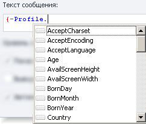


**Окончательный вид макроса**

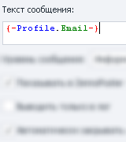


:::note На заметку
Есть несколько переменных, которые не отображаются на вкладке “Человек” в Окне профиля но они есть в Окне переменных и их можно вставить вручную: `{ -Profile.NickName- }`(значение этого поля отличается от `{ -Profile.Login- }`, которое отображается на вкладке), `{ -Profile.SecretQuestionAnswer1- }`, `{ -Profile.SecretQuestionAnswer2- }`
:::

### Пол профиля (`{ -Profile.Sex- }`)

Стоит обратить внимание на то, что пол профиля в ProjectMaker имеет булевый тип:

- мужской - True
- женский - False

  

## Пример использования

Примеры использования можно найти в статье об экшене [❗→ Операции над профилем](https://zennolab.atlassian.net/wiki/spaces/RU/pages/486539291#%D0%92%D0%BE%D0%B7%D0%BC%D0%BE%D0%B6%D0%BD%D0%BE%D0%B5-%D0%BF%D1%80%D0%B0%D0%BA%D1%82%D0%B8%D1%87%D0%B5%D1%81%D0%BA%D0%BE%D0%B5-%D0%BF%D1%80%D0%B8%D0%BC%D0%B5%D0%BD%D0%B5%D0%BD%D0%B8%D0%B5 "https://zennolab.atlassian.net/wiki/spaces/RU/pages/486539291#%D0%92%D0%BE%D0%B7%D0%BC%D0%BE%D0%B6%D0%BD%D0%BE%D0%B5-%D0%BF%D1%80%D0%B0%D0%BA%D1%82%D0%B8%D1%87%D0%B5%D1%81%D0%BA%D0%BE%D0%B5-%D0%BF%D1%80%D0%B8%D0%BC%D0%B5%D0%BD%D0%B5%D0%BD%D0%B8%D0%B5") или в статье про [❗→ настройку параметров генерации профиля](https://zennolab.atlassian.net/wiki/spaces/RU/pages/483426308#%D0%94%D0%BB%D1%8F-%D1%87%D0%B5%D0%B3%D0%BE-%D1%8D%D1%82%D0%BE-%D0%B8%D1%81%D0%BF%D0%BE%D0%BB%D1%8C%D0%B7%D1%83%D0%B5%D1%82%D1%81%D1%8F%3F "https://zennolab.atlassian.net/wiki/spaces/RU/pages/483426308#%D0%94%D0%BB%D1%8F-%D1%87%D0%B5%D0%B3%D0%BE-%D1%8D%D1%82%D0%BE-%D0%B8%D1%81%D0%BF%D0%BE%D0%BB%D1%8C%D0%B7%D1%83%D0%B5%D1%82%D1%81%D1%8F%3F"). Дополнительно профиль можно применять при использовании [❗→ GET](/wiki/spaces/RU/pages/534315165 "/wiki/spaces/RU/pages/534315165")-, [❗→ POST](/wiki/spaces/RU/pages/534315180 "/wiki/spaces/RU/pages/534315180")-, и [❗→ других](/wiki/spaces/RU/pages/489259052 "/wiki/spaces/RU/pages/489259052")запросов (использовать можно как текущий профиль так и ранее сохранённый) для подстановки заголовков.

  

## Полезные ссылки

- [❗→ Профиль](/wiki/spaces/RU/pages/483426308 "/wiki/spaces/RU/pages/483426308")
- [❗→ Операции над профилем](/wiki/spaces/RU/pages/486539291 "/wiki/spaces/RU/pages/486539291")
- [❗→ Профиль (PM)](/wiki/spaces/RU/pages/735608848 "/wiki/spaces/RU/pages/735608848")
- [❗→ Окно переменных](/wiki/spaces/RU/pages/735608872 "/wiki/spaces/RU/pages/735608872")
- [❗→ Установки браузера](/wiki/spaces/RU/pages/489324572 "/wiki/spaces/RU/pages/489324572")
- [❗→ Использование профиль-папки](/wiki/spaces/RU/pages/1251475485 "/wiki/spaces/RU/pages/1251475485")