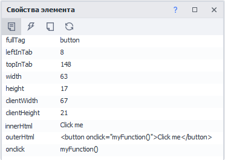
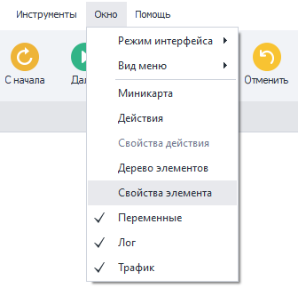
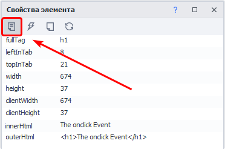
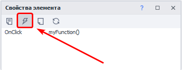
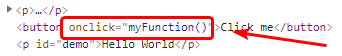
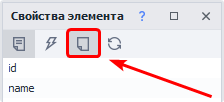
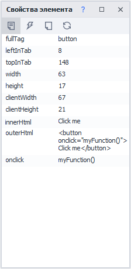
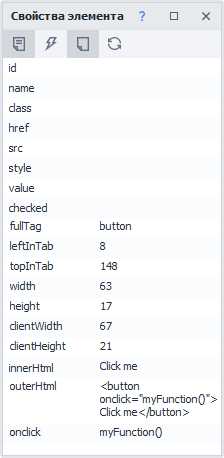
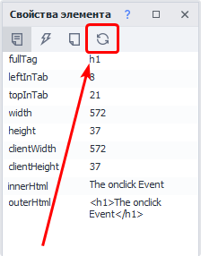

---
sidebar_position: 6
title: "Окно свойства элемента"
description: ""
date: "2025-07-19"
converted: true
originalFile: "Окно свойства элемента.txt"
targetUrl: "https://zennolab.atlassian.net/wiki/spaces/RU/pages/735608879"
---
:::info **Пожалуйста, ознакомьтесь с [*Правилами использования материалов на данном ресурсе*](../Disclaimer).**
:::

> 🔗 **[Оригинальная страница](https://zennolab.atlassian.net/wiki/spaces/RU/pages/735608879)** — Источник данного материала

_______________________________________________  
# Окно свойства элемента

## Описание

При работе с HTML-кодом страницы, в зависимости от тега, элемент имеет свои атрибуты, которые помогают анализировать или идентифицировать объект, для последующей работы с ним.

При анализе исходного кода, не редко встречаются (на первый взгляд) одинаковые элементы, что может дать некорректный результат при работе с данными. Воспользовавшись окном *Свойства элемента, можно детально изучить объекты, а именно их атрибуты (свойства)

  

## Как работать с окном?

### Включение окна

Чтобы его включить надо кликнуть в верхнем меню по пункту *Окно и выбрать пункт **Свойства элемента**: 

### Отображение информации по нужному элементу

Есть несколько способов как отобразить информацию в этом окне по интересующему Вас элементу

- добавить его в [❗→ Конструктор действий и Поиск по XPath](/wiki/spaces/RU/pages/483426337 "/wiki/spaces/RU/pages/483426337")
- выбрать в [❗→ окне дерева элементов](/wiki/spaces/RU/pages/727777355 "/wiki/spaces/RU/pages/727777355")
- ПКМ по нужному элементу и из контекстного меню выбрать *Исследовать или *Следовать за курсором.

### Вкладка “Свойства”

Эта вкладка открыта по умолчанию. 

На ней отображаются атрибуты выбранного HTML элемента.

### Вкладка “События”

На данной вкладке отображаются привязанные к этому элементу JavaScript события.

**ВАЖНО!** Событие отобразится тут только в том случае, если оно явно указано как атрибут в HTML коде анализируемого элемента:

### Кнопка “Показать пустые поля”

При включении, во вкладках “Свойства” и “События”, дополнительно будут отображены пустые атрибуты\события.

**До включения**

**После включения**

### Кнопка “Обновить поля“

С помощью данной кнопки можно обновить значения атрибутов элемента

  

## Полезные ссылки

- [❗→ Окно дерева элементов](/wiki/spaces/RU/pages/727777355 "/wiki/spaces/RU/pages/727777355")
- [❗→ Конструктор действий и Поиск по XPath](/wiki/spaces/RU/pages/483426337 "/wiki/spaces/RU/pages/483426337")
- [❗→ Инструменты web-разработчика (DevTools)](/wiki/spaces/RU/pages/1331134465 "/wiki/spaces/RU/pages/1331134465")
- [❗→ Просмотр текста страницы](/wiki/spaces/RU/pages/735903769 "/wiki/spaces/RU/pages/735903769")