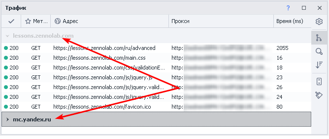

:::info **Пожалуйста, ознакомьтесь с [*Правилами использования материалов на данном ресурсе*](../Disclaimer).**
:::

> 🔗 **[Оригинальная страница](https://zennolab.atlassian.net/wiki/spaces/RU/pages/735805465)** — Источник данного материала

_______________________________________________  
# Окно трафика

## Описание

В окно трафика попадают все запросы которые делает браузер ProjectMaker’а. Сюда так же попадут и запросы сделанные с помощью экшенов [❗→ GET-запрос](/wiki/spaces/RU/pages/534315165 "/wiki/spaces/RU/pages/534315165") , [❗→ POST-запрос](/wiki/spaces/RU/pages/534315180 "/wiki/spaces/RU/pages/534315180") , [❗→ HTTP запросы](/wiki/spaces/RU/pages/489259052 "/wiki/spaces/RU/pages/489259052") 

|  |
| :--: |
| Вид окна трафика после перехода на https://lessons.zennolab.com/ru/advanced |

  

## Как работать с окном трафика?

### Включение

В верхнем меню ищем *Окно и в выпадающем списке выбираем *Трафик.

Что делать если окно не отображается

Бывают случаи, когда окно не отображается, хоть возле него в настройках и стоит чекбокс (как показано на скриншоте выше), говорящий о том, что оно включено. Если после нескольких попыток его включить оно так и не появилось, то можно произвести общий сброс настроек окон в ProjectMaker. 

**ВНИМАНИЕ!** Описанные далее действия приведут к сбросу настроек окон, другими словами если Вы настроили интерфейс программы под себя, расположив её окна удобным для Вас способом, то все эти настройки будут удалены и будет установлено значение по умолчанию.

Заходим в настройки (*Редактирование-Настройки), выбираем вкладку *Отладка ** и в самом низу окна ищем кнопку *Сбросить панели. После нажатия данной кнопки и перезагрузки ProjectMaker все настройки окон будут сброшены, но и включение окна должно корректно работать.

  

### Внешний вид окна

#### Список сделанных запросов

Содержит следующие колонки:

- Статус ответа (может быть 200, 403, 404, 407, 503 и др.)
- Метод запроса ([❗→ GET-запрос](/wiki/spaces/RU/pages/534315165 "/wiki/spaces/RU/pages/534315165"), [❗→ POST-запрос](/wiki/spaces/RU/pages/534315180 "/wiki/spaces/RU/pages/534315180"), [❗→ PUT, DELETE и др.](/wiki/spaces/RU/pages/489259052 "/wiki/spaces/RU/pages/489259052"))
- URL по которому был запрос
- [❗→ Прокси](/wiki/spaces/RU/pages/492208129 "/wiki/spaces/RU/pages/492208129")(если использовался)
- Время (ms) - время в миллисекундах, затраченное на запрос

#### Настройки политики содержимого

Этот пункт описан ниже в статье.

#### Сгруппировать по домену

Для каждого домена будет создана вкладка с его запросами (для каждого поддомена создаётся собственная вкладка):

Пример

#### Панель поиска

Можно использовать в паре с “Группировкой”.

Пример

На скриншоте показан пример поиска загруженных JavaScript файлов для домена http://yandex.ru

#### Сортировка по умолчанию

Если кликнуть по заголовку любой колонки, то запросы отсортируются в алфавитном порядке по данной колонке. Опция *Сортировка по умолчанию позволяет восстановить исходный порядок запросов - по времени их отправки.

#### Автопрокрутка

При активной данной опции окно трафика будет автоматически прокручиваться при поступлении новых запросов. Таким образом самый новый запрос всегда будет в поле зрения.

#### Очистка

Удаляет все запросы из окна.

#### Включение/отключение колонок

Если кликнуть ПКМ по любому заголовку то появится контекстное меню в котором можно включить/выключить отображаемые колонки

#### Подробная информация о запросе

При двойном клике по любому запросу в окне трафика откроется подробная информация по данному запросу. Данное окно содержит четыре вкладки. Коротко пройдём по всем:

**Заголовки**

Эта вкладка содержит основную информацию по запросу:

- URL
- Метод
- Статус ответа
- Прокси (если использовался)
- Заголовки запроса и ответа

**Куки**

Отправленные и полученные куки

**Параметры**

Параметры отправленные в запросе:

- *Строка запроса - тут будут параметры, которые отправлены как часть URL (для запроса с данного скриншота URL выглядел так - `https://httpbin.org/post?urlparam1=val1&urlparam2=ProjectMaker`)
- *Данные запроса - параметры отправленные в теле запроса.

**Ответ**

На скриншоте показан ответ сервера после [❗→ POST запроса](/wiki/spaces/RU/pages/534315180 "/wiki/spaces/RU/pages/534315180") на https://httpbin.org/post.

  

## Для чего это используется?

- Анализ сделанных браузером запросов:

 - для составления собственных запросов с помощью экшенов [❗→ GET-запрос](/wiki/spaces/RU/pages/534315165 "/wiki/spaces/RU/pages/534315165") , [❗→ POST-запрос](/wiki/spaces/RU/pages/534315180 "/wiki/spaces/RU/pages/534315180") , [❗→ HTTP запросы](/wiki/spaces/RU/pages/489259052 "/wiki/spaces/RU/pages/489259052")
- Блокировка нежелательных запросов (с использованием белых или черных списков)

  

## Контекстное меню запроса

Кликнув ПКМ по любому запросу в окне траффика появится контекстное меню с дополнительными возможностями.

### Копирование данных запроса

С лёгкостью можно скопировать URL запроса, заголовки (как запроса так и ответа) и ответ от сервера.

### Автоматическое создание запросов

ProjectMaker автоматически создаст экшен с необходимым типом запроса. Подставит заголовки, параметры, прокси (если использовался). 

:::note На заметку
После создания всё же лучше вручную проверить данные, которые попали в экшен.
:::

### Политика содержимого. Белый и чёрный списки

С помощью *политики содержимого Вы можете запрещать\разрешать PorjectMaker загружать определённые домены, URL. Для этого так же можно использовать [❗→ регулярные выражения](/wiki/spaces/RU/pages/534086111 "/wiki/spaces/RU/pages/534086111"). 

Существует три возможных состояния:

:::warning Внимание
В один момент времени может использоваться либо черный, либо белый список
:::

1. *Без ограничений - будут загружены все адреса без исключений.
2. *Белый список - будут загружены только те домены и адреса, которые указаны в белом списке.
3. Черный список - будут загружены все адреса, кроме тех, что находятся в черном списке.

#### Для чего это может понадобится?

- ProjectMaker ждёт полной загрузки страницы прежде чем выполнить любой экшен. Но бывают ситуации когда страница находится в состоянии вечной загрузки или о-о-очень до-о-о-олгой загрузки страницы из-за чего выполнение шаблона замедляется. Проблема может быть в том, что браузер пытается загрузить какой-то скрипт со стороннего ресурса, но у него это по какой-то причине не получается. Тут-то Вам и поможет *Политика содержимого - добавьте адрес скрипта в Черный список, переключите состояние политики на *Черный список и этот незагружаемый скрипт больше не будет портить Вам жизнь.
- за счёт блокировки нежелательных адресов Вы сможете:

 - увеличить скорость загрузки страниц
 - повысить стабильность работы шаблонов
 - уменьшить количество потребляемого трафика (особенно актуально для прокси с лимитированным трафиком)

#### Как это работает?

Существует несколько способов включения чёрного\белого списков.

**Способ №1** (самый простой)

Клик ПКМ в *Окне трафика по необходимому запросу и добавление домена или адреса из этого запроса в один из списков. Если до этого в проекте не существовало экшена *Политика содержимого то он будет автоматически добавлен (режим во вновь добавленном экшене будет зависеть от того в какой список Вы добавили домен\адрес - белый или чёрный)

Добавленные таким образом элементы можно будет потом отредактировать вручную в самом экшене.

**Способ №2** (через контекстное меню)

**Добавить действие** → **Браузер** → **Настройки**

В настройках экшена (в выпадающем меню) ищем *Политика содержимого

1. Выбор режима работы.
2. Адрес для фильтрации (домен или [❗→ регулярное выражение](/wiki/spaces/RU/pages/534086111 "/wiki/spaces/RU/pages/534086111"))
3. Режим обработки адреса из пункта №2
4. С помощью данной кнопки можно удалить условие (альтернативный вариант: выделить нужное условие и нажать клавишу DELETE на клавиатуре)

**Способ №3** (через [❗→ *Окно профиля](/wiki/spaces/RU/pages/735903758 "/wiki/spaces/RU/pages/735903758"))

Сначала кликаем по иконке *Профиль в главном окне ProjectMaker^(1)^, откроется окно *Текущий профиль, в нём открываем вкладку *Браузер^(2)^. В нижней части данной вкладки надо активировать *Содержимое^(3)^. Тут можно в ручном режиме добавить новые условия для фильтрации запросов.

Добавление нового правила

В версии 7.1.6.0 со стандартной темой оформления (*Интерфейс - Light, *Редактор - Modern2) может быть не совсем очевидным, как добавлять новые правила в ручном режиме (это касается как метода через профиль, так и через экшен).

Сразу после добавления экшена и выбора одного из режимов (Белый или чёрный список) будет выделена верхняя строка.

После добавления нового условия и выбора типа обработки курсор не переходит на новую строку и не появляется кнопки “Добавить”

Чтобы добавить новое правило необходимо несколько раз кликнуть под вновь добавленным условием и у Вас появится возможность создать ещё одно.

Ниже прикреплена GIF-анимация на которой запечатлён весь этот процесс (при добавлении через профиль всё идентично)

  

## Пример использования

Рассмотрим пример на основе форума https://zennolab.com/discussion/

Открыв окно трафика и совершив переход по вышеуказанному URL Вы увидите большое количество запросов, которые делает браузер - к VK, Facebook, Yandex, Google, CloudFlare и другим ресурсам помимо https://zennolab.com/discussion/. 

|  |
| :--: |
| На скриншоте отображена лишь малая часть запросов. |

Представим, что Вам необходимо запретить запросы к VK, Facebook и Yandex. Дополнительно Вы хотите запретить загрузку адресов в которых встречается слово *analytics (в любом месте URL'а). Вот как может выглядеть экшен *Политика содержимого для выполнения вышепоставленных задач:

Вот так выглядит *Окно трафика после применения правил со скриншота выше и повторного захода на https://zennolab.com/discussion/

  

## Полезные ссылки

- [❗→ GET-запрос](/wiki/spaces/RU/pages/534315165 "/wiki/spaces/RU/pages/534315165")
- [❗→ POST-запрос](/wiki/spaces/RU/pages/534315180 "/wiki/spaces/RU/pages/534315180")
- [❗→ HTTP запросы](/wiki/spaces/RU/pages/489259052 "/wiki/spaces/RU/pages/489259052")
- [❗→ Тестер регулярных выражений](/wiki/spaces/RU/pages/534086111 "/wiki/spaces/RU/pages/534086111")
- [❗→ Инструменты web-разработчика (DevTools)](/wiki/spaces/RU/pages/1331134465 "/wiki/spaces/RU/pages/1331134465")