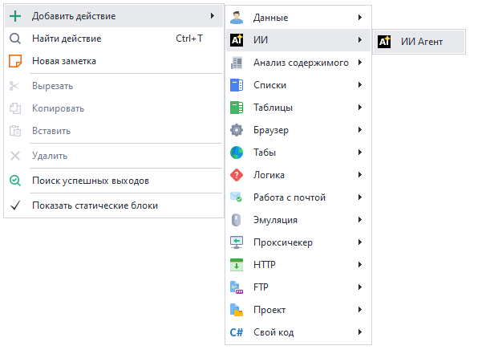
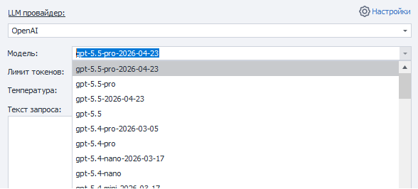
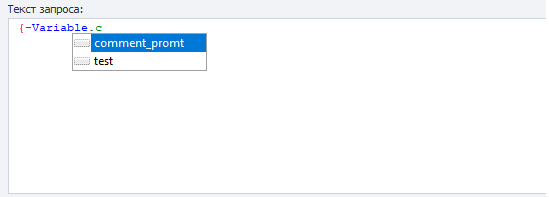

## Описание
Данный экшен используется для работы с LLM-провайдерами (OpenAI, Anthropic, DeepSeek, Gemini, Perplexity), позволяет отправлять текстовый промпт из запроса/переменной и получать ответ в переменную.


### Как добавить действие в проект?
Через контекстное меню: **Добавить действие → ИИ → ИИ Агент**



### Для чего это используется?
- Поддерживать диалог с ИИ
- Писать и генерировать статьи, посты, тексты
- Создавать и применять промпты
- Анализировать и классифицировать данные
- Автоматизировать создание контента

_______________________________________________
## Принцип работы

### Основные настройки


1. Выбор модуля LLM из выпадающего списка.
2. Предварительно надо указать ваш API ключ от сервиса в настройках.

_______________________________________________
### Модель


Модель — название LLM-модели, которая будет использоваться для генерации текста.

После выбора провайдера список моделей автоматически подгружается в выпадающий список.
Если вы используете собственный LLM сервис, укажите название модели вручную.

От выбранной модели зависят:
- качество ответов;
- скорость генерации;
- стоимость запросов.

_______________________________________________
### Лимит токенов
Лимит токенов — параметр, который ограничивает максимальное количество токенов, которое модель может сгенерировать в ответе.

Подходит для:
- контроля длины ответа;
- снижения стоимости API-запросов;
- уменьшения задержки генерации;
- предотвращения «слишком длинных» ответов.

Особенности:
- учитываются именно выходные токены (output), а не входной prompt (контролируйте входной промт в поле «Текст запроса»);
- если лимит достигнут, генерация останавливается;
- слишком маленькое значение может обрезать ответ на полуслове.

По умолчанию стоит **400**, увеличьте значение если вам нужны длинные ответы (также можете добавить доп. ограничение в тексте промта, например — `«Комментарий длиной в 300 символов»`).

:::info Токен — не слово и не символ
Важно понимать, что токен — это не слово и не символ, а кусок текста, поэтому длина сильно зависит от языка и текста.
:::

Примерные оценки для современных LLM:

| Язык        | 1 токен ≈                        | 100 токенов ≈                              |
|-------------|----------------------------------|--------------------------------------------|
| Английский  | 3–4 символа / ~0.75 слова        | ~70–80 слов                                |
| Русский     | 2–3 символа / ~0.4–0.6 слова     | ~40–60 слов                                |
| Немецкий    | 2–4 символа                      | ~50–70 слов                                |
| Китайский   | 1–2 иероглифа                    | ~100–150 иероглифов                        |
| Японский    | 1–2 символа                      | ~80–120 символов                           |
| Код         | очень зависит от синтаксиса      | часто токенов больше, чем в обычном тексте |

:::warning
Русский текст обычно «дороже» по токенам, чем английский той же длины.
:::

_______________________________________________
### Температура
Температура — параметр, который управляет степенью случайности и креативности генерации текста.

Как работает:
- низкие значения → ответы более точные, предсказуемые и стабильные;
- высокие значения → ответы более разнообразные, творческие и неожиданные.

Типичный диапазон: от `0` до `2` (в зависимости от LLM).

Практика использования:
- `0.0–0.3` → код, SQL, документация, точные ответы;
- `0.4–0.7` → обычный чат и большинство задач (по умолчанию);
- `0.8–1.2+` → креатив, идеи, сторитейлинг.

Особенности:
- Температура `0` не гарантирует 100% одинаковый результат, но делает ответы максимально детерминированными;
- высокая температура повышает вероятность нестандартных формулировок и ошибок.

_______________________________________________
### Текст запроса


Текст запроса (или prompt) — это инструкция и входные данные, которые передаются модели для генерации ответа.

:::tip
Можно использовать макросы переменной или проекта.
:::

Именно prompt определяет:
- что должна сделать модель;
- в каком формате отвечать;
- какой стиль использовать;
- какие данные анализировать.

Хороший prompt обычно включает:
- задачу;
- контекст;
- ограничения;
- желаемый формат ответа.

#### Пример хорошего промта для x.com

```
Ты активный пользователь Crypto Twitter.

Напиши reply к посту в стиле опытного crypto/AI пользователя.

Тон:
- умный, но не слишком официальный
- коротко и по делу
- допускаются мемные фразы
- максимум 280 символов
- без хэштегов
- без эмодзи-spam

Пост:
{-POST_TEXT-}

Верни только reply.
```

_______________________________________________
### Положить в переменную
Выбираем переменную, в которую будет возвращён результат работы.

_______________________________________________
## Полезные ссылки

- [❗→ Окно трафика](/wiki/spaces/RU/pages/735805465 "/wiki/spaces/RU/pages/735805465")
- [❗→ Окно переменных](/wiki/spaces/RU/pages/735608872 "/wiki/spaces/RU/pages/735608872")
- [❗→ Данные](https://zennolab.atlassian.net/wiki/spaces/RU/pages/534085840/- "https://zennolab.atlassian.net/wiki/spaces/RU/pages/534085840/-")
- [❗→ Настройки ИИ](/zennoposter/ProjectMaker/ProjectMaker%20Settings/AI_PM)
