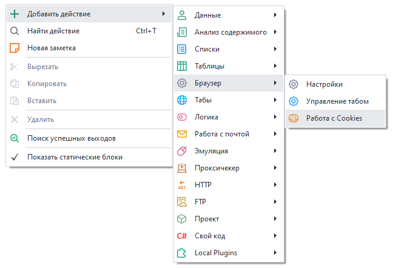
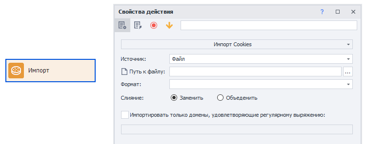
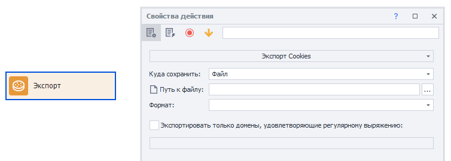
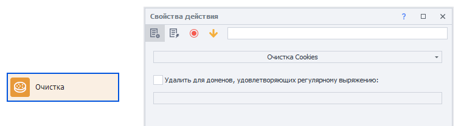

---
sidebar_position: 0
title: "Работа с Cookies"
description: " "
date: "2025-07-24"
converted: true
originalFile: "Работа с Cookies.txt"
targetUrl: "https://zennolab.atlassian.net/wiki/spaces/RU/pages/1307738124/Cookies"
---
import DisclaimerNotice from '@site/src/components/DisclaimerNotice';

<DisclaimerNotice />

> 🔗 **[Оригинальная страница](https://zennolab.atlassian.net/wiki/spaces/RU/pages/1307738124/Cookies)** — Источник данного материала

_______________________________________________  
## Описание
:::info Добавлено в ZennoPoster 7.3.1.0
:::  

Данное действие позволяет работать с куками проекта. Доступен импорт, экспорт и очистка.  

В качестве источника загрузки и сохранения можно использовать файл или переменную. Поддерживаются форматы [Netscape](./Netscape_cookie_file_format) и [JSON](./Json_cookie_file_format).

:::tip Отлично дополняет [*Инструмент по управлению Cookie*](../../../../Program-interface/Profile_Window#вкладка-cookies).
::: 

### Как добавить действие в проект?
Через контекстное меню: **Добавить действие → Браузер → Работа с Cookie**

### Для чего это используется?
- Импортировать куки из купленных аккаунтов
- Экспортировать куки для использования в обычном браузере
- Добавить недостающие куки в профиль
_______________________________________________
## Принцип работы
### Импорт
Загружает Cookie в профиль для использования в проекте с браузером или без.

#### Источник
Выбираем, откуда будут загружены куки:  
- *из файла*  
- *из переменной*

#### Путь к файлу
> Этот пункт отображается, если в качестве источника выбран **Файл**.

Указываем полный путь к файлу, из которого будут загружены куки.

#### Переменная
> Этот пункт отображается, если в качестве источника выбрана **Переменная**.

Необходимо выбрать переменную, в которой сохранены куки.

#### Формат
Тут необходимо выбрать формат загружаемых cookie. Возможные варианты: [Netscape](./Netscape_cookie_file_format) и [JSON](./Json_cookie_file_format).

#### Слияние
- **Заменить** — перед установкой новых кук текущие будут удалены.
- **Объединить** — текущие куки в браузере будут объединены с загружаемыми.

:::warning При совпадении имён кука из браузера будет замещена загружаемой.
:::

#### Импортировать только домены, удовлетворяющие регулярному выражению
Если нужно загружать cookie только для определённых доменов, то советуем включить эту настройку и составить регулярное выражения.

### Экспорт
Выполняется выгрузка текущих кук.

#### Куда сохранить
Выбираем, куда будут сохранены куки:  
- *в файл*  
- *в переменную*

#### Путь к файлу
> Этот пункт отображается, если в качестве конечной точки выбран **Файл**.

Указываем полный путь к файлу, в который сохранятся куки.

#### Переменная
> Этот пункт отображается, если в качестве конечной точки выбрана **Переменная**.

Необходимо выбрать переменную, в которую сохранятся куки.

#### Формат
Здесь надо выбрать формат сохраняемых cookie. Возможные варианты: [Netscape](./Netscape_cookie_file_format) и [JSON](./Json_cookie_file_format).

#### Экспортировать только домены, удовлетворяющие регулярному выражению
Если хотите сохранить cookie только для определённых доменов, то советуем включить эту настройку и составить регулярное выражения.
  

### Очистка Cookie  
Кубик с таким свойством полностью очистит браузерные куки для всех сайтов или только для указанных доменов. Задать домены можно через регулярное выражение.  

## Полезные ссылки
- [❗→ Инструмент по работе с Cookie](https://zennolab.atlassian.net/wiki/spaces/RU/pages/735903758#%D0%92%D0%BA%D0%BB%D0%B0%D0%B4%D0%BA%D0%B0-%E2%80%9CCookies%E2%80%9D "https://zennolab.atlassian.net/wiki/spaces/RU/pages/735903758#%D0%92%D0%BA%D0%BB%D0%B0%D0%B4%D0%BA%D0%B0-%E2%80%9CCookies%E2%80%9D")
- [❗→ Браузер → Настройки → Очистить Cookie](https://zennolab.atlassian.net/wiki/spaces/RU/pages/489324572#%D0%9E%D1%87%D0%B8%D1%81%D1%82%D0%B8%D1%82%D1%8C-%D0%BA%D1%83%D0%BA%D0%B8 "https://zennolab.atlassian.net/wiki/spaces/RU/pages/489324572#%D0%9E%D1%87%D0%B8%D1%81%D1%82%D0%B8%D1%82%D1%8C-%D0%BA%D1%83%D0%BA%D0%B8")
- [❗→ Регулярные выражения](/wiki/spaces/RU/pages/534086111 "/wiki/spaces/RU/pages/534086111")
- [❗→ Netscape формат файла cookie](https://zennolab.atlassian.net/wiki/spaces/RU/pages/2155872263)
- [❗→ Json формат файла cookie](https://zennolab.atlassian.net/wiki/spaces/RU/pages/2155479041)