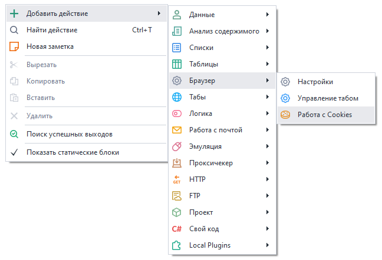
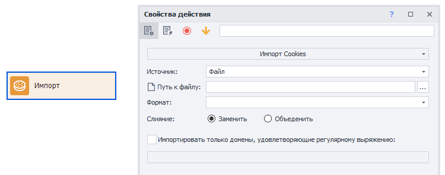
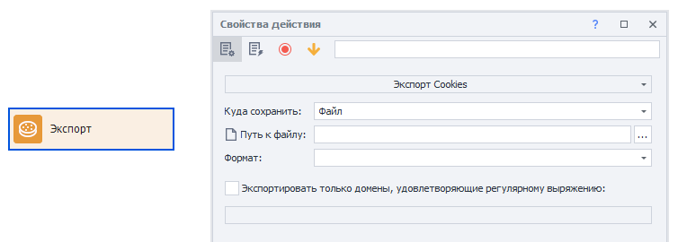
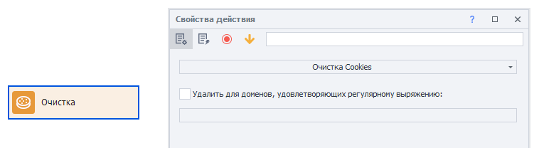

---
sidebar_position: 0
title: "Работа с Cookies"
description: "Конвертировано из HTML в MDX"
date: "2025-07-24"
converted: true
originalFile: "Работа с Cookies.txt"
targetUrl: "https://zennolab.atlassian.net/wiki/spaces/RU/pages/1307738124/Cookies"
---
:::info **Пожалуйста, ознакомьтесь с [*Правилами использования материалов на данном ресурсе*](../Disclaimer).**
:::

> 🔗 **[Оригинальная страница](https://zennolab.atlassian.net/wiki/spaces/RU/pages/1307738124/Cookies)** — Источник данного материала

_______________________________________________  

## Описание

:::info Информация
Добавлено в ZennoPoster 7.3.1.0
:::

С помощью данного действия вы сможете работать с куками вашего проекта. Доступен импорт, экспорт и очистка. В качестве источника загрузки \ сохранения можно использовать файл или переменную. Поддерживаются форматы Netscape и JSON ([❗→ Netscape формат файла cookie](https://zennolab.atlassian.net/wiki/spaces/RU/pages/2155872263) [❗→ Json формат файла cookie](https://zennolab.atlassian.net/wiki/spaces/RU/pages/2155479041)).

Отлично дополняет [❗→ инструмент по управлению Cookie](https://zennolab.atlassian.net/wiki/spaces/RU/pages/735903758#%D0%92%D0%BA%D0%BB%D0%B0%D0%B4%D0%BA%D0%B0-%E2%80%9CCookies%E2%80%9D "https://zennolab.atlassian.net/wiki/spaces/RU/pages/735903758#%D0%92%D0%BA%D0%BB%D0%B0%D0%B4%D0%BA%D0%B0-%E2%80%9CCookies%E2%80%9D").

## Как добавить действие в проект?

Через контекстное меню **Добавить действие** → **Браузер** → **Работа с Cookie**

Либо воспользуйтесь [❗→ умным поиском](https://zennolab.atlassian.net/wiki/spaces/RU/pages/506200090/ProjectMaker+7#%D0%A3%D0%BC%D0%BD%D1%8B%D0%B9-%D0%BF%D0%BE%D0%B8%D1%81%D0%BA-%D0%B4%D0%B5%D0%B9%D1%81%D1%82%D0%B2%D0%B8%D0%B9 "https://zennolab.atlassian.net/wiki/spaces/RU/pages/506200090/ProjectMaker+7#%D0%A3%D0%BC%D0%BD%D1%8B%D0%B9-%D0%BF%D0%BE%D0%B8%D1%81%D0%BA-%D0%B4%D0%B5%D0%B9%D1%81%D1%82%D0%B2%D0%B8%D0%B9").

## Где это можно применить \ Для чего это используется?

- Импортировать куки из купленных аккаунтов
- Экспортировать куки для использования в обычном браузере
- Добавить недостающие куки в профиль

## Как работать с экшеном?

### Импорт

Загружает Cookie в профиль для использования в проекте с браузером или без.

#### Источник

Выбираем откуда будут загружены куки: из *файла или из [❗→ *переменной](/wiki/spaces/RU/pages/735608872 "/wiki/spaces/RU/pages/735608872").

#### Путь к файлу

:::note На заметку
Этот пункт отображается если в качестве Источника выбран Файл.
:::

Указываем полный путь к файлу из которого будут загружены куки.

#### Переменная

:::note На заметку
Этот пункт отображается если в качестве Источника выбрана Переменная.
:::

Необходимо выбрать переменную, в которой сохранены куки.

#### Формат

Тут необходимо выбрать формат загружаемых cookie. Возможные варианты - **JSON** и **Netscape** ([❗→ Netscape формат файла cookie](https://zennolab.atlassian.net/wiki/spaces/RU/pages/2155872263) [❗→ Json формат файла cookie](https://zennolab.atlassian.net/wiki/spaces/RU/pages/2155479041)).

#### Слияние

**Заменить** - перед установкой новых кук текущие будут удалены.

**Объединить** - текущие куки в браузере будут объединены с загружаемыми.

:::warning Внимание
Во время объединения, при совпадении имён кука из браузера будет замещена загружаемой.
:::

#### Импортировать только домены, удовлетворяющие регулярному выражению

Если Вы хотите загрузить cookie только для определённых доменов, то стоит включить эту настройку и внести [❗→ регулярное выражения](/wiki/spaces/RU/pages/534086111 "/wiki/spaces/RU/pages/534086111").

  

### Экспорт

Выгрузка текущих кук.

#### Куда сохранить

Выбираем куда будут сохранены куки: в *файл или в [❗→ *переменную](/wiki/spaces/RU/pages/735608872 "/wiki/spaces/RU/pages/735608872").

#### Путь к файлу

:::note На заметку
Этот пункт отображается если в качестве Куда сохранить выбран Файл.
:::

Указываем полный путь к файлу куда будут сохранены куки.

#### Переменная

:::note На заметку
Этот пункт отображается если в качестве Куда сохранить выбрано Переменная.
:::

Необходимо выбрать переменную, в которую будут сохранены куки.

#### Формат

Тут необходимо выбрать формат сохранения cookie. Возможные варианты - **JSON** и **Netscape**.

#### Экспортировать только домены, удовлетворяющие регулярному выражению

Если Вы хотите сохранить cookie только для определённых доменов, то стоит включить эту настройку и внести [регулярное выражения](https://zennolab.atlassian.net/wiki/pages/resumedraft.action?draftId=534086111 "https://zennolab.atlassian.net/wiki/pages/resumedraft.action?draftId=534086111").

  

### Очистка Cookie

Кубик с таким свойством очистит браузерные куки полностью для всех сайтов или только для указанных доменов с помощью [❗→ регулярных выражений](/wiki/spaces/RU/pages/534086111 "/wiki/spaces/RU/pages/534086111"). Аналогично действию из группы [❗→ Браузер → Настройки](https://zennolab.atlassian.net/wiki/spaces/RU/pages/489324572#%D0%9E%D1%87%D0%B8%D1%81%D1%82%D0%B8%D1%82%D1%8C-%D0%BA%D1%83%D0%BA%D0%B8 "https://zennolab.atlassian.net/wiki/spaces/RU/pages/489324572#%D0%9E%D1%87%D0%B8%D1%81%D1%82%D0%B8%D1%82%D1%8C-%D0%BA%D1%83%D0%BA%D0%B8").

  

## Полезные ссылки

- [❗→ Инструмент по работе с Cookie](https://zennolab.atlassian.net/wiki/spaces/RU/pages/735903758#%D0%92%D0%BA%D0%BB%D0%B0%D0%B4%D0%BA%D0%B0-%E2%80%9CCookies%E2%80%9D "https://zennolab.atlassian.net/wiki/spaces/RU/pages/735903758#%D0%92%D0%BA%D0%BB%D0%B0%D0%B4%D0%BA%D0%B0-%E2%80%9CCookies%E2%80%9D")
- [❗→ Браузер → Настройки → Очистить Cookie](https://zennolab.atlassian.net/wiki/spaces/RU/pages/489324572#%D0%9E%D1%87%D0%B8%D1%81%D1%82%D0%B8%D1%82%D1%8C-%D0%BA%D1%83%D0%BA%D0%B8 "https://zennolab.atlassian.net/wiki/spaces/RU/pages/489324572#%D0%9E%D1%87%D0%B8%D1%81%D1%82%D0%B8%D1%82%D1%8C-%D0%BA%D1%83%D0%BA%D0%B8")
- [❗→ Регулярные выражения](/wiki/spaces/RU/pages/534086111 "/wiki/spaces/RU/pages/534086111")
- [❗→ Netscape формат файла cookie](https://zennolab.atlassian.net/wiki/spaces/RU/pages/2155872263)
- [❗→ Json формат файла cookie](https://zennolab.atlassian.net/wiki/spaces/RU/pages/2155479041)