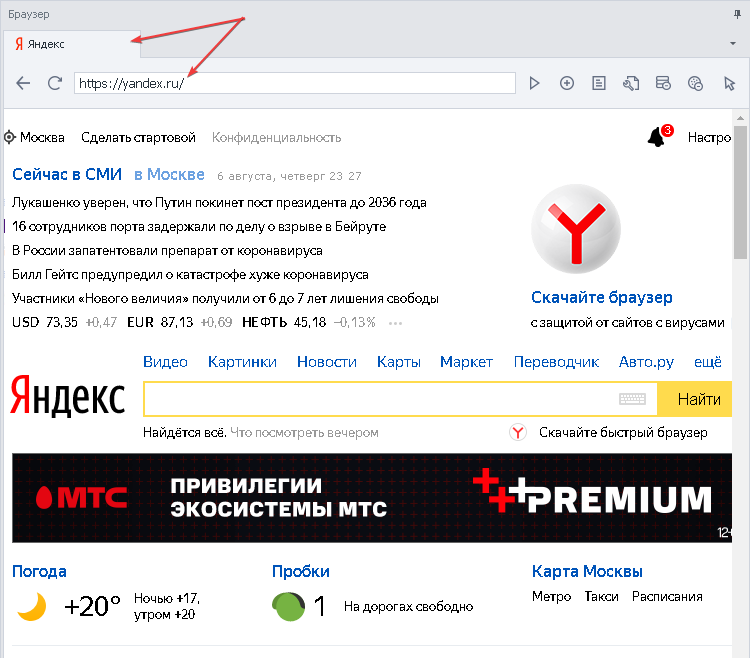
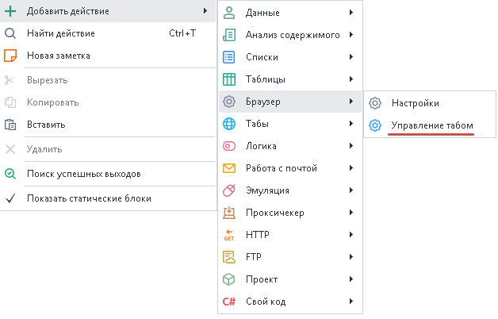
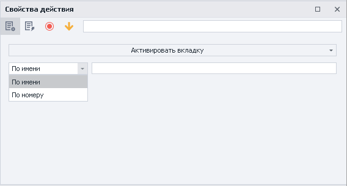
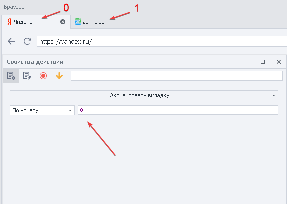
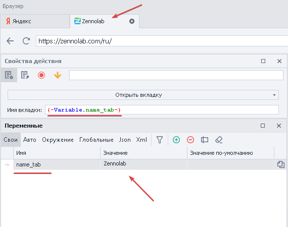
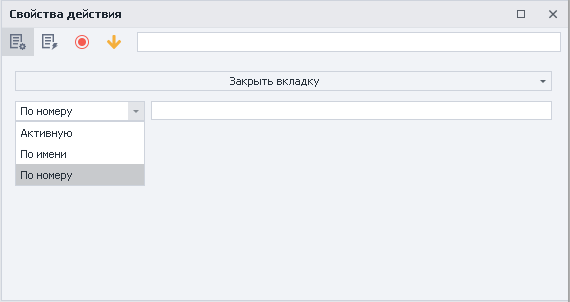

---
sidebar_position: 2
title: "Управление вкладкой браузера (табом браузера)"
description: " "
date: "2025-07-24"
converted: true
originalFile: "Управление вкладкой браузера (табом браузера).txt"
targetUrl: "https://zennolab.atlassian.net/wiki/spaces/RU/pages/534020201"
---
import DisclaimerNotice from '@site/src/components/DisclaimerNotice';

<DisclaimerNotice />

> 🔗 **[Оригинальная страница](https://zennolab.atlassian.net/wiki/spaces/RU/pages/534020201)** — Источник данного материала

_______________________________________________  
## Описание
> *Табом браузера называют открытую вкладку с сайтом.*

На этом скриншоте у нас открыт таб с именем **Яндекс**, и в нём загружена стартовая страница yandex.ru

### Где используется? 
- Работа с несколькими сайтами одновременно
- Закрытие всплывающих окон
- Открытие дополнительного окна с нужным сайтом
- Переход к нужному окну
- Присвоение имени окну для удобной навигации при работе

### Как добавить действие в проект?
Через контекстное меню: **Добавить действие → Браузер → Управление табом**

_______________________________________________ 
## Принцип работы
### Активировать вкладку
:::info Данное действие работает только с уже открытыми окнами.
:::  

- **По имени** — в браузере будет активно окно с именем, указанным в действии. Можно указать переменную с названием вкладки.

:::tip Важно соблюдать регистр имени таба
Если у вас вкладка называется **Google**, а в экшене имя `google`, то действие не будет выполнено.
:::

- **По номеру** — откроется вкладка в порядке, начиная слева направо.

:::info Нумерация вкладок начинается с `0`
Первая вкладка всегда будет стоять под номером **0**, а все последующие соответственно: **1**, **2**, **3**
:::

### Открыть вкладку
Кубик создаст новое окно браузера с заданным именем.  

  

Так же в поле можно указать переменную, если вы генерируете название случайным образом или используете заготовленный список.

### Закрыть вкладку

- **Активную** — ту вкладку, которая у вас перед глазами.
- **По имени** — указываем имя вкладки или переменную, соблюдая регистр.
- **По номеру** — нумерация идёт слева направо начиная с 0.  
То есть для закрытия первой вкладки в поле указываем `0`. Последующие вкладки идут по счету: `1`, `2`, `3` и так далее.
_______________________________________________ 
## Пример использования: 
Для регистрации на сайте вам нужно подтвердить учетную запись через почту.

1. Открываем новую вкладку, указав её имя
2. Загружаем сайт и производим нужные действия
3. Закрываем вкладку, повторив имя окна из первого пункта или его номер
_______________________________________________ 
## Полезные ссылки

1. [❗→ Окно браузер](/wiki/spaces/RU/pages/534315373 "/wiki/spaces/RU/pages/534315373")
2. [❗→ Настройки](https://zennolab.atlassian.net/wiki/spaces/RU/pages/534020228/- "https://zennolab.atlassian.net/wiki/spaces/RU/pages/534020228/-")