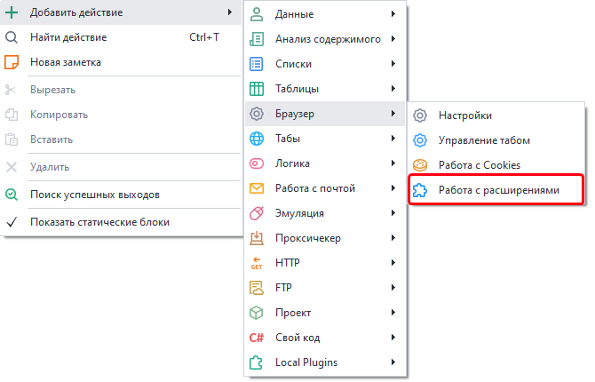
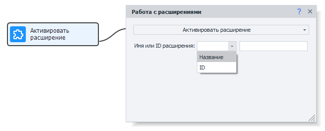
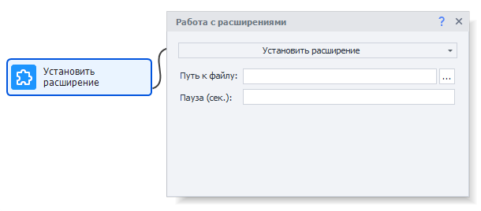
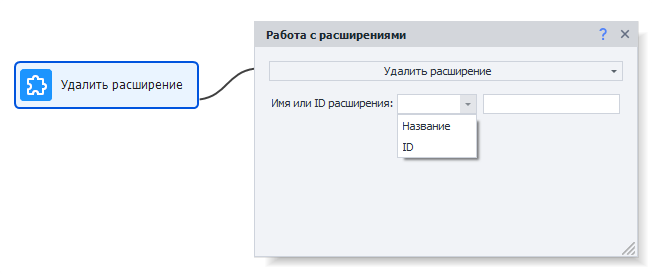
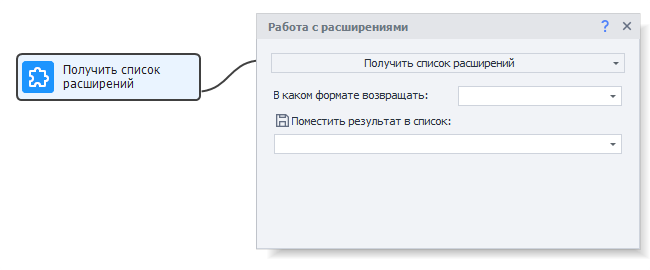
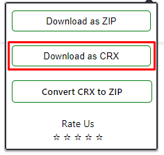

---
sidebar_position: 4
title: "Работа с расширениями"
description: " "
date: "2025-07-24"
converted: true
originalFile: "Работа с расширениями.txt"
targetUrl: "https://zennolab.atlassian.net/wiki/spaces/RU/pages/2081423361"
---
import DisclaimerNotice from '@site/src/components/DisclaimerNotice';

<DisclaimerNotice />

> 🔗 **[Оригинальная страница](https://zennolab.atlassian.net/wiki/spaces/RU/pages/2081423361)** — Источник данного материала

_______________________________________________   
## Описание
С помощью данного действия можно управлять расширениями в браузере.

### Как добавить действие в проект?
Через контекстное меню: **Добавить действие → Браузер → Работа с расширениями**



### Где это можно использовать?
- Блокировка рекламы на сайтах
- Для криптокошельков и различных взаимодействий с блокчейном
- Подключение к виртуальным частным сетям
- И прочие функции, которые дают расширения браузера
_______________________________________________
## Принцип работы
### Активировать расширение  
> *Активация расширения — это открытие его всплывающего окна (Popup), если оно есть.*  



Этот кубик активирует расширение по его имени или ID (аналог клика по иконке расширения в обычном браузере).  

- **Имя или ID расширения** — каким способом искать.  
- **Значение** — по нему будет искаться расширение для активации.

:::tip Как узнать ID или Название расширения?
Используйте опцию **Получить список расширений** (описана ниже).
:::

<details>
<summary>Аналог на C#</summary>

```csharp
var extension1 = instance.GetExtensionById("EXTENSION_ID");
extension1 = instance.GetExtensionByName("EXTENSION_NAME");
extension1.Activate();
```
</details>  

### Установить расширение
Устанавливает расширение из CRX файла.  



> *О способе скачивания расширения в виде CRX файла рассказано ниже.*

- **Путь к файлу** — место, где лежит `.crx` расширения.
- **Пауза (сек.)** — может понадобиться для некоторых расширений. Гарантирует корректную установку перед стартом работы.

<details>
<summary>Аналог на C#</summary>

```csharp
instance.InstallCrxExtension("PATH_TO_CRX_FILE");
```

</details>
### Удалить расширение
Удаляет расширение по его имени или id (аналог клика по кнопке в обычном браузере).  



- **Имя или ID расширения** — каким способом искать.  
- **Значение** — по нему будет искаться расширение для удаления.

:::tip Как узнать ID или Название расширения?
Используйте опцию **Получить список расширений** (описана далее).
:::

<details>
<summary>Аналог на C#</summary>

```csharp
var extension1 = instance.GetExtensionById("EXTENSION_ID");
extension1 = instance.GetExtensionByName("EXTENSION_NAME");
instance.UninstallExtension(extension1);

// OR...
instance.UninstallExtension("EXTENSION_ID");
```

</details>
### Получить список расширений
Возвращает в виде списка информацию о всех установленных расширениях.  



- **В каком формате возвращать** — `Название, ID` или `Название` и `ID`
- **Поместить результат в список** — указываем *Список*, в котором хотим сохранить данные о расширениях

<details>
<summary>Аналог на C#</summary>

```csharp
var allExtensions = instance.GetAllExtensions();
//allExtensions[0].Name
//allExtensions[0].Id
```

</details>

### Сохранение состояния расширений
Для этого нужно использовать [Профиль-папку](../../../Recording-and-creating-projects/Using_a_Profile_Folder). Все установленные расширения и их состояния будут автоматически сохраняться в неё.
_______________________________________________
## Получение CRX-файла
### Подготовка браузера
Сначала подготовим ваш домашний браузер Chrome.
1. Перейдите в [магазин расширений](https://chrome.google.com/webstore/category/extensions)
2. Найдите одно из расширений, которое может скачивать CRX-файлы и установите его в свой браузер.

:::tip Примеры таких расширений:
- [CRX Extractor/Downloader](https://chrome.google.com/webstore/detail/crx-extractordownloader/ajkhmmldknmfjnmeedkbkkojgobmljda) — далее используется для примера
- [Get CRX](https://chrome.google.com/webstore/detail/get-crx/dijpllakibenlejkbajahncialkbdkjc)
- [Extension Source Downloader](https://chrome.google.com/webstore/detail/extension-source-download/dlbdalfhhfecaekoakmanjflmdhmgpea)
:::

### Скачивание файла расширения
Скачиваем файл нужного расширения с помощью [CRX Extractor/Downloader](https://chrome.google.com/webstore/detail/crx-extractordownloader/ajkhmmldknmfjnmeedkbkkojgobmljda)

1. Переходим на страницу расширения в Chrome Web Store. Например — [CapMonster Cloud](https://chromewebstore.google.com/detail/pabjfbciaedomjjfelfafejkppknjleh?utm_source=item-share-cb)
2. Активируем CRX Extractor и жмём на кнопку скачивания расширения:




3. Выбираем место для сохранения файла
_______________________________________________
## Полезные ссылки
- [❗→ Окно браузера](/wiki/spaces/RU/pages/534315373 "/wiki/spaces/RU/pages/534315373")
- [❗→ Использование профиль-папки](/wiki/spaces/RU/pages/1251475485 "/wiki/spaces/RU/pages/1251475485")