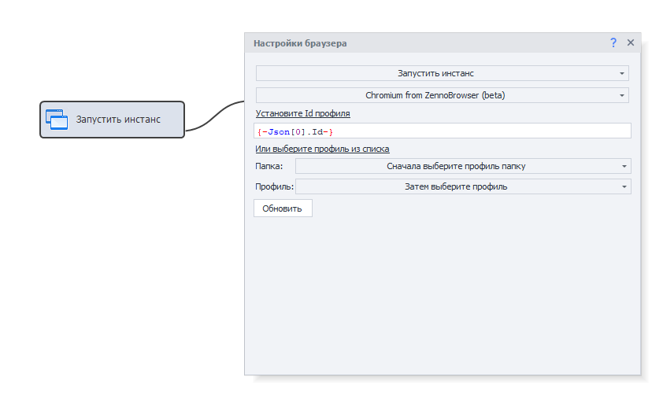
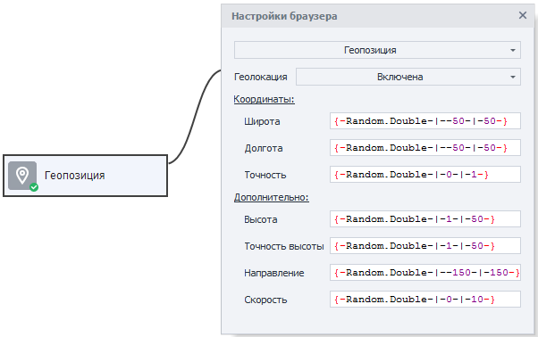

:::info **Пожалуйста, ознакомьтесь с [*Правилами использования материалов на данном ресурсе*](../Disclaimer).**
:::

> 🔗 **[Оригинальная страница](https://zennolab.atlassian.net/wiki/spaces/RU/pages/489324572)** — Источник данного материала

_______________________________________________  

## Описание

[❗→ Браузер](https://zennolab.atlassian.net/wiki/spaces/RU/pages/534315373 "https://zennolab.atlassian.net/wiki/spaces/RU/pages/534315373") является основной частью автоматизации ZennoPoster. В экшене собраны различные действия для изменения опций и свойств браузера. Некоторые из них можно также найти в [❗→ Настройках проекта](https://zennolab.atlassian.net/wiki/spaces/RU/pages/534315477 "https://zennolab.atlassian.net/wiki/spaces/RU/pages/534315477"), но следует их различать - настройки проекта задаются при старте шаблона, а с помощью настроек в этом экшене можно изменять опции прямо в процессе исполнения шаблона. Например можно включать и выключать отображение картинок в браузере в любой момент работы когда это необходимо.

## Как добавить действие в проект?

Через контекстное меню **Добавить действие** → **Браузер** → **Настройки**

Либо воспользуйтесь [❗→ умным поиском](https://zennolab.atlassian.net/wiki/spaces/RU/pages/506200090/ProjectMaker+7#%D0%A3%D0%BC%D0%BD%D1%8B%D0%B9-%D0%BF%D0%BE%D0%B8%D1%81%D0%BA-%D0%B4%D0%B5%D0%B9%D1%81%D1%82%D0%B2%D0%B8%D0%B9 "https://zennolab.atlassian.net/wiki/spaces/RU/pages/506200090/ProjectMaker+7#%D0%A3%D0%BC%D0%BD%D1%8B%D0%B9-%D0%BF%D0%BE%D0%B8%D1%81%D0%BA-%D0%B4%D0%B5%D0%B9%D1%81%D1%82%D0%B2%D0%B8%D0%B9").

## Где это можно применить?

- Изменение различных браузерных настроек в реальном времени.
- Применение к боту различных настроек по безопасности и анонимности проекта.

## Как работать с экшеном?

Рассмотрим каждую опцию экшена в подробностях.

### AudioContext

Эта настройка служит для большей уникальности профиля браузера и может принимать два значения: по умолчанию и эмуляция. В первом случае она берется из настроек проекта, во втором - эмулируется случайным образом.

### Canvas

Ещё одно из свойств браузера помогающее придать создаваемому боту индивидуальность. Это элемент отрисовки веб-страницы на основе технологии [WebGL](https://developer.mozilla.org/en-US/docs/WebGL "https://developer.mozilla.org/en-US/docs/WebGL") для аппаратно-ускоренной 3D-графики, который имеет свой уникальный отпечаток (fingerprint). С ним возможны три действия: разрешить на основе основных настроек проекта, эмулировать и блокировать.

:::info Информация
Режим “Супер-эмуляция” был добавлен в ZennoPoster 7.7.0.0.Работает только в движке Chromium.Подробнее можно почитать в статье Профиль | Canvas/WebGL
:::

:::note На заметку
В основном Canvas передаёт данные о характеристиках вебсистемы и эти данные довольно широко используются на многих сайтах для обеспечения защиты от накруток или иных методов автоматизации.
:::

### ClientRects

Ещё один из отпечатков основанный на получении хешей при масштабировании изображения. Эмулируется или используется по умолчанию.

### Flash/Java/Silverlight

Отключение или включение популярных когда-то браузерных плагинов. Поможет в работе со старыми сайтами, уменьшив нагрузку на ресурсы, и объем передаваемого трафика.

Если Flash включен данной настройкой, но он по какой-то причине не работает в Chrome браузере, добавьте [❗→ аргументы запуска](https://zennolab.atlassian.net/wiki/spaces/RU/pages/534315477#%D0%90%D1%80%D0%B3%D1%83%D0%BC%D0%B5%D0%BD%D1%82%D1%8B "https://zennolab.atlassian.net/wiki/spaces/RU/pages/534315477#%D0%90%D1%80%D0%B3%D1%83%D0%BC%D0%B5%D0%BD%D1%82%D1%8B") `--enable-system-flash --disable-software-rasterizer --disable-smooth-scrolling` . Подробнее: [Не работает Flash в браузере](https://zennolab.kayako.com/ru/article/392-ne-rabotaet-flash-v-brauzere "https://zennolab.kayako.com/ru/article/392-ne-rabotaet-flash-v-brauzere")

### JavaScript

Включает/отключает поддержку браузером JavaScript.

:::warning Внимание
Все современные сайты практически теряют работоспособность при отключении JavaScript, потому что эти скрипты нередко формируют не только верстку, но и контент, не говоря уже о многочисленной защите посредством JS-скриптов. Однако, иногда бывает полезно с помощью этого действия, временно отключить JS, проделать какие-то действия на сайте (например авторизоваться), а затем включить его снова. Этот хак поможет с “глючными” и особо хитрыми ресурсами.
:::

### Javascript Authorization

Иногда сайты предлагают пользователям авторизоваться через модальное окно выводимое Javascript. Особенно часто такая форма авторизации используется в серверных панелях, в админках роутеров и т. д. Данное действие позволяется передать логин и пароль в скрипт и произвести авторизацию. В поля логин и пароль можно добавить соответствующие [❗→ переменные проекта](https://zennolab.atlassian.net/wiki/spaces/RU/pages/486309922 "https://zennolab.atlassian.net/wiki/spaces/RU/pages/486309922").

### Javascript Confirm

Эта функция подтверждает модальное окно выводимое Javascript. При этом нажать можно как “**OK**“, так и “**Cancel**“ выбрав нужный пункт в экшене.

### Javascript Prompt

Практически тоже самое что и предыдущее свойство, но с возможностью передать какое-то значение, которое может находиться в переменной или быть вписанным в текстовом поле. 

:::note На заметку
Именно с помощью этого кубика решают защиту “Ответьте на секретный вопрос”, который так любят задавать на некоторых форумах. Но в данном случае вопрос выводится именно во всплывающем popup окне с помощью Javascript.
:::

### Блокировка всплывающих окон

Эта настройка запрещает открывать новые вкладки в браузере.

Если по клику по ссылке она должна открыться в новой вкладке, и включена эта настройка, то открытие не произойдёт.

### Геопозиция

Для корректной работы на некоторых сайтах, для работы с картами, да и вообще для лучшей эмуляции бота максимально похожего на реального пользователя желательно эмулировать геопозиции максимально совпадающие со страной/городом эмулируемого пользователя, а также совпадающие с GEO используемых проксей. С помощью действия “Геопозиция” можно подставить заранее вычисленные координаты (широта и долгота), точность координат, высоту над уровнем моря с её точностью, а также направление и скорость движения.

#### Координаты

- Широта и долгота устанавливается в градусах
- Точность - метры

#### Дополнительно

- Высота в метрах от уровня моря.
- Точность высоты - метры
- Направление - градусы (0 - север, 90 - восток, 270 - запад).
- Скорость - метры в секунду

:::tip Совет
При использовании функции Установить прокси (описана ниже) геопозицию можно эмулировать автоматически.
:::

### Загружать плагины в том же окне

Опция позволяет делать скриншоты Flash и других плагинов, если загружать в другом окне, вместо изображения плагина будет выводиться пустой квадрат.

### Загрузка стилей

Этим свойством можно отключать CSS стили на странице. Данный метод поможет несколько уменьшить потребляемые ресурсы, но также может изменить верстку страницы и привести к ошибкам на ней. Используйте метод отключения аккуратно.

### Загрузка фреймов

Во фреймах часто выводятся HTML с других сайтов, различные виджеты социальных сетей, реклама и прочий ненужный мусор. Поэтому, отключив фреймы, можно значительно ускорить время загрузки сайта и уменьшить загрузку ресурсов.

### Запустить инстанс

Иногда в шаблонах, работающих на запросах, требуется на короткое время запустить браузерный инстанс — например, если пользователь вышел из системы и требуется повторная авторизация через браузер. Для решения подобных задач и предназначено это свойство.

Чтобы запустить браузер, выберите его в выпадающем списке и укажите нужные аргументы, если они требуются. Вы можете воспользоваться текущим профилем браузера или создать новый профиль на основе настроек проекта.

После выполнения задачи можно вернуть работу в режим без браузера, добавив кубик с настройкой «**Без браузера**». 

:::note На заметку
Встречаются ситуации когда на определенной странице или на определенном этапе сайта нужно заменить браузер (например ломается верстка). Для этого опять же подойдет этот кубик - можно в реальном времени перейти с Chrome на Firefox и, после обработки проблемной страницы, возврат обратно.
:::

#### Чекбокс “Изоляция сайтов (beta)”

Изоляция сайтов — это функция безопасности в Chrome, обеспечивающая дополнительную защиту от некоторых типов уязвимостей. Она использует песочницу Chrome, чтобы усложнить ненадежным веб-сайтам доступ к вашим данным или кражу информации из учетных записей на других сайтах.

При активации данного чекбокса включается изоляция сайтов, что позволяет эмуляции успешнее проходить проверки на некоторых сайтах, например, проверку Cloudflare Turnstile.

#### Аргументы

При запуске инстанса можно задать аргументы. Список доступных аргументов можно найти по ссылкам:

- [Run Chromium with flags](https://www.chromium.org/developers/how-tos/run-chromium-with-flags "https://www.chromium.org/developers/how-tos/run-chromium-with-flags")
- [List of Chromium Command Line Switches](https://peter.sh/experiments/chromium-command-line-switches/ "https://peter.sh/experiments/chromium-command-line-switches/")

#### Использовать путь к профиль-папке

:::info Информация
В ZennoPoster версии 7.3.1.0 были добавлены профиль-папки. Подробней о них можно прочитать в статье Работа с профиль-папкой.
:::

При активации данной опции надо указать путь к профиль-папке, которая будет загружена для данного инстанса.

##### **Путь**

Полный путь к профиль-папке (можно использовать [❗→ переменные](https://zennolab.atlassian.net/wiki/spaces/RU/pages/735608872 "https://zennolab.atlassian.net/wiki/spaces/RU/pages/735608872")).

##### **Создать папку, если она не существует**

Если настройка вЫключена и по указанному пути не будет найдено профиль-папки, то экшен завершится ошибкой.

Если настройка включена и по указанному пути не будет найдено профиль-папки, то будет создана новая, пустая профиль-папка.

##### **При загрузке создать недостающие переменные**

При [❗→ сохранении профиль-папки через экшен](https://zennolab.atlassian.net/wiki/spaces/RU/pages/486539291#%D0%A1%D0%BE%D1%85%D1%80%D0%B0%D0%BD%D0%B8%D1%82%D1%8C-%D0%BF%D1%80%D0%BE%D1%84%D0%B8%D0%BB%D1%8C-%D0%BF%D0%B0%D0%BF%D0%BA%D1%83 "https://zennolab.atlassian.net/wiki/spaces/RU/pages/486539291#%D0%A1%D0%BE%D1%85%D1%80%D0%B0%D0%BD%D0%B8%D1%82%D1%8C-%D0%BF%D1%80%D0%BE%D1%84%D0%B8%D0%BB%D1%8C-%D0%BF%D0%B0%D0%BF%D0%BA%D1%83") можно так же сохранять переменные проекта.

Если включить эту настройку, то вместе с профиль-папкой в проект загрузятся и сохранённые с ней переменные.

#### Применить текущий профиль браузера

##### **Включено**

К запускаемому инстансу привяжется профиль , который был в проекте на момент запуска инстанса.

:::warning Внимание
Если Вы запускаете инстанс вместе с профиль-папкой и включаете опцию Применить текущий профиль браузера, то данные профиль-папки будут затёрты текущим профилем проекта.
:::

##### **Выключено**

При запуске инстанса будет сгенерирован новый профиль.

**Интеграция с действием "Запустить инстанс"**

В стандартное действие "Запустить инстанс" добавлен новый тип браузера — **"Chromium from ZennoBrowser (beta)"**.

Эта интеграция обеспечивает единообразный подход к запуску различных типов браузеров в рамках одного действия.

С более подробной инструкцией интеграции можно ознакомиться в разделе [❗→ Интеграция ZennoPoster с ZennoBrowser](https://zennolab.atlassian.net/wiki/spaces/RU/pages/3641737224) 

### Картинки

Отключение картинок очень помогает экономить ресурсы. Если ваши задачи не заключаются в использовании графики, то смело отключайте картинки.

:::note На заметку
Все же сейчас пользователи достаточно редко отключают картинки в целях экономии трафика и поэтому, для некоторых ресурсов, например социальных сетей, такой метод может быть подозрительным.
:::

:::warning Внимание
В режиме отключенных картинок решение каптч с помощью сервисов или программ скорее всего будет невозможным и будет выводиться ошибка.
:::

### Медиа (Video/Audio)

Включение/выключение медиа контента с HTML элементами `<video/>`, `<audio/>` и т. д. Тоже помогает экономить трафик и ресурсы.

### Ожидание действий пользователя

:::info Информация
Начиная с ZennoPoster 7.7.0.0 это действие было перемещено в отдельный экшен - Ожидание действий пользователя
:::

Старое описание. Для версий ниже 7.7.0.0

Данная функция пригодится, если по какой-то причине Вам нужно вмешаться в процесс работы проекта и сделать что-то руками в браузере. 

1. Таймаут в течение которого все необходимые действия должны быть выполнены (если оно неизвестно, установите 99999, например). По истечению таймаута шаблон продолжит работу дальше.
2. Сообщение, которое будет играть роль подсказки. Оно будет отображено вверху окна инстанса.

**Окно ожидания действий**

После того, как будет запущен этот экшен откроется окно браузера.
В верхней части окна (на оранжевом фоне), слева сверху находится название проекта, который вызвал это окно (в данном случае *ProjectM).
Под именем проекта текст, который был задан в экшене.
Справа кнопка “Продолжить” а в скобках количество оставшихся секунд, до автоматического закрытия окна.

Этот полезный функционал можно использовать для тех пользователей шаблона, которые боятся сохранять данные для входа на сайты или для ввода данных кредитных карт.

### Очистить куки

Кубик с таким свойством очистит браузерные куки полностью для всех сайтов или только для указанных доменов с помощью [❗→ регулярных выражений](https://zennolab.atlassian.net/wiki/spaces/RU/pages/534086111 "https://zennolab.atlassian.net/wiki/spaces/RU/pages/534086111"). 

:::info Информация
В ZennoPoster 7.3.1.0 был добавлен экшен Работа с Cookies Он позволяет не только очищать cookie но и сохранять\загружать их в нескольких форматах.
:::

### Очистить кэш

Кэш это специальное место на жестком диске компьютера, куда сохраняются ранее посещенные страницы, изображения и любые другие данные с просмотренных страниц. Для лучшей анонимности желательно удалять кэш перед каждой сессией (что решается специальной опцией в настройках проекта), но также можно очищать кэш и в процессе работы шаблона. Так же как и “Очистить куки”, кэш можно очищать для конкретного домена или групп доменов определенных [❗→ регулярным выражением](https://zennolab.atlassian.net/wiki/spaces/RU/pages/534086111 "https://zennolab.atlassian.net/wiki/spaces/RU/pages/534086111").

### Папка для загрузки файлов

Выбрав локальную папку на компьютере, можно установить директорию куда будут сохраняться файлы, картинки, видео и другие документы при скачивании. В противном случае, если не определить такую папку, файлы будут скачиваться во [❗→ временную папку ZennoPoster](https://zennolab.atlassian.net/wiki/spaces/RU/pages/808845378#%D0%9F%D1%83%D1%82%D1%8C-%D0%BA-%D0%BA%D1%83%D0%BA%D0%B0%D0%BC-%D0%B8-%D0%BA%D1%8D%D1%88%D1%83 "https://zennolab.atlassian.net/wiki/spaces/RU/pages/808845378#%D0%9F%D1%83%D1%82%D1%8C-%D0%BA-%D0%BA%D1%83%D0%BA%D0%B0%D0%BC-%D0%B8-%D0%BA%D1%8D%D1%88%D1%83").

### Перезагрузить инстанс

Закрывает и снова открывает инстанс проекта без потери данных. Иногда, в проектах использующих браузер в цикле на протяжении долгого времени наблюдаются сбои и ошибки из-за нехватки памяти. В таком случае помогает данный экшен. Он перезагружает инстанс и одновременно освобождает память.

### Политика содержимого

Этот экшен также помогает как в безопасности проекта, так и экономии трафика и ресурсов. С его помощью можно блокировать запросы к заданным пользователем URL и доменам. Также, данный инструмент доступен в [❗→ окне трафика](https://zennolab.atlassian.net/wiki/spaces/RU/pages/735805465 "https://zennolab.atlassian.net/wiki/spaces/RU/pages/735805465"). 

Возможны три варианта:

1. **Без ограничений** - режим по умолчанию.
2. **Белый список** - будут блокироваться все запросы, кроме указанных адресов и доменов.
3. **Черный список** - будут блокироваться все указанные запросы.

:::note На заметку
С помощью “Политики содержимого” можно решать различные практические задачи. Например отключать не все картинки, а только GIF. Или например блокировать скрипты счетчиков и различные защиты.
:::

### Реклама

Отключает рекламные баннеры с целью экономии трафика.

:::note На заметку
Файл с правилами для блокировки находится в папке установленной программы - Progs\Data\Filters\easylist.txt Если Вы редактировали easylist.txt то после этого необходимо удалить Progs\Data\Filters\easylist.zpdata
:::

### Состояние занятости

Позволяет отключать ожидание полной загрузки каждого в отдельности из перечисленных компонентов: Ajax, Flash, GET/POST-запросы, FRAME.

:::note На заметку
Пользователи часто сталкиваются с ситуацией когда браузер в течении долгого времени ждёт загрузки фрейма с контентом “упавшего” сайта. В результате тратится время и ресурсы на ожидание. Этот экшен позволяет гибко отключать такие проблемные элементы.
:::

### Уведомления браузера

Отключает/включает уведомления о геопозиции, о приеме пушей и прочие элементы, которые мешают парсингу или постингу на сайте, а нередко и блокируют работу с сайтом вообще. 

### Уровень эмуляции

Настройка аналогичная той, что находится в [❗→ свойствах проекта](https://zennolab.atlassian.net/wiki/spaces/RU/pages/534315477 "https://zennolab.atlassian.net/wiki/spaces/RU/pages/534315477"), но в данном случае можно гибко регулировать уровень эмуляции по ходу исполнения шаблона. С помощью слайдера можно либо сделать акцент на скорости обработки элементов, либо на качестве, либо выбрать золотую середину.

:::note На заметку
Уровень эмуляции можно регулировать индивидуально для каждого экшена в Свойствах действия, во вкладке Дополнительно.
:::

### Установить прокси

Кубик с этим свойством устанавливает прокси и, при необходимости, сразу автоматически эмулирует для установленных проксей геопозицию, часовой пояс и WebRTC (нужные опции определяются чекбоксами). Прокси могут устанавливаться передачей значения через переменную, либо строкой в нужном формате.

:::note На заметку
В ZennoPoster используется следующий формат для прокси:С авторизацией: protocol://login:password@ip:portБез авторизации: protocol://ip:portprotocol может быть http, socks4, socks5. Если не указывать протокол, то по умолчанию назначается http
:::

:::info Информация
Следующие функции экшена Установить прокси были добавлены в ZennoPoster 7.7.2.0:
:::

#### Как определять “выходной” IP прокси

Эмуляции геопозиции, часового пояса и WebRTC полагаются на информацию о том, какой IP-адрес мы имеем на выходе при работе через прокси.

**Автоматически** - программа будет пытаться определить "выходной" IP через сервера ZennoLab.

**Указать вручную** - пользователь самостоятельно указывает "выходной" IP прокси.

#### Чекбокс Игнорировать ошибки

Если опция включена и не удалось определить "выходной" IP автоматически, то для эмуляций будет использован "входной" IP прокси.

Если опция выключена, то кубик завершится неуспешно.

#### Шаблоны DNS over HTTPS

:::info Информация
Работает только в движке Chromium.
:::

Поле для указания шаблона URI, необходимого преобразователя DNS поверх HTTPS.

Для указания нескольких преобразователей шаблоны необходимо разделять пробелами.

Если шаблон URI содержит переменную dns, то для отправки запросов преобразователю будет использован метод GET, в противном случае – метод POST.

:::note На заметку
Пример значения: `https://dns.example.net/dns-query{?dns}`
:::

### Установить сертификат

Некоторые сайты (например Webmoney) для работы с ними требуют установленного сертификата. Для этого следует указать локальный путь к файлу сертификата и пароль для него.

### Файлы для загрузки на сервер

Этот кубик определят локальные пути к файлам, которые при следующих шагах будут загружены на сервер. Например при вложении изображения к письму, в обычном браузере открывается обзорное окно Проводника, в котором пользователь выбирает один файл или несколько, и, при нажатии на “ОК” эти файлы загружаются на сервер ресурса. 
В ZennoPoster это окно не открывается, а файлы загружаются сразу же после нажатия соответствующего HTML-элемента.

Для мультизагрузки нескольких файлов пути разделяются запятой.

### Часовой пояс

Позволяет эмулировать часовой пояс согласно введенных в поля часов и минут.

### Эмуляция задержек

Устанавливает общие для всех кубиков настройки эмуляции как между вводом каждого символа, так и перед переключениями между полями. С помощью двух слайдеров (движков) можно дать приоритет или скорости или качеству.

### Эмуляция тач-скрина

Для корректной эмуляции Touch-событий в браузере, вместо мышки, необходимо включить данную опцию. Данное действие добавляется автоматически при записи в [❗→ режиме ввода “Touch-события“](https://zennolab.atlassian.net/wiki/spaces/RU/pages/534315373#11.-%D0%A0%D0%B5%D0%B6%D0%B8%D0%BC-%D0%B2%D0%B2%D0%BE%D0%B4%D0%B0 "https://zennolab.atlassian.net/wiki/spaces/RU/pages/534315373#11.-%D0%A0%D0%B5%D0%B6%D0%B8%D0%BC-%D0%B2%D0%B2%D0%BE%D0%B4%D0%B0") в [❗→ окне браузера](https://zennolab.atlassian.net/wiki/spaces/RU/pages/534315373 "https://zennolab.atlassian.net/wiki/spaces/RU/pages/534315373").

  

## Пример использования

Рассмотрим один из примеров использования этого экшена.

Допустим у нас задача - генерировать максимально хаотичные координаты или координаты, которые изменяются в процессе нахождения бота на сайте (бот якобы путешествует).

Для этого активируем кубик “**Настройки браузера**” и включаем **Геолокацию**. Для генерации случайных чисел можно использовать макрос `{ -Random.Double- | --10- | -10- }` (данный макрос будет случайным образом выводить не целые числа в интервале от -10 до 10) или заранее вычислять значения широты и долготы (вычислять их в цикле прибавляя к ним определенный счетчик) и подставлять полученные значения в соответствующих полях.

## Полезные ссылки

- [Canvas API](https://developer.mozilla.org/ru/docs/Web/API/Canvas_API "https://developer.mozilla.org/ru/docs/Web/API/Canvas_API")
- [❗→ Использование прокси](https://zennolab.atlassian.net/wiki/spaces/RU/pages/492208129 "https://zennolab.atlassian.net/wiki/spaces/RU/pages/492208129")
- [❗→ Настройки проекта](https://zennolab.atlassian.net/wiki/spaces/RU/pages/534315477 "https://zennolab.atlassian.net/wiki/spaces/RU/pages/534315477")