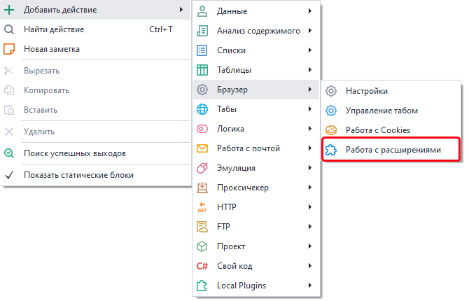
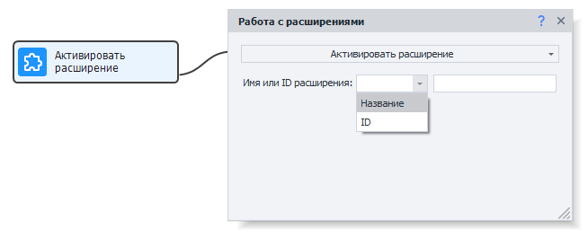
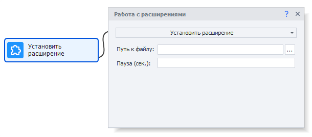
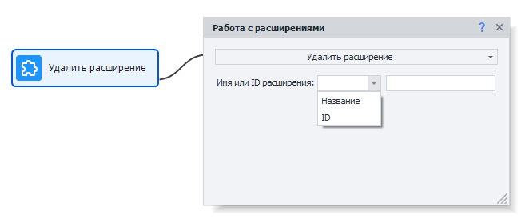
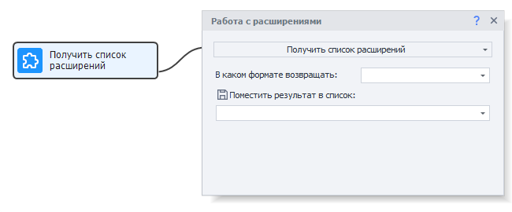
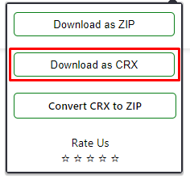

---
sidebar_position: 4
title: "Работа с расширениями"
description: "Конвертировано из HTML в MDX"
date: "2025-07-24"
converted: true
originalFile: "Работа с расширениями.txt"
targetUrl: "https://zennolab.atlassian.net/wiki/spaces/RU/pages/2081423361"
---
:::info **Пожалуйста, ознакомьтесь с [*Правилами использования материалов на данном ресурсе*](../Disclaimer).**
:::

> 🔗 **[Оригинальная страница](https://zennolab.atlassian.net/wiki/spaces/RU/pages/2081423361)** — Источник данного материала

_______________________________________________   

## Описание

:::info Информация
Добавлено в ZennoPoster 7.6.0.0 в статусе “Beta“
:::

С помощью данного действия вы сможете управлять расширениями в браузере.

  

## Как добавить действие в проект?

Через контекстное меню **Добавить действие** → **Браузер** → **Работа с расширениями**




Либо воспользуйтесь [❗→ умным поиском](https://zennolab.atlassian.net/wiki/spaces/RU/pages/506200090/ProjectMaker+7#%D0%A3%D0%BC%D0%BD%D1%8B%D0%B9-%D0%BF%D0%BE%D0%B8%D1%81%D0%BA-%D0%B4%D0%B5%D0%B9%D1%81%D1%82%D0%B2%D0%B8%D0%B9 "https://zennolab.atlassian.net/wiki/spaces/RU/pages/506200090/ProjectMaker+7#%D0%A3%D0%BC%D0%BD%D1%8B%D0%B9-%D0%BF%D0%BE%D0%B8%D1%81%D0%BA-%D0%B4%D0%B5%D0%B9%D1%81%D1%82%D0%B2%D0%B8%D0%B9").

  

## Где это можно применить?

- Блокировка рекламы на сайтах
- Использование крипто-кошельков и различные взаимодействия с блокчейном
- Подключение к VPN
- Любые другие функции, которые дают расширения браузера

  

## Как работать с экшеном?

### Активировать расширение




Активация расширения - это открытие его всплывающего окна (Popup), если оно есть.

Кубик активирует расширение по его имени или id (аналог клика по иконке расширения в обычном браузере)

- *Имя или ID расширения - по какому значению искать.
- *Значение - значение, по которому будет искаться расширение для активации.

:::info Информация
Чтобы получить Id или Название расширения, используйте опцию Получить список расширений
:::

<details>
<summary>Аналог на C#</summary>

```csharp
var extension1 = instance.GetExtensionById("EXTENSION_ID");
extension1 = instance.GetExtensionByName("EXTENSION_NAME");
extension1.Activate();
```


</details>
### Установить расширение




Устанавливает расширение по CRX файлу.

О том как скачать расширение в виде CRX файла описано ниже в данной статье, абзац *Как скачать crx файл расширения.

- **Путь к файлу** - путь к crx файлу

:::info Информация
“Пауза” была добавлена в 7.7.0.0
:::

- **Пауза (сек.)** - пауза может понадобиться при установке некоторых расширений, чтобы гарантировать, что оно корректно установится, перед тем, как с ним начнут работать.

<details>
<summary>Аналог на C#</summary>


```csharp
instance.InstallCrxExtension("PATH_TO_CRX_FILE");
```


</details>
### Удалить расширение




Удаляет расширение по его имени или id (аналог клика по иконке расширения в обычном браузере)

- *Имя или ID расширения* - по какому значению искать.
- *Значение* - значение, по которому будет искаться расширение для активации.

:::info Информация
Чтобы получить Id или Название расширения, используйте опцию Получить список расширений
:::

<details>
<summary>Аналог на C#</summary>

```csharp
var extension1 = instance.GetExtensionById("EXTENSION_ID");
extension1 = instance.GetExtensionByName("EXTENSION_NAME");
instance.UninstallExtension(extension1);

// OR...
instance.UninstallExtension("EXTENSION_ID");
```

</details>
### Получить список расширений




Возвращает в список информацию о всех установленных расширениях

- **В каком формате возвращать** - формат, в котором информация будет сохранена в список (*Название, *ID или *Название и ID)
- **Поместить результат в список** - в какой [❗→ список](/wiki/spaces/RU/pages/534053375 "/wiki/spaces/RU/pages/534053375") будут возвращены данные о расширениях

<details>
<summary>Аналог на C#</summary>

```csharp
var allExtensions = instance.GetAllExtensions();
//allExtensions[0].Name
//allExtensions[0].Id
```

</details>
* * *

## Как сохранить состояние расширения между запусками проекта?

Для этого нужно использовать [❗→ профиль-папки](/wiki/spaces/RU/pages/1251475485 "/wiki/spaces/RU/pages/1251475485"). Все установленные расширения и их состояние автоматически будет сохраняться в неё.

* * *

## Как скачать crx файл расширения

### Подготовка браузера

Вначале необходимо подготовить ваш домашний браузер Chrome.

1. Перейдите в [магазин расширений](https://chrome.google.com/webstore/category/extensions "https://chrome.google.com/webstore/category/extensions")
2. Найдите одно из расширений, которое может скачивать crx файлы со страниц расширений и установите его в свой браузер.
Примеры таких расширений:

 1. [CRX Extractor/Downloader](https://chrome.google.com/webstore/detail/crx-extractordownloader/ajkhmmldknmfjnmeedkbkkojgobmljda "https://chrome.google.com/webstore/detail/crx-extractordownloader/ajkhmmldknmfjnmeedkbkkojgobmljda") - он в дальнейшем будет использоваться для примера.
 2. [Get CRX](https://chrome.google.com/webstore/detail/get-crx/dijpllakibenlejkbajahncialkbdkjc "https://chrome.google.com/webstore/detail/get-crx/dijpllakibenlejkbajahncialkbdkjc")
 3. [Extension Source Downloader](https://chrome.google.com/webstore/detail/extension-source-download/dlbdalfhhfecaekoakmanjflmdhmgpea "https://chrome.google.com/webstore/detail/extension-source-download/dlbdalfhhfecaekoakmanjflmdhmgpea")

### Скачивание файла расширения

Скачивание crx-файла на примере [CRX Extractor/Downloader](https://chrome.google.com/webstore/detail/crx-extractordownloader/ajkhmmldknmfjnmeedkbkkojgobmljda "https://chrome.google.com/webstore/detail/crx-extractordownloader/ajkhmmldknmfjnmeedkbkkojgobmljda")

1. Перейдите на страницу нужного вам расширения. Например - [Google Translate](https://chrome.google.com/webstore/detail/google-translate/aapbdbdomjkkjkaonfhkkikfgjllcleb "https://chrome.google.com/webstore/detail/google-translate/aapbdbdomjkkjkaonfhkkikfgjllcleb")
2. Активируйте расширение и нажмите на кнопку скачивания расширения




3. Выберите куда сохранить файл

* * *

## Полезные ссылки

- [❗→ Окно браузера](/wiki/spaces/RU/pages/534315373 "/wiki/spaces/RU/pages/534315373")
- [❗→ Использование профиль-папки](/wiki/spaces/RU/pages/1251475485 "/wiki/spaces/RU/pages/1251475485")