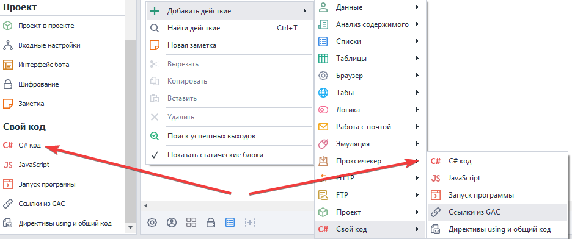
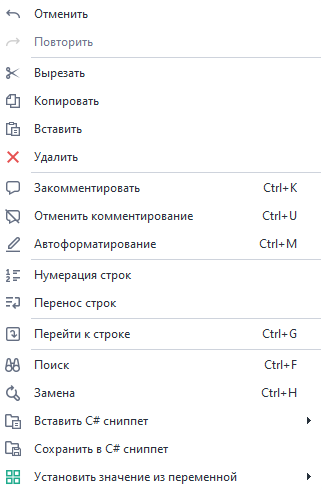
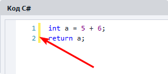
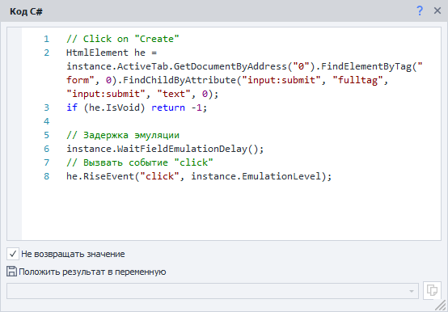
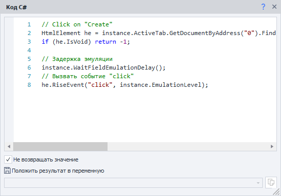
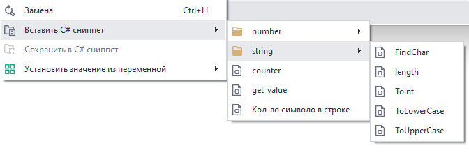
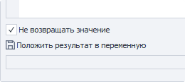
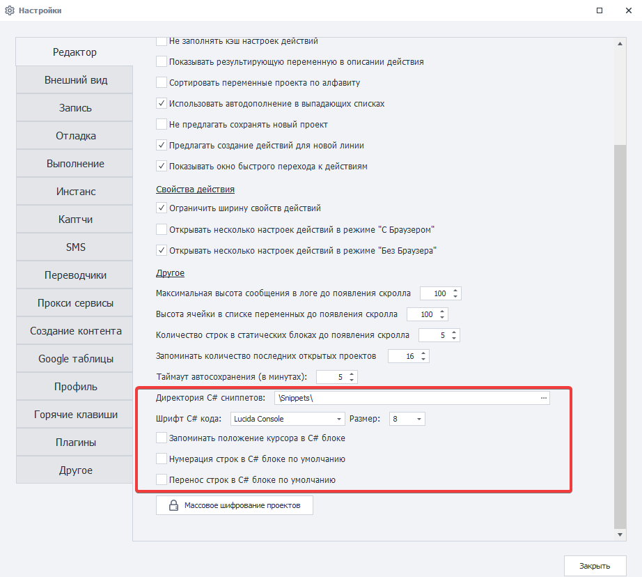
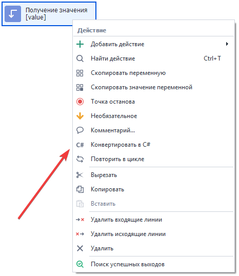
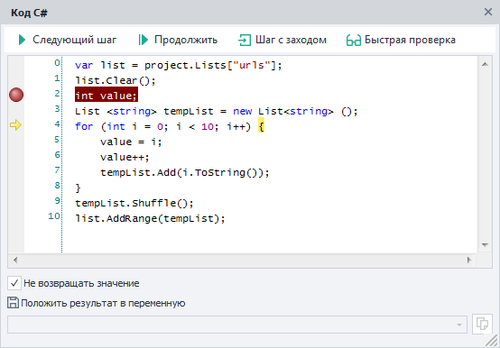

---
sidebar_position: 1
title: "C# код (Си шарп код .net)"
description: ""
date: "2025-08-04"
converted: true
originalFile: "C# код (Си шарп код .net).txt"
targetUrl: "https://zennolab.atlassian.net/wiki/spaces/RU/pages/492011596/C+.net"
---
:::info **Пожалуйста, ознакомьтесь с [*Правилами использования материалов на данном ресурсе*](../Disclaimer).**
:::

> 🔗 **[Оригинальная страница](https://zennolab.atlassian.net/wiki/spaces/RU/pages/492011596/C+.net)** — Источник данного материала

_______________________________________________  
# C# код (Си шарп код .net)

  

## Описание

Данный экшен позволяет вставлять в проект куски кода написанные на популярном языке программирования C# и тем самым многократно расширять функциональность ZennoPoster и область его использования. 

**C#** - объектно-ориентированный язык, но в данном экшене не используются все преимущества такого подхода (классы, наследования) и код исполняется последовательно за исключением использования классов и публичных переменных из [❗→ Директивы using и общий код](https://zennolab.atlassian.net/wiki/spaces/RU/pages/492109917 "https://zennolab.atlassian.net/wiki/spaces/RU/pages/492109917") 

## Как добавить действие в проект?

Через контекстное меню **Добавить действие** → **Свой код** → **C# код**




Либо воспользуйтесь [❗→ умным поиском](https://zennolab.atlassian.net/wiki/spaces/RU/pages/506200090/ProjectMaker+7#%D0%A3%D0%BC%D0%BD%D1%8B%D0%B9-%D0%BF%D0%BE%D0%B8%D1%81%D0%BA-%D0%B4%D0%B5%D0%B9%D1%81%D1%82%D0%B2%D0%B8%D0%B9 "https://zennolab.atlassian.net/wiki/spaces/RU/pages/506200090/ProjectMaker+7#%D0%A3%D0%BC%D0%BD%D1%8B%D0%B9-%D0%BF%D0%BE%D0%B8%D1%81%D0%BA-%D0%B4%D0%B5%D0%B9%D1%81%D1%82%D0%B2%D0%B8%D0%B9").

## Где это можно применить?

- Практически любые действия кубиков можно заменить аналогичными исполняемыми в C# при этом ускоряется разработка и эффективность выполнения кода.
- Использование любых разработок на C# в своём проекте.
- Интеграция сторонних библиотек и применение их в коде.

  

## Как работать с экшеном?

Кубик *Свой C# код* представляет собой обычный текстовый редактор с базовой подсветкой кода.

На вход можно использовать любые переменные проекта ([❗→ Работа с переменными](https://zennolab.atlassian.net/wiki/spaces/RU/pages/486309922 "https://zennolab.atlassian.net/wiki/spaces/RU/pages/486309922") ), а результат также сохранять в переменных, в текстовых файлах, таблицах и базах данных. Для использования методов и свойств проекта используется сущность `project`, а для работы с браузером используется сущность `instance`.

:::note На заметку
Если Вы хотите использовать переменную проекта в коде, то вызывать её надо так - `project.Variables["counter"].Value`, где `counter` - имя переменной.
:::

  

### Контекстное меню




Правым кликом по окну кубика открывается контекстное меню, которое имеет следующие опции:

#### Отменить\Повторить

Отменяет последнее изменение в коде. Если отмена была сделана неправильно, то можно повторить отмененный ввод. Важно учесть, что данные действия работают только в коде окна **C#** и не вызывают изменений в других кубиках. Для аналогичной функции в рабочей области для работы с кубиками есть подобные действия на тулбаре ProjectMaker.

#### Вырезать\Копировать\Вставить\Удалить

Стандартные действия по работе с кодом как с текстом.

#### Закомментировать\Отменить комментирование

Комментирование кода крайне полезный функционал. Особенно в больших проектах или при отладке кода. В комментариях можно разместить информацию об изменениях, связях, функционале строк или частей кода. Комментариями можно быстро включать/отключать отдельные строки или куски кода для проверки ошибок и при тестировании. Для комментирования части кода нужно его выделить и нажать этот пункт.

#### Нумерация строк




Включает/отключает нумерацию строк, которая важна для быстрой навигации по коду, для нахождения ошибок после получения информации об ошибке в логах. Но на небольших проектах нумерацию можно отключить чтобы расширить рабочее пространство.

:::note На заметку
В настройках программы можно выставить поведение по умолчанию.
:::

#### Перенос строк

Включает автоматический перенос строк, если строка не помещается в текущее окно.

Ниже можно увидеть пример одного и того же окна с включенной и выключенной настройкой переноса строк.

Настройка включена




Настройка выключена




:::note На заметку
В настройках программы можно выставить поведение по умолчанию.
:::

#### Перейти к строке

В больших проектах важно быстро найти ошибочный участок кода. Ошибки выводятся в логах программы. При клике на этот элемент меню открывается диалоговое окно, где можно ввести номер линии и номер столбца. При подтверждении ввода курсор переводится точно в указанное место в коде кубика.

#### Поиск

Открывает окно поиска по коду этого экшена. Искать можно с учетом параметров: учитывать регистр или нет, слово целиком, обратное направление поиска и использовать регулярные выражения или знаки подстановки при поиске. Нажимая на кнопку *Найти далее курсор переходит на первое найденное значение, повторное нажатие переводит курсор на следующее найденное значение и т. д.

#### Замена

Похоже на *Поиск, но сразу после нахождения искомого значения производится его замена на введенное значение. Работать может в пошаговом режиме, либо сразу заменить все найденные вхождения нажатием кнопки *Заменить всё

#### Вставить C# сниппет

В место где сейчас находится курсор будет вставлено всё содержимое выбранного файла.

Изначально этот пункт меню не отображается, чтобы он появился, надо в [❗→ Директорию C# сниппетов](https://zennolab.atlassian.net/wiki/spaces/RU/pages/725385223#%D0%94%D0%B8%D1%80%D0%B5%D0%BA%D1%82%D0%BE%D1%80%D0%B8%D1%8F-C%23-%D1%81%D0%BD%D0%B8%D0%BF%D0%BF%D0%B5%D1%82%D0%BE%D0%B2 "https://zennolab.atlassian.net/wiki/spaces/RU/pages/725385223#%D0%94%D0%B8%D1%80%D0%B5%D0%BA%D1%82%D0%BE%D1%80%D0%B8%D1%8F-C%23-%D1%81%D0%BD%D0%B8%D0%BF%D0%BF%D0%B5%D1%82%D0%BE%D0%B2") добавить хотя бы один файл либо сохранить фрагмент кода с помощью функции *Сохранить в C# сниппет (описано ниже).
Файлы в директории можно перемещать в папки и таким образом удобно их группировать.




#### Сохранить в C# сниппет

Позволяет сохранять выделенный фрагмент кода в TXT-файл как сниппет для дальнейшего использования и быстрой вставки в других проектах.

:::note На заметку
Директорию, в которую будут сохраняться сниппеты, можно [❗→ изменить в настройках программы](https://zennolab.atlassian.net/wiki/spaces/RU/pages/725385223 "https://zennolab.atlassian.net/wiki/spaces/RU/pages/725385223").
:::

#### Установить значение из переменной

При наведении курсора на этот пункт контекстного меню открывается список всех [❗→ ***Своих***](https://zennolab.atlassian.net/wiki/spaces/RU/pages/735608872#%D0%A1%D0%B2%D0%BE%D0%B8 "https://zennolab.atlassian.net/wiki/spaces/RU/pages/735608872#%D0%A1%D0%B2%D0%BE%D0%B8") и [❗→ ***Авто-сгенерированных***](https://zennolab.atlassian.net/wiki/spaces/RU/pages/735608872#%D0%90%D0%B2%D1%82%D0%BE "https://zennolab.atlassian.net/wiki/spaces/RU/pages/735608872#%D0%90%D0%B2%D1%82%D0%BE") переменных проекта. Выбрав нужную переменную в редакторе появляется конструкция вида `project.Variables["myVar"].Value`, которая представляет собой значение переменной `myVar`. 
Это значение всегда имеет строковый тип и для его использовании в качестве других типов необходима конвертация.

### Не возвращать значение




Отключение этого чекбокса позволяет передавать результат выполнения кода с помощью оператора возврата `return`. 

### Положить результат в переменную

Из этого списка можно подставить любую переменную в которую сохранится значение по результату выполнения `return`, конечно, если отключен чекбокс из предыдущего пункта.

:::note На заметку
Каждая строка C# обязательно должна заканчиваться точкой с запятой ; . Это помогает определить компилятору где заканчивается строка. Без этого символа проект просто выдаст ошибку на этапе запуска.
:::

  

## Настройки

Для установки настроек по умолчанию для кубика “**С#**“ служит эта часть [❗→ настроек программы](https://zennolab.atlassian.net/wiki/spaces/RU/pages/725385223 "https://zennolab.atlassian.net/wiki/spaces/RU/pages/725385223").




  

## Конвертация экшенов в код

Важно отметить, что в ZennoPoster имеется функционал позволяющий новичкам быстро освоиться с C# и начать использовать этот язык уже в самом начале своей работы с программой. Много экшенов можно конвертировать в C# код и в дальнейшем работать с полученным кодом аналогичным по функционалу кубика. Для этого достаточно после создания кубика и установки его свойств нажать на *Конвертировать в C# в контекстном меню и затем вставить скопированный код в кубик *C# код. 




  

## Отладка C#

В сложных и больших фрагментах C# часто бывает сложно быстро найти ошибку. Поэтому необходима отладка (debug) C# кода с пошаговым мониторингом изменения переменных и данных в списках, таблицах и базах данных. Также как и в основном проекте ZennoPoster, каждый экшен C# можно отладить в Project Maker с помощью установки одной или нескольких точек останова. 

Для добавления точки останова нужно кликнуть в поле слева от редактора кода напротив нужной строки. После этого нажатием *Далее запускаем исполнение кубика и затем с помощью навигации в панели над редактором кода в пошаговом режиме или в режиме до следующей точки останова проверяем работу кода, смотрим изменения переменных в [❗→ Окне переменных](https://zennolab.atlassian.net/wiki/spaces/RU/pages/735608872 "https://zennolab.atlassian.net/wiki/spaces/RU/pages/735608872") и это помогает эффективно исправлять ошибки.




  

## Примеры использования

Обучение программированию на C# выходит за рамки данного документа, однако можно дать несколько советов и практических примеров, которые часто используются в практике пользователей ZennoPoster при работе с C#.

### Арифметические действия с целыми числами

```csharp
int value1 = Convert.ToInt32(project.Variables["value1"].Value);
int value2 = Convert.ToInt32(project.Variables["value2"].Value);
int value3 = value1 + value2; //или value1 - value2 или value1 * value2 и т. д.
return value3.ToString(); //сумма двух чисел
```

### Округление результата деления

```csharp
float value1 = Convert.ToSingle(project.Variables["value1"].Value);
float value2 = Convert.ToSingle(project.Variables["value2"].Value);
return Math.Ceiling(value1/value2); // округление в большую сторону
//или
return Math.Ground(value1/value2); // округление в меньшую сторону
```

### Создание списка со случайными числами от 1 до 10

:::note На заметку
Обратите внимание, в этом примере экшен C# ничего не возвращает, в отличии от двух примеров выше где итоговое значение с помощью оператора возврата return попадает в указанную кубиком переменную. Здесь результат работы сохраняется в списке.
:::

:::note На заметку
В этом примере ключевое слово `var` ссылается на тип неявным способом. Это псевдоним любого типа. Реальный тип определит компилятор `C#`
:::

```csharp
var list = project.Lists["numbers"];//обращаемся к списку списков проекта для получения сущности одного из них.
list.Clear();//очищаем список перед заполнением
int value;//объясляем цельночисленную переменную
List <string> tempList = new List<string> ();//создаём новый список из строк, но этот список существует только в рамках этого экшена и будет уничтожен после выполнения экшена
for (int i = 0; i < 10; i++) {//цикл из 10 иттераций 
	value = i;//присваиваем значение счетчика цикла чтобы не имзменять его
	value++;//увеличиваем на 1 значение переменной
	tempList.Add(value.ToString());//добавляем во временный список строковое значение числа
}//повторяем так 10 раз
tempList.Shuffle();//перемешиваем список
list.AddRange(tempList);//добавляем в результирующий список перемешанный список чисел от 1 до 10
```

### Получение случайной строки из файла с доступами к аккаунтам и разделение её на логин и пароль

Оператор `return` можно использовать для возврата **null**. Ключевое слово **null** является литералом, представляющим пустую ссылку, которая не ссылается на объект. При возврате **null** экшен C# выйдет по красной линии и это часто удобно использовать для создания взаимосвязей с другими кубиками. В примере ниже при пустом списке аккаунтов можно вывести предупреждение (хотя тоже самое можно сделать и внутри C# с помощью метода `project.SendInfoToLog("Пустой список", true);`) и заполнить пустой список из TXT новыми доступами.

```csharp
IZennoList list = project.Lists["accounts"];//получаем список с привязанным TXT-файлом в котором построчно хранятся доступы в формате логин:пароль
if (list.Count== 0) return null;//Если список пустой, то выходим из кубика по красной линии
Random rnd = new Random();//создаем генератор случайных чискел
string str = list[rnd.Next(0, list.Count)];//вычисляем случайное чисто от 0 до количества элементов списка (не включительно) и назначаем значение найденного индекса строковой переменной
string [] arr = str.Split(':');//формируем массив строк разделяя переменную с помощью делимера :
project.Variables["login"].Value = arr[0];//берем первый элемент массива, который является логином (индесы массивов, списков всегда начинаются с 0) и присваиваем это значение переменной login
project.Variables["password"].Value = arr[1];//второй элемент массива будет паролем
```

### Работа с HTML элементами

Через C# можно работать с методами объекта `instace` точно также как и со стандартными кубиками, но на на более высоком уровне. В примере ниже получаем коллекцию HTML- элементов и добавляем в список ссылки с их дочерних элементов. 

:::note На заметку
Для быстрого получения значений атрибутов HTML-элементов удобно сначала с помощью Конструктора действий добавлять кубик по работе с этим элементом, а потом с помощью функционала Конвертировать в C# получать код, который нуждается в минимальных правках.
:::

```csharp
var list = project.Lists["urls"];//список в который будем складывать ссылки
HtmlElementCollection hec = instance.ActiveTab.GetDocumentByAddress("0").FindElementsByAttribute("li", "class", "pageNav-page", "regexp");//получаем коллекцию HTML элементов с тегом "li" имеющих в имени класса текст "pageNav-page"
for (int i = 0; i < hec.Count; i++) {
	HtmlElement he = hec.GetByNumber(i);//перебираем все элементы коллекции в цикле
	if (he.IsVoid) break;//если элемент недоступен, то прерываем цикл с помощью команды break
	string attribute = he.FirstChild.GetAttribute("href");//получаем значение атрибута "href" - URL на страницу
	list.Add(attribute);//добавляем URL в список
}
```

### Работа с файлами: получение разрешения (ширина x высота) изображения

:::note На заметку
Символ @ перед строкой означает, что компилятор будет использовать строку за ним буквально, а не как escape-последовательность. Если убрать этот символ, то для корректности пути в примере ниже, пришлось бы ставить двойной слэш вместо одинарного для правильной работоспособности кода.
:::

```csharp
Image img = Image.FromFile(project.Directory + @"/temp.jpg");//получаем изображение из файла
int width = img.Width;//получаем ширину картинки
int height = img.Height;//и высоту
return width.ToString() + "х"+ height.ToString();//формируем строку с данными
```

### Работа с OwnCode и с изображениями: наложение полупрозрачного “водяного знака” по центру

:::note На заметку
На практике часто требуется вывести некоторые функции на C# в отдельное место и обращаться к ним из разных экшенов. Этому служит OwnCode (свой код) .В этот класс можно вставить функцию, которая будет доступна из кубиков. Эта функция может принимать параметры (аргументы) и она будет возвращать результаты этих вычислений.В примере ниже создаётся такая функция SetImageOpacity, которая принимает изображение и значение на которое нужно изменить её прозрачность, а на выходе она отправляет измененное изображение. Эта функция требует using System.Drawing.Imaging;
:::

```csharp
Image original = Image.FromFile(project.Directory + @"/image.jpg");//исходная картинка на которую нужно наложить водяной знак

int w = original.Width;//азмеры исходной картинки
int h = original.Height;

int w_wm = (int) w/10;//ширина водяного знака, в данном случае эта ширина составляет 10 исходной картинки

Image wm = OwnCode.CommonCode.SetImageOpacity(Image.FromFile(project.Directory + @"/wm.png"), .5F);//в одной строке получаем изображение из файла и обрабатываем его (накладываем эффект полупрозрачности) с помощью функции SetImageOpacity, которая находится в классе общего кода
float scale = (float)wm.Height / wm.Width; //пропорции водяного знака
int h_wm = (int) (w_wm * scale);//вычисляем новую высоту водяного знака в зависимости от новой ширины и пропорций
int x = (int) (w/2 - w_wm/2);//позиция x водяного знака (середина основной картинки минус середина новой ширины водяного знака
int y = (int) (h/2 - h_wm/2);//позиция y водяного знака

Graphics gr = Graphics.FromImage(original);//создаём графический объект из исходкого изображения
gr.DrawImage(wm, x, y, w_wm, h_wm);//рисуем поверх исходной картинки водяной знак с вычисленными ранее координатами и новыми размерами

original.Save(project.Directory + @"/image_result.jpg", System.Drawing.Imaging.ImageFormat.Jpeg);//сохраняем картинку в формате JPEG по указанному пути
original.Dispose();//уничтожаем объекты, которые уже не нужны, чтобы они не занимали память
wm.Dispose();
gr.Dispose();
```

И собственно класс `SetImageOpacity` , который нужно вставить в классе `OwnCode.CommonCode`

```csharp
using System.Drawing.Imaging;
public static Image SetImageOpacity(Image image, float opacity)  
{  
    try  {  
		Bitmap bmp = new Bitmap(image.Width, image.Height);
        //создание графики из картинки
        using (Graphics gfx = Graphics.FromImage(bmp)) {
            //создание объекта color matrix  
            ColorMatrix matrix = new ColorMatrix();      
            //установка прозрачности 
            matrix.Matrix33 = opacity;  
            //создание новых атрибутов
            ImageAttributes attributes = new ImageAttributes();      
            //установка цвета прозрачности картинки
            attributes.SetColorMatrix(matrix, ColorMatrixFlag.Default, ColorAdjustType.Bitmap);    
            //отрисовываем картинку
            gfx.DrawImage(image, new Rectangle(0, 0, bmp.Width, bmp.Height), 0, 0, image.Width, image.Height, GraphicsUnit.Pixel, attributes);
        }
        return bmp;  
    }  
    catch (Exception ex)  
    {  
        return null;  
    }  
} 
```

### Работа с Regex

:::note На заметку
С помощью регулярных выражений, которые полностью поддерживает C#, удобно парсить данные, находить нужные значения, обрабатывать и присваивать данные переменным, очищать тексты от мусора.В примере ниже стоит задача - очистить от всех тегов HTML содержимое некоторого элемента.
:::

```csharp
string html = project.Variables["value1"].Value;//присваиваем значение переменной где содержится исходный код элемента
return Regex.Replace(html, @"<.*?>", String.Empty);//заменяем HTML-теги на пустоту и возвращаем результат
```

### Работа с макросами

:::note На заметку
С помощью объекта Macros можно получить доступ ко множеству функций по работе с файловой системой или по обработке текстов. Например можно в C# организовать обработку Spintax, аналогичную соответствующему кубику.
:::

```csharp
return Macros.TextProcessing.Spintax("{0|1|2}");//случайно выведет одно из трёх значений
```

  

## Полезные ссылки

- [❗→ Документация по API ZennoPoster (управлению из .Net кода)](https://zennolab.atlassian.net/wiki/spaces/RU/pages/495058994/ "https://zennolab.atlassian.net/wiki/spaces/RU/pages/495058994/")
- [Официальное руководство по программированию на C#](https://docs.microsoft.com/ru-ru/dotnet/csharp/programming-guide/ "https://docs.microsoft.com/ru-ru/dotnet/csharp/programming-guide/")
- [Большая коллекция сниппетов (в основном C#), созданных комьюнити ZennoPoster](https://github.com/ZennoHelpers/Snippets "https://github.com/ZennoHelpers/Snippets")