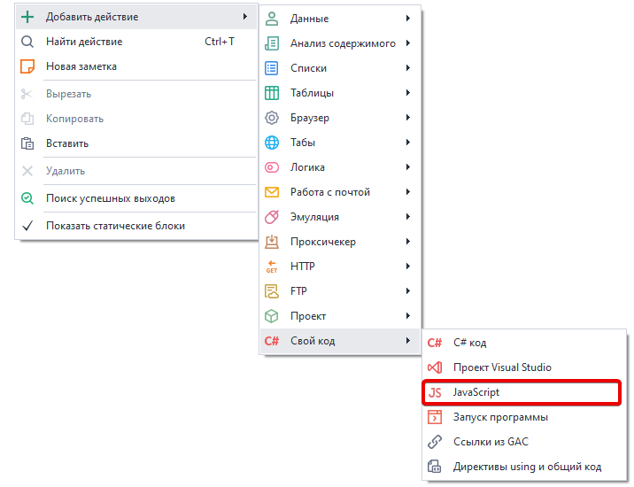
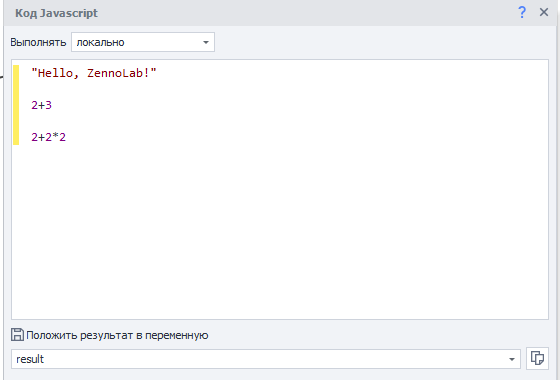
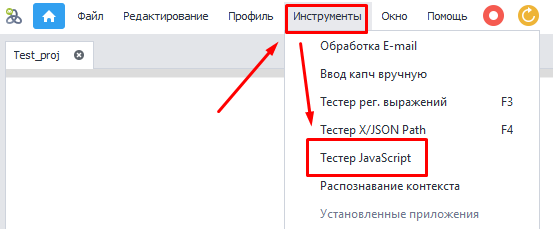
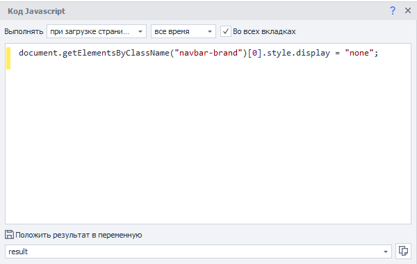
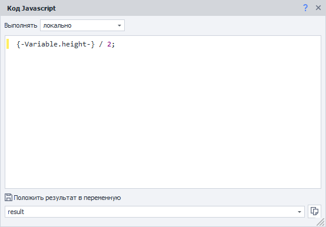
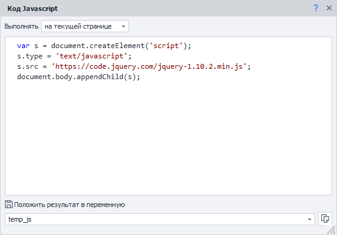

---
sidebar_position: 2
title: "Код JavaScript"
description: ""
date: "2025-08-04"
converted: true
originalFile: "Код JavaScript.txt"
targetUrl: "https://zennolab.atlassian.net/wiki/spaces/RU/pages/489259137/JavaScript"
---
import DisclaimerNotice from '@site/src/components/DisclaimerNotice';

<DisclaimerNotice />

> 🔗 **[Оригинальная страница](https://zennolab.atlassian.net/wiki/spaces/RU/pages/489259137/JavaScript)** — Источник данного материала

_______________________________________________  
## Описание
Этот экшен позволяет выполнять пользовательский JavaScript код и производить арифметические операции с переменными проекта.  


### Как добавить действие в проект?
Через контекстное меню: **Добавить действие** → **Свой код** → **JavaScript**



_______________________________________________ 
## Принцип работы
Есть **несколько режимов работы:**  

### Локально.  
Код будет выполнен в изолированном окружении, независимо от открытого приложения и за его пределами.   
Этот способ можно использовать для работы с любыми данными, которые поддерживает JS. Например с:  
- *переменными*,  
- *числами*,  
- *строками*.  



При работе в данном режиме **не надо** указывать ключевое слово *return*, если собираетесь вернуть какое-то значение. Данный экшен сам вернет результат вычислений из последней строки.  
В примере выше в переменную проекта `{-Variable.result-}` попадёт значение `6`, результат выражения `2+2*2`.  

:::info **Протестировать такой код можно с помощью *Тестера JavaScript*.**  

:::  

### На текущей странице
Код будет выполнен на открытой странице браузера. Этот способ стоит использовать для работы с DOM-древом, чтобы взаимодействовать с элементами страницы.  

При работе в данном режиме открывается доступ ко все объектам текущей страницы. В том числе к подключенным на сайте библиотекам и фреймворкам (например jQuery).  

 
:::warning **Независимо от выбранного режима**  
В настройках экшена обязательно должна быть указана переменная, в которую сохранится результат работы. Даже если логика кода не подразумевает возврат значения. 
:::   

### На странице расширения
Код будет выполнен в контексте активированного расширения.

### При создании окна страницы
Скрипт выполнится во время события `DOMWindowCreated`. С помощью данного режима можно переопределять любые JavaScript объекты, до первого обращения к ним сайта.  

У данного режиме есть несколько вариантов исполнения:
- *один раз* — код выполнится только единожды;  
- *на домене* — выполнение каждый раз при создании окна для указанного домена.
- *все время* — исполняется при каждом создании окна независимо от домена.   

:::info Код исполняется во всех вкладках инстанса  
Если при этом отмечена настройка «Во всех вкладках»
:::   

### При загрузке страницы
При таком варианте скрипт выполняется уже во время события `DOMContentLoaded`. Можно использовать, например, для отключения отображения ненужных или мешающих элементов на странице.  



Как и в предыдущем режиме существует несколько вариантов исполнения:
- *один раз* — код выполнится только единожды;  
- *на домене* — выполнение каждый раз при создании окна для указанного домена.
- *все время* — исполняется при каждом создании окна независимо от домена.   

:::info Код исполняется во всех вкладках инстанса  
Если при этом отмечена настройка «Во всех вкладках»
:::  
_______________________________________________ 
## Пример использования
### Арифметические операции

|  |
| :--: |
| *После выполнения этого экшена в переменную **result** сохранится результат деления переменной **height** на **2***|


### Подключение JavaScript библиотек
Можно также встроить на страницу библиотеку, которой изначально не было. Например, с помощью кода добавить jQuery:

```javascript
var s = document.createElement('script');
s.type = 'text/javascript';
s.src = 'https://code.jquery.com/jquery-1.10.2.min.js';
document.body.appendChild(s);
```



### [Пример проекта](./assets/add_jquery.zp)


## Полезные ссылки

- [❗→ XPath](https://zennolab.atlassian.net/wiki/spaces/RU/pages/862093419 "https://zennolab.atlassian.net/wiki/spaces/RU/pages/862093419")
- [❗→ C# код](https://zennolab.atlassian.net/wiki/spaces/RU/pages/492011596/C+.net "https://zennolab.atlassian.net/wiki/spaces/RU/pages/492011596/C+.net")
- [❗→ Тестер JavaScript](https://zennolab.atlassian.net/wiki/spaces/RU/pages/534086128 "https://zennolab.atlassian.net/wiki/spaces/RU/pages/534086128")