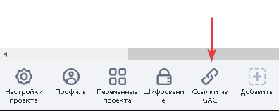
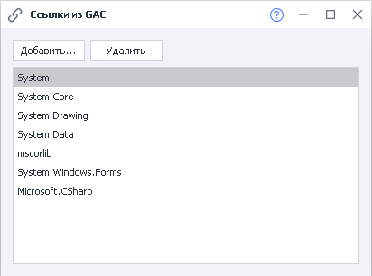
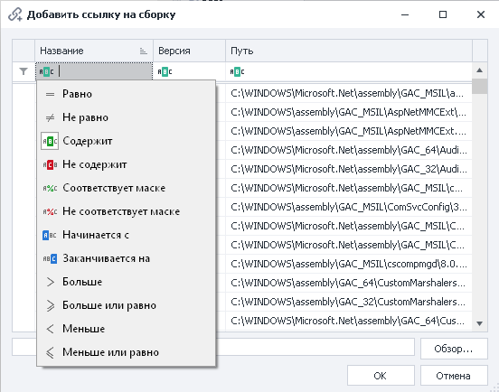
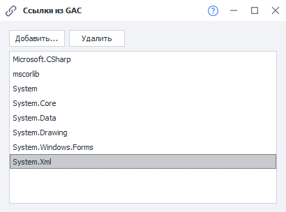

---
sidebar_position: 4
title: "Ссылки из GAC"
description: ""
date: "2025-08-04"
converted: true
originalFile: "Ссылки из Global Assembly Cache (GAC).txt"
targetUrl: "https://zennolab.atlassian.net/wiki/spaces/RU/pages/492175442/Global+Assembly+Cache+GAC"
---
import DisclaimerNotice from '@site/src/components/DisclaimerNotice';

<DisclaimerNotice />

> 🔗 **[Оригинальная страница](https://zennolab.atlassian.net/wiki/spaces/RU/pages/492175442/Global+Assembly+Cache+GAC)** — Источник данного материала

_______________________________________________  
## Описание
При использовании C# сниппетов вам доступны все возможности этого языка. Например, он включает в себя обширную библиотеку классов и методов, которая покрывает большинство возникающих задач.  

Описание различным классов, а также их возможности доступны на странице [**Библиотека классов платформы .NET Framework**](https://learn.microsoft.com/ru-ru/previous-versions/gg145045(v=vs.110)?redirectedfrom=MSDN).  

Однако, если вы не нашли класс, решающий вашу задачу, вы можете воспользоваться сторонней библиотекой. Для этого в проект нужно добавить экшен **Ссылки из GAC**, в котором можно подключить отдельную библиотеку классов.  

### Как добавить в проект?  
Через контекстное меню: **Добавить действие → Свой код → Ссылки из GAC**.  

  

Или через **[*Панель статических блоков*](/zennoposter/ProjectMaker/Project-editor/Static_blocks/General_Principles_of_Operation) → Добавить → Добавить ссылки из GAC**:  

  

_______________________________________________
## Принцип работы

При открытии экшена или соответствующего элемента из [*Панели статических блоков*](/zennoposter/ProjectMaker/Project-editor/Static_blocks/General_Principles_of_Operation) появится окно, в котором перечислены все подключенные в данный момент библиотеки.  

С помощью кнопки **Добавить** можно добавить свою библиотеку, выбрав ее из списка или загрузив из файла. 

Можно также воспользоваться фильтрацией для поиска:

После добавления нужной библиотеки для нее необходимо прописать новое пространство имен. Это делается через экшен [*Директивы using и общий код*](./Using_Directives_and_Shared_Code), который мы рассматриваем в соседней статье.  

:::tip Для эстетичного вида вашего кода 
А также для доступа к классам в обход пространства имён и при использовании стандартной библиотеки классов платформы .NET Framework следует использовать [Директивы using и общий код](./Using_Directives_and_Shared_Code)
::: 

