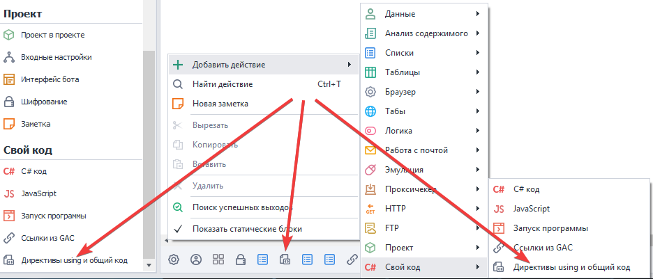
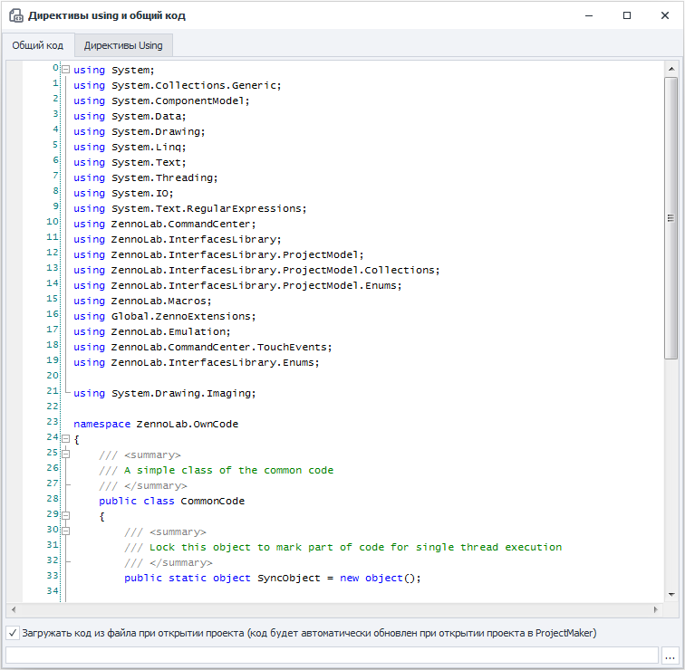
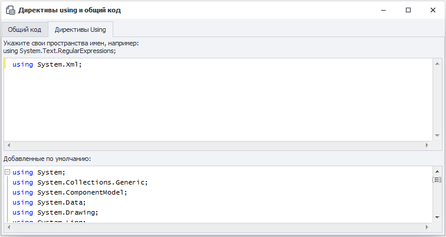

---
sidebar_position: 5
title: "Директивы using и общий код"
description: ""
date: "2025-08-04"
converted: true
originalFile: "Директивы using и общий код.txt"
targetUrl: "https://zennolab.atlassian.net/wiki/spaces/RU/pages/492109917/using"
---
import DisclaimerNotice from '@site/src/components/DisclaimerNotice';

<DisclaimerNotice />

> 🔗 **[Оригинальная страница](https://zennolab.atlassian.net/wiki/spaces/RU/pages/492109917/using)** — Источник данного материала

_______________________________________________  
## Описание
**Общий код** - это функционал, расширяющий возможности стандартных кубиков C#. Он используется для вставки дополнительных классов и функций.   

А **Using-директивы** нужны для доступа к функциям и классам, а также для создания пространства имён (*namespaсes*).  

#### Как можно использовать?  
- Более эффективная работа с C# кодом.  
- Создание новых пространств имен.  
- Организация работы с большим объемом кода.  
- Избежание конфликтов в пространстве имен.

:::warning **Работа с общим кодом подразумевает, что у вас уже есть базовые знания C#.**
:::  

### Как добавить действие в проект?
Через контекстное меню: **Добавить действие** → **Свой код** → **Директивы using и общий код**

  

> *При добавлении действия в [Панели статических блоков](/zennoposter/ProjectMaker/Project-editor/Static_blocks/General_Principles_of_Operation) появится соответствующий блок.*  
_______________________________________________
## Общий код
Это окно представляет собой редактор кода с подсветкой синтаксиса. В контекстном меню можно получить доступ к базовому функционалу для редактирования кода: копирование, вставка, комментирование, поиск, замена и т. д.  

В нижней части окна есть чекбокс, который позволяет загружать код из своего файла в форматах `.txt` или `.cs`.  

Самыми первыми в коде перечислены все **using**, используемые в проекте. А далее идет пример объявления `namespace ZennoLab.OwnCode`. Вы можете по аналогии создавать свои пространства имён и обращаться к ним в дальнейшем.  

Для доступа к функциям и методам общего кода их нужно объявлять с модификатором `public`. Если не нужно работать с объектами определенного класса, то его можно объявить статичным `public static`. А когда не понадобится наследование, то лучше сразу объявить как `public sealed`.  

:::warning В общем коде невозможно напрямую получить доступ к сущностям `instance` или `project`
В отличие от кубиков C#.  

Поэтому для работы с инстансом эти объекты необходимо инициировать через `new`:  
(`Instance instance = new Instance("127.0.0.1", 40500, "server");`)  
или передать их через аргументы функций.  

Аналогично с переменными проекта — их значения необходимо передавать посредством аргументов функций.
:::
_______________________________________________
## Директивы Using  
  

Перейдя на эту вкладку, вы увидите перед собой два поля:  
- **Верхнее**. Служит для добавления *namespaces*, которые используются при выполнении кода в экшенах C#. Например, для парсинга XML нужно написать `using System.Xml;`.  
- **Нижнее**. Здесь перечислены все *using*, которые используются проектом по умолчанию. Их нельзя редактировать.  

