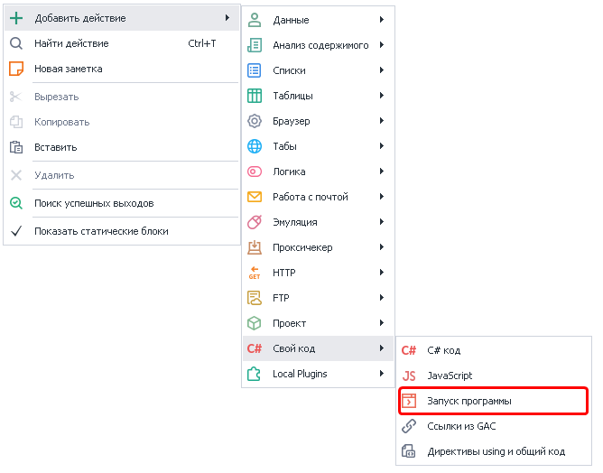
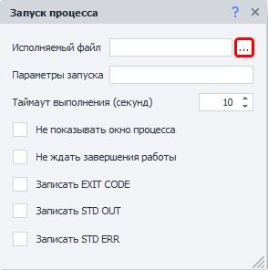
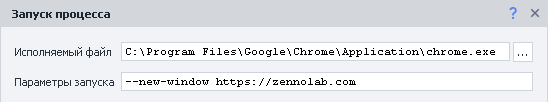
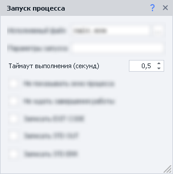
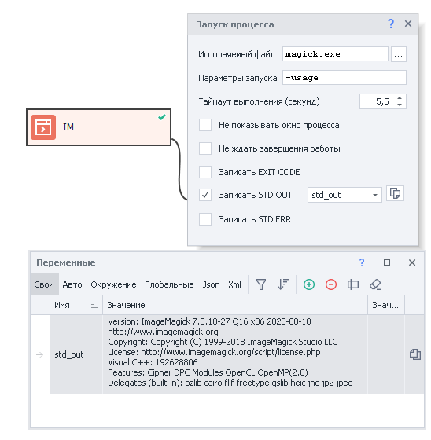
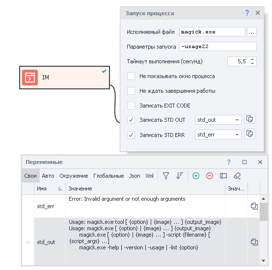
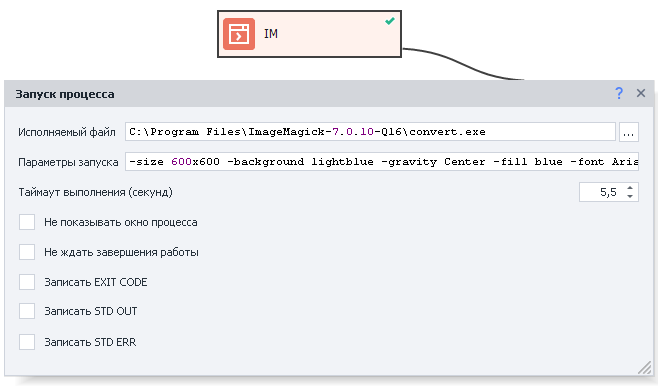
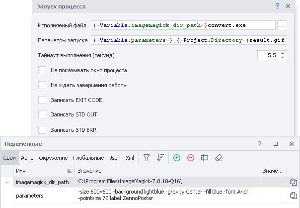
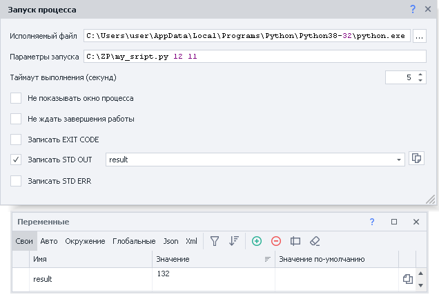
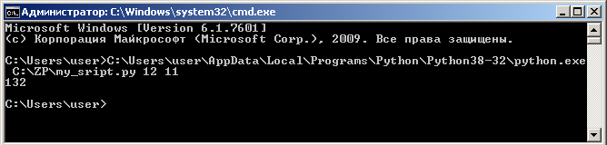

---
sidebar_position: 3
title: "Запуск программ"
description: ""
date: "2025-08-04"
converted: true
originalFile: "Запуск программ.txt"
targetUrl: "https://zennolab.atlassian.net/wiki/spaces/RU/pages/534315231"
---
:::info **Пожалуйста, ознакомьтесь с [*Правилами использования материалов на данном ресурсе*](../Disclaimer).**
:::

> 🔗 **[Оригинальная страница](https://zennolab.atlassian.net/wiki/spaces/RU/pages/534315231)** — Источник данного материала

_______________________________________________  
# Запуск программ

  

## Описание

Экшен служит для запуска сторонних программ. Запускать можно как обычные десктопные программы (Notepad, WinRar, Paint), так и консольные утилиты (ffmpeg, ImageMagick). Есть возможность передачи параметров запуска.

  

## Как добавить действие в проект?

Через контекстное меню **Добавить действие** → **Свой код** → **Запуск программы**




Либо воспользуйтесь [❗→ умным поиском](https://zennolab.atlassian.net/wiki/spaces/RU/pages/506200090/ProjectMaker+7#%D0%A3%D0%BC%D0%BD%D1%8B%D0%B9-%D0%BF%D0%BE%D0%B8%D1%81%D0%BA-%D0%B4%D0%B5%D0%B9%D1%81%D1%82%D0%B2%D0%B8%D0%B9 "https://zennolab.atlassian.net/wiki/spaces/RU/pages/506200090/ProjectMaker+7#%D0%A3%D0%BC%D0%BD%D1%8B%D0%B9-%D0%BF%D0%BE%D0%B8%D1%81%D0%BA-%D0%B4%D0%B5%D0%B9%D1%81%D1%82%D0%B2%D0%B8%D0%B9").

  

## Где это можно применить?

- Чаще всего используется для запуска консольных утилит. Например:
    - [❗→ ImageMagick](https://imagemagick.org/index.php "https://imagemagick.org/index.php") - набор программ (консольных утилит) для чтения и редактирования файлов множества графических форматов (изображений).
    - [❗→ FFmpeg](https://ffmpeg.org/ "https://ffmpeg.org/") - набор свободных библиотек с открытым исходным кодом, которые позволяют записывать, конвертировать и передавать цифровые аудио- и видеозаписи в различных форматах
    - запуск скриптов на [❗→ Python](https://www.python.org/ "https://www.python.org/")и других языках программирования.
- Запуск любых других приложений

  

## Как работать с экшеном?




### Исполняемый файл

Полный путь к файлу, который надо запустить (кликнув по кнопке “Выбора файлов” (выделена красным квадратом) откроется стандартный диалог поиска файлов на компьютере)  
- <span style={{color: 'red'}}><strong>Если файл по указанному пути не будет найден, то экшен завершится с ошибкой</strong></span>
- Можно использовать [❗→ макросы переменных](https://zennolab.atlassian.net/wiki/spaces/RU/pages/486309922 "https://zennolab.atlassian.net/wiki/spaces/RU/pages/486309922")
- Если каталог выполняемой программы находится в [переменной среды PATH](https://ru.wikipedia.org/wiki/PATH_%28%D0%BF%D0%B5%D1%80%D0%B5%D0%BC%D0%B5%D0%BD%D0%BD%D0%B0%D1%8F%29 "https://ru.wikipedia.org/wiki/PATH_(%D0%BF%D0%B5%D1%80%D0%B5%D0%BC%D0%B5%D0%BD%D0%BD%D0%B0%D1%8F)"), то можно указывать не полный путь к файлу, а только его название (`notepad.exe` или `calc.exe`)

### Параметры запуска

Это дополнительные команды, которые передаются запускаемой программе. У каждой программы свои параметры запуска (можно использовать [❗→ макросы переменных](https://zennolab.atlassian.net/wiki/spaces/RU/pages/486309922 "https://zennolab.atlassian.net/wiki/spaces/RU/pages/486309922")).

- Например запуск нового окна браузера Chrome с URL https://zennolab.com будет выглядеть следующим образом:




- При запуске консольных утилит в данной строке передаются аргументы.

### Таймаут

Удобно использовать когда Вы знаете сколько будет выполняться программа. Если вызванная программа не завершит работу после указанного количества секунд, то экшен завершится с ошибкой 

:::note На заметку
Можно указывать дробное значение.
:::




<span style={{color: 'red'}}><strong>Это поведение можно отключить, описано чуть ниже</strong></span>

### Не показывать окно процесса

При включении данной опции запускаемая программа не будет отображена.

### Не ждать завершения работы

При включении этой настройки *Таймаут выполнения будет игнорироваться и экшен не будет ждать пока программа закончит работу.

### Записать EXIT CODE

[Код возврата](https://ru.wikipedia.org/wiki/%D0%9A%D0%BE%D0%B4_%D0%B2%D0%BE%D0%B7%D0%B2%D1%80%D0%B0%D1%82%D0%B0 "https://ru.wikipedia.org/wiki/%D0%9A%D0%BE%D0%B4_%D0%B2%D0%BE%D0%B7%D0%B2%D1%80%D0%B0%D1%82%D0%B0") с которым завершилась вызываемая программа. 

Обычно при нормальном завершении работы программы возвращают 0 (ноль). Если возвращено что-то другое, то, возможно, программа завершилась с ошибкой. Чтоб понять, что означает тот или иной код, стоит вбить в поиск запрос `название_программы exit code код_возврата`, пример - `ffmpeg exit code 137`

### Записать STD OUT

Это стандартный поток вывода. Другими словами, всё что программа пишет в окно консоли (если это не сообщение об ошибке (-ах)) является STD OUT

Пример:

при установке ImageMagick программа добавляет путь к своей папке в [переменную среды PATH](https://ru.wikipedia.org/wiki/PATH_%28%D0%BF%D0%B5%D1%80%D0%B5%D0%BC%D0%B5%D0%BD%D0%BD%D0%B0%D1%8F%29 "https://ru.wikipedia.org/wiki/PATH_(%D0%BF%D0%B5%D1%80%D0%B5%D0%BC%D0%B5%D0%BD%D0%BD%D0%B0%D1%8F)") и уже нет необходимости писать полный путь к исполняемому файлу, можно написать ```xml
magick.exe &lt;тут_аргументы&gt;
```. Для демонстрации STD OUT запустим программу с аргументом `-usage`(в ответ программа напишет базовую информацию о себе) и перенаправим STD OUT в переменную.




### Записать STD ERR

Будет содержать в себе данные, если программа сообщит о какой-либо ошибке.

Пример:

повторим команду из предыдущего пункта, но сделаем ошибку в команде и напишем `-usage22`




На скриншоте видно, что в STD ERR попал текст ошибки, говорящий что был передан неверный аргумент или их было недостаточно. В то же время и в STD OUT тоже попали данные - программа подсказывает нам как ей правильно пользоваться.

:::note На заметку
Вы можете повторить команды описанные выше. Для этого надо установить ImageMagick, после открыть окно консоли (`Win+R → вводим cmd.exe → нажимаем Enter`) и в нём вводим команды `magick-usage` и `magick-usage22`
:::

* * *

## Пример использования

Рассмотрим несколько примеров на основе ImageMagick.

Цель: создать изображение размером 600 на 600 пикселей, со светло голубым фоном, с надписью “ZennoPoster” (синим цветом), шрифт - Arial, размер шрифта - 72. Результат сохраним в файл по пути `C:\Users\user\Desktop\result.gif` рядом с шаблоном. Команда будет выглядеть следующим образом (convert - одна из утилит входящих в состав ImageMagick. На Вашем компьютере путь к исполняемому файлу и рабочему столу может отличаться):

```bash
C:\Program Files\ImageMagick-7.0.10-Q16\convert.exe -size 600x600 -background lightblue -gravity Center -fill blue -font Arial -pointsize 72 label:ZennoPoster C:\Users\user\Desktop\result.gif
```

:::note На заметку
Для подробностей по поводу того или иного аргумента используйте Вашу любимую поисковую систему. Это выходит за рамки данной справки.
:::

:::warning Внимание
Для корректной работы команды в cmd.exe необходимо путь к исполняемому файлу взять в кавычки - "C:\Program Files\ImageMagick-7.0.10-Q16\convert.exe"
:::

### Пример №1. ImageMagick Все параметры жёстко прописаны

|  |
| :--: |
| К сожалению все параметры запуска не поместились на скриншот |


После выполнения данного экшена на рабочем столе появится файл result.gif 


### Пример №2. ImageMagick Параметры переданы в виде переменных




- В данном примере путь к папке с исполняемым файлом был вынесен в [❗→ переменную](https://zennolab.atlassian.net/wiki/spaces/RU/pages/486309922 "https://zennolab.atlassian.net/wiki/spaces/RU/pages/486309922") (например, шаблон может запускаться на разных компьютерах и на каждом может быть свой путь).
- Все параметры тоже были вынесены в переменную (не обязательно было всё сохранять в одну переменную. Можно для каждого аргумента создать свою переменную и перечислить эти переменные в поле *Параметры запуска*)
- Итоговый файл `result.gif` сохраняется в ту же директорию, в которой находится файл проекта. (`{ -Project.Directory- }`- системная переменная в которой хранится полный путь к директории текущего проекта)

:::warning Внимание
Проект должен быть сохранён на компьютере при использовании переменной `{ -Project.Directory- }`. Т.к. в противном случае данная переменная будет пустой.
:::

### Пример №3. Запуск Python скрипта

:::warning Внимание
Для работы данного примера в системе должен быть установлен Python.
:::

Иногда, при поиске в интернете решения той или иной задачи можно найти скрипты написанные на разных языках программирования, которые делают именно то, что Вам нужно. Можно конечно полностью переписать код скрипта на C# и запустить с помощью экшена [❗→ Свой C# код](https://zennolab.atlassian.net/wiki/spaces/RU/pages/492011596/C+.net "https://zennolab.atlassian.net/wiki/spaces/RU/pages/492011596/C+.net"). Или же запустить скрипт с помощью экшена *Запуск программ* и воспользоваться результатом его работы. Последний вариант и будет рассмотрен, на основе языка программирования Python.

Есть скрипт по пути `C:\ZP\my_sript.py`, на входе принимает два числа и умножает их друг на друга, ответ возвращается в консоль (в Вашем случае скрипт может генерировать изображение, текст; либо это может быть нейросеть, которая разгадывает капчу; в общем что угодно).




- В качестве исполняемого файла указываем `C:\Users\user\AppData\Local\Programs\Python\Python38-32\python.exe`(на Вашем компьютере путь может отличаться).
- В *параметрах запуска* первым делом идёт путь к скрипту (`C:\ZP\my_sript.py`), далее два аргумента (`12 11).`
- После запуска данного экшена в переменную result запишется результат работы - 132.

Вот как выглядит запуск того же скрипта в cmd.exe




* * *

## Полезные ссылки

- [❗→ Переменные](https://zennolab.atlassian.net/wiki/spaces/RU/pages/486309922 "https://zennolab.atlassian.net/wiki/spaces/RU/pages/486309922")
- [❗→ Окно переменных](https://zennolab.atlassian.net/wiki/spaces/RU/pages/735608872 "https://zennolab.atlassian.net/wiki/spaces/RU/pages/735608872")