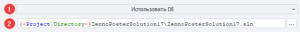
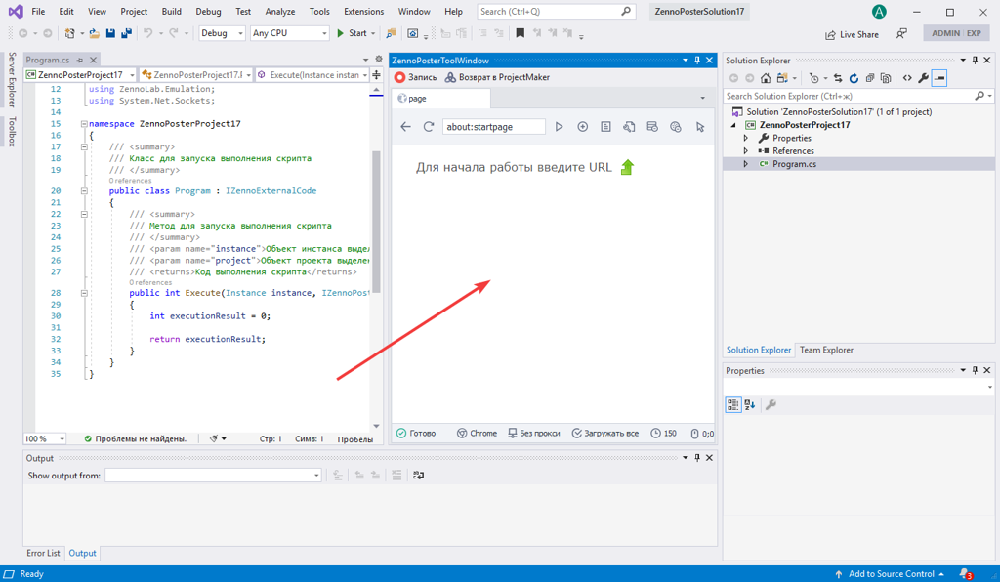

:::info **Пожалуйста, ознакомьтесь с [*Правилами использования материалов на данном ресурсе*](../Disclaimer).**
:::

> 🔗 **[Оригинальная страница](https://zennolab.atlassian.net/wiki/spaces/RU/pages/1375109121/Visual+Studio)** — Источник данного материала

_______________________________________________  
# Проект Visual Studio

## Описание

:::info Информация
Данный кубик доступен с версии 7.3.2.0
:::

Экшен **“Проект Visual Studio”** позволяет использовать в проекте ZennoPoster проект созданный в среде Microsoft Visual Studio 2019 и тем самым открывает неограниченные возможности для написания, отладки кода и подключения внешних библиотек.

## Как добавить действие в проект?

Через контекстное меню **Добавить действие** → **Свой код** → **Проект Visual Studio**

Либо воспользуйтесь [❗→ умным поиском](https://zennolab.atlassian.net/wiki/spaces/RU/pages/506200090/ProjectMaker+7#%D0%A3%D0%BC%D0%BD%D1%8B%D0%B9-%D0%BF%D0%BE%D0%B8%D1%81%D0%BA-%D0%B4%D0%B5%D0%B9%D1%81%D1%82%D0%B2%D0%B8%D0%B9 "https://zennolab.atlassian.net/wiki/spaces/RU/pages/506200090/ProjectMaker+7#%D0%A3%D0%BC%D0%BD%D1%8B%D0%B9-%D0%BF%D0%BE%D0%B8%D1%81%D0%BA-%D0%B4%D0%B5%D0%B9%D1%81%D1%82%D0%B2%D0%B8%D0%B9").

## Для чего это используется?

- Удобная интеграция сторонних библиотек и применение их в коде
- Создание собственных библиотек для многократного использования в разных проектах

## Как работать с экшеном?

Экшн **“Проект Visual Studio”** может работать в двух режимах:

- Использование решения Visual Studio
- Использование Dll

В режиме **“Использовать решение Visual Studio”** свойства кубика выглядят следующим образом

Элементы управления:

1. Выбор режима работы кубика
2. Путь к решению в котором находится проект
3. Проект, который будет запускаться при выполнении кубика
4. Конфигурация проекта
5. Флаг объединение выходной dll и зависимостей в один dll файл с помощью ILRepack
6. Кнопка перехода к режиму **“Использовать Dll”**
7. Кнопка **“Подключиться к Visual Studio”**
8. Кнопка **“Создать новый проект Visual Studio”**

В режиме **“Использовать Dll”** свойства кубика выглядят следующим образом

Элементы управления:

1. Выбор режима работы кубика
2. Путь к dll, которая будет запускаться при выполнении кубика

### Режим “Использовать решение Visual Studio”

#### Создание проекта и подключение к Visual Studio

:::warning Внимание
Для работы экшена в режиме “Решение Visual Studio” необходимо, чтобы были установлены:
- Visual Studio 2019. Бесплатную Community версию можно скачать на официальном сайте https://visualstudio.microsoft.com/ru/vs/community/
- Конечная платформа проекта для .Net Framework 4.6.2 ([Download .NET SDKs for Visual Studio (microsoft.com)](https://dotnet.microsoft.com/download/visual-studio-sdks))
:::

Для создания проекта и подключения к Visual Studio выполните следующие шаги:

1. Добавьте экшн и выберите режим “Использовать решение Visual Studio”

2. Создайте новый проект, нажав на кнопку **“Создать новый проект Visual Studio” (1)**

:::info Информация
Если у вас уже есть созданный проект, то вы можете пропустить следующие шаги, а выбрать решение, проект и конфигурацию в свойствах кубика и подключиться к Visual Studio с помощью кнопки “Подключиться к Visual Studio” (2)
:::

3. Появится окно в котором необходимо заполнить название проекта, расположение и название решения и нажать кнопку **“ОК”**

4. В результате запустится процесс создание решения Visual Studio

5. А затем процесс подключения к Visual Studio. 

Подключение к Visual Studio обеспечивает взаимодействие между Project Maker и Visual Studio. Данное взаимодействие позволяет:

- Вести запись действий из браузера Project Maker в исходный код Visual Studio
- Отлаживать проект Visual Studio с доступом к браузеру Project Maker и проекту

6. После подключения в Visual Studio откроется окно браузера Project Maker, если данное окно не открылось автоматически, то его можно вызвать **Вид→Другие окна→ZennoPosterToolWindow**. 

:::info Информация
Для подключения к Visual Studio необходимо расширение **ZennoPosterVisualStudioExtension**. Оно будет автоматически установлено в Visual Studio при первом подключении.
:::

:::warning Внимание
Если пункта меню **Вид→Другие окна→ZennoPosterToolWindow** отсутствует, то вероятно, что расширение **ZennoPosterVisualStudioExtension** не установлено или отключено. В Visual Studio откройте окно **Расширения→Управление расширениями**, перейдите в раздел **Установленные** и проверьте состояние расширения **ZennoPosterVisualStudioExtension**. Если расширение не установлено, то попробуйте перезапустить Project Maker и подключится к Visual studio ещё раз, если проблема сохранится, то обратитесь в техническую поддержку.
:::

#### Работа в Visual Studio, структура проекта

Для того, чтобы проект можно было использовать в экшне, он должен удовлетворять следующим требованиям (проекты созданные из Project Maker уже соответствуют всем требованиям):

- Содержать ссылки на общие библиотеки ZennoPoster: `Global.dll`, `ZennoLab.CommandCenter.dll`, `ZennoLab.Emulation.dll`, `ZennoLab.InterfacesLibrary.dll`. Данные библиотеки находятся в папке установленного ZennoPoster.
- Содержать в себе класс, реализующий интерфейс `IZennoExternalCode`. При выполнении кода будет вызван метод `public int Execute(Instance instance, IZennoPosterProjectModel project)` который должен возвращать 0 в случае успеха и любое другое значение в случае ошибки.

Проект созданный автоматически, содержит в себе один файл **Program.cs**, в котором находится реализация метода `Execute` .

Встраивание браузера Project Maker в Visual Studio позволяет вести запись действий в исходный код. Для включения/выключения записи нажмите кнопку "Запись" на панели инструментов окна браузера.

Для возврата браузера в Project Maker нажмите кнопку "Возврат в Project Maker".

При включённой записи, ввод нового url в браузер порождает создание нового файла действий `ActionGroupXXX.cs`, где XXX - сквозной номер набора действий, а в файл `Program.cs` добавляется код для вызова данного действия.

Для доступа к браузеру или проекту в метод Execute передаются объекты `instance `и `project`, с ними можно работать так же, как описан в разделе [❗→ C# код (Си шарп код .net)](https://zennolab.atlassian.net/wiki/spaces/RU/pages/492011596/C+.net "https://zennolab.atlassian.net/wiki/spaces/RU/pages/492011596/C+.net").

Для отладки кода следует воспользоваться стандартной кнопкой **“Пуск”** в Visual Studio.

### Использование dll

:::warning Внимание
Для работы экшена в режиме "Использовать dll" установленная Visual Studio не требуется. Таким образом данный режим можно использовать для переноса готового проекта между различными компьютера. При этом необходимо обеспечить доступность требуемых dll на каждом компьютере (например, скопировать в папку проекта)
:::

После завершения разработки проекта в Visual Studio можно быстро перейти к прямому использованию выходной dll, для следует воспользоваться кнопкой **"Использовать как dll"**

После нажатия на данную кнопку откроется окно, которое позволяет выбрать требуемые действия

1. Сборка решения (обязательный шаг)
2. Объединение выходной dll и библиотек в один dll файл с помощью ILRepack (позволяет уменьшить количество файлов, которые необходимо переносить с проектом)
3. Скопировать dll по требуемому пути (по-умолчанию, используется макрос папки проекта)
4. Изменить режим работы кубика на **"Использовать как dll"** и установить путь к dll
5. Показать собранную dll в проводнике

:::info Информация
Также можно вручную изменить режим и указать путь к необходимой dll, чтобы dll могла быть выполнена, необходимо, чтобы в ней был класс реализующий интерфейс `IZennoExternalCode`.
:::

## Возможные ошибки и способы их устранения

### Project Target Framework Not Installed (Не установлена конечная платформа проекта)

Данная ошибка означает, что не установлен набор разработчика для .Net 4.6.2, его необходимо скачать с официального сайта и установить [Download .NET SDKs for Visual Studio (microsoft.com)](https://dotnet.microsoft.com/download/visual-studio-sdks)

### Call was rejected by callee (RPC\_E\_CALL\_REJECTED)

Данная ошибка означает, что Visual Studio отклоняет запросы на взаимодействие со стороны ProjectMaker. Чаще всего это бывает, когда необходимо совершить какие-либо действия в Visual Studio (появилось диалоговое окно), следует переключится в Visual Studio и выполнить необходимые действия там. После этого следует повторно подключиться к Visual Studio. Если ошибка сохранилась – перезапустите Visual Studio, если это не помогло – обратитесь в техническую поддержку.

### После подключения к Visual Studio некорректно работает рендеринг свойств кубиков

Проблема выглядит следующим образом. Обратите внимание, что при клике на разные кубики или пустое место диаграммы свойства кубика корректно не обновляются.

Для устранения данной проблемы необходимо проверить настройки Visual Studio.

Русская версия (**Средства→Параметры…→Общие**):

Английская версия (**Tools→Options…→Общие**):

Подробное описание данной настройки доступно по ссылке: [Поддержка Per-Monitor для расширений Visual Studio](https://docs.microsoft.com/ru-ru/visualstudio/extensibility/ux-guidelines/per-monitor-awareness-extenders?view=vs-2019 "https://docs.microsoft.com/ru-ru/visualstudio/extensibility/ux-guidelines/per-monitor-awareness-extenders?view=vs-2019")

Если данная опция у вас недоступна, то следует обновить Windows и Visual Studio или можно воспользоваться инструкцией по установке ключа в реестре:

https://docs.microsoft.com/en-us/visualstudio/designers/disable-dpi-awareness?view=vs-2019#add-a-registry-entry

## Полезные ссылки

- [❗→ Документация по API ZennoPoster (управлению из .Net кода)](https://zennolab.atlassian.net/wiki/spaces/RU/pages/495058994/ "https://zennolab.atlassian.net/wiki/spaces/RU/pages/495058994/")
- [Официальное руководство по программированию на C#](https://docs.microsoft.com/ru-ru/dotnet/csharp/programming-guide/ "https://docs.microsoft.com/ru-ru/dotnet/csharp/programming-guide/")
- [Утилита ILRepack](https://github.com/gluck/il-repack "https://github.com/gluck/il-repack")