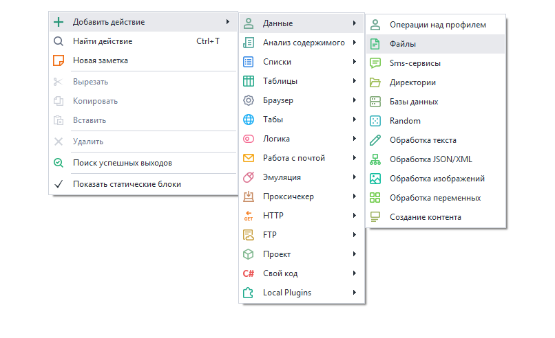
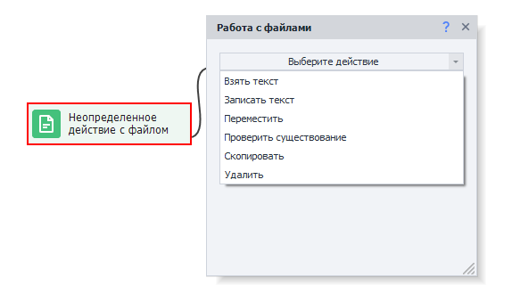
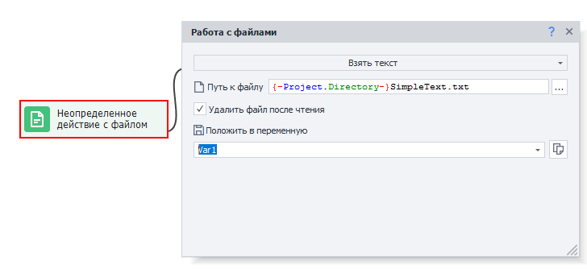
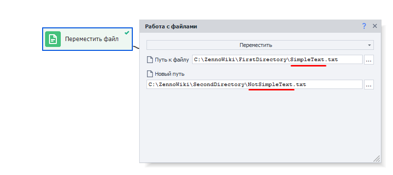
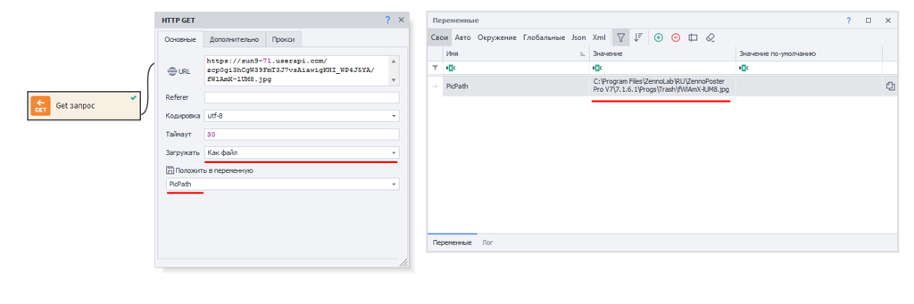
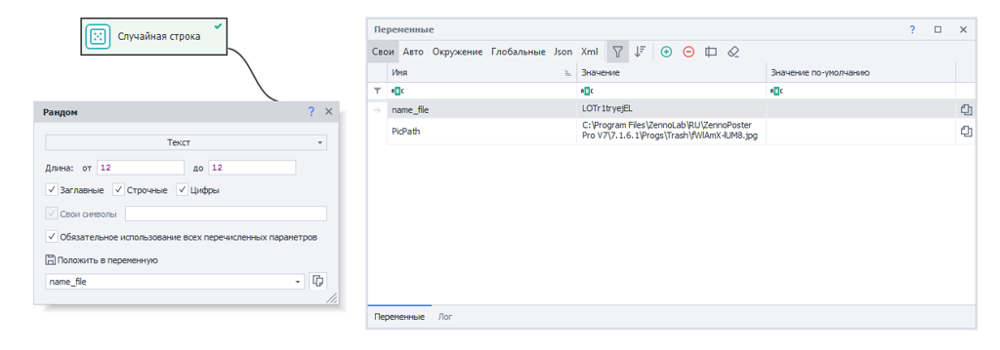
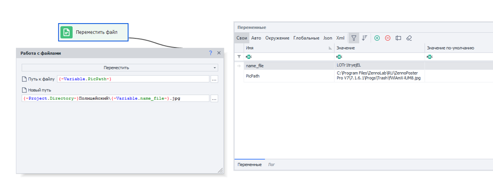

---
sidebar_position: 1
title: "Файлы"
description: " "
date: "2025-07-24"
converted: true
originalFile: "Files.txt"
targetUrl: "https://zennolab.atlassian.net/wiki/spaces/RU/pages/486309948"
---
import DisclaimerNotice from '@site/src/components/DisclaimerNotice';

<DisclaimerNotice />

> 🔗 **[Оригинальная страница](https://zennolab.atlassian.net/wiki/spaces/RU/pages/486309948)** — Источник данного материала

_______________________________________________  
## Описание
ZennoPoster позволяет автоматизировать работу с файлами. 

### Как это можно использовать?
- Вставить заготовленный текст из файла при постинге на форумах
- Размещать объявления на различных сайтах
- Комментировать в автоматическом режиме
- Записывать данные в экшен при парсинге сайтов
- Вести подробное логирование в файл
- Удалять или перемещать ненужные файлы

### Как добавить экшен в проект?
Через контекстное меню: **Добавить действие → Данные → Файлы**

_______________________________________________ 
## Принцип работы
Для работы с файлами предусмотрены следующие действия:  

### Взять текст 

Копирование текста из файла с возможностью записи в переменную.

#### Путь к файлу
Здесь необходимо указать путь к файлу, из которого будут считаны данные.

:::info Можно использовать макросы переменных.
:::

#### Удалить файл после чтение
После выполнения экшена файл будет удалён.

### Записать текст 

Добавление текста в файл.

#### Что писать
Текст, который будет записан в файл.

:::info Можно использовать макросы переменных.
:::
#### Дописать в файл
Если включена эта настройка, то указанный вами текст будет **дописан** в файл.  

Но если же галочка снята, то файл будет **полностью перезаписан**.

#### Записать перенос строки в конец
В конец вашего текста после внесения его в файл будет добавлен перенос строки — `\r\n`  

Это необходимо для более корректной записи нескольких строк данных в файл.

:::tip При работе в многопоточном режиме рекомендуем использовать *Список*
И записывать строки в файл с использованием экшена [Операции над списком](../Lists/List_Operations)
:::

### Переместить 
Перемещение файла в указанную директорию.  

Данная опция также подходит для переименовывания файла.

Необходимо указать полный путь к уже существующему файлу и желаемые путь и имя файла после переноса.

### Проверить существование
Проверка существования файла по указанному пути.

- **Если файл существует** — зеленый (успешный) выход,  
- **Если отсутствует** — красный (неудачный);  

#### Таймаут ожидания
Cтолько экшен будет ждать появления файла, в секундах.

### Скопировать 
То же самое, что и перемещение, но **без удаления исходного файла**.

### Удалить 
Удаление выбранного файла.
_______________________________________________
## Пример использования
Ставим перед собой задачу: 

1. Скачать картинку с сайта vk.com
2. Переименовать ее
3. Перенести в нужную папку

Представим, что мы уже получили [**прямую ссылку**](https://sun9-68.userapi.com/s/v1/ig2/DhrIcMYYdSmqmlespA6LoKlCGb0k9cRwX_HRiA688Lw6XuzMt3XuqySbKz0zSPgpOX67pRZgv6A8sHv15HVATeMo.jpg?quality=95&as=32x40,48x60,72x90,108x135,160x200,240x299,360x449,480x599,540x673,640x798,720x898&from=bu&cs=720x0) на картинку.

Используя [GET-запрос](../Http/GET-request), скачиваем картинку на компьютер. В качестве переменной указываем `PicPath`.  

После выполнения этого экшена в указанной переменной у нас появится прямой путь к картинке: 

Далее добавляем экшен [**Random**](./Random_Numbers_and_Strings) для генерации имени файла: 

Теперь создаем экшен *Файлы* с опцией **Переместить**. 

- **Путь к файлу**: `{ -Variable.PicPath- }`
- **Новый путь**: `{ -Project.Directory- }Котики\{ -Variable.name_file- }.jpg`

> `{ -Project.Directory- }` — макрос, при указании которого будет использована директория проекта.

После выполнения этого действия файл переместится в нужную папку, а вы сможете приступить к загрузке следующей картинки.

:::warning Расширение файла
При работе с изображениями нужно указывать такое же, какое было при загрузке.
:::

## Полезные ссылки
- [❗→ Directories](/wiki/spaces/RU/pages/534052965 "/wiki/spaces/RU/pages/534052965")
- [❗→ Тестер регулярных выражений](/wiki/spaces/RU/pages/534086111 "/wiki/spaces/RU/pages/534086111")
- [❗→ Обработка текста](/wiki/spaces/RU/pages/488865793 "/wiki/spaces/RU/pages/488865793")
- [❗→ Работа с переменными](/wiki/spaces/RU/pages/486309922 "/wiki/spaces/RU/pages/486309922")
- [❗→ Список](/wiki/spaces/RU/pages/534053375 "/wiki/spaces/RU/pages/534053375")