---
sidebar_position: 1
title: "Операции над профилем"
description: " "
date: "2025-07-24"
converted: true
originalFile: "Операции над профилем.txt"
targetUrl: "https://zennolab.atlassian.net/wiki/spaces/RU/pages/486539291"
---
import DisclaimerNotice from '@site/src/components/DisclaimerNotice';

<DisclaimerNotice />

> 🔗 **[Оригинальная страница](https://zennolab.atlassian.net/wiki/spaces/RU/pages/486539291)** — Источник данного материала


_______________________________________________  
## Описание
Для работы в интернете ZennoPoster имеет специальную сущность — **Профиль проекта**.

Профиль совмещает в себе такие часто используемые параметры, как:
- **Виртуальная личность**:  
    - имя,  
    - фамилия,  
    - дата рождения,  
    - e-mail,  
    - национальность,  
    - прочие параметры.
- **Виртуальный браузер**:  
    - UserAgent,  
    - Proxy,  
    - отпечаток браузера и т.д.

:::info Профиль генерируется каждый раз заново 
По нажатию кнопки **«С начала»** в ProjectMaker или при новом выполнении проекта в ZennoPoster.
:::

import modernVideo from '@site/static/video/profile_regen.mp4';

export const VideoSample = ({source}) => (
  <video controls playsInline muted preload="auto" className='docsVideo'>
    <source src={source} type="video/mp4" />
  </video>
);

<VideoSample source={modernVideo} />  

> Характеристики для первичной генерации профиля можно настроить в [статическом блоке](../../Static_blocks/Profile). Там задаётся язык профиля, пол, желаемые регионы, а также параметры браузера.

### Как добавить действие в проект?
Через контекстное меню: **Добавить действие → Данные → Операции над профилем**

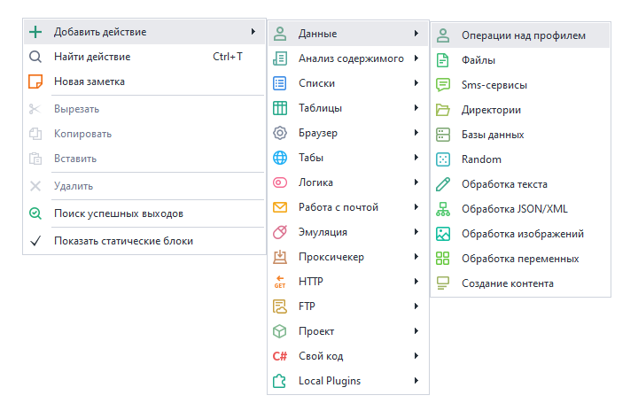

### Для чего это используется?
Профили можно сохранять и загружать в шаблон и, таким образом, использовать подходящие для работы на различных ресурсах. Это помогает работать с сайтами, где есть защита от ботов.

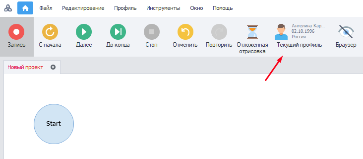

Чтобы посмотреть **Текущий профиль**, нужно нажать на соответствующую кнопку в верхней части интерфейса программы.  

> Подробнее обо всех настройках профиля [**читайте здесь**](../../../Program-interface/Profile_Window).
_______________________________________________ 
## Принцип работы
### Сохранение профиля
После регистрации или любых других действий на сайте, которые вы выполняете внутри шаблона, можно сохранить эти данные профиля для последующего использования в других проектах.  

В файле профиля `\.zpprofile` сохраняются все данные инстанса: *куки*, *User Agent*, *данные о компьютере*, *имя*, *фамилия*, *логин*, *город* и *прочее*.

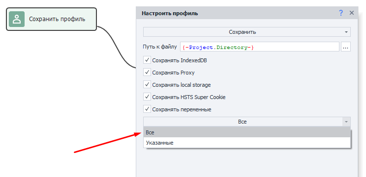

:::warning Будьте аккуратны с галочкой *Сохранять переменные*
Если сохранить профиль с этой опцией, то значения выбранных переменных будут перезаписаны при его следующей загрузке.
:::

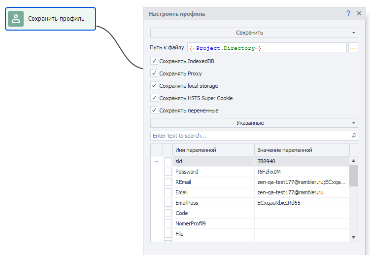

> Для корректного выполнения шаблона сохраняйте только необходимые переменные. 

### Загрузка профиля
Если у вас есть ранее сохраненные профили, то их можно загрузить для использования в проекте.

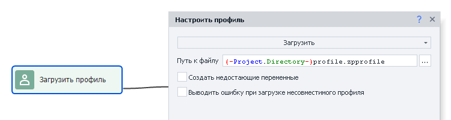

#### Создать недостающие переменные
При включении данной настройки в проекте автоматически будут созданы и добавлены недостающие переменные, которые числятся в профиле. Это полезно, когда вы добавляете в проект профиль, который был сохранен при работе с другим проектом.

#### Выводить ошибку при загрузке несовместимого профиля
При загрузке профилей, которые были созданы на движке браузера, отличном от движка проекта, проект будет завершаться ошибкой.  

Например у вашего текущего проекта движок **Firefox 52**, а загрузить пытаетесь профиль созданный на движке **Chrome**. В этом случае вы получите ошибку.

:::info Данная настройка добавлена в ZennoPoster 7.2.1.
:::

### Переназначить поля
Вы можете вручную редактировать составляющие профиля. Для некоторых параметров можно установить свое значение вручную, а для других просто перегенерировать.

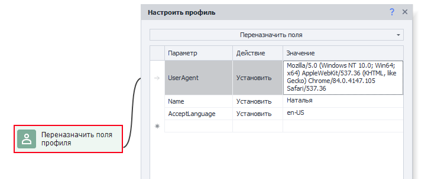

#### Что можно установить?
- Свои UserAgent;
- Желаемые имена, фамилии, даты рождения и прочую информацию о *личности*;
- Необходимые разрешения для браузера;
- Подходящие логины/пароли/почты;
- Любую другую модернизацию профиля под свои нужды.

Далее в работе можно использовать данные из профиля в других экшенах. Для этого понадобятся макросы из [Переменных окружения](../../../Recording-and-creating-projects/General-information/ZennoPoster_Environment_Variables), например: `{ -Profile.Name}`

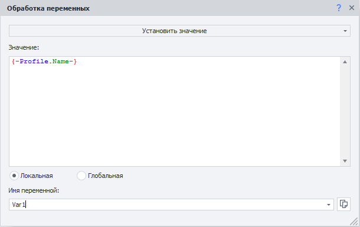

:::info Вам достаточно написать фрагмент `{ -Profile.`
А ProjectMaker предложит все возможные варианты выбора в виде выпадающего списка.  

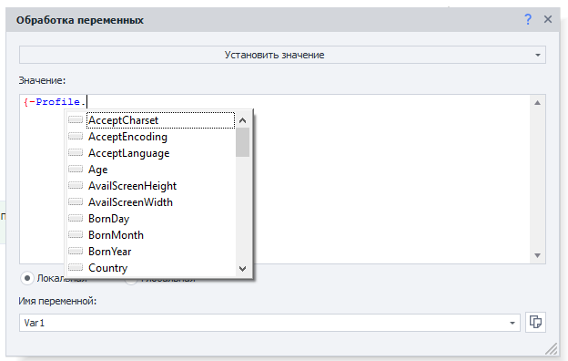
:::


### Обновить
:::info Доступно в ZennoPoster, начиная с версии 7.3.1.0.
:::

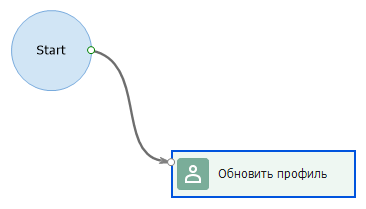

Данный экшен будет обновлять текущий профиль на похожий профиль с последней версией браузера.

Он не просто обновляет версию браузера, а целиком заменяет профиль на найденный. Все параметры будут новые, кроме тех по которым производился поиск)

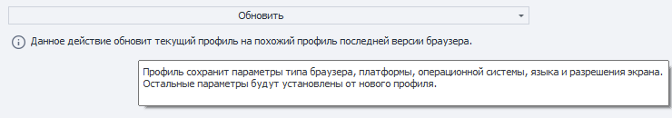

Поиск производится по фильтру проекта и соответствию нового профиля следующим параметрам:  
- тип браузера,  
- операционная система,  
- платформа,  
- язык  
- разрешение экрана.

> ZennoPoster может загрузить до 4000 профилей для поиска подходящего (столько сервер генерирует в сутки), а ProjectMaker — 400.

### Сохранить профиль-папку
Данная функция сохранят профиль-папку  

:::info Доступно начиная с версии ZennoPoster 7.3.1.0.
[Подробнее о Профиль-папке](../../../Recording-and-creating-projects/Using_a_Profile_Folder)
:::

:::warning Профиль-папка привязана к Zennolab ID
Сохранённая профиль-папка будет работать только под вашим Zennolab ID. Переданная другому пользователю — не заработает.
:::

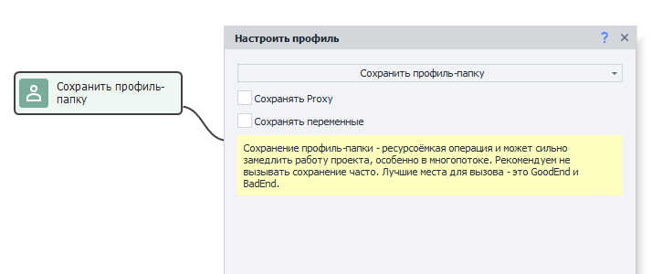

Так же вместе с профиль-папкой можно сохранить текущий прокси проекта и переменные (все или некоторые).  

:::warning Сохранение профиль-папки — ресурсоёмкая операция 
Она может сильно замедлить работу проекта, особенно при многопоточном выполнении. Поэтому мы не рекомендуем часто инициировать сохранение.  

Лучшие моменты для сохранения — это хороший и плохой выходы проекта (Good End/Bad End).
:::
_______________________________________________ 
## Пример использования
Представим ситуацию, что мы работаем с сервисом, в котором есть подписчики. По завершению работы сохраняем в переменную `LastActivity` нынешние дату и время. Для этого используем экшен [Обработка переменных](./Variable_Processing) и в поле данных указываем макрос `{ -TimeNow.Date- }`.

В переменной **`OldSubcribers`** содержится количество подписчиков, которое мы получили при работе шаблона. А в переменной **`PhoneNum`** содержится номер телефона, привязанный к аккаунту.

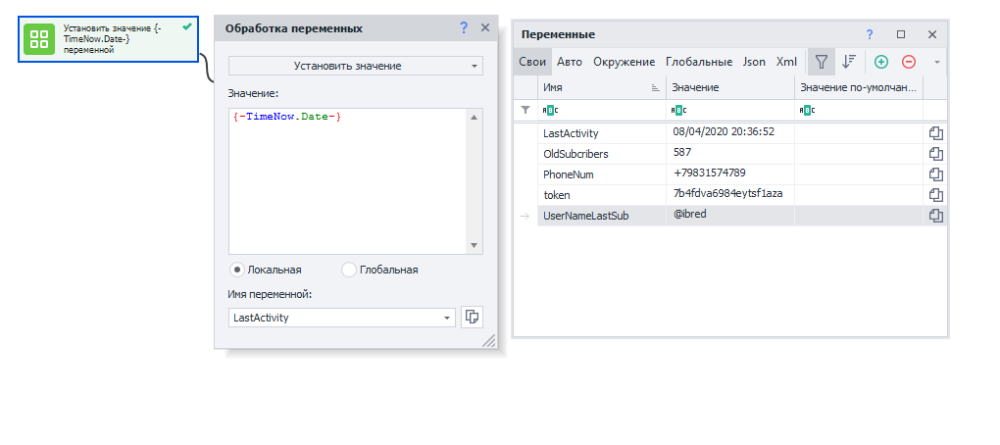

Сохраняем наш профиль и указываем желаемые переменные для сохранения.

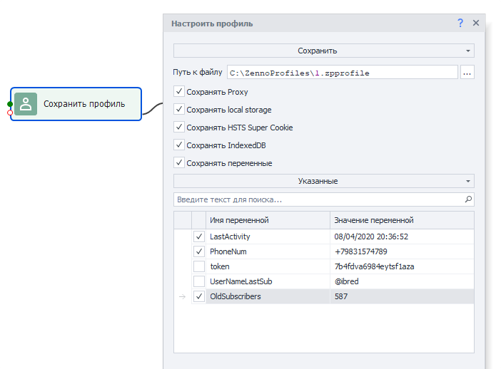

Так как переменные `token` и `UserNameLastSub` нам не нужны, мы их не сохраняем.

:::tip Сохранение профиля происходит проще и логичнее с профиль-папкой.
Доступно с версии 7.3.1.0
:::

Далее мы сможем использовать **Загрузку профиля**, чтобы получить нужные переменные для собственного логирования действий.  

Создадим экшен [Оповещение](../Logic/Notification_Log_Entry) и укажем там следующий текст, задействовав макросы:

```
Загружен профиль.
Имя профиля: {-Profile.Name-};
Последняя активность профиля: {-Variable.LastActivity-};
Количество подписчиков после предыдущей проверки: {-Variable.OldSubcribers-};
Номер телефона: {-Variable.PhoneNum-}.
```

На выходе получим такое сообщение в логе:


### Дополнительная информация
При сохранении и загрузке профиля можно использовать **Пользовательские переменные** и сочетать их с **Переменными окружения**.  

Например, при установке следующей строки: `{-Project.Directory-}ProfilesZenno\{-Profile.Login-}.zpprofile` в *Путь к файлу* при сохранении профиля. В папке **Profiles** будет сохранён файл под названием `rosenhydo1987.zpprofile`.

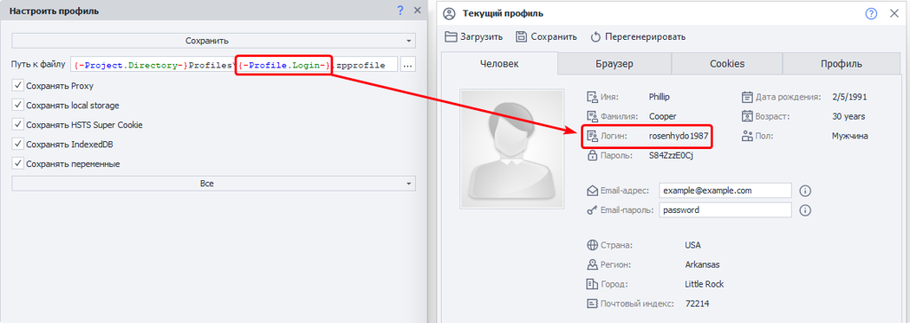

> Папка *Profiles* будет создана **рядом с файлом проекта**, если на момент выполнения экшена её не существовало.

## Полезные ссылки

- [❗→ Профиль](https://zennolab.atlassian.net/wiki/spaces/RU/pages/483426308 "https://zennolab.atlassian.net/wiki/spaces/RU/pages/483426308") - настройки первичной генерации профиля.
- [❗→ Окно профиля](https://zennolab.atlassian.net/wiki/spaces/RU/pages/735903758 "https://zennolab.atlassian.net/wiki/spaces/RU/pages/735903758") - информация о сгенерированном профиле.
- [❗→ Произвольные числа и строки (Random/Рандом)](https://zennolab.atlassian.net/wiki/spaces/RU/pages/534315050 "https://zennolab.atlassian.net/wiki/spaces/RU/pages/534315050") - для создания логинов;
- [❗→ Операции над списком](https://zennolab.atlassian.net/wiki/spaces/RU/pages/534085798 "https://zennolab.atlassian.net/wiki/spaces/RU/pages/534085798") - для работы со своими списками данных;
- [❗→ Google таблицы (PM)](https://zennolab.atlassian.net/wiki/spaces/RU/pages/735576090 "https://zennolab.atlassian.net/wiki/spaces/RU/pages/735576090") - для работы с перечнями данных;
- [❗→ Обработка текста](https://zennolab.atlassian.net/wiki/spaces/RU/pages/488865793 "https://zennolab.atlassian.net/wiki/spaces/RU/pages/488865793") - для внесения в регулируемые переменные проекта.
- [❗→ Окно переменных](https://zennolab.atlassian.net/wiki/spaces/RU/pages/735608872 "https://zennolab.atlassian.net/wiki/spaces/RU/pages/735608872")