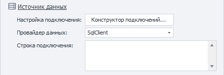

:::info **Пожалуйста, ознакомьтесь с [*Правилами использования материалов на данном ресурсе*](../Disclaimer).**
:::

> 🔗 **[Оригинальная страница](https://zennolab.atlassian.net/wiki/spaces/RU/pages/486473806)** — Источник данного материала

_______________________________________________  

## Описание

ZennoPoster позволяет работать с различными типами баз данных, такими как Microsoft SQL, MySql, PostgreSQL, SQLite и др. Вы сможете подключаться к базам на локальном компьютере или удаленном сервере и загружать нужные данные для Ваших веб-задач.

## Как добавить действие в проект?

Через контекстное меню **Добавить действие** → **Название раздела** → **Название действия**

Либо воспользуйтесь [❗→ умным поиском](https://zennolab.atlassian.net/wiki/spaces/RU/pages/506200090/ProjectMaker+7#%D0%A3%D0%BC%D0%BD%D1%8B%D0%B9-%D0%BF%D0%BE%D0%B8%D1%81%D0%BA-%D0%B4%D0%B5%D0%B9%D1%81%D1%82%D0%B2%D0%B8%D0%B9 "https://zennolab.atlassian.net/wiki/spaces/RU/pages/506200090/ProjectMaker+7#%D0%A3%D0%BC%D0%BD%D1%8B%D0%B9-%D0%BF%D0%BE%D0%B8%D1%81%D0%BA-%D0%B4%D0%B5%D0%B9%D1%81%D1%82%D0%B2%D0%B8%D0%B9").

## Как работать с экшеном?

  

### Источник данных

Для того чтобы подключится к базе данных, необходимо правильно настроить подключение. Оно будет отличаться в зависимости от СУБД.

#### Конструктор подключений

Чтобы облегчить задачу создания строки подключения можно использовать *Конструктор подключений. На основе указанных в нём данных будет сформирована *Строка подключения.

Скриншоты

:::warning Внимание
В Конструкторе нельзя использовать макросы переменных.
:::

#### Провайдер данных

Имеется несколько провайдеров данных:

- **SqlClient** – провайдер для нативного подключения к SQLServer;
- **MySqlClient** – провайдер для нативного подключения к MySQL;
- **OleDb** – один из стандартов позволяющий подключаться к различным СУБД (в том числе и к SQLServer);
- **Odbc** – ещё один стандарт для подключения к СУБД.

#### Строка подключения

В строке подключения указываются различные параметры входа (будь то логин и пароль). Примеры строк подключения для разных СУБД можно посмотреть по [этой ссылке](https://www.connectionstrings.com/ "https://www.connectionstrings.com/").
Чтоб не составлять эту строку вручную, можно воспользоваться *Конструктором подключений (описан выше).

Как подключиться к PostgreSQL?

Наш пользователь **Lord\_Alfred** написал подробный гайд по подключению ZennoPoster к PostgreSQL через ODBC. Рекомендуем к ознакомлению:

[PostgreSQL (СУБД) и ZennoPoster - подключение через ODBC](https://zennolab.com/discussion/threads/postgresql-subd-i-zennoposter-podkljuchenie-cherez-odbc.43320/)

  

### Запрос

#### Тип запроса

Существует несколько типов запроса

##### **Запрос без ответа**

Применяется для операций не возвращающих данных из БД (например INSERT или DELETE). В качестве ответа такой операции является число задействованных в запросе записей.

##### **Скалярный запрос**

Позволяет получить единственное значение. Например, если нужно выполнить агрегатную функцию (select sum(price) from fruit).

##### **Обычный запрос**

Возвращает таблицу данных.

#### Текст запроса

Поле ввода SQL запроса.

#### Использовать параметры в запросе

Чтобы упростить создание запроса, используются параметры. Они будут подставляться в нужные места текста запроса. Существует именованные и неименованные параметры. В первом случае важно имя, во втором - порядок переменных.
Какой тип параметров использовать зависит от СУБД.

:::note На заметку
При использовании параметров текст внутри них автоматически экранируется
:::

##### **Именованные параметры**

Пример запроса с именованными параметрами:

##### **Неименованные параметры**

Пример запроса с неименованными параметрами:

  

### Обработка результатов

В этом разделе необходимо выбрать куда сохранить результат запроса.

#### Положить результат в

##### **Переменную**

Все строки и колонки, которые вернуться в результате запроса будут сохранены в одну [❗→ переменную](/wiki/spaces/RU/pages/486309922 "/wiki/spaces/RU/pages/486309922").

Так же необходимо выбрать разделители с помощью которых будут отделены друг от друга строки и колонки.

##### **Список**

Для того чтобы сохранить результаты в [❗→ список](/wiki/spaces/RU/pages/534053375 "/wiki/spaces/RU/pages/534053375"), важно указать какой разделитель использовать для столбцов. В итоге каждая строчка из базы будет занесена в новый элемент списка, а между столбцами вставлен соответствующий разделитель.

##### **Таблицу**

При записи данных в таблицу, ячейки будут заполнены в соответствии с запросом.

##### **Переменные**

*Номер строки **-** в результате запроса может вернуться несколько строк, поэтому необходимо указать номер той, которую будем разбирать (нумерация с нуля!). 

В таблице ниже выбирается номер ячейки в строке и переменная, в которую эта ячейка будет сохранена (нумерация с нуля!).

## Полезные ссылки

- [❗→ Работа с переменными](/wiki/spaces/RU/pages/486309922 "/wiki/spaces/RU/pages/486309922")
- [❗→ Список](/wiki/spaces/RU/pages/534053375 "/wiki/spaces/RU/pages/534053375")
- [❗→ Таблицы](/wiki/spaces/RU/pages/534315019 "/wiki/spaces/RU/pages/534315019")
- [❗→ Обработка текста](/wiki/spaces/RU/pages/488865793 "/wiki/spaces/RU/pages/488865793")