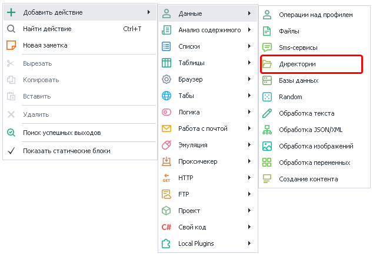
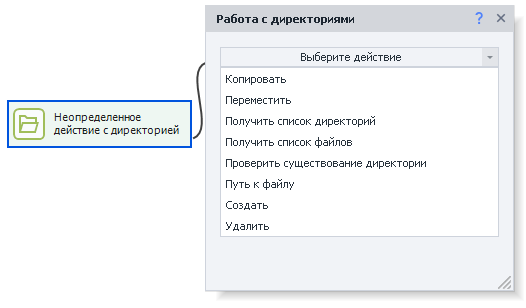
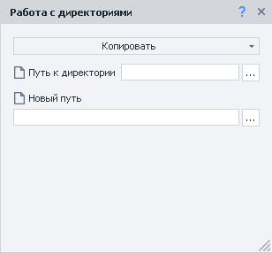
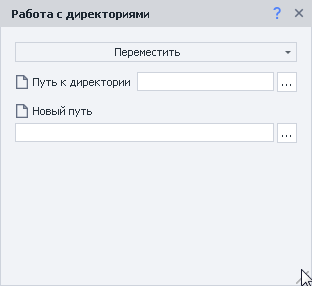
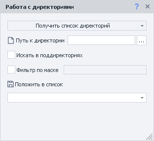
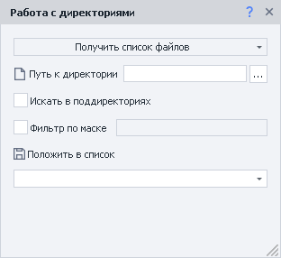
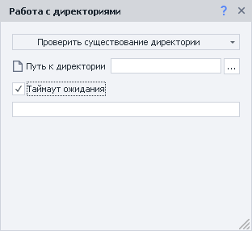
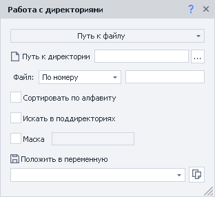
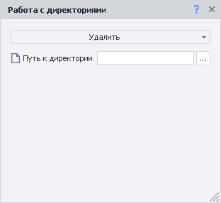
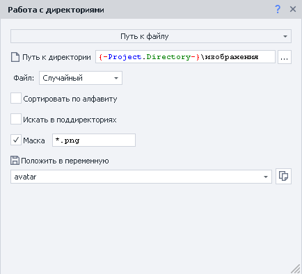

---
sidebar_position: 4
title: "Директории"
description: "Конвертировано из HTML в MDX"
date: "2025-07-24"
converted: true
originalFile: "Директории.txt"
targetUrl: "https://zennolab.atlassian.net/wiki/spaces/RU/pages/534052965"
---
:::info **Пожалуйста, ознакомьтесь с [*Правилами использования материалов на данном ресурсе*](../Disclaimer).**
:::

> 🔗 **[Оригинальная страница](https://zennolab.atlassian.net/wiki/spaces/RU/pages/534052965)** — Источник данного материала

_______________________________________________  

## Описание

Данный экшен служит для работы с директориями: 

- создание
- копирование
- перемещение
- удаление
- получение одного или нескольких файлов
- проверка существования директории

## Как добавить действие в проект?

Через контекстное меню **Добавить действие** → **Данные** → **Директории**

Либо воспользуйтесь [❗→ умным поиском](https://zennolab.atlassian.net/wiki/spaces/RU/pages/506200090/ProjectMaker+7#%D0%A3%D0%BC%D0%BD%D1%8B%D0%B9-%D0%BF%D0%BE%D0%B8%D1%81%D0%BA-%D0%B4%D0%B5%D0%B9%D1%81%D1%82%D0%B2%D0%B8%D0%B9 "https://zennolab.atlassian.net/wiki/spaces/RU/pages/506200090/ProjectMaker+7#%D0%A3%D0%BC%D0%BD%D1%8B%D0%B9-%D0%BF%D0%BE%D0%B8%D1%81%D0%BA-%D0%B4%D0%B5%D0%B9%D1%81%D1%82%D0%B2%D0%B8%D0%B9").

## Где можно применить экшен?

- Получение файла из директории (как по порядку так и случайного):

 - файл со статьёй для постинга в блог
 - картинка для аватара при регистрации на форуме
- При парсинге можно создавать для каждого товара свою директорию куда сохранять картинки, описание и другую нужную информацию

## Как работать с экшеном?

Для работы с директориями предусмотрены следующие действия, которые выбираются в окне свойств:

### Копировать

Данное действие позволяет скопировать директорию со всем содержимым по новому пути.

#### Путь к директории

Здесь указывается путь к исходной папке

#### Новый путь

Путь куда необходимо скопировать директорию

:::warning Внимание
Если в новом пути будут директории, которых не существует, то они будут созданыЕсли директория по новому пути существует, то ничего НЕ БУДЕТ СКОПИРОВАНО, а экшен завершится успехом (выйдет по зелёной ветке)
:::

  

### Переместить

Перемещение директории по указанному пути.

#### Путь к директории

Здесь указывается путь к исходной папке

#### Новый путь

Путь куда необходимо переместить директорию

:::warning Внимание
Если в новом пути будут директории, которых не существует, то они будут созданыЕсли директория по новому пути существует, то ничего НЕ БУДЕТ ПЕРЕМЕЩЕНО, а экшен завершится успехом (выйдет по зелёной ветке)
:::

  

### Получить список директорий

Это действие позволяет получить список всех директорий по указанному пути.

#### Путь к директории

Здесь указывается путь к папке

#### Искать в поддиректориях

- если чекбокс НЕ ОТМЕЧЕН - то будут возвращены только те папки, которые находятся внутри директории по пути *Путь к директории на первом уровне вложенности
- если чекбокс ОТМЕЧЕН - дополнительно будет производится поиск во всех поддиректориях не зависимо от их уровня вложенности

#### Фильтр по маске

Если данный чекбокс отмечен, то в поле справа можно ввести [❗→ маску поиска](https://zennolab.atlassian.net/wiki/spaces/RU/pages/534052965#%D0%9F%D0%BE%D0%B8%D1%81%D0%BA-%D0%BF%D0%BE-%D0%BC%D0%B0%D1%81%D0%BA%D0%B5 "https://zennolab.atlassian.net/wiki/spaces/RU/pages/534052965#%D0%9F%D0%BE%D0%B8%D1%81%D0%BA-%D0%BF%D0%BE-%D0%BC%D0%B0%D1%81%D0%BA%D0%B5"), можно использовать несколько масок разделённых символом |

Результат работы сохраняется в [❗→ список](/wiki/spaces/RU/pages/534053375 "/wiki/spaces/RU/pages/534053375")

  

### Получить список файлов

Это действие позволяет получить [❗→ список](/wiki/spaces/RU/pages/534053375 "/wiki/spaces/RU/pages/534053375")всех [❗→ файлов](/wiki/spaces/RU/pages/486309948 "/wiki/spaces/RU/pages/486309948")по указанному пути.

#### Путь к директории

Здесь указывается путь к папке

#### Искать в поддиректориях

- если чекбокс НЕ ОТМЕЧЕН - то будут возвращены только те файлы, которые находятся внутри директории по пути *Путь к директории на первом уровне вложенности
- если чекбокс ОТМЕЧЕН - дополнительно будет производится поиск в поддиректориях не зависимо от их уровня вложенности

#### Фильтр по маске

Если данный чекбокс отмечен, то в поле справа можно ввести [❗→ маску поиска](https://zennolab.atlassian.net/wiki/spaces/RU/pages/534052965#%D0%9F%D0%BE%D0%B8%D1%81%D0%BA-%D0%BF%D0%BE-%D0%BC%D0%B0%D1%81%D0%BA%D0%B5 "https://zennolab.atlassian.net/wiki/spaces/RU/pages/534052965#%D0%9F%D0%BE%D0%B8%D1%81%D0%BA-%D0%BF%D0%BE-%D0%BC%D0%B0%D1%81%D0%BA%D0%B5"), можно использовать несколько масок разделённых символом |

Результат работы сохраняется в [❗→ список](/wiki/spaces/RU/pages/534053375 "/wiki/spaces/RU/pages/534053375")

  

### Проверить существование директории

Благодаря данному действию Вы можете узнать существует ли по заданному пути директория. Если директория будет найдена то экшен выйдет по зелёной ветке (успешное завершение работы), если такой папки не будет найдено - то по красной (ошибка)

#### Путь к директории

Здесь указывается путь к папке, существование которой надо проверить

#### Таймаут ожидания

:::note На заметку
Указывается в секундах
:::

Если экшен сразу не нашёл директорию, то он будет ожидать её появление указанное количество времени

  

### Путь к файлу

Это действие позволяет получить путь к одному [❗→ файлу](/wiki/spaces/RU/pages/486309948 "/wiki/spaces/RU/pages/486309948") из директории по указанному пути.

#### Путь к директории

Здесь указывается путь к папке

#### Файл 

##### **По номеру**

Необходимо указать конкретный номер файла (нумерация с нуля)

##### **Случайный**

Будет возвращён случайный путь из доступных.

#### Сортировка по алфавиту

*Описание появится позже.

#### Искать в поддиректориях

- если чекбокс НЕ ОТМЕЧЕН - то файл будет выбран из тех, что находятся внутри директории по пути *Путь к директории
- если чекбокс ОТМЕЧЕН - дополнительно будет производится поиск в поддиректориях не зависимо от их уровня вложенности

#### Маска

Если данный чекбокс отмечен, то в поле справа можно ввести [❗→ маску поиска](https://zennolab.atlassian.net/wiki/spaces/RU/pages/534052965#%D0%9F%D0%BE%D0%B8%D1%81%D0%BA-%D0%BF%D0%BE-%D0%BC%D0%B0%D1%81%D0%BA%D0%B5 "https://zennolab.atlassian.net/wiki/spaces/RU/pages/534052965#%D0%9F%D0%BE%D0%B8%D1%81%D0%BA-%D0%BF%D0%BE-%D0%BC%D0%B0%D1%81%D0%BA%D0%B5"), можно использовать несколько масок разделённых символом |

Результат работы сохраняется в [❗→ переменную](/wiki/spaces/RU/pages/486309922 "/wiki/spaces/RU/pages/486309922").

  

### Создать

Используя это действие можно создать новую директорию по указанному пути в поле *Путь к директории

:::warning Внимание
Если по заданному пути уже существует директория она НЕ БУДЕТ перезаписана. Экшен выйдет по зелёной ветке (успешно).
:::

  

### Удалить

Это действие позволяет удалить указанную в поле *Путь к директории папку со всем её содержимым. При попытке удалить несуществующую папку экшен всё-равно выйдет по зелёной ветке.

:::warning Внимание
Удалённые таким образом директории не попадают в Корзину, а удаляются безвозвратно!
:::

  

## Пример использования

Часто при регистрации на различных ресурсах необходимо загрузить аватарку. Представим, что у Вас есть директория с подготовленными картинками, внутри которой файлы с различными расширениями (jpg, jpeg, png, tiff и др.) и нам надо выбрать один. Ресурс, на котором, надо зарегистрироваться требует, чтобы загружаемые файлы были только в формате PNG. Для этой задачи воспользуемся действием *Путь к файлу и выбором случайного пути файла. Чтобы выбрать только PNG файлы воспользуемся маской `*.png`

 
> `{-Project.Directory-}` - это системная переменная ProjectMaker в которой хранится полный путь к папке, в которой находится файл шаблона.

 После запуска данного кубика в переменной *avatar будет находится абсолютный путь к файлу.

  

## Поиск по маске

При поиске по маске можно использовать специальные символы:

- ? - любой один символ кроме точки
- \ - любое количество любых символов
- | - данный символ использует когда нужно применить одновременно несколько масок (работает только с файлами)

Примеры

| **Маска** | **Описание** |
| --- | --- |
|`*.*` | Любые файлы с любым расширением |
| `*.jpg` | Файлы с расширением `.jpg`: • image.jpg • аватарка.jpg • 1.jpg |
| `*.p*` | Файлы у которых расширение начинается на `p`: • document.pdf • презентация.ppt • документ.project • 1.p |
| `кар*.*` | Файлы с любым расширением, но имя которых начинается на `кар`: • карета.jpg • картинка.ico • картошка.html |
| `*mat?.html` | `.html` файлы имя которых начинается с любой последовательности символов, затем идёт часть `mat` после которой один символ: • automate.html • tomato.html • mate.html |
| `doc?????.xls` | `.xls` файл начинающиеся на `doc` после чего идёт 5 любых символов (кроме точки): • document.xls • doc-1208.xls • doctrine.xls |
| `???.??` | Файл с тремя символами в имени и двумя в расширении: • abc.ps • job.ai • 123.45 |
| `?????` | Файл с пятью символами в имени и без расширения: • house • image • tasks |
| `*.xlsx \| *.docx` | Любой xlsx и/или docx документ: • invoice.docx • resume.docx • project.xlsx • default.xlsx |

[Оригинал статьи](https://www.febooti.com/products/automation-workshop/online-help/file-wildcard-mask/ "https://www.febooti.com/products/automation-workshop/online-help/file-wildcard-mask/")
  

## Полезные ссылки

- [❗→ Файлы](/wiki/spaces/RU/pages/486309948 "/wiki/spaces/RU/pages/486309948")
- [❗→ Список](/wiki/spaces/RU/pages/534053375 "/wiki/spaces/RU/pages/534053375")
- [❗→ Операции над списком](/wiki/spaces/RU/pages/534085798 "/wiki/spaces/RU/pages/534085798")
- [❗→ Обработка текста](/wiki/spaces/RU/pages/488865793 "/wiki/spaces/RU/pages/488865793")