---
sidebar_position: 8
title: "Обработка JSON и XML"
description: "Конвертировано из HTML в MDX"
date: "2025-07-24"
converted: true
originalFile: "Обработка JSON и XML.txt"
targetUrl: "https://zennolab.atlassian.net/wiki/spaces/RU/pages/488964124/JSON+XML"
---
:::info **Пожалуйста, ознакомьтесь с [*Правилами использования материалов на данном ресурсе*](../Disclaimer).**
:::

> 🔗 **[Оригинальная страница](https://zennolab.atlassian.net/wiki/spaces/RU/pages/488964124/JSON+XML)** — Источник данного материала

_______________________________________________  

## Описание

Экшен служит для обработки и работы с JSON и XML.

:::warning Внимание
В один момент времени в проекте может обрабатываться только один JSON и один XML объект. Если Вам необходимо обработать несколько порций данных одного формата, то это надо будет делать по очереди.
:::

### JSON

JSON (JavaScript Object Notation) - простой формат обмена данными, удобный для чтения и написания как человеком, так и компьютером.

Пример:

```json
{
   "firstName": "Иван",
   "lastName": "Иванов",
   "address": {
       "streetAddress": "Московское ш., 101",
       "city": "Ленинград",
       "postalCode": 101101
   },
   "phoneNumbers": [
       "812 123-1234",
       "916 123-4567"
   ]
}
```

### XML

XML - (*eXtensible Markup Language - расширяемый язык разметки)  – язык разметки, который напоминает HTML. Предназначен для передачи данных, а не для их отображения. Теги XML не предопределены. Вы должны сами определять нужные теги. 

```xml
<CATALOG>
	<CD>
		<TITLE>Имперская Пародия</TITLE>
		<ARTIST>Боб Дилан</ARTIST>
		<COUNTRY>США</COUNTRY>
		<COMPANY>Колумбия</COMPANY>
		<PRICE>10.90</PRICE>
		<YEAR>1985</YEAR>
	</CD>
	<CD>
		<TITLE>Спрячь свое сердце</TITLE>
		<ARTIST>Бонни Тайлер</ARTIST>
		<COUNTRY>Соединенное Королевство</COUNTRY>
		<COMPANY>Записи си-би-эс</COMPANY>
		<PRICE>9.90</PRICE>
		<YEAR>1988</YEAR>
	</CD>
	<CD>
		<TITLE>Лучшие Хиты</TITLE>
		<ARTIST>Долли Партон</ARTIST>
		<COUNTRY>США</COUNTRY>
		<COMPANY>Ар-Си-Эй</COMPANY>
		<PRICE>9.90</PRICE>
		<YEAR>1982</YEAR>
	</CD>
</CATALOG>
```

:::note На заметку
Бывает, что сервисы возвращают не красиво отформатированный текст (как в примерах выше) а всё в одну строку, что значительно затрудняет чтение. В таких случаях можно воспользоваться так называемыми beautifier'ами. В Тестер X/JSON Path уже встроен этот компонент (кнопка Beautify)Для экшена не важно в одну строку записан текст или красиво отформатирован - главное, чтобы он был корректно составлен.
:::

## Как добавить действие в проект?

Через контекстное меню **Добавить действие** → **Данные** → **Обработка JSON/XML**

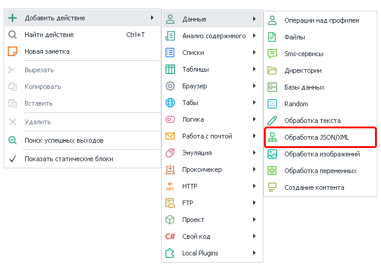


Либо воспользуйтесь [❗→ умным поиском](https://zennolab.atlassian.net/wiki/spaces/RU/pages/506200090/ProjectMaker+7#%D0%A3%D0%BC%D0%BD%D1%8B%D0%B9-%D0%BF%D0%BE%D0%B8%D1%81%D0%BA-%D0%B4%D0%B5%D0%B9%D1%81%D1%82%D0%B2%D0%B8%D0%B9 "https://zennolab.atlassian.net/wiki/spaces/RU/pages/506200090/ProjectMaker+7#%D0%A3%D0%BC%D0%BD%D1%8B%D0%B9-%D0%BF%D0%BE%D0%B8%D1%81%D0%BA-%D0%B4%D0%B5%D0%B9%D1%81%D1%82%D0%B2%D0%B8%D0%B9").

## Где применяется JSON/XML?

Чаще всего эти форматы применяются в [API](https://ru.wikipedia.org/wiki/API "https://ru.wikipedia.org/wiki/API") различных сервисов. 

Например сервисы по распознаванию [❗→ капчи](/wiki/spaces/RU/pages/808845385 "/wiki/spaces/RU/pages/808845385") или [❗→ СМС сервисы](https://zennolab.atlassian.net/wiki/spaces/RU/pages/809074773/ "https://zennolab.atlassian.net/wiki/spaces/RU/pages/809074773/") (если Вы работаете с ними напрямую используя [❗→ GET](/wiki/spaces/RU/pages/534315165 "/wiki/spaces/RU/pages/534315165")-, [❗→ POST](/wiki/spaces/RU/pages/534315180 "/wiki/spaces/RU/pages/534315180")- и [❗→ другие](/wiki/spaces/RU/pages/489259052 "/wiki/spaces/RU/pages/489259052")запросы, минуя экшены [❗→ Сервисы для обработки SMS](/wiki/spaces/RU/pages/486539308 "/wiki/spaces/RU/pages/486539308") и [❗→ Распознать каптчу](/wiki/spaces/RU/pages/534053026 "/wiki/spaces/RU/pages/534053026") ) обычно работают как минимум с одним из этих форматов (либо сразу с двумя)

## Как работать с экшеном?

Для начала стоит выбрать тип данных, с которыми Вы будете работать

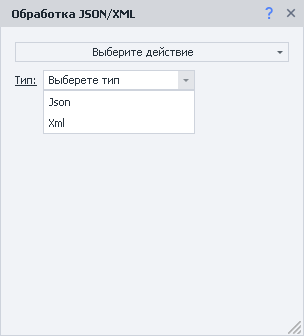


### Парсинг

Данные необходимо обработать, за это отвечает действие *Парсинг. 

| 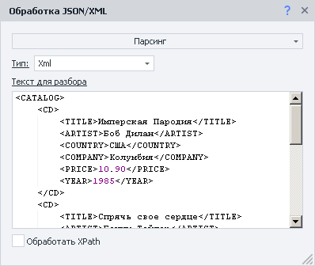 |
| :--: |
| Здесь обработан XML из Описания |


#### Окно переменных

Результат выполнения экшена заносится в переменную проекта Json или Xml соответственно, содержимое можно просмотреть в [❗→ Окне переменных](/wiki/spaces/RU/pages/735608872 "/wiki/spaces/RU/pages/735608872")

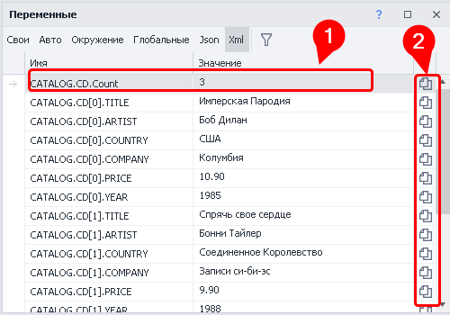


Так как в примере парсился XML то и вкладку в *Окне переменных выбрали соответствующую.

В переменной *Count (1) хранится количество элементов - очень удобно использовать в качестве ограничителя при обходе данных в цикле. Если бы в нашем примере ещё были тэги &lt;DVD&gt; на одном уровне с &lt;CD&gt;, то была бы переменная CATALOG.DVD.Count с количеством тэгов &lt;DVD&gt;

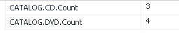


С помощью специальных кнопок (2) Вы можете сразу скопировать в буфер обмена [❗→ макрос переменной](/wiki/spaces/RU/pages/486309922 "/wiki/spaces/RU/pages/486309922").

#### Макросы переменных

Вот пример одного из макросов переменных -`{ -Xml.CATALOG.CD[1].ARTIST- }.`

Вы можете использовать другие переменные внутри этой переменной, пример:


```
{-Xml.CATALOG.{-Variable.item_type-}[{-Variable.counter-}].{-Variable.property-}-}
```


| 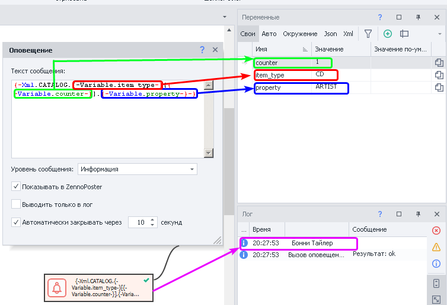 |
| :--: |
| Подстановка данных из других переменных и результат работы (основано на данных приведённых в секции Описание. Нумерация начинается с нуля.) |


:::note На заметку
Для быстрой вставки переменной можете в любом текстовом поле нажать комбинацию клавиш CTRL+ПРОБЕЛ, появится выпадающее меню, в этом меню двойной клик по Xml или Json (зависит от того, с чем Вы работаете), после поставьте точку и появится ещё одно меню уже со спарсенными переменными.
:::

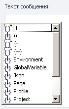


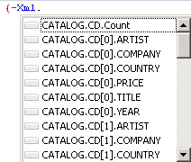


#### Обработать JsonPath/XPath

Данная опция используется когда из всех данных, которые обрабатываются с помощью действия *Парсинг, надо выделить какое-то подмножество. В таком случае составляется выражение [❗→ XPath](/wiki/spaces/RU/pages/862093419 "/wiki/spaces/RU/pages/862093419") (для XML) или JsonPath (для JSON). В составлении выражения Вам может помочь [❗→ Тестер X/JSON Path](/wiki/spaces/RU/pages/534315390 "/wiki/spaces/RU/pages/534315390") В поле для вставки выражения можно использовать макросы переменных.

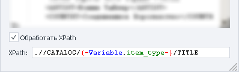


#### Особенности XML

У XML имеются атрибуты узлов. Для доступа к ним в макросах используются квадратные скобки со строковым значением. (Например: `{ -Xml.CATALOG.CD[0]["item"]- }`).

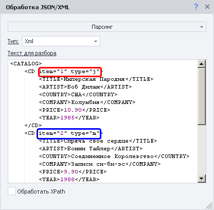


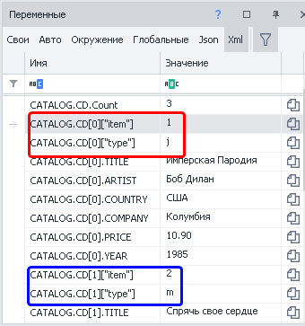


#### Скорость обработки

Парсинг большого JSON или XML, во время отладки проекта в ProjectMaker, может занимать длительное время. Но при работе в ZennoPoster парсинг будет проходить гораздо быстрей.

  

### Добавить в список

Данное действие используется когда нужно из всех данных достать одно конкретное свойство для каждого элемента. Можно использовать [❗→ переменные](/wiki/spaces/RU/pages/486309922 "/wiki/spaces/RU/pages/486309922").

**Свойство** - указывает на поле, которое будет разбираться как массив. Здесь возможно использовать вложенность, указывая через точку (например: store.employees). Если поле не является массивом, то в список заносится один элемент.

**Подсвойство** - так как в массивах могут находиться сложные объекты, можно указать какое значение из него брать для списка.

Если за основу мы возьмём данные из секции *Описание и, представим, что нам необходимы только года для каждого CD, то данный экшен мог бы иметь следующий вид:

|  |
| :--: |
| В переменной `{ -Variable.item_type- }` находится CD |


  

### Добавить в таблицу

Данное действие похоже на предыдущее, но тут можно получить не одно свойство, а несколько. Можно использовать [❗→ переменные](/wiki/spaces/RU/pages/486309922 "/wiki/spaces/RU/pages/486309922").

|  |
| :--: |
| В переменной `{ -Variable.item_type- }` находится CD, а в `{ -Variable.property- }`- ARTIST |


Столбцы именуются как в Excel - большие (!) латинские буквы, в алфавитном порядке. Если будет пропущен какой-то столбец, то он будет пустым. На скриншоте можно заметить, что не указан столбец C, вот как это отразилось на итоговой таблице:

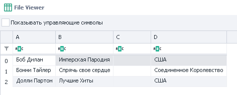


  

## Работа в коде

В C# объекты JSON и XML находятся в объекте project. Они имеют тип dynamic. Из-за этого редактор кода не может полноценно показывать выпадающие подсказки.

Пример кода работы с XML:

```csharp
project.Xml.FromString(project.Variables["XmlText"].Value);
return project.Xml.PurchaseOrder.Address[0]["Type"];
```

Пример 2:

```csharp
var list = new List<string>();
for(int i = 0; i &lt; project.Xml.PurchaseOrder.Address.Count; i++)
{
 list.Add(project.Xml.PurchaseOrder.Address[i].Name.Value);
}
return string.Join(", ", list);
```

Пример 3:

```csharp
var list = new List<string>();
foreach(dynamic i in project.Xml.PurchaseOrder.Address)
{
 list.Add(i.Name.Value);
}
return string.Join(", ", list);
```

Аналогично происходит и с Json. Однако стоит учесть, что доступ к свойствам происходит без использования “Value”.

Пример:

```csharp
return project.Json.employees[1].firstName;
```

  

## Пример использования

### JSON

Есть сайт [http://ip-api.com](http://ip-api.com/ "http://ip-api.com/"), который возвращает подробную информацию по ip адресу используя простейший API. Пригодится для:

- того, чтобы удостовериться, что проект работает через прокси, а не через основной ip
- выбора страны/города при регистрации, согласно данным прокси

Он может возвращать данные в разных форматах (подробнее тут - https://ip-api.com/docs), но нас сейчас интересует JSON.

Для получения информации делаем [❗→ GET-запрос](/wiki/spaces/RU/pages/534315165 "/wiki/spaces/RU/pages/534315165") по адресу http://ip-api.com/json, затем результат обрабатываем через действие *Парсить и далее уже работаем с полученными данными

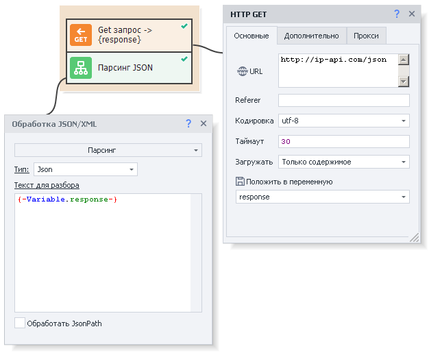


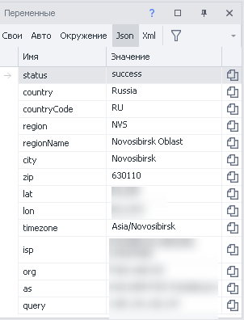


  

### XML + Обработка XPath

В качестве данных будем использовать то, что находится в секции *Описание. 

Представим, что из всех данных нам нужны только названия альбомов. Для этой задачи составим XPath выражение `//CATALOG/CD/TITLE`. 

| 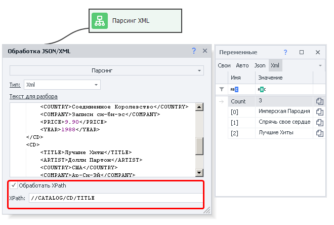 |
| :--: |
| Настройки экшена и результат его работы (справа) |


  

## Полезные ссылки

- [❗→ Окно переменных](/wiki/spaces/RU/pages/735608872 "/wiki/spaces/RU/pages/735608872")
- [❗→ Работа с переменными](/wiki/spaces/RU/pages/486309922 "/wiki/spaces/RU/pages/486309922")
- [❗→ XPath](/wiki/spaces/RU/pages/862093419 "/wiki/spaces/RU/pages/862093419")
- [❗→ Тестер X/JSON Path](/wiki/spaces/RU/pages/534315390 "/wiki/spaces/RU/pages/534315390")
- [❗→ Обработка текста](/wiki/spaces/RU/pages/488865793 "/wiki/spaces/RU/pages/488865793")
- [❗→ Циклы](/wiki/spaces/RU/pages/489259031 "/wiki/spaces/RU/pages/489259031")