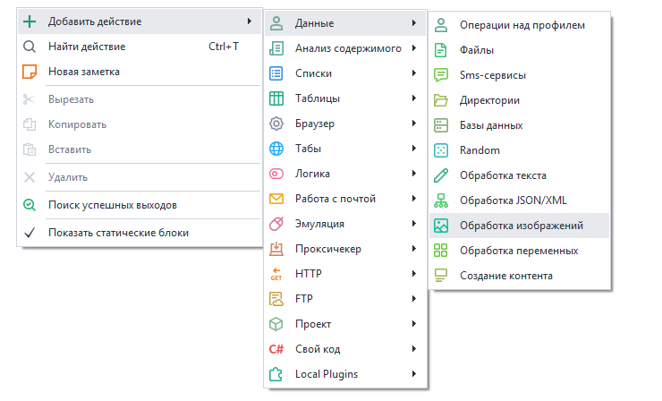
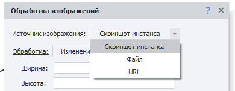
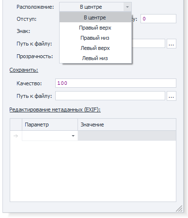
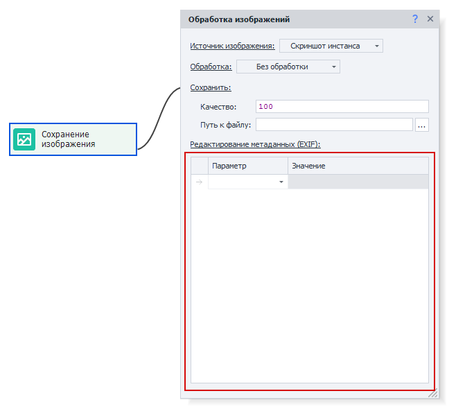
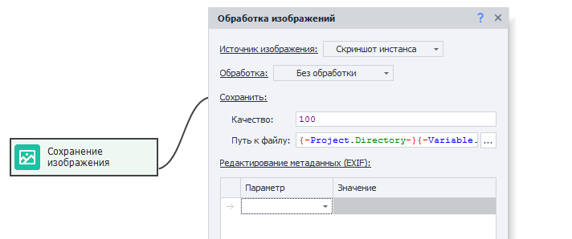

---
sidebar_position: 9
title: "Обработка изображений"
description: "Конвертировано из HTML в MDX"
date: "2025-07-24"
converted: true
originalFile: "Обработка изображений.txt"
targetUrl: "https://zennolab.atlassian.net/wiki/spaces/RU/pages/488865806"
---
:::info **Пожалуйста, ознакомьтесь с [*Правилами использования материалов на данном ресурсе*](../Disclaimer).**
:::

> 🔗 **[Оригинальная страница](https://zennolab.atlassian.net/wiki/spaces/RU/pages/488865806)** — Источник данного материала

_______________________________________________  

## Описание

Действие для редактирование и сохранения изображений.

## Как добавить действие в проект?

Через контекстное меню **Добавить действие** → **Данные** → **Обработка изображений**

Либо воспользуйтесь [❗→ умным поиском](https://zennolab.atlassian.net/wiki/spaces/RU/pages/506200090/ProjectMaker+7#%D0%A3%D0%BC%D0%BD%D1%8B%D0%B9-%D0%BF%D0%BE%D0%B8%D1%81%D0%BA-%D0%B4%D0%B5%D0%B9%D1%81%D1%82%D0%B2%D0%B8%D0%B9 "https://zennolab.atlassian.net/wiki/spaces/RU/pages/506200090/ProjectMaker+7#%D0%A3%D0%BC%D0%BD%D1%8B%D0%B9-%D0%BF%D0%BE%D0%B8%D1%81%D0%BA-%D0%B4%D0%B5%D0%B9%D1%81%D1%82%D0%B2%D0%B8%D0%B9").

## Для чего это используется?

- Обработка визуальной составляющей картинок
- Изменение / очистка метаданных
- Сохранение скриншота инстанса

## Как работать с экшеном?

### Источник изображения

1. **Скриншот инстанса** - производится скриншот активной вкладки инстанса (браузера)
2. **Файл** - обрабатывается файл. При установке, необходимо указать путь к файлу на компьютере. Возможно использование макросов.
3. **URL** - после установки необходимо указать ссылку, по которой будет находиться картинка. С ней и будет производиться работа.

:::warning Внимание
Если в качестве источника изображения используется URL, то стоит учитывать, что скачивание происходит через Ваш реальный IP адрес. Даже если в проекте установлен прокси.
:::

  

## Обработка

### Без обработки

Изображение не будет изменяться.

Полезно для сохранения скриншота инстанса или сохранения картинки с адреса URL на компьютер.

### Изменение размеров

Позволяет изменить размер изображения

- **“Ширина”** и **“Высота”** - цифровое значение, которое устанавливается исходя из настроек поля **“Размеры”**.
- **Размеры** - указывается либо процентное соотношение, либо пиксели.
- **Сохранять соотношение сторон** - если установить, то данные, которые вводятся в графы **“Ширина”** и **“Высота”** будут принудительно приведены к одному значению.
- **Не увеличивать изображение** - Если указанная ширина или высота в кубике больше высоты и ширины картинки, то преобразование размеров не применяется.

### Обрезка

Позволяет обрезать изображение

- **Область** - Видимая или Заданная. 

 - **Видимая** - Актуально только для опции “Скриншот инстанса“. Обрезает скриншот по границам окна, что позволяет получить на изображении только видимую часть сайта.
 - **Заданная** - обрезает всё изображение по заданным параметрам, которые регулируются в пунктах, перечисленных ниже.
 - **Слева** / **Сверху** / **Ширина** / **Высота** - указывается значение в пикселях или процентах.
 - **Размеры** - выбирается вариант **“В пикселях”** или **“В процентах”**.

### Поворот

Позволяет повернуть изображение на желаемое количество градусов.

### Водяной знак

- Позволяет наложить текст или изображение на обрабатываемый файл.

 - **Тип наложения** - вариант расположения: **“Горизонтально”** или **“По диагонали”**.

#### Подробнее про Горизонтальный тип наложения

1. Расположение - где будет размещен текст/изображения

2. Отступ - указывается отступ слева или сверху, в пикселях. Отступ производится относительно расположения, которое было указано ранее.

- **Знак** - изображение или текст. 

 - Изображение - необходимо указать путь к нему.
 - Текст - необходимо указать желаемый текст и желаемый шрифт (справа от поля *Шрифт есть кнопка, которая открывает визуальный конструктор для подбора параметров текста).
- **Прозрачность** - процентное значение прозрачности наложенного текста или изображения. Чем больше, тем оно прозрачнее.

### Зеркальное отражение

Позволяет “отзеркалить” изображение по заданным параметрам.

### Очистить Exif

Позволяет очистить все метаданные изображения.

### Сохранить

Необходимо указать качество в процентах и путь, куда сохранять файл.

Путь необходимо указывать с именем и форматом сохранения. Возможно использование [❗→ переменных](/wiki/spaces/RU/pages/486309922 "/wiki/spaces/RU/pages/486309922").

### Редактирование Метаданных (EXIF)

Позволяет изменить те или иные метаданные. Возможно использование при установке всех типов обработки, кроме “Очистки Exif”

## Пример использования

Представим ситуацию, что вы написали шаблон, но на каком-то этапе работы с сайтом, он завершается ошибкой. Чтобы понять, что идёт не так, мы можем сделать скриншот в момент ошибки, чтобы оценить ситуацию визуально.

Создадим экшен [❗→ Произвольные числа и строки (Random/Рандом)](/wiki/spaces/RU/pages/534315050 "/wiki/spaces/RU/pages/534315050"), после этого сгенерировать число или имя “потока”, положим всё это в переменную `{ -Variable.thread- }`.

Далее нам необходимо создать кубик [❗→ Плохой выход в проекте (Bad End)](/wiki/spaces/RU/pages/534020265 "/wiki/spaces/RU/pages/534020265") и провести от него ветку в обработку изображения. Указываем настройки, как на скриншоте:

В качестве пути указываем: `{ -Project.Directory- }{ -Variable.thread- }\Instance_screenshot.jpg`

Также, можно добавить сохранение кода страницы `{ -Page.Dom- }` через действий [❗→ Записать в файл](/wiki/spaces/RU/pages/486309948 "/wiki/spaces/RU/pages/486309948"). Это позволит нам отловить ошибки, возникающие в ходе работы с браузером. 

## Полезные ссылки

- [❗→ Файлы](/wiki/spaces/RU/pages/486309948 "/wiki/spaces/RU/pages/486309948")
- [❗→ GET-запрос](/wiki/spaces/RU/pages/534315165 "/wiki/spaces/RU/pages/534315165")
- [❗→ Получить данные с веб-страницы](/wiki/spaces/RU/pages/534085840 "/wiki/spaces/RU/pages/534085840")
- [❗→ Произвольные числа и строки (Random/Рандом)](/wiki/spaces/RU/pages/534315050 "/wiki/spaces/RU/pages/534315050")