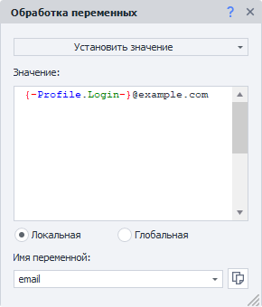

:::info **Пожалуйста, ознакомьтесь с [*Правилами использования материалов на данном ресурсе*](../Disclaimer).**
:::

> 🔗 **[Оригинальная страница](https://zennolab.atlassian.net/wiki/spaces/RU/pages/486309922)** — Источник данного материала

_______________________________________________  

## Описание

Переменная - это контейнер в памяти, который может принимать заданное или вычисляемое значение. Переменные в ZennoPoster можно создавать, изменять название переменной и удалять, а также присваивать им различные значения. Удобнее всего работать с переменными через [❗→ Окно переменных](/wiki/spaces/RU/pages/735608872 "/wiki/spaces/RU/pages/735608872").

Следует разделять переменные **C#**, которые строго типизированы и переменные проекта, которые не имеют строгой типизации. Однако значения этих двух типов переменных всегда можно конвертировать без потери и искажения данных. 

Переменные - основа любого проекта в программировании. 

  

## Как добавить действие в проект?

Через контекстное меню **Добавить действие** → **Данные** → **Обработка переменных**

Либо воспользуйтесь [❗→ умным поиском](https://zennolab.atlassian.net/wiki/spaces/RU/pages/506200090/ProjectMaker+7#%D0%A3%D0%BC%D0%BD%D1%8B%D0%B9-%D0%BF%D0%BE%D0%B8%D1%81%D0%BA-%D0%B4%D0%B5%D0%B9%D1%81%D1%82%D0%B2%D0%B8%D0%B9 "https://zennolab.atlassian.net/wiki/spaces/RU/pages/506200090/ProjectMaker+7#%D0%A3%D0%BC%D0%BD%D1%8B%D0%B9-%D0%BF%D0%BE%D0%B8%D1%81%D0%BA-%D0%B4%D0%B5%D0%B9%D1%81%D1%82%D0%B2%D0%B8%D0%B9").

## Для чего используются?

- Для установки и изменения значений переменных.
- Для увеличения или уменьшения значения счётчиков.

  

## Как работать с экшеном?

### Установить значение

Присваивать переменной можно статические строки, числа, значения других переменных, значения переменных окружения, а также комбинации вышеперечисленных данных.

### Увеличить\Уменьшить счётчик

Режим счетчика возможен как на увеличение, так и на уменьшение значения. При этом счетчик можно увеличивать или уменьшать не только на единицу, а на любое число указанное в поле “**Значение**”. 
Увеличивается\уменьшается значение переменной, которая выбрана в поле “**Имя переменной”**.

### Очистить переменные

:::info Информация
Добавлено в ZennoPoster 7.7.0.0
:::

С помощью данного действия можно удалить содержимое переменных.

Есть 3 режима очистки:

- Все
- Перечисленные
- Все, кроме перечисленных

Это будет полезно, когда, например, шаблон работает в цикле и перед началом новой итерации требуется очистить данные в переменных, чтобы значения из предыдущей фазы не попали в следующую.

### Глобальные переменные и Пространство имён

Обычные переменные видны только в пределах одного потока проекта (если проект работает в многопоточном режиме, то каждый поток будет иметь свою локальную, независимую переменную)

Глобальные же переменные **доступны для всех проектов и их потоков** в ZennoPoster.

Для того, чтобы избежать путаницы у глобальных переменных есть дополнительное свойство - *Пространство имён, которое нужно указывать при создании и при обращении.

  

## Примеры использования

Рассмотрим несколько практических примеров использования переменных в проектах.

### Присвоение значения переменной

Значение переменной можно присвоить или изменить как в специальном окне [❗→ Окно переменных](/wiki/spaces/RU/pages/735608872 "/wiki/spaces/RU/pages/735608872") , так и с помощью кубика “**Данные**“ → “**Обработка переменных**”

В данном примере на основе строковых переменных логина и домена сайта формируется адрес электронной почты.

  

### Работа с переменой счетчика и переменными окружения

Представим синтетическую задачу, в которой нам требуется составить список десяти текущих отметок времени.

1. Создадим переменную `count`, которая будет являться счетчиком и присвоим ей значение `0` с помощью кубика “**Обработка переменных**“.
2. С помощью того же кубика получим текущую отметку времени с помощью [❗→ переменной окружения](https://zennolab.atlassian.net/wiki/spaces/RU/pages/735608872#%D0%9E%D0%BA%D1%80%D1%83%D0%B6%D0%B5%D0%BD%D0%B8%D0%B5 "https://zennolab.atlassian.net/wiki/spaces/RU/pages/735608872#%D0%9E%D0%BA%D1%80%D1%83%D0%B6%D0%B5%D0%BD%D0%B8%D0%B5") `{ -TimeNow.TimeNow- }` , добавим её к переменной `time` и сохраним полученное значение в туже самую переменную `time`.
3. Теперь нам нужно повторить процедуру из п. 2 ещё 9 раз. Для этого сравниваем кубиком “**IF**“ [❗→ IF (условие "Если ... то ...")](/wiki/spaces/RU/pages/534315151 "/wiki/spaces/RU/pages/534315151") значение счетчика `count` с максимальным значением `9`.
4. Если условие не верное (счетчик меньше или равен 9), то увеличиваем `count` на `1` с помощью кубика “**Обработка переменных**“ (свойство “**Увеличить счетчик**”) и повторяем п. 2.
5. Если условие верное (счетчик более 9), то завершаем обработку и выводим в лог полученное значение переменной `time`. Мы можем видеть результат работы проекта в [❗→ Окне переменных](/wiki/spaces/RU/pages/735608872 "/wiki/spaces/RU/pages/735608872")

  

## Полезные ссылки

- [❗→ Окно переменных](/wiki/spaces/RU/pages/735608872 "/wiki/spaces/RU/pages/735608872")
- Использование переменных - [ссылка на YouTube](https://www.youtube.com/watch?v=YvmrETeOJD8 "https://www.youtube.com/watch?v=YvmrETeOJD8").
- Инициализация переменных - [ссылка на YouTube](https://www.youtube.com/watch?v=2vXkJIk86yE "https://www.youtube.com/watch?v=2vXkJIk86yE").
- Удаление переменной из проекта - [ссылка на YouTube](https://www.youtube.com/watch?v=LX3wqMh24-4 "https://www.youtube.com/watch?v=LX3wqMh24-4").
- Переменная счетчик - [ссылка на YouTube](https://www.youtube.com/watch?v=gtkflXeyMG0 "https://www.youtube.com/watch?v=gtkflXeyMG0").
- Получение значения переменной - [ссылка на YouTube](https://www.youtube.com/watch?v=WIE_IRtq-DI "https://www.youtube.com/watch?v=WIE_IRtq-DI").

.