---
sidebar_position: 7
title: "Обработка текста"
description: "Конвертировано из HTML в MDX"
date: "2025-07-24"
converted: true
originalFile: "Обработка текста.txt"
targetUrl: "https://zennolab.atlassian.net/wiki/spaces/RU/pages/488865793"
---
:::info **Пожалуйста, ознакомьтесь с [*Правилами использования материалов на данном ресурсе*](../Disclaimer).**
:::

> 🔗 **[Оригинальная страница](https://zennolab.atlassian.net/wiki/spaces/RU/pages/488865793)** — Источник данного материала

_______________________________________________  

## Описание

Данный экшен служит для различных манипуляций с текстом, которые в практике требуются очень часто. Обработать спарсенный текст, очистить его от мусора, перевести на другие языки – всё это, и многое другое, может «кубик» обработки текста.

## Как добавить действие в проект?

Через контекстное меню **Добавить действие** → **Данные** → **Обработка текста**

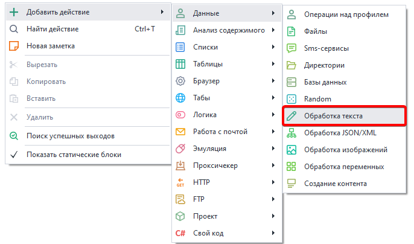


Либо воспользуйтесь [❗→ умным поиском](https://zennolab.atlassian.net/wiki/spaces/RU/pages/506200090/ProjectMaker+7#%D0%A3%D0%BC%D0%BD%D1%8B%D0%B9-%D0%BF%D0%BE%D0%B8%D1%81%D0%BA-%D0%B4%D0%B5%D0%B9%D1%81%D1%82%D0%B2%D0%B8%D0%B9 "https://zennolab.atlassian.net/wiki/spaces/RU/pages/506200090/ProjectMaker+7#%D0%A3%D0%BC%D0%BD%D1%8B%D0%B9-%D0%BF%D0%BE%D0%B8%D1%81%D0%BA-%D0%B4%D0%B5%D0%B9%D1%81%D1%82%D0%B2%D0%B8%D0%B9").

## Где применяется обработка текста?

- [❗→ Escape строки](https://zennolab.atlassian.net/wiki/spaces/RU/pages/488865793#Escape-%D1%81%D1%82%D1%80%D0%BE%D0%BA%D0%B8 "https://zennolab.atlassian.net/wiki/spaces/RU/pages/488865793#Escape-%D1%81%D1%82%D1%80%D0%BE%D0%BA%D0%B8"). Для экранирования специальных символов
- [❗→ Regex](https://zennolab.atlassian.net/wiki/spaces/RU/pages/488865793#Regex "https://zennolab.atlassian.net/wiki/spaces/RU/pages/488865793#Regex"). Поиск текста регулярным выражением
- [❗→ Spintax](https://zennolab.atlassian.net/wiki/spaces/RU/pages/488865793#Spintax "https://zennolab.atlassian.net/wiki/spaces/RU/pages/488865793#Spintax"). Рандомизировать, уникализировать текст
- [❗→ Split](https://zennolab.atlassian.net/wiki/spaces/RU/pages/488865793#Split "https://zennolab.atlassian.net/wiki/spaces/RU/pages/488865793#Split"). Разделить строку на несколько других через разделитель
- [❗→ ToChar](https://zennolab.atlassian.net/wiki/spaces/RU/pages/488865793#ToChar "https://zennolab.atlassian.net/wiki/spaces/RU/pages/488865793#ToChar"). Преобразовать Unicode код в символ
- [❗→ ToLower, ToUpper](https://zennolab.atlassian.net/wiki/spaces/RU/pages/488865793#ToLower "https://zennolab.atlassian.net/wiki/spaces/RU/pages/488865793#ToLower"). Преобразовать заглавные буквы в строчные и наоборот
- [❗→ Trim](https://zennolab.atlassian.net/wiki/spaces/RU/pages/488865793#Trim "https://zennolab.atlassian.net/wiki/spaces/RU/pages/488865793#Trim"). Очистить текст от лишних пробельных символов
- [❗→ UrlEncode, UrlDecode](https://zennolab.atlassian.net/wiki/spaces/RU/pages/488865793#UrlDecode "https://zennolab.atlassian.net/wiki/spaces/RU/pages/488865793#UrlDecode"). Кодировать \ Декодировать URL
- [❗→ В переменную, список, таблицу](https://zennolab.atlassian.net/wiki/spaces/RU/pages/488865793#%D0%92-%D0%BF%D0%B5%D1%80%D0%B5%D0%BC%D0%B5%D0%BD%D0%BD%D1%83%D1%8E "https://zennolab.atlassian.net/wiki/spaces/RU/pages/488865793#%D0%92-%D0%BF%D0%B5%D1%80%D0%B5%D0%BC%D0%B5%D0%BD%D0%BD%D1%83%D1%8E"). Положить данные в переменную, список или таблицу
- [❗→ Замена](https://zennolab.atlassian.net/wiki/spaces/RU/pages/488865793#%D0%97%D0%B0%D0%BC%D0%B5%D0%BD%D0%B0 "https://zennolab.atlassian.net/wiki/spaces/RU/pages/488865793#%D0%97%D0%B0%D0%BC%D0%B5%D0%BD%D0%B0"). Произвести замену в тексте
- [❗→ Перевод](https://zennolab.atlassian.net/wiki/spaces/RU/pages/488865793#%D0%9F%D0%B5%D1%80%D0%B5%D0%B2%D0%BE%D0%B4 "https://zennolab.atlassian.net/wiki/spaces/RU/pages/488865793#%D0%9F%D0%B5%D1%80%D0%B5%D0%B2%D0%BE%D0%B4"). Выполнить перевод на другой язык
- [❗→ Подготовка JavaScript](https://zennolab.atlassian.net/wiki/spaces/RU/pages/488865793#%D0%9F%D0%BE%D0%B4%D0%B3%D0%BE%D1%82%D0%BE%D0%B2%D0%BA%D0%B0-JavaScript "https://zennolab.atlassian.net/wiki/spaces/RU/pages/488865793#%D0%9F%D0%BE%D0%B4%D0%B3%D0%BE%D1%82%D0%BE%D0%B2%D0%BA%D0%B0-JavaScript"). Обработать текст для использования в экшене Логики (IF-ELSE) или JavaScript
- [❗→ Получить подстроку](https://zennolab.atlassian.net/wiki/spaces/RU/pages/488865793#%D0%9F%D0%BE%D0%B4%D1%81%D1%82%D1%80%D0%BE%D0%BA%D0%B0 "https://zennolab.atlassian.net/wiki/spaces/RU/pages/488865793#%D0%9F%D0%BE%D0%B4%D1%81%D1%82%D1%80%D0%BE%D0%BA%D0%B0")
- [❗→ Транслитерация](https://zennolab.atlassian.net/wiki/spaces/RU/pages/488865793#%D0%A2%D1%80%D0%B0%D0%BD%D1%81%D0%BB%D0%B8%D1%82%D0%B5%D1%80%D0%B0%D1%86%D0%B8%D1%8F "https://zennolab.atlassian.net/wiki/spaces/RU/pages/488865793#%D0%A2%D1%80%D0%B0%D0%BD%D1%81%D0%BB%D0%B8%D1%82%D0%B5%D1%80%D0%B0%D1%86%D0%B8%D1%8F"). Сделать транслитерацию текста

## Как работать с экшеном?

Окно свойств состоит в основном из трёх областей:

1. Входная строка – текст, переменная или их комбинация.
2. Действия над строкой, свойства и их настройки.
3. Выходная строка (результат) в переменной.

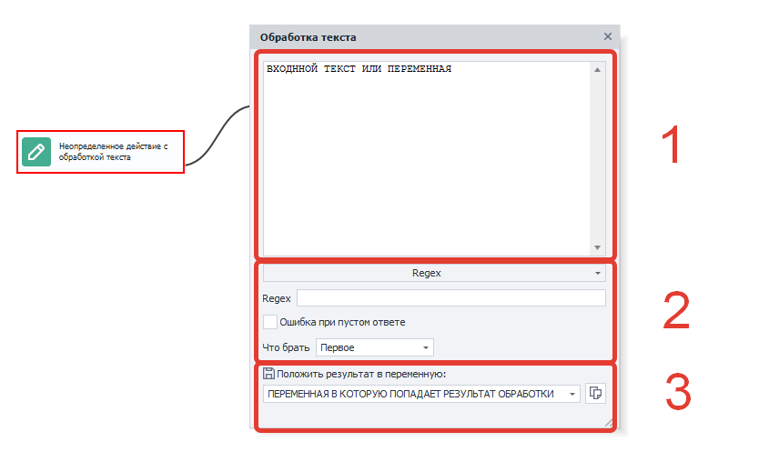


:::info Информация
Установите курсор в области входной строки, нажмите Ctrl+Пробел и выберите из выпадающего списка полезные константы и переменные проекта. Например, так можно быстро вставить прокси проекта `{ -Project.Proxy- }` или URL активной вкладки `{ -Page.Url- }` (другие доступные переменные окружения Вы можете найти в статье Окно переменных )
:::

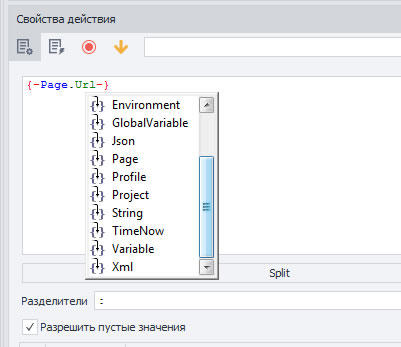


Все возможные операции с этим «кубиком»:

### Escape строки

Экранирование символов. 
Этот экшен экранирует пробел и символы `*+?|{[()^$.#` (размещает "слэш" перед каждым указанным символом - `\`) . Этот метод часто используется для работы с запросами и для того чтобы обработчик [регулярных выражений](/wiki/spaces/RU/pages/534086111 "/wiki/spaces/RU/pages/534086111") использовал эти символы буквально, а не как команды или метасимволы.  

До применения: `{"animal": "cat"}`  
После: `\{"animal":\ "cat"}`

  

### Regex

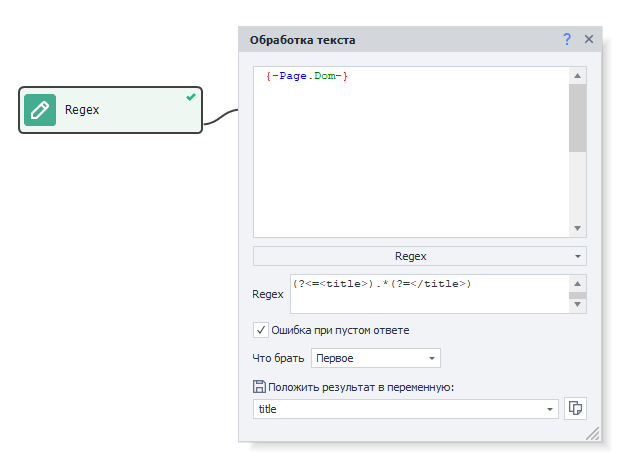


Обработка текста регулярными выражениями. 
Регулярками очень удобно парсить строки для нахождения нужной подстроки по заданному паттерну. Данный экшен позволяет спарсить не только первое найденное значение, но и всю группу и сохранить значения в переменные или таблицу. 

#### Поле ввода “Regex”

В данное поле необходимо ввести регулярное выражение, с помощью которого будет производиться поиск по тексту. Пример - 
```regex
(?<=<title>).*(?=</title>) 
``` 

:::note На заметку
В составлении регулярных выражений Вам может помочь Тестер регулярных выражений
:::

#### Ошибка при пустом ответе

Если отмечена данная настройка и регулярное выражение ничего не нашло в тексте, то экшен завершится ошибкой (выход по красной ветке).

:::warning Внимание
Обратите внимание на то, что если регулярное выражение вернёт пустую строку, то даже при включённой настройке “Ошибка при пустом ответе” экшен выйдет по зелёной ветке: например, на сайте ничего нет в теге title: `<title></title>`, в таком случае регулярное выражение `(?<=<title>).*(?=</title>)` сработает, но вернёт пустую строку - экшен завершится успехом.А вот если бы в тексте вообще не было `<title></title>`, в таком случае выражение ничего не найдёт и экшен выйдет по красной ветке.
:::

#### Что брать

##### **Первое**

В переменную сохранится первое найденное совпадение.

##### **Все**

Сохранить все результаты поиска в список.

##### **Одно совпадение**

Сохранить только одно совпадение.
В появившемся поле можно ввести порядковый номер совпадения (**нумерация с нуля!**) или выбрать *Последнее* либо *Random* (случайное) значение.

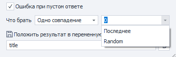


##### **Номера совпадений**

Сохранить в список только указанные номера совпадений (**нумерация с нуля!**, указывать через запятую).

##### **В переменные**

Данная функция используется при работе с групповыми регулярными выражениями. Пример под спойлером:

<details>
<summary>Нажмите здесь, чтобы развернуть пример</summary>

Представим, что есть следующий текст:

`21.01.2003, 11:34:00.9299
11.12.2013, 01:22:55.3021
04.01.2007, 08:00:06.0032`

И стоит задача его разобрать на составляющие. Для этого воспользуемся таким регулярным выражением: `(\d{2}).(\d{2}).(\d{4}), (\d{2}):(\d{2}):(\d{2}).(\d{4})`

Вот как результат выполнения выглядит в [❗→ Тестере регулярных выражений](/wiki/spaces/RU/pages/534086111 "/wiki/spaces/RU/pages/534086111"):

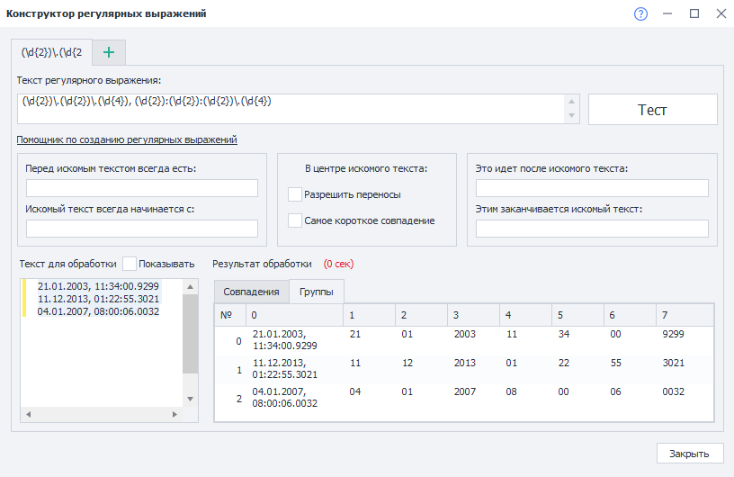


Представим, что нам надо взять в переменные день, месяц и год из второй строки. Вот как это можно сделать:

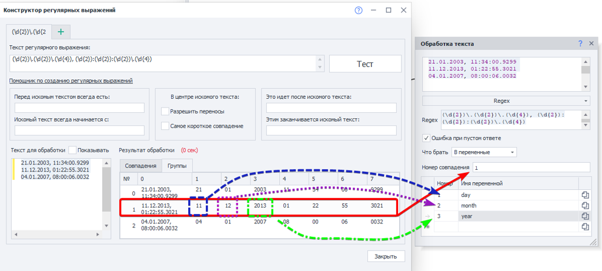


**Номер совпадения** в нашем случае - номер строки. Т.к. нумерация тут начинается с нуля, то для того, чтобы взять вторую строку, указываем **1**

Дальше надо указать номер группы и переменную, в которую сохранится результат. Тут тоже нумерация групп начинается с нуля. Но в группе **0** находится вся найденная строка (`11.12.2013, 01:22:55.3021`). Поэтому для дня указываем номер группы 1, для месяца - 2 и для года - 3.

</details>
##### **В таблицу**

Очень похоже на предыдущую функцию (**В переменные**) с тем отличием, что тут сохраняется не один результат, а все и в [❗→ таблицу](/wiki/spaces/RU/pages/735903776 "/wiki/spaces/RU/pages/735903776"). Можно исключить из итогового результата некоторые найденные группы.

<details>
<summary>Нажмите здесь, чтобы развернуть пример</summary>

Используем тот же текст:


```
21.01.2003, 11:34:00.9299
11.12.2013, 01:22:55.3021
04.01.2007, 08:00:06.0032
```

Перед нами стоит задача его разобрать и сохранить в таблицу. Для этого воспользуемся таким регулярным выражением: `(\d{2}).(\d{2}).(\d{4}), (\d{2}):(\d{2}):(\d{2}).(\d{4})`


Вот как результат выполнения выглядит в [❗→ Тестере регулярных выражений](/wiki/spaces/RU/pages/534086111 "/wiki/spaces/RU/pages/534086111"):


Так же представим, что в итоговой таблице нам не нужны секунды и миллисекунды. Вот как это может выглядеть:

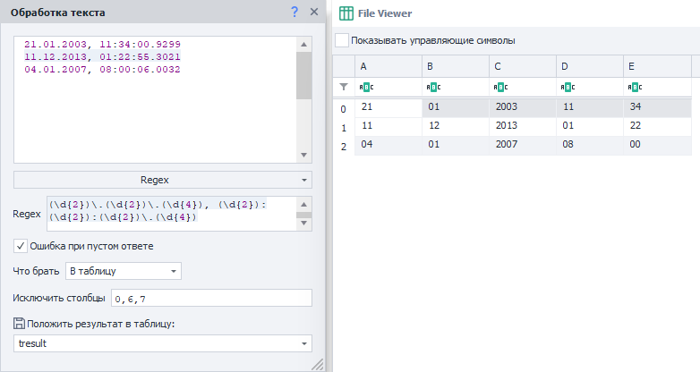


В группе под индексом **0** находится всё совпадение (в нашем случае строка) поэтому исключаем. В группах 6, 7 - секунды и миллисекунды соответственно.

</details>
#### Пример использования

Рассмотрим на конкретном примере - парсинг ссылок регулярными выражениями, составленными с помощью [❗→ конструктора](/wiki/spaces/RU/pages/534086111 "/wiki/spaces/RU/pages/534086111"). 

Например, у нас есть задача - получить ссылки на профили активных пользователей [форума ZennoLab](https://zennolab.com/discussion/ "https://zennolab.com/discussion/"). Приступаем:

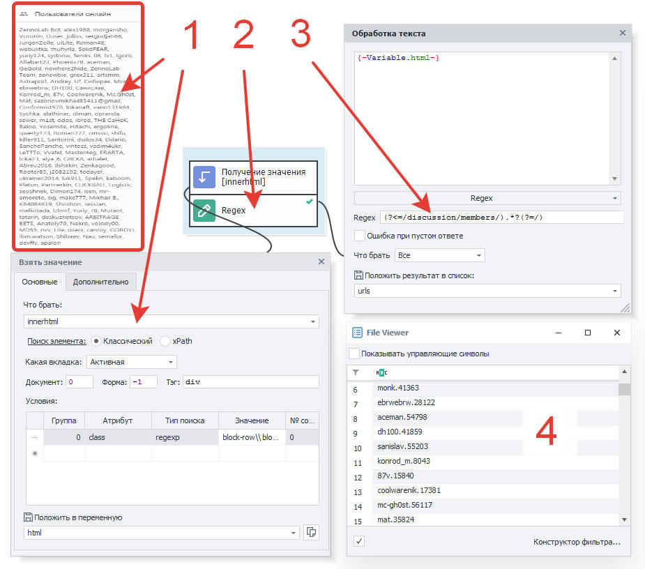


1. С помощью кубика [❗→ Взятие значения](/wiki/spaces/RU/pages/534315124 "/wiki/spaces/RU/pages/534315124") получаем HTML код элемента в котором размещены ссылки на пользователей находящихся на форуме онлайн.
2. Добавляем экшен “Regex”. Для составления паттерна, используемого в свойствах экшена “Regex”, используем [❗→ Конструктор регулярных выражений](/wiki/spaces/RU/pages/534086111 "/wiki/spaces/RU/pages/534086111").
3. В свойствах экшена на вход добавляем переменную “html“, а результат сохраняем в список “urls“.
4. После запуска кубика получаем в списке уникальные id, которые можно использовать для формирования URL профилей юзеров.

  

### Spintax

Рандомизация или уникализация текста. 
С помощью spintax удобно создавать синонимизацию текстов. Спинтакс - это такая конструкция из обрамляющих фигурных скобок и вертикальных слэшей, которая позволяет в случайном порядке подставлять подстроки из строки. В простейшем варианте спинтакс выглядит так: 
`{вариант1|вариант2|вариант3}`. При выполнении этого действия в результирующую переменную случайно попадет один из трёх вариантов. 
Но конструкции спинтакса бывают более сложными и обладают многоуровневой вложенностью из-за чего из одного текста можно получить тысячи разных вариантов.

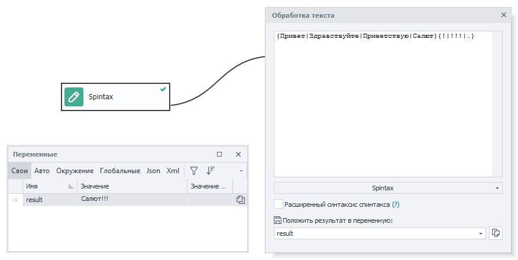


#### Расширенный синтаксис спинтакса

- `{Red|White|Blue}` — в результирующий текст попадает одно из значений, например: «White»
- `[ Red| White| Blue]` — в результирующий текст попадает перестановка значений, например: «White Blue Red»
- `[+_+Red|White|Blue]` — в результирующий текст попадает перестановка значений, между которыми вставлен разделитель, например: «White\_Red\_Blue»

Вложенность шаблонов неограниченна (например: `[+{_|- }+Red|White|Blue {1|2}] `= «White-Blue 2-Red»). Спец.символы можно экранировать: `[+\++Red|\[White\]|Blue]` - результат «[White]+Red+Blue»

* * *

### Split

Разделение текста каким-либо символом-разделителем (делиметером). 
Эта обработка превращает строку в массив строк. По сути это более простой аналог RegExp для разделения строки символами.

#### Разделители

Здесь нужно указать символ (-ы), по которому будут разбиваться данные.

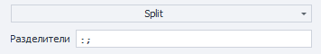


#### Разрешить пустые значения

Этот пункт рассмотрим на примере.

И так у нас есть строка в формате `имя;фамилия;пол;год рождения` Экшен может выглядеть так:

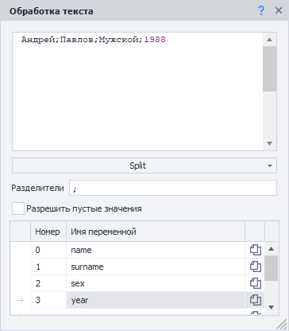


Но, если будет отсутствовать одна из составляющих, например `пол` (`Андрей;Павлов;;1988`), то год рождения запишется в переменную для пола (`sex` ). Вот как раз для таких случаев и создана настройка *Разрешить пустые значения -* если её включить, в переменную для пола запишется пустая строка, а год сохранится в правильную переменную.

#### Пример использования

Рассмотрим работу сплита на примере очень частой задачи – разбиение строки с прокси на составляющие части. Очень часто покупные прокси имеют такой формат: `логин:пароль@хост:порт`
Тут сразу два разделителя - `:`(двоеточие) и `@`. Вот как могут выглядеть настройки экшена:

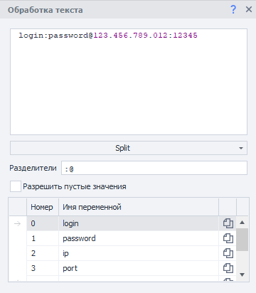


В качестве разделителя здесь указаны сразу оба символа.

* * *

### ToChar

Преобразует значение целого числа в [символы Unicode](https://ru.wikipedia.org/wiki/%D0%AE%D0%BD%D0%B8%D0%BA%D0%BE%D0%B4 "https://ru.wikipedia.org/wiki/%D0%AE%D0%BD%D0%B8%D0%BA%D0%BE%D0%B4"). 
Каждый символ Юникод имеет свой цифровой код и этот функционал позволяет конвертировать числовое значение в соответствующие символы. Например у символа `♛` числовое значение `9819`

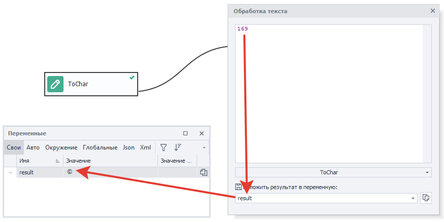


* * *

### ToLower

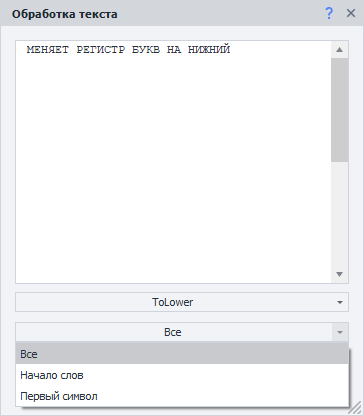


Меняет регистр букв на нижний в зависимости от выбранного свойства. Для примера возьмём строку `МЕНЯЕТ РЕГИСТР БУКВ НА НИЖНИЙ`

#### Все

Заменит все символы верхнего регистра в тексте на нижний регистр.

| **Было**<figure><div><div aria-disabled="false"><div></div></div></div></figure> | **Стало**<figure><div><div aria-disabled="false"><div></div></div></div></figure> |
| --- | --- |
| **Было**<figure><div><div aria-disabled="false"><div></div></div></div></figure> | **Стало**<figure><div><div aria-disabled="false"><div></div></div></div></figure> |
| --- | --- |
| МЕНЯЕТ РЕГИСТР БУКВ НА НИЖНИЙ | меняет регистр букв на нижний |

#### Начало слов

Меняет регистр на нижний у первого символа каждого слова в тексте.

| **Было**<figure><div><div aria-disabled="false"><div></div></div></div></figure> | **Стало**<figure><div><div aria-disabled="false"><div></div></div></div></figure> |
| --- | --- |
| **Было**<figure><div><div aria-disabled="false"><div></div></div></div></figure> | **Стало**<figure><div><div aria-disabled="false"><div></div></div></div></figure> |
| --- | --- |
| МЕНЯЕТ РЕГИСТР БУКВ НА НИЖНИЙ | мЕНЯЕТ рЕГИСТР бУКВ нА нИЖНИЙ |

#### Первый символ

Меняет регистр только первого символа в переданном тексте.

| **Было**<figure><div><div aria-disabled="false"><div></div></div></div></figure> | **Стало**<figure><div><div aria-disabled="false"><div></div></div></div></figure> |
| --- | --- |
| **Было**<figure><div><div aria-disabled="false"><div></div></div></div></figure> | **Стало**<figure><div><div aria-disabled="false"><div></div></div></div></figure> |
| --- | --- |
| МЕНЯЕТ РЕГИСТР БУКВ НА НИЖНИЙ | мЕНЯЕТ РЕГИСТР БУКВ НА НИЖНИЙ |

* * *

### **ToUpper**

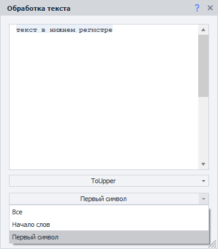


Меняет регистр букв на верхний в зависимости от выбранного свойства. Для примера возьмём строку `текст в нижнем регистре`

#### Все

Заменит все символы нижнего регистра в тексте на верхний регистр.

| **Было**<figure><div><div aria-disabled="false"><div></div></div></div></figure> | **Стало**<figure><div><div aria-disabled="false"><div></div></div></div></figure> |
| --- | --- |
| **Было**<figure><div><div aria-disabled="false"><div></div></div></div></figure> | **Стало**<figure><div><div aria-disabled="false"><div></div></div></div></figure> |
| --- | --- |
| текст в нижнем регистре | ТЕКСТ В НИЖНЕМ РЕГИСТРЕ |

#### Начало слов

Меняет регистр на верхний у первого символа каждого слова в тексте.

| **Было**<figure><div><div aria-disabled="false"><div></div></div></div></figure> | **Стало**<figure><div><div aria-disabled="false"><div></div></div></div></figure> |
| --- | --- |
| **Было**<figure><div><div aria-disabled="false"><div></div></div></div></figure> | **Стало**<figure><div><div aria-disabled="false"><div></div></div></div></figure> |
| --- | --- |
| текст в нижнем регистре | Текст В Нижнем Регистре |

#### Первый символ

Меняет регистр только первого символа в переданном тексте.

| **Было**<figure><div><div aria-disabled="false"><div></div></div></div></figure> | **Стало**<figure><div><div aria-disabled="false"><div></div></div></div></figure> |
| --- | --- |
| **Было**<figure><div><div aria-disabled="false"><div></div></div></div></figure> | **Стало**<figure><div><div aria-disabled="false"><div></div></div></div></figure> |
| --- | --- |
| текст в нижнем регистре | Текст в нижнем регистре |

  

### Trim

Эта функция используется для удаления лишних символов в начале и\или конце переданной строки. 

Чаще всего используется, если нужно почистить строку от лишних пробелов, переносов строк, табуляций, которые так часто остаются в результате парсинга. 

#### Что обрезать

Тут необходимо выбрать символы, которые нужно удалить. Это может быть либо предустановленный вариант для всех типов пробельных символов (пробел, перенос строки, табуляция), либо Вы можете указать свои символы.

#### Где обрезать

Где надо удалить символы - **Начало строки**, **Конец** либо **Начало и Конец.**

  

### UrlDecode

Декодирует закодированную с помощью UrlEncode (описано ниже) строку.

Наиболее наглядно этот экшен выглядит при раскодировании кириллицы:
Было: `%D0%9F%D1%80%D0%B8%D0%B2%D0%B5%D1%82%2C%20%D0%BC%D0%B8%D1%80%21`
Стало: `Привет, мир!`

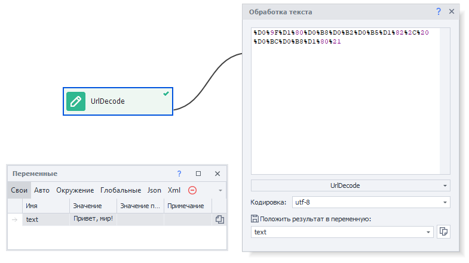


* * *

### UrlEncode

В URL разрешается использовать лишь латинские буквы, цифры и несколько знаков пунктуации. Все остальные символы, которые передаются в HTTP-запросе, должны быть закодированы с помощью UrlEncode, иначе сервер может неправильно интерпретировать запрос.

#### Кодировать только значения в переменных

Очень удобно использовать при формировании [❗→ HTTP запросов](/wiki/spaces/RU/pages/534085713 "/wiki/spaces/RU/pages/534085713"), т.к. адрес сайта кодировать не надо, а только параметры. Вот как могут выглядеть настройки экшена:

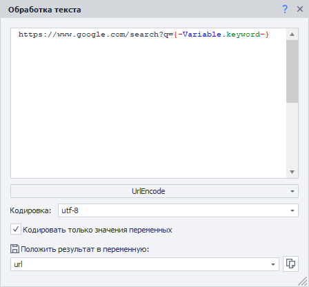


В переменной `{ -Variable.keyword- }`находится текст `что такое urlencode`. После выполнения в переменную `{ -Variable.url- }` запишется такая строка - `https://www.google.com/search?q=%d1%87%d1%82%d0%be+%d1%82%d0%b0%d0%ba%d0%be%d0%b5+urlencode`

* * *

### В переменную

Это действие просто сохраняет всё что вы добавите во входное окно – переменные, текст, символы, константы проекта, в отдельную переменную.

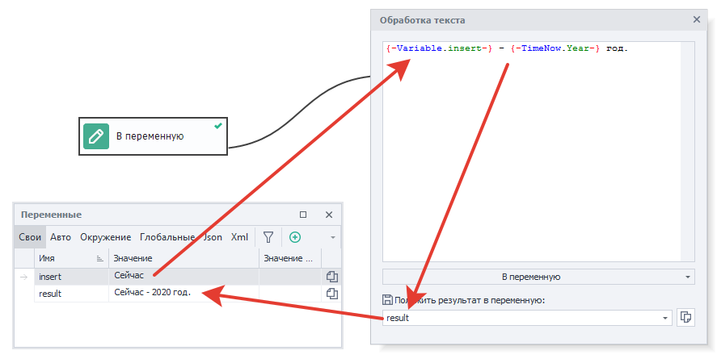


* * *

### В список

Данный экшен разбивает текст с помощью указанного в свойствах разделителя на строки и записывает их в [❗→ список](/wiki/spaces/RU/pages/534053375 "/wiki/spaces/RU/pages/534053375").

#### Разделитель

- Enter - символ новой строки
- Пробел
- Свой текст - тут можно указать как единичный символ (например `;`) так и несколько символов (**внимание:** если Вы укажите здесь несколько символов, то они будут рассматриваться как *один* разделитель!)
- Свой Regex - использование [❗→ регулярного выражения](/wiki/spaces/RU/pages/534086111 "/wiki/spaces/RU/pages/534086111").

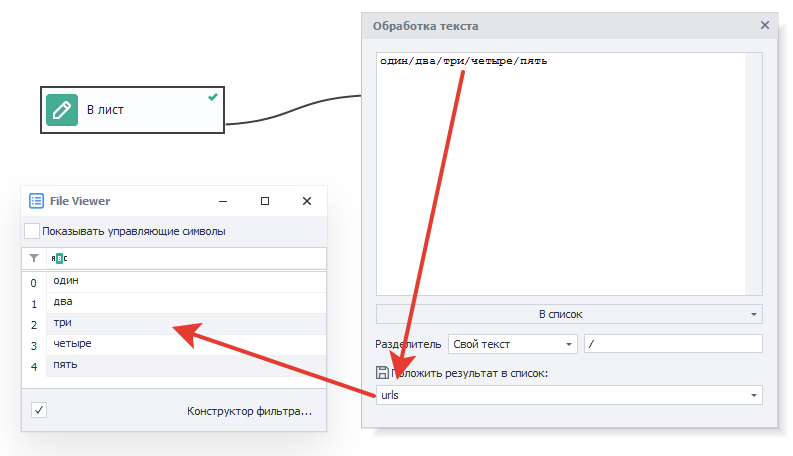


* * *

### В таблицу

Данное действие разбивает переданный текст на строки и столбцы (согласно указанным разделителям) и помещает данные в [❗→ таблицу](/wiki/spaces/RU/pages/735903776 "/wiki/spaces/RU/pages/735903776").

#### Разделители

- Enter - символ новой строки
- Пробел
- Свой текст - тут можно указать как единичный символ (например `;`) так и несколько символов (**внимание:** если Вы укажите здесь несколько символов, то они будут рассматриваться как один разделитель!)
- Свой Regex - использование [❗→ регулярного выражения](/wiki/spaces/RU/pages/534086111 "/wiki/spaces/RU/pages/534086111").

  

### Замена

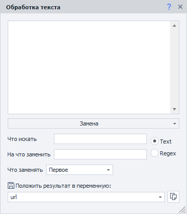


Это действие ищет в строке подстроку, заменяет её на другую и затем сохраняет результат в переменную. 

#### Что искать

Подстрока, которую надо найти (либо [❗→ регулярное выражение](/wiki/spaces/RU/pages/534086111 "/wiki/spaces/RU/pages/534086111"), если выбран тип поиска *Regex).

#### На что заменить

Чем будет заменена найденная подстрока.

#### Тип поиска

*Text - ищется точно такая же строка, которая была передана в поле **Что искать**.

*Regex - в поле **Что искать** надо записать регулярное выражение, по которому будет искаться совпадение.

#### Что заменять

##### **Первое**

Будет заменено первое найденное совпадение.

##### **Все**

Будут заменены все совпадения.

##### **Одно совпадение**

Заменить только одно, указанное, совпадение (нумерация с нуля!) либо *Последнее.

##### **Номера совпадений**

Указать через запятую номера совпадений, которые нужно заменить (нумерация с нуля!).

  

### Перевод

Переводит строки с одного языка на другой.

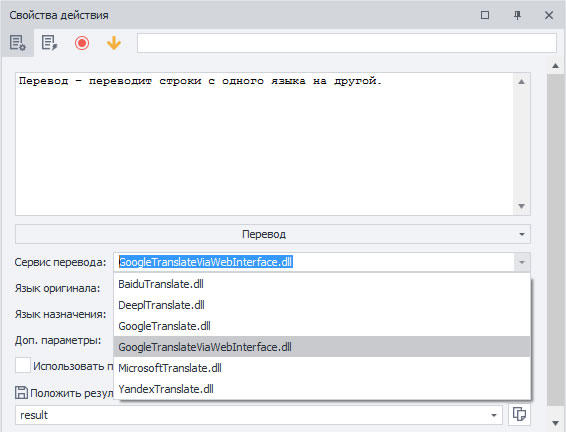


В экшене перевода имеется большой выбор сервисов перевода, что поможет гибко подходить к уникализации текстов выбирая наиболее качественные текста.

#### Сервис перевода

Тут необходимо выбрать сервис, через который будет осуществляться перевод. Доступные варианты:

- [Baidu](https://www.npmjs.com/package/baidu-translate-api "https://www.npmjs.com/package/baidu-translate-api")
- [DeepL](https://www.deepl.com/ru/docs-api/ "https://www.deepl.com/ru/docs-api/")
- [Google](https://cloud.google.com/translate "https://cloud.google.com/translate")
- [Google через веб интерфейс](https://translate.google.com/ "https://translate.google.com/")
- [Microsoft](https://www.microsoft.com/en-us/translator/business/translator-api/ "https://www.microsoft.com/en-us/translator/business/translator-api/")
- [Yandex](https://tech.yandex.com/translate/ "https://tech.yandex.com/translate/")

Ключи API для сервисов можно добавить в [❗→ настройках ZennoPoster](https://zennolab.atlassian.net/wiki/spaces/RU/pages/808747136/ZennoPoster "https://zennolab.atlassian.net/wiki/spaces/RU/pages/808747136/ZennoPoster").

#### Язык оригинала, Язык назначения

С какого и на какой язык надо перевести текст.

Вот несколько примеров: английский – en, испанский – es, немецкий – de, русский – ru ([полный список](http://www.loc.gov/standards/iso639-2/php/code_list.php "http://www.loc.gov/standards/iso639-2/php/code_list.php"))

:::warning Внимание
Коды языков могут отличаться в разных сервисах. Для полного и достоверного списка кодов стоит обратиться к документации выбранного сервиса.
:::

:::note На заметку
Можно указать язык “auto” и тогда система попробует определить язык перевода сама, но результат не гарантируется.
:::

#### Дополнительные параметры

Дополнительные параметры, которые можно передать стоит уточнить в документации выбранного сервиса.

#### Использовать прокси проекта (если это возможно)

Если это возможно, то запрос на перевод будет осуществлён с помощью текущего установленного прокси.

### Подготовка JavaScript

Обрабатывает строку для корректного использования в JavaScript. В основном экранирует кавычки и другие спец. символы. Этот макрос подготавливает текст, чтобы его можно было вставить в качестве строки в экшен [❗→ JavaScript](https://zennolab.atlassian.net/wiki/spaces/RU/pages/489259137/JavaScript "https://zennolab.atlassian.net/wiki/spaces/RU/pages/489259137/JavaScript") или [❗→ IF](https://zennolab.atlassian.net/wiki/spaces/RU/pages/534315151/...+...+IF "https://zennolab.atlassian.net/wiki/spaces/RU/pages/534315151/...+...+IF"). В ProjectMaker есть [❗→ тестер JavaScript](https://zennolab.atlassian.net/wiki/spaces/RU/pages/534086128/JavaScript "https://zennolab.atlassian.net/wiki/spaces/RU/pages/534086128/JavaScript"), где можно проверить (протестировать) код. Этот “кубик” поможет заэкранировать кавычки, апострофы и другие спецсимволы.

Было: 
```
<a href="https://zennolab.com/">
```
Стало:
```
<a href=\"https://zennolab.com/\">
```

  

### Подстрока

Берет из строки кусок текста заданный в свойствах экшена двумя индексами – **от** одного символа и **до** другого. Например, если взять первое предложение этого абзаца и есть задача получить подстроку в ней от 95 символа до конца текста, то получим “до другого.“ .

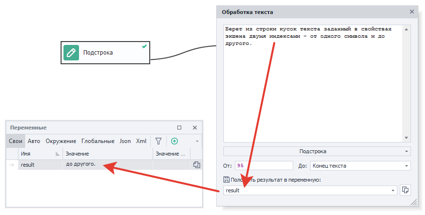


  

### Транслитерация

Иногда всё ещё требуется *perevesti кириллицу в латиницу. Этому действию и служит данный экшен.

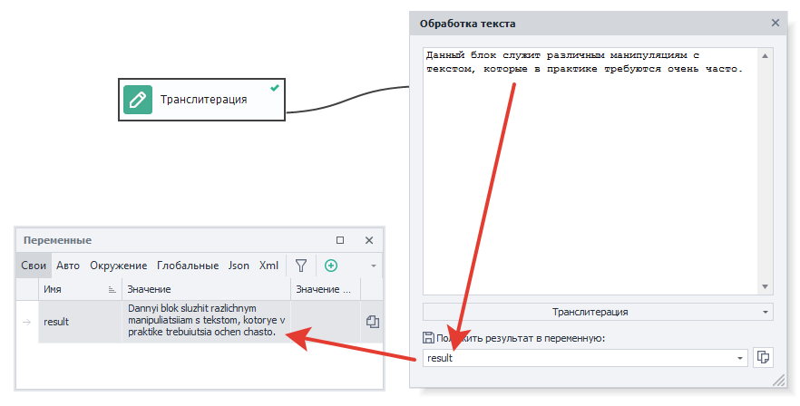


  

## Полезные ссылки

- [❗→ Тестер регулярных выражений](/wiki/spaces/RU/pages/534086111 "/wiki/spaces/RU/pages/534086111")
- [❗→ Окно переменных](/wiki/spaces/RU/pages/735608872 "/wiki/spaces/RU/pages/735608872")