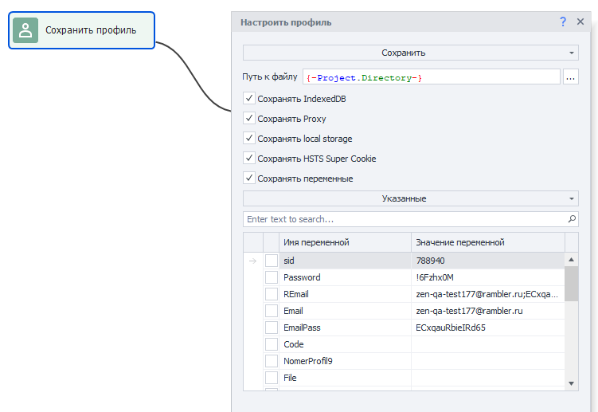

:::info **Пожалуйста, ознакомьтесь с [*Правилами использования материалов на данном ресурсе*](../Disclaimer).**
:::

> 🔗 **[Оригинальная страница](https://zennolab.atlassian.net/wiki/spaces/RU/pages/486539291)** — Источник данного материала

_______________________________________________  

## Описание

Для работы в интернете ZennoPoster имеет специальную сущность - Профиль проекта.

Профиль совмещает в себе такие часто используемые параметры, как:

1. **Виртуальная личность** - имя, фамилия, дата рождения, e-mail, национальность и другие параметры.
2. **Виртуальный браузер** - UserAgent, Proxy, отпечаток браузера и т.д.

:::info Информация
Профиль генерируется заново каждый раз по нажатию кнопки “С начала“ в ProjectMaker или при новом выполнении проекта в ZennoPoster
:::


**📹 Здесь было видео**

Для настроек первичной генерации профиля, необходимо настроить его в [❗→ статическом блоке](https://zennolab.atlassian.net/wiki/spaces/RU/pages/534053179 "https://zennolab.atlassian.net/wiki/spaces/RU/pages/534053179") → [❗→ Профиль](https://zennolab.atlassian.net/wiki/spaces/RU/pages/483426308 "https://zennolab.atlassian.net/wiki/spaces/RU/pages/483426308"). В нём Вы можете указать язык профиля, пол, желаемые регионы, а также настройки браузера.

## Как добавить действие в проект?

Через контекстное меню **Добавить действие** → **Данные** → **Операции над профилем**


Либо воспользуйтесь [❗→ умным поиском](https://zennolab.atlassian.net/wiki/spaces/RU/pages/506200090/ProjectMaker+7#%D0%A3%D0%BC%D0%BD%D1%8B%D0%B9-%D0%BF%D0%BE%D0%B8%D1%81%D0%BA-%D0%B4%D0%B5%D0%B9%D1%81%D1%82%D0%B2%D0%B8%D0%B9 "https://zennolab.atlassian.net/wiki/spaces/RU/pages/506200090/ProjectMaker+7#%D0%A3%D0%BC%D0%BD%D1%8B%D0%B9-%D0%BF%D0%BE%D0%B8%D1%81%D0%BA-%D0%B4%D0%B5%D0%B9%D1%81%D1%82%D0%B2%D0%B8%D0%B9").

## Для чего это используется?

Профиль можно сохранять и загружать в шаблон, используя, таким образом, различные профили для работы на различных ресурсах. Это позволяет обходить защиту от ботов.


Для ознакомления с нынешним профилем, Вы можете нажать на кнопку “Текущий профиль” в верхней части интерфейса программы. Подробнее обо всех настройках профиля читайте здесь: [❗→ Окно профиля](https://zennolab.atlassian.net/wiki/spaces/RU/pages/735903758 "https://zennolab.atlassian.net/wiki/spaces/RU/pages/735903758") 

## Как работать с экшеном?

### Сохранение профиля

После регистрации на ресурсе или после иных действий на сайте, выполненных внутри шаблона, Вы можете сохранить данные профиля для последующего использования в других проектах. В файле профиля (\.zpprofile) сохраняются все данные инстанса: куки, User Agent, данные о компьютере, сгенерированные для инстанса, имя, фамилия, логин, город и прочее.


:::warning Внимание
Будьте аккуратны с галочкой “Сохранять переменные”. Если Вы сохранили профиль с этой опцией, то при его следующей загрузке значения выбранных переменных будут перезаписаны.
:::




В целях корректного выполнения шаблона, сохраняйте только необходимые переменные. Однако, Вы всегда можете выбрать “Все” в выпадающем списке.

  

### Загрузка профиля

Если у Вас есть ранее сохраненные профили, Вы можете загрузить их для использования в проекте.


**Создать недостающие переменные** - при включении данной настройки в Вашем проекте автоматически будут созданы и добавлены недостающие переменные, которые числятся в профиле. Это полезно, когда Вы хотите добавить в проект профиль, который был сохранен при работе другого.

**Выводить ошибку при загрузке несовместимого профиля** - если включена данная настройка, то при загрузке профилей, которые были созданы на движке браузера, отличном от [❗→ движка проекта](https://zennolab.atlassian.net/wiki/spaces/RU/pages/534315477#%D0%A2%D0%B8%D0%BF-%D0%B1%D1%80%D0%B0%D1%83%D0%B7%D0%B5%D1%80%D0%B0 "https://zennolab.atlassian.net/wiki/spaces/RU/pages/534315477#%D0%A2%D0%B8%D0%BF-%D0%B1%D1%80%D0%B0%D1%83%D0%B7%D0%B5%D1%80%D0%B0"), проект будет завершаться ошибкой (например Вы сейчас работаете в проекте, который использует движок Firefox 52, а загрузить пытаетесь профиль созданный на движке Chrome).

:::info Информация
Данная настройка добавлена в ZennoPoster 7.2.1.0
:::

  

### Переназначить поля

Вы можете вручную редактировать составляющие профиля. Для некоторых данных Вы можете установить значение, которое Вам необходимо, а для других перегенерировать.


#### Для чего это нужно?

- Установка своих UserAgent-ов;
- Установка желаемых имен, фамилий, дат рождения и прочей информации “личности”;
- Установка желаемого разрешения браузера;
- Установка желаемых логинов/паролей/почты;
- Любая другая возможная модернизация профиля под свои нужды.

В дальнейшей работе можно использовать данные из профиля в других действиях, например, в кубике [❗→ Обработка текста](https://zennolab.atlassian.net/wiki/spaces/RU/pages/488865793 "https://zennolab.atlassian.net/wiki/spaces/RU/pages/488865793"). Для этого воспользуйтесь макросами из [❗→ переменных окружения](https://zennolab.atlassian.net/wiki/spaces/RU/pages/735608872#%D0%9F%D1%80%D0%BE%D1%84%D0%B8%D0%BB%D1%8C "https://zennolab.atlassian.net/wiki/spaces/RU/pages/735608872#%D0%9F%D1%80%D0%BE%D1%84%D0%B8%D0%BB%D1%8C"), например: `{ -Profile.Name}`


:::note На заметку
Вам достаточно написать фрагмент \{ -Profile. и ProjectMaker предложит Вам все возможные варианты выбора в виде выпадающего списка.
:::


  

### Обновить

:::info Информация
Доступно в ZennoPoster, начиная с версии 7.3.1.0.
:::

Данный экшен будет обновлять текущий профиль на похожий профиль с последней версией браузера.


Поиск производится по фильтру проекта и соответствию нового профиля следующим параметрам текущего профиля: тип браузера, ОС, платформа, язык и разрешение экрана.

Экшен не просто обновляет последнюю версию браузера, а целиком заменяет профиль на найденный (все параметры будут новые, кроме тех по которым производился поиск).

ZennoPoster может загрузить до 4000 профилей для поиска подходящего (больше грузить нет смысла т.к. сервер генерирует 4000 профилей в сутки), ProjectMaker - 400.

  

### Сохранить профиль-папку

:::info Информация
Доступно начиная с версии ZennoPoster 7.3.1.0.
:::


В ZennoPoster 7.3.1.0 была добавлена профиль-папка, подробнее о ней Вы можете прочитать в статье [❗→ Использование профиль-папки](https://zennolab.atlassian.net/wiki/spaces/RU/pages/1251475485 "https://zennolab.atlassian.net/wiki/spaces/RU/pages/1251475485") 

С помощью данной функции Вы можете её сохранить.

Так же вместе с профиль-папкой можно сохранить текущий прокси проекта и\или переменные (все либо некоторые)

:::warning Внимание
Сохранение профиль-папки - ресурсоёмкая операция и может сильно замедлить работу проекта, особенно при многопоточной работе. Не рекомендуется часто вызывать сохранение. Лучшие места для вызова - Хороший выход в проекте (Good End) и Плохой выход в проекте (Bad End)
:::

  

## Возможное практическое применение

Представим ситуацию, что мы работаем с каким-либо сервисом, где есть подписчики. После завершения работы, сохраняем в переменную **LastActivity** нынешние дату и время. Для этого используем экшен [❗→ Обработка переменных](https://zennolab.atlassian.net/wiki/spaces/RU/pages/486309922#%D0%AD%D0%BA%D1%88%D0%B5%D0%BD-%E2%80%9C%D0%9E%D0%B1%D1%80%D0%B0%D0%B1%D0%BE%D1%82%D0%BA%D0%B0-%D0%BF%D0%B5%D1%80%D0%B5%D0%BC%D0%B5%D0%BD%D0%BD%D1%8B%D1%85%E2%80%9D "https://zennolab.atlassian.net/wiki/spaces/RU/pages/486309922#%D0%AD%D0%BA%D1%88%D0%B5%D0%BD-%E2%80%9C%D0%9E%D0%B1%D1%80%D0%B0%D0%B1%D0%BE%D1%82%D0%BA%D0%B0-%D0%BF%D0%B5%D1%80%D0%B5%D0%BC%D0%B5%D0%BD%D0%BD%D1%8B%D1%85%E2%80%9D") ** и в поле данных указываем макрос `{ -TimeNow.Date- }` (подробнее о доступных макросах можно прочитать в статье [❗→ Окно переменных](https://zennolab.atlassian.net/wiki/spaces/RU/pages/735608872 "https://zennolab.atlassian.net/wiki/spaces/RU/pages/735608872")).

В переменной **OldSubcribers** содержится количество подписчиков, которое мы получили при работе шаблона.

В переменной **PhoneNum** содержится номер телефона, привязанный к аккаунту.


Сохраняем наш профиль и указываем желаемые переменные для сохранения.


:::tip Совет
Начиная с версии 7.3.1.0 сохранение профиля проще и логичнее происходит при Работе с профиль-папкой.
:::

Т.к. переменные token и UserNameLastSub нам не нужны по тем или иным причинам, мы их не сохраняем.

Позже мы можем использовать “Загрузку профиля” и получить нужные переменные, далее их используем для личного логирования действий. Создадим действие [❗→ Оповещение (Notification/Запись в лог)](https://zennolab.atlassian.net/wiki/spaces/RU/pages/534053050 "https://zennolab.atlassian.net/wiki/spaces/RU/pages/534053050") ** и укажем там следующий текст:

```
Загружен профиль.
Имя профиля: {-Profile.Name-};
Последняя активность профиля: {-Variable.LastActivity-};
Количество подписчиков после предыдущей проверки: {-Variable.OldSubcribers-};
Номер телефона: {-Variable.PhoneNum-}.
```

В нем задействовано несколько макросов: `{-Profile.Name-}` - имя профиля, `{-Variable.LastActivity-}` - переменная `LastActivity`, `{-Variable.OldSubcribers-}` - переменная `OldSubcribers`, `{-Variable.PhoneNum-}` - переменная `PhoneNum`. На выходе получим следующий текст в логе:


Также, при сохранении и загрузке профиля, Вы можете использовать [❗→ пользовательские переменные](https://zennolab.atlassian.net/wiki/spaces/RU/pages/486309922 "https://zennolab.atlassian.net/wiki/spaces/RU/pages/486309922"), [❗→ переменные окружения](https://zennolab.atlassian.net/wiki/spaces/RU/pages/1976762378 "https://zennolab.atlassian.net/wiki/spaces/RU/pages/1976762378") и их сочетания. Например, при установке следующей строки `{-Project.Directory-}ProfilesZenno\{-Profile.Login-}.zpprofile` в "Путь к файлу" при сохранении профиля, в папке Profiles (эта папка будет создана рядом с файлом проекта если на момент выполнения экшена её не существовало) будет сохранён файл под названием `rosenhydo1987.zpprofile`.


## Полезные ссылки

- [❗→ Профиль](https://zennolab.atlassian.net/wiki/spaces/RU/pages/483426308 "https://zennolab.atlassian.net/wiki/spaces/RU/pages/483426308") - настройки первичной генерации профиля.
- [❗→ Окно профиля](https://zennolab.atlassian.net/wiki/spaces/RU/pages/735903758 "https://zennolab.atlassian.net/wiki/spaces/RU/pages/735903758") - информация о сгенерированном профиле.
- [❗→ Произвольные числа и строки (Random/Рандом)](https://zennolab.atlassian.net/wiki/spaces/RU/pages/534315050 "https://zennolab.atlassian.net/wiki/spaces/RU/pages/534315050") - для создания логинов;
- [❗→ Операции над списком](https://zennolab.atlassian.net/wiki/spaces/RU/pages/534085798 "https://zennolab.atlassian.net/wiki/spaces/RU/pages/534085798") - для работы со своими списками данных;
- [❗→ Google таблицы (PM)](https://zennolab.atlassian.net/wiki/spaces/RU/pages/735576090 "https://zennolab.atlassian.net/wiki/spaces/RU/pages/735576090") - для работы с перечнями данных;
- [❗→ Обработка текста](https://zennolab.atlassian.net/wiki/spaces/RU/pages/488865793 "https://zennolab.atlassian.net/wiki/spaces/RU/pages/488865793") - для внесения в регулируемые переменные проекта.
- [❗→ Окно переменных](https://zennolab.atlassian.net/wiki/spaces/RU/pages/735608872 "https://zennolab.atlassian.net/wiki/spaces/RU/pages/735608872")