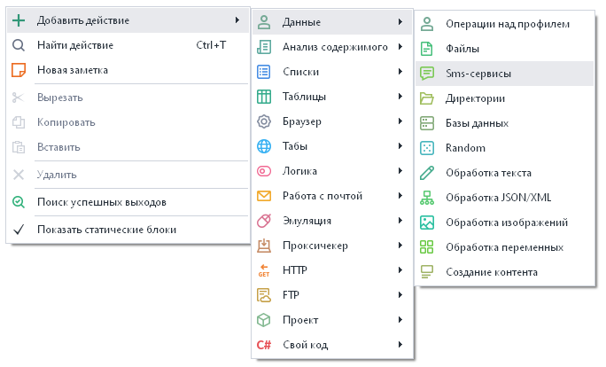
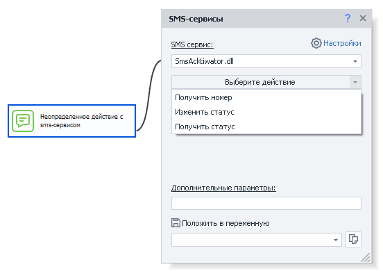
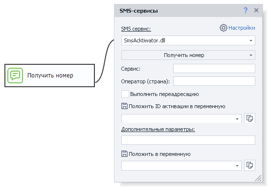
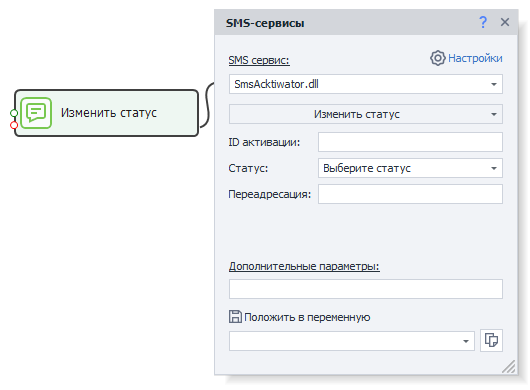
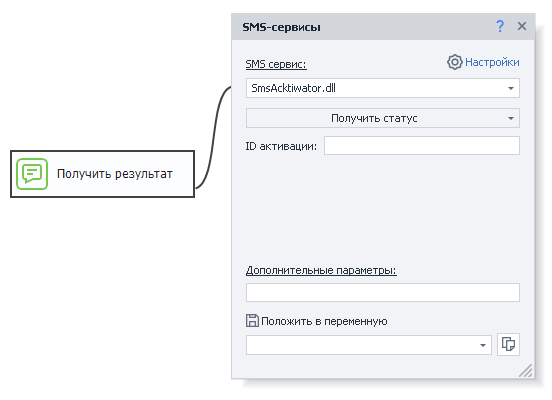
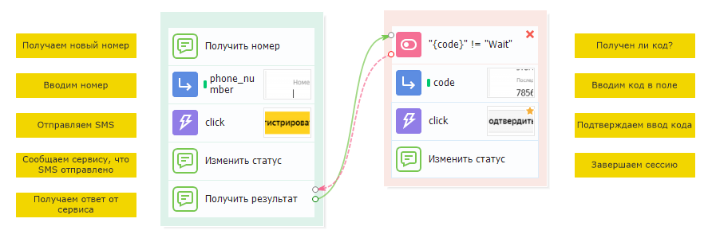

---
sidebar_position: 3
title: "Сервисы для обработки SMS"
description: "Конвертировано из HTML в MDX"
date: "2025-07-24"
converted: true
originalFile: "Сервисы для обработки SMS.txt"
targetUrl: "https://zennolab.atlassian.net/wiki/spaces/RU/pages/486539308/SMS"
---
:::info **Пожалуйста, ознакомьтесь с [*Правилами использования материалов на данном ресурсе*](../Disclaimer).**
:::

> 🔗 **[Оригинальная страница](https://zennolab.atlassian.net/wiki/spaces/RU/pages/486539308/SMS)** — Источник данного материала

_______________________________________________  

## Для чего используются

Данный экшен используется для работы с SMS-сервисами, позволяет получать номер из выбранного сервиса и использовать его в работе.

## Как добавить действие в проект?

Через контекстное меню **Добавить действие** → **Данные** → **SMS-сервисы**

Либо воспользуйтесь [❗→ умным поиском](https://zennolab.atlassian.net/wiki/spaces/RU/pages/506200090/ProjectMaker+7#%D0%A3%D0%BC%D0%BD%D1%8B%D0%B9-%D0%BF%D0%BE%D0%B8%D1%81%D0%BA-%D0%B4%D0%B5%D0%B9%D1%81%D1%82%D0%B2%D0%B8%D0%B9 "https://zennolab.atlassian.net/wiki/spaces/RU/pages/506200090/ProjectMaker+7#%D0%A3%D0%BC%D0%BD%D1%8B%D0%B9-%D0%BF%D0%BE%D0%B8%D1%81%D0%BA-%D0%B4%D0%B5%D0%B9%D1%81%D1%82%D0%B2%D0%B8%D0%B9").

## Для чего это используется?

Получить SMS сообщение для регистрации на сайтах, требующих для проверки SMS подтверждение.

## Как работать с экшеном?

:::note На заметку
Для начала требуется подключить API ключ одного из смс-сервисов в настройках программы
:::

Экшен имеет следующие основные настройки:

### SMS-сервис

Выбор SMS-сервиса для работы. Настройки сервисов описаны в статье [❗→ SMS-сервисы](https://zennolab.atlassian.net/wiki/spaces/RU/pages/809074773 "https://zennolab.atlassian.net/wiki/spaces/RU/pages/809074773").

### Выберите действие

#### Получить номер

##### **Сервис**

Сайт\приложение, для которого надо получить номер.

:::note На заметку
Допустимые значения стоит уточнить в документации выбранного сервиса активации.
:::

##### **Оператор (страна)**

В этом поле обычно указывается код страны, номер которой нужно получить.

:::note На заметку
Коды стран отличаются от сервиса к сервису, значения стоит уточнить в документации выбранного сервиса активации.
:::

##### **Выполнить переадресацию**

Нужно ли выполнить переадресацию?

:::note На заметку
Возможность переадресации стоит узнавать в документации выбранного сервиса активации.
:::

##### **Положить ID активации в переменную**

В указанную здесь переменную сохранится ID активации. Этот ID понадобится в будущем, когда проект будет ожидать получения СМС.

#### Изменить статус

Уведомление сервиса об изменении статуса номера. 

##### **ID активации**

Здесь надо указать ID активации, который был получен на шаге **Получить номер** 

:::note На заметку
Можно использовать макрос переменной
:::

##### **Статус**

- **SMS отправлено** - SMS было отправлено на указанный номер.
- **Повторный запрос кода** - для случаев когда по каким-либо причинам пришлось отправить SMS ещё раз.
- **Отмена запроса** - когда потребность в номере прошла и, зачастую, сервисы могут вернуть использованные средства на счёте.
- **Номер уже использовался** - необходим для уведомления сервиса, что номер не подходит по причине его занятости.
- **Завершение** - уведомляет сервис об успешном использовании номера.

##### **Переадресация**

Номер для переадресации

  

#### Получить статус

Получает состояние номера. Если происходит ожидание SMS, программа будет пытаться его получить в течение 3 минут. Если за это время SMS не было получено, в результирующую переменную попадет значение «Wait», и операцию «Получить статус» придется повторить заново. Некоторые сервисы имеют очень долгое время отклика на SMS (около 15 минут).

##### **ID активации**

Здесь надо указать ID активации, который был получен на шаге **Получить номер** 

:::note На заметку
Можно использовать макрос переменной
:::

  

### Дополнительные параметры

Сервисы могут принимать дополнительные параметры, которые не предусмотрены настройками экшена.

Формат записи: `параметр=значение`

Можно передавать сразу несколько параметров. Друг от друга они должны отделяться символом & (амперсанд): `&параметр1=значение1&параметр2=значение2&параметрN=значениеN`.

:::warning Внимание
Названия параметров, их назначение и принимаемые значения отличаются от сервиса к сервису. Уточнить их стоит в документации выбранного сервиса.
:::

  

### Положить в переменную

Выбираем переменную, в которую будет возвращён результат работы.

  

## Как это работает?

Алгоритм работы с каждым сервисом, примерно такой:

1. Заказать номер и получить его.
2. Отправить на полученный номер SMS сообщение.
3. Уведомить сервис, что сообщение отправлено.
4. Ожидать получения сообщения.
5. Завершить сессию.

  

## Примерный вид шаблона

Примерная схема работы с SMS-сервисом в шаблоне для ZennoPoster представлена ниже:

:::warning Внимание
Это только пример!Не используйте в своих шаблонах бесконечные циклы - это может привести к зависанию шаблона и потере денег (если будет выставлен бесконечный цикл на получение номера и по какой-то причине шаблон не сможет выйти из такого цикла он будет запрашивать номера, пока не кончаться деньги на сервисе).
:::

  

## Полезные ссылки

- [❗→ SMS-сервисы](https://zennolab.atlassian.net/wiki/spaces/RU/pages/809074773 "https://zennolab.atlassian.net/wiki/spaces/RU/pages/809074773")
- [❗→ Обработка текста](https://zennolab.atlassian.net/wiki/spaces/RU/pages/488865793 "https://zennolab.atlassian.net/wiki/spaces/RU/pages/488865793")
- [❗→ Обработка JSON и XML](https://zennolab.atlassian.net/wiki/spaces/RU/pages/488964124 "https://zennolab.atlassian.net/wiki/spaces/RU/pages/488964124")
- [❗→ Работа с переменными](https://zennolab.atlassian.net/wiki/spaces/RU/pages/486309922 "https://zennolab.atlassian.net/wiki/spaces/RU/pages/486309922")