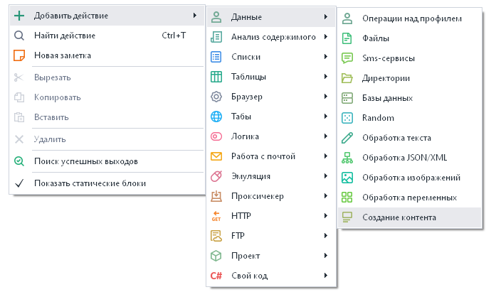
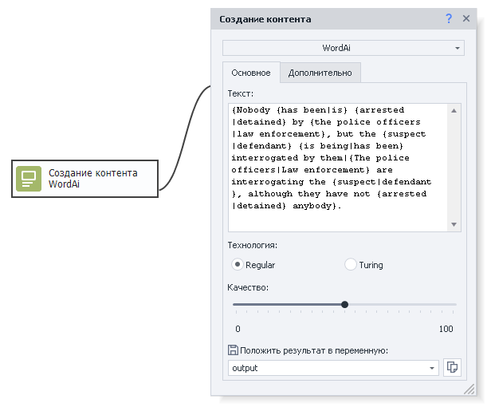
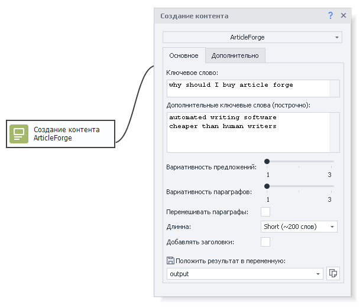
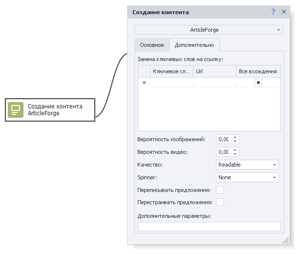

---
sidebar_position: 11
title: "Создание контента"
description: "Конвертировано из HTML в MDX"
date: "2025-07-24"
converted: true
originalFile: "Создание контента.txt"
targetUrl: "https://zennolab.atlassian.net/wiki/spaces/RU/pages/489095179"
---
:::info **Пожалуйста, ознакомьтесь с [*Правилами использования материалов на данном ресурсе*](../Disclaimer).**
:::

> 🔗 **[Оригинальная страница](https://zennolab.atlassian.net/wiki/spaces/RU/pages/489095179)** — Источник данного материала

_______________________________________________  

## Описание

ZennoPoster позволяет подключить и использовать сервисы для создания уникального текста - **WordAI** и **ArticleForge**. Эти сервисы используют искусственный интеллект для понимания текста, и способны сделать автоматический рерайтинг, читабельность которого сравнима с текстом, написанным человеком. Один минус - сервисы не поддерживают русский язык, поэтому их использование будет актуально для тех, кто работает в англоязычном сегменте интернета.

## Как добавить действие в проект?

Через контекстное меню **Настройки → Создание контента**. Предварительно необходимо настроить авторизацию в сервисах в [❗→ настройках программы](/wiki/spaces/RU/pages/808812655 "/wiki/spaces/RU/pages/808812655").

Либо воспользуйтесь [❗→ умным поиском](https://zennolab.atlassian.net/wiki/spaces/RU/pages/506200090/ProjectMaker+7#%D0%A3%D0%BC%D0%BD%D1%8B%D0%B9-%D0%BF%D0%BE%D0%B8%D1%81%D0%BA-%D0%B4%D0%B5%D0%B9%D1%81%D1%82%D0%B2%D0%B8%D0%B9 "https://zennolab.atlassian.net/wiki/spaces/RU/pages/506200090/ProjectMaker+7#%D0%A3%D0%BC%D0%BD%D1%8B%D0%B9-%D0%BF%D0%BE%D0%B8%D1%81%D0%BA-%D0%B4%D0%B5%D0%B9%D1%81%D1%82%D0%B2%D0%B8%D0%B9").

## Как работать с экшеном?

### Сервис WordAi

В поле “Текст” - вводится текст для рерайтинга, выбирается технология генерации текста - Regular или Turing и качество распознавания текста. При необходимости задаются дополнительные параметры. Результат работы помещается в выбранную переменную.

Подробнее о сервисе WordAi вы можете узнать на [официальном сайте](http://wordai.com "http://wordai.com").

### Сервис ArticleForge

Задаётся основное ключевое слово и дополнительные ключевые слова построчно, выбирается вариативность предложений и параграфов. Можно включить перемешивание параграфов и добавление заголовков, а так же выбрать длину текста - от 50 до 750 слов.

В дополнительных настройках можно выбрать замену ключевых слов на нужную ссылку, выставить вероятность вставки в текст изображений и видео, качество текста - regular, unique, very unique, readable, very readable. В графе “Spinner” можно выбрать 3 метода генерации текста - none, regular и turing. Так же можно включить режимы переписывания и перестраивания предложений. В графе “дополнительные параметры” можно задать дополнительные опции, предусмотренные сервисом. Результат работы помещается в выбранную переменную.

Подробнее о сервисе ArticleForge вы можете узнать на [официальном сайте](https://www.articleforge.com/ "https://www.articleforge.com/").

## Пример использования

Для создания множества страниц на сайте с уникальным текстом можно задать исходный текст и подключить сервисы-синонимайзеры.

1. Вносим данные идентификации на сервисах.
2. Добавляем в проект экшен “Создание контента”.
3. Задаём параметры для обработки текста.
4. Получаем уникальную текстовку для каждой страницы.

Таким образом получаем читаемый и самое главное уникальный текст для сайта.