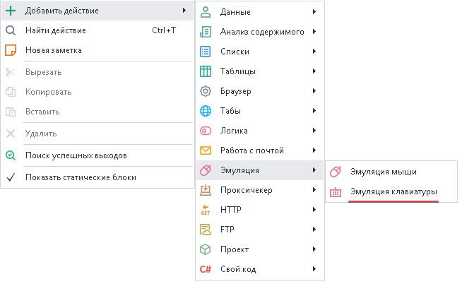
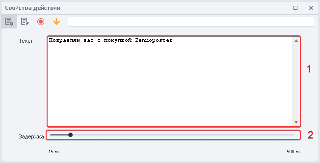
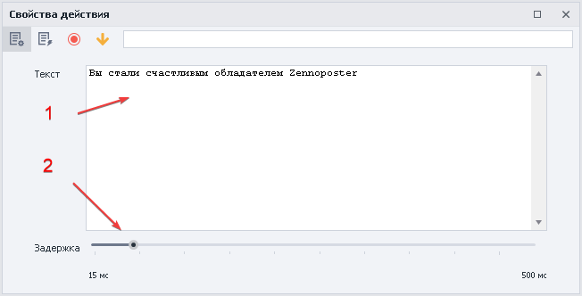
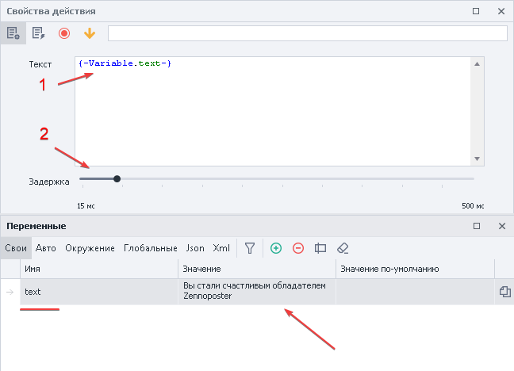
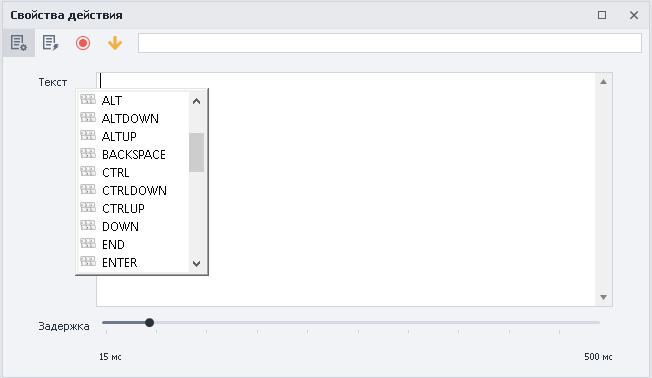
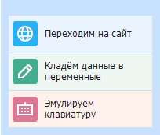

---
sidebar_position: 2
title: "Эмуляция клавиатуры"
description: ""
date: "2025-08-04"
converted: true
originalFile: "Эмуляция клавиатуры.txt"
targetUrl: "https://zennolab.atlassian.net/wiki/spaces/RU/pages/735608949"
---
import DisclaimerNotice from '@site/src/components/DisclaimerNotice';

<DisclaimerNotice />

> 🔗 **[Оригинальная страница](https://zennolab.atlassian.net/wiki/spaces/RU/pages/735608949)** — Источник данного материала

_______________________________________________  
## Описание
Позволяет имитировать ручной набор текста или нажатия клавиш на сайте.  

#### Используется для:  
- Заполнения полей ввода
- Набора различного текста
- Эмуляции нажатия клавиш

### Как добавить действие в проект?
Через контекстное меню: **Добавить действие** → **Эмуляция** → **Эмуляция клавиатуры**

_______________________________________________
## Принцип работы
### Настройка экшена

1. Поле для *текста*, *переменных* и *специальных клавиш*. Их все **можно использовать одновременно**.  
2. Пауза между набором символов.

### Статичный текст

1. Вводим статичный текст.
2. Выставляем параметры ввода.

:::info Текст останется неизменным на протяжении всего выполнения проекта.
:::

### Работа с переменными
Переменная в экшене позволит каждый раз вводить новый текст.

1. Устанавливаем необходимую переменную.
2. Фиксируем ползунок задержки.

:::info Текст будет меняться в зависимости от содержания переменной.
:::

### Использование специальных клавиш
Позволяет эмулировать клавиши `Enter`, `CTRL`, `END` и другие.

1. Устанавливаем курсор мыши в поле *Текст*.
2. Нажатием горячих клавиш `CTRL` + `Space` вызываем контекстное меню.
3. Выбираем из списка нужную клавишу.
_______________________________________________
## Пример использования
Многие ресурсы научились отслеживать нажатия клавиш, поэтому для максимальной надежности можно заполнять формы через эмуляцию клавиатуры.

Это выглядит примерно так:  

  

1. Заходим на сайт и переходим в раздел заполнения профиля.
2. Сохраняем необходимые данные в соответствующие переменные.
3. Затем вносим их в экшен эмуляции клавиатуры.
4. После установки курсора в поле ввода запускаем кубик.
5. Сайт расценивает нас как настоящего пользователя и принимает данные.
_______________________________________________
## Полезные ссылки
1. [❗→ Окно переменных](https://zennolab.atlassian.net/wiki/spaces/RU/pages/735608872 "https://zennolab.atlassian.net/wiki/spaces/RU/pages/735608872")
2. [❗→ Настройки проекта](https://zennolab.atlassian.net/wiki/spaces/RU/pages/534315477 "https://zennolab.atlassian.net/wiki/spaces/RU/pages/534315477")
3. [❗→ Эмуляция мыши](https://zennolab.atlassian.net/wiki/spaces/RU/pages/534315158 "https://zennolab.atlassian.net/wiki/spaces/RU/pages/534315158")