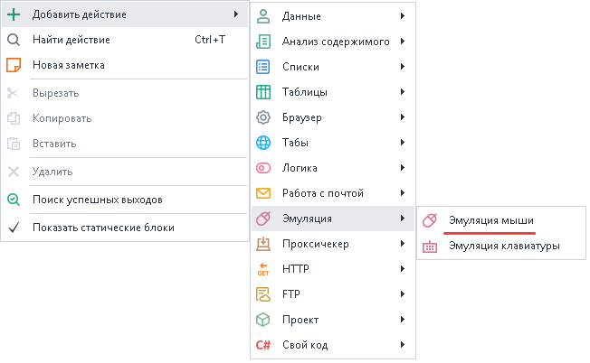
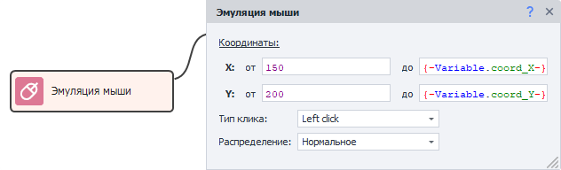
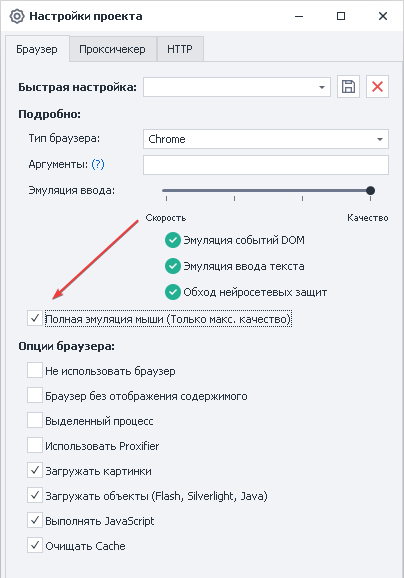
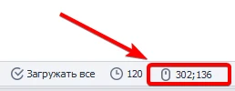
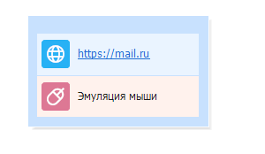

---
sidebar_position: 1
title: "Эмуляция мыши"
description: ""
date: "2025-08-04"
converted: true
originalFile: "Эмуляция мыши.txt"
targetUrl: "https://zennolab.atlassian.net/wiki/spaces/RU/pages/534315158"
---
import DisclaimerNotice from '@site/src/components/DisclaimerNotice';

<DisclaimerNotice />

> 🔗 **[Оригинальная страница](https://zennolab.atlassian.net/wiki/spaces/RU/pages/534315158)** — Источник данного материала

_______________________________________________  
## Описание
Эмуляция мыши позволяет имитировать поведение человека на сайте. Например, нажать или вызвать элемент путём наведения на него курсора.

### Как добавить действие в проект?
Через контекстное меню: **Добавить действие** → **Эмуляция** → **Эмуляция мыши**

### Для чего это используется?
- **Перемещение курсора мыши**
- **Наведение на объект**
- **Клик по элементу**. Например, когда он отрисован на [canvas](https://developer.mozilla.org/ru/docs/Web/API/Canvas_API "https://developer.mozilla.org/ru/docs/Web/API/Canvas_API") и к нему нельзя подобраться с помощью экшена [Выполнить событие](/zennoposter/ProjectMaker/Project-editor/Actions-in-ProjectMaker-Actions-Blocks/Tabs/Perform_Event).
_______________________________________________ 
## Принцип работы

### Координаты
Здесь необходимо указать точки, в пределах которых будет осуществлён клик (будет выбрана случайная позиция в пределах указанных координат).

- **X** — по горизонтали  
- **Y** — по вертикали

> *Можно указать статичные значения или динамические в виде переменных.*

:::tip Узнать координаты можно в Окне браузера
:::

### Тип клика
- *Left click* — нажатие левой кнопкой мыши.  
- *Right click* — клик правой кнопкой мыши.  
- *Double click* — эмуляция двойного нажатия.  

### Распределение
- *Нормальное* — более вероятно попадание ближе к центру объекта.  
- *Равномерное* — ровное распределение в пределах указанных координат.

### Полная эмуляция мыши
В [Настройках проекта](/zennoposter/ProjectMaker/Project-editor/Static_blocks/Project_Settings) можно централизованно включить уровень эмуляции мыши на уровне шаблона.  

Это значит, что при выполнении экшенов: [Установка значения](../Tabs/Setting_Value) и [Выполнить событие](../Tabs/Perform_Event) эмуляция мыши автоматически добавится от текущего курсора к HTML элементу, что указан в действии.  

_______________________________________________
## Пример использования
Наводим курсор мыши на элемент для появления дополнительного окна в почте mail.ru, в котором можно сменить дизайн.

1. Получаем координаты элемента и кладём их в переменные.  

2. Добавляем экшен эмуляции мыши.  

3. Указываем в кубике переменные с координатами.

Почтовый сервис старается пресечь работу ботов, но с имеющимся функционалом ZennoPoster вам это не грозит.
_______________________________________________
## Полезные ссылки
- [❗→ Окно переменных](https://zennolab.atlassian.net/wiki/spaces/RU/pages/735608872 "https://zennolab.atlassian.net/wiki/spaces/RU/pages/735608872")
- [❗→ Настройки проекта](https://zennolab.atlassian.net/wiki/spaces/RU/pages/534315477 "https://zennolab.atlassian.net/wiki/spaces/RU/pages/534315477")
- [❗→ Эмуляция клавиатуры](https://zennolab.atlassian.net/wiki/spaces/RU/pages/735608949 "https://zennolab.atlassian.net/wiki/spaces/RU/pages/735608949")
- [❗→ Поиск по картинке](https://zennolab.atlassian.net/wiki/spaces/RU/pages/492044304 "https://zennolab.atlassian.net/wiki/spaces/RU/pages/492044304")