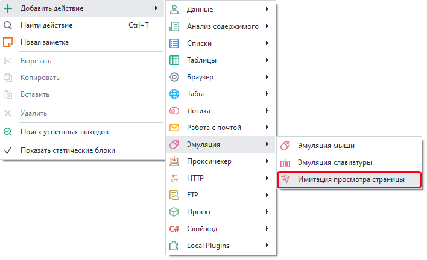
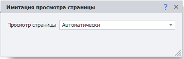
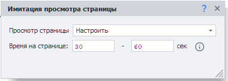

---
sidebar_position: 3
title: "Имитация просмотра страницы"
description: ""
date: "2025-08-04"
converted: true
originalFile: "Имитация просмотра страницы.txt"
targetUrl: "https://zennolab.atlassian.net/wiki/spaces/RU/pages/2076082178"
---
import DisclaimerNotice from '@site/src/components/DisclaimerNotice';

<DisclaimerNotice />

> 🔗 **[Оригинальная страница](https://zennolab.atlassian.net/wiki/spaces/RU/pages/2076082178)** — Источник данного материала

_______________________________________________  
## Описание
Это действие используется для имитации активности на странице.  

В процессе работы кубика на активной вкладке будут совершены движения мыши и скроллы со случайной скоростью и паузами. Действия будут похожи на реальные посещения страниц, которые, например, можно наблюдать в WebVisor. Логика экшена учитывает расположение HTML-элементов на странице для правдоподобности имитации.  

Работа виртуальной мыши отвязана от реального курсора на вашем компьютере, поэтому может быть выполнена в многопоточном режиме.

### Как добавить действие в проект?
Через контекстное меню: **Добавить действие** → **Эмуляция** → **Имитация просмотра страницы**

_______________________________________________ 
## Принцип работы
> Экшен следует выполнять после перехода на целевую веб-страницу.  

Существует два варианта конфигурации экшена:

### Автоматически
В данном режиме будут использованы настройки по умолчанию.  

### Настроить
А в этом режиме можно настроить время проведенное на странице.  

Фактическое время будет случайно выбрано из указанного интервала при каждом выполнении кубика.
_______________________________________________
## Ограничения
- Поддерживается **только работа в CEF (Chrome)** и Chromium.
- **Не учитывается значение ForceTouch**, поэтому не рекомендуем использовать на мобильных профилях.
- **Время указывается ориентировочное**. Иногда происходит незначительный выход за верхнюю границу. Например, вместо указанных 10 секунд кубик может исполняться 11 секунд.
_______________________________________________
## Полезные ссылки
- [❗→ Переход на страницу](https://zennolab.atlassian.net/wiki/spaces/RU/pages/534052989 "https://zennolab.atlassian.net/wiki/spaces/RU/pages/534052989")
- [❗→ Настройки веб страницы](https://zennolab.atlassian.net/wiki/spaces/RU/pages/534020228 "https://zennolab.atlassian.net/wiki/spaces/RU/pages/534020228")