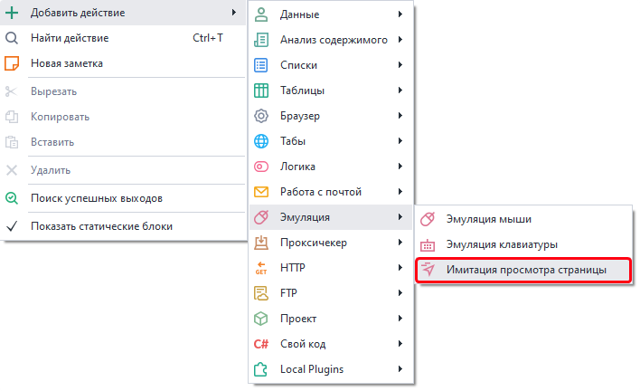
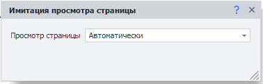
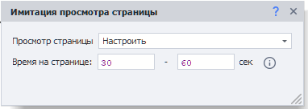

---
sidebar_position: 3
title: "Имитация просмотра страницы"
description: ""
date: "2025-08-04"
converted: true
originalFile: "Имитация просмотра страницы.txt"
targetUrl: "https://zennolab.atlassian.net/wiki/spaces/RU/pages/2076082178"
---
:::info **Пожалуйста, ознакомьтесь с [*Правилами использования материалов на данном ресурсе*](../Disclaimer).**
:::

> 🔗 **[Оригинальная страница](https://zennolab.atlassian.net/wiki/spaces/RU/pages/2076082178)** — Источник данного материала

_______________________________________________  
# Имитация просмотра страницы

  

## Описание

Это действие используется для имитации активности на странице. В процессе работы кубика на активной вкладке будут совершены движения мыши и скроллы со случайной скоростью и паузами. Действия будут похожи на те, что можно наблюдать за реальными посещениями страниц в WebVisor. Логика работы учитывает расположение html-элементов на странице, чтобы поведение максимально напоминало действия реального пользователя. Работа виртуальной мыши отвязана от реального курсора на вашем компьютере, поэтому без проблем может быть выполнена в многопоточном режиме (ZennoPoster Standard и Pro).

  

## Как добавить действие в проект?

Через контекстное меню: **Добавить действие** → **Эмуляция** → **Имитация просмотра страницы**

Либо воспользуйтесь [❗→ умным поиском](https://zennolab.atlassian.net/wiki/spaces/RU/pages/506200090/ProjectMaker+7#%D0%A3%D0%BC%D0%BD%D1%8B%D0%B9-%D0%BF%D0%BE%D0%B8%D1%81%D0%BA-%D0%B4%D0%B5%D0%B9%D1%81%D1%82%D0%B2%D0%B8%D0%B9 "https://zennolab.atlassian.net/wiki/spaces/RU/pages/506200090/ProjectMaker+7#%D0%A3%D0%BC%D0%BD%D1%8B%D0%B9-%D0%BF%D0%BE%D0%B8%D1%81%D0%BA-%D0%B4%D0%B5%D0%B9%D1%81%D1%82%D0%B2%D0%B8%D0%B9").

  

## Как работать с экшеном?

Экшен следует исполнять после перехода на целевую веб-страницу. Существует два варианта конфигурации экшена:

### Автоматически

В данном режиме будут использованы настройки по умолчанию

### Настроить

В данном режиме вы можете настроить время проведенное на странице. При выполнении, фактическое время будет случайно выбрано из указанного интервала при каждом исполнении кубика.

  

## Ограничения при работе с экшеном

1. Поддерживается только в CEF (Chrome) и Chromium.
2. Пока не учитывает значение ForceTouch, поэтому не рекомендуется к использованию в мобильных профилях.
3. Время, указанное в настройках экшена, носит ориентировочный характер. В определенных случаях может происходить незначительный выход за верхнюю границу. Например, если указать время на странице от 10 до 10 секунд, то фактически кубик может исполняться, например, 11 секунд.

  

## Полезные ссылки

- [❗→ Переход на страницу](https://zennolab.atlassian.net/wiki/spaces/RU/pages/534052989 "https://zennolab.atlassian.net/wiki/spaces/RU/pages/534052989")
- [❗→ Настройки веб страницы](https://zennolab.atlassian.net/wiki/spaces/RU/pages/534020228 "https://zennolab.atlassian.net/wiki/spaces/RU/pages/534020228")