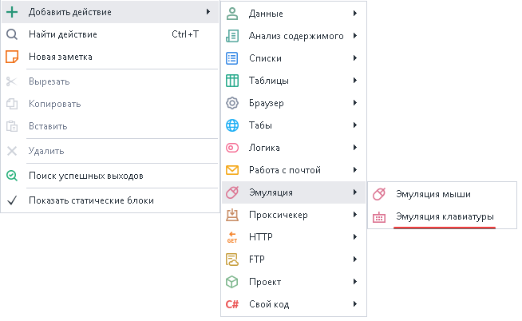
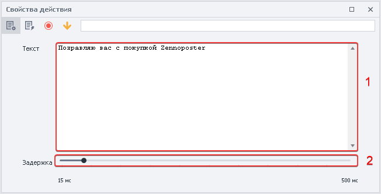
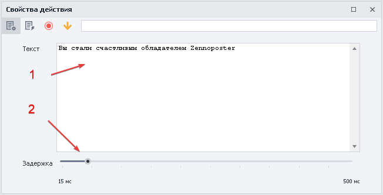
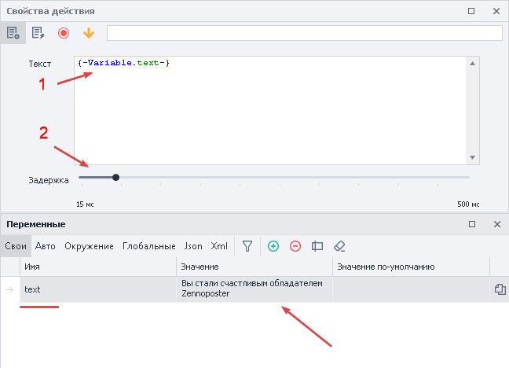
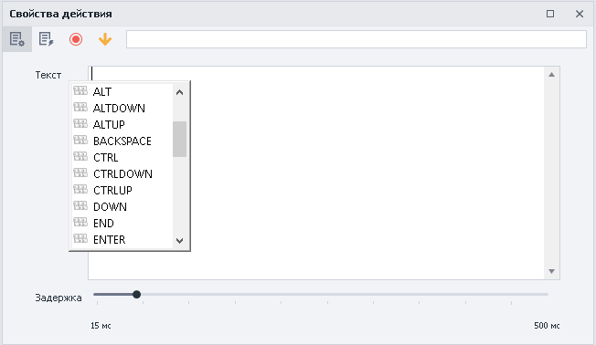
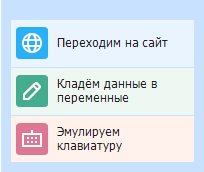

---
sidebar_position: 2
title: "Эмуляция клавиатуры"
description: ""
date: "2025-08-04"
converted: true
originalFile: "Эмуляция клавиатуры.txt"
targetUrl: "https://zennolab.atlassian.net/wiki/spaces/RU/pages/735608949"
---
:::info **Пожалуйста, ознакомьтесь с [*Правилами использования материалов на данном ресурсе*](../Disclaimer).**
:::

> 🔗 **[Оригинальная страница](https://zennolab.atlassian.net/wiki/spaces/RU/pages/735608949)** — Источник данного материала

_______________________________________________  
# Эмуляция клавиатуры

  

## Описание

Эмуляция набора текста или нажатия клавиш на сайте. 

  

## Как добавить действие в проект?

Через контекстное меню **Добавить действие** → **Эмуляция** → **Эмуляция клавиатуры**

Либо воспользуйтесь [❗→ умным поиском](https://zennolab.atlassian.net/wiki/spaces/RU/pages/506200090/ProjectMaker+7#%D0%A3%D0%BC%D0%BD%D1%8B%D0%B9-%D0%BF%D0%BE%D0%B8%D1%81%D0%BA-%D0%B4%D0%B5%D0%B9%D1%81%D1%82%D0%B2%D0%B8%D0%B9 "https://zennolab.atlassian.net/wiki/spaces/RU/pages/506200090/ProjectMaker+7#%D0%A3%D0%BC%D0%BD%D1%8B%D0%B9-%D0%BF%D0%BE%D0%B8%D1%81%D0%BA-%D0%B4%D0%B5%D0%B9%D1%81%D1%82%D0%B2%D0%B8%D0%B9").

  

## Для чего это используется?

- Заполнение полей для ввода
- Набор текста
- Эмуляция нажатия клавиш

  

## Как работать с экшеном?

### Настройка экшена

1. Поле для *текста*, [❗→ *переменных](https://zennolab.atlassian.net/wiki/spaces/RU/pages/735608872 "https://zennolab.atlassian.net/wiki/spaces/RU/pages/735608872") и *специальных клавиш*.
2. Пауза между набором символов.

:::note На заметку
Допускается использование одновременно текста, переменных и специальных клавиш.
:::

  

### Статичный текст

1. Вводим статичный текст.
2. Выставляем параметры ввода.

:::note На заметку
Текст останется неизменным на протяжении всего выполнения проекта.
:::

  

### Работа с переменными

Переменная в экшене позволит каждый раз вводить новый текст.

1. Устанавливаем необходимую переменную.
2. Фиксируем ползунок задержки.

:::note На заметку
Текст будет меняться в зависимости от содержания переменной.
:::

  

### Использование специальных клавиш

Позволяет эмулировать клавиши *Enter*, *CTRL*, *END* и тд.

1. Устанавливаем курсор мыши в поле *Текст*.
2. Нажатием горячих клавиш **CTRL + Space** вызываем контекстное меню.
3. Выбираем из списка нужную клавишу.

  

## Пример использования

Многие ресурсы научились отслеживать нажатия клавиш, поэтому для максимальной надежности можно заполнять формы через эмуляцию клавиатуры.

Это выглядит примерно так:

1. Заходим на сайт.
2. Переходим в раздел заполнения профиля.
3. Сохраняем необходимые данные в соответствующие переменные.
4. Вносим переменные в экшен эмуляции клавиатуры.
5. После установки курсора в поле ввода запускаем кубик.
6. Сайт расценивает нас как настоящего пользователя и принимает данные.

  

## Полезные ссылки

1. [❗→ Окно переменных](https://zennolab.atlassian.net/wiki/spaces/RU/pages/735608872 "https://zennolab.atlassian.net/wiki/spaces/RU/pages/735608872")
2. [❗→ Настройки проекта](https://zennolab.atlassian.net/wiki/spaces/RU/pages/534315477 "https://zennolab.atlassian.net/wiki/spaces/RU/pages/534315477")
3. [❗→ Эмуляция мыши](https://zennolab.atlassian.net/wiki/spaces/RU/pages/534315158 "https://zennolab.atlassian.net/wiki/spaces/RU/pages/534315158")