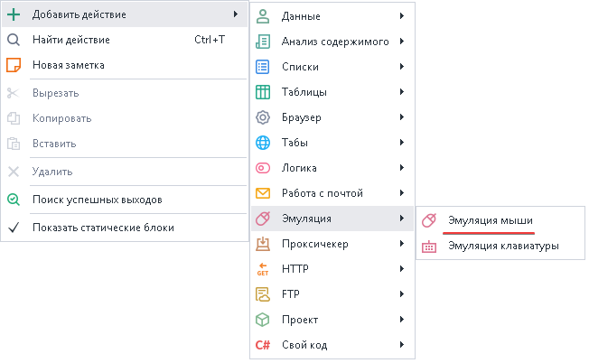
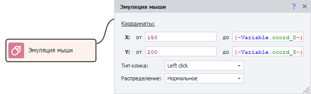
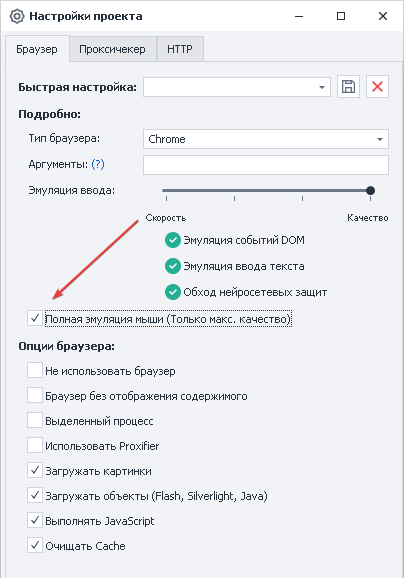
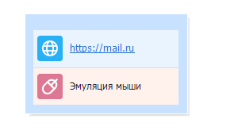

---
sidebar_position: 1
title: "Эмуляция мыши"
description: ""
date: "2025-08-04"
converted: true
originalFile: "Эмуляция мыши.txt"
targetUrl: "https://zennolab.atlassian.net/wiki/spaces/RU/pages/534315158"
---
:::info **Пожалуйста, ознакомьтесь с [*Правилами использования материалов на данном ресурсе*](../Disclaimer).**
:::

> 🔗 **[Оригинальная страница](https://zennolab.atlassian.net/wiki/spaces/RU/pages/534315158)** — Источник данного материала

_______________________________________________  
# Эмуляция мыши

  

## Описание

Эмуляция мыши позволяет обойти защиту на сайте, нажать или вызвать элемент путём наведения на него курсора.

  

## Как добавить действие в проект?

Через контекстное меню **Добавить действие** → **Эмуляция** → **Эмуляция мыши**

Либо воспользуйтесь [❗→ умным поиском](https://zennolab.atlassian.net/wiki/spaces/RU/pages/506200090/ProjectMaker+7#%D0%A3%D0%BC%D0%BD%D1%8B%D0%B9-%D0%BF%D0%BE%D0%B8%D1%81%D0%BA-%D0%B4%D0%B5%D0%B9%D1%81%D1%82%D0%B2%D0%B8%D0%B9 "https://zennolab.atlassian.net/wiki/spaces/RU/pages/506200090/ProjectMaker+7#%D0%A3%D0%BC%D0%BD%D1%8B%D0%B9-%D0%BF%D0%BE%D0%B8%D1%81%D0%BA-%D0%B4%D0%B5%D0%B9%D1%81%D1%82%D0%B2%D0%B8%D0%B9").

  

## Для чего это используется?

- Перемещение курсора мыши
- Наведение на объект
- Клик по элементу (например, когда последний отрисован на [canvas](https://developer.mozilla.org/ru/docs/Web/API/Canvas_API "https://developer.mozilla.org/ru/docs/Web/API/Canvas_API") и к нему нельзя подобраться с помощью экшена [❗→ Выполнить событие](https://zennolab.atlassian.net/wiki/spaces/RU/pages/534020211 "https://zennolab.atlassian.net/wiki/spaces/RU/pages/534020211"))

  

## Как работать с экшеном?

### Координаты

Здесь необходимо указать точки, в пределах которых будет осуществлён клик (будет выбрана случайная позиция в пределах указанных координат).

**X** - по горизонтали  
**Y** - по вертикали

:::note На заметку
Узнать координаты можно в Окне браузера.
:::

:::note На заметку
Координаты можно указывать статичные и динамические в виде переменных.
:::

### Тип клика

**Left click** - нажатие левой кнопкой мыши.  
**Right click** - клик правой кнопкой мыши.  
**Double click** - эмуляция двойного нажатия.  

### Распределение

a) **Нормальное** - более вероятно попадание ближе к центру объекта.  
b) **Равномерное** - ровное распределение в пределах указанных координат.

  

## Полная эмуляция мыши

В [❗→ настройках проекта](https://zennolab.atlassian.net/wiki/spaces/RU/pages/534315477 "https://zennolab.atlassian.net/wiki/spaces/RU/pages/534315477") можно централизованно включить уровень эмуляции мыши на уровне шаблона. Это значит, что при выполнении экшенов «[❗→ Установка значения](https://zennolab.atlassian.net/wiki/spaces/RU/pages/534315117 "https://zennolab.atlassian.net/wiki/spaces/RU/pages/534315117")» (Set) и «[❗→ Выполнить действие](https://zennolab.atlassian.net/wiki/spaces/RU/pages/534020211 "https://zennolab.atlassian.net/wiki/spaces/RU/pages/534020211")» (Rise) автоматически добавится эмуляция мыши от текущего курсора к HTML элементу, что указан в действии.

  

## Пример использования

Для смены дизайна в почте Mail необходимо навести курсор мыши на элемент, после чего откроется дополнительное окно, в котором можно сменить дизайн.

1. [❗→ Получаем координаты элемента](https://zennolab.atlassian.net/wiki/spaces/RU/pages/534315373#%D0%9A%D0%BE%D0%BE%D1%80%D0%B4%D0%B8%D0%BD%D0%B0%D1%82%D1%8B-%D0%BA%D1%83%D1%80%D1%81%D0%BE%D1%80%D0%B0-%D0%BC%D1%8B%D1%88%D0%B8 "https://zennolab.atlassian.net/wiki/spaces/RU/pages/534315373#%D0%9A%D0%BE%D0%BE%D1%80%D0%B4%D0%B8%D0%BD%D0%B0%D1%82%D1%8B-%D0%BA%D1%83%D1%80%D1%81%D0%BE%D1%80%D0%B0-%D0%BC%D1%8B%D1%88%D0%B8") и кладём их в переменные.
2. Добавляем экшен эмуляции мыши.
3. Указываем в кубике переменные с координатами.

Таким образ почтовый сервис старается пресечь работу ботов, но Вам это не грозит с имеющимся функционалом Zennoposter.

  

## Полезные ссылки

- [❗→ Окно переменных](https://zennolab.atlassian.net/wiki/spaces/RU/pages/735608872 "https://zennolab.atlassian.net/wiki/spaces/RU/pages/735608872")
- [❗→ Настройки проекта](https://zennolab.atlassian.net/wiki/spaces/RU/pages/534315477 "https://zennolab.atlassian.net/wiki/spaces/RU/pages/534315477")
- [❗→ Эмуляция клавиатуры](https://zennolab.atlassian.net/wiki/spaces/RU/pages/735608949 "https://zennolab.atlassian.net/wiki/spaces/RU/pages/735608949")
- [❗→ Поиск по картинке](https://zennolab.atlassian.net/wiki/spaces/RU/pages/492044304 "https://zennolab.atlassian.net/wiki/spaces/RU/pages/492044304")