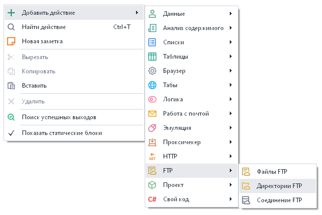
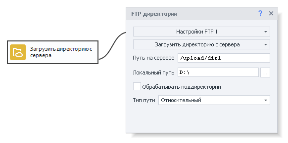
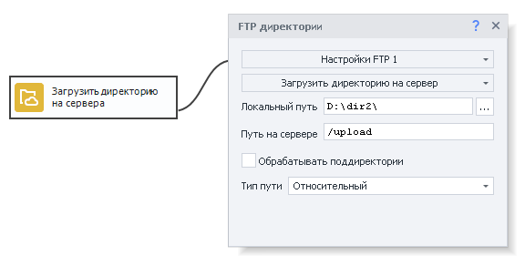
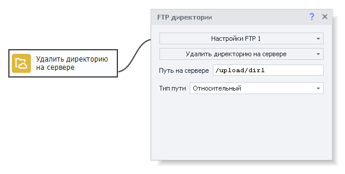
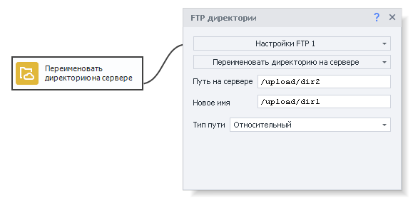
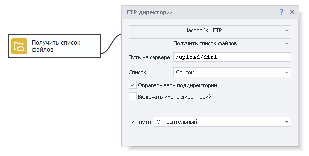
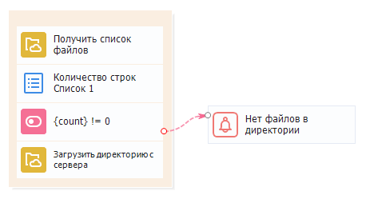

---
sidebar_position: 2
title: "Директории FTP"
description: ""
date: "2025-08-04"
converted: true
originalFile: "Директории FTP.txt"
targetUrl: "https://zennolab.atlassian.net/wiki/spaces/RU/pages/534085901/FTP"
---
import DisclaimerNotice from '@site/src/components/DisclaimerNotice';

<DisclaimerNotice />

> 🔗 **[Оригинальная страница](https://zennolab.atlassian.net/wiki/spaces/RU/pages/534085901/FTP)** — Источник данного материала

_______________________________________________  
## Описание
Данный экшен позволяет вам работать с директориями, а именно:  
- ***Скачать** директорию с файлами данных проекта, которая находится на FTP-сервере;*  
- ***Загрузить** директорию с данными проекта на FTP-сервер;*  
- ***Удалить** директорию с файлами из сервера;*  
- ***Получить** список рабочих файлов, которые находятся в определенной директории;*  
- ***Переименовать** директорию на сервере.*  

### Как добавить действие в проект?
Через контекстное меню: **Добавить действие → FTP → директории FTP**

_______________________________________________ 
## Принцип работы
> *Для работы с этим экшеном нужно сначала [настроить FTP соединение](/zennoposter/ProjectMaker/Project-editor/Static_blocks/FTP_Settings).* 

Экшен имеет следующие основные настройки:

- **Путь на сервере** — путь к нужному файлу на сервере.
- **Локальный путь** — путь на вашем компьютере, куда необходимо сохранить скачанный файл.
- **Тип пути** — *относительный* (относительно текущей папки) или *абсолютный* (от корня системы) путь на сервере.
- **Обрабатывать поддиректории** — учитывать при работе также вложенные в основную директории.

### Загрузить директорию с сервера
Позволяет скачать директорию с сервера на свой компьютер.

### Загрузить директорию на сервер
Загружает директорию с вашего компьютера на сервер.

### Удалить директорию на сервере
Удаляет директорию с сервера.  

> Необходимо указать к ней путь.  

### Переименовать директорию на сервере
Нужен для изменения имени директории на сервере.  

> Указываем путь к директории и ее новое имя.
### Получить список файлов
Используется для получения списка файлов, содержащихся в определённой директории на сервере.  

> Необходимо указать [Список](/zennoposter/ProjectMaker/Project-editor/Actions-in-ProjectMaker-Actions-Blocks/Lists/List_Operations), в который будут сохраняться имена файлов.

#### Включать имена директорий 
Это настройка позволяет включать в итоговый список файлов имена директорий, содержащихся в основной директории.  
_______________________________________________ 
## Пример использования
### Скачиваем папку с файлами
  

**1.** Проверяем есть ли файлы в директории на FTP сервере.   
**2.** Если директория не пустая, то скачиваем ее для дальнейшей работы.  
**3.** Получаем список файлов.  
**4.** Если строк в списке больше 0, то скачиваем все файлы с FTP-сервера и работаем с ними.  
**5.** Когда строки заканчиваются, выводим уведомление об этом и завершаем работу.  
