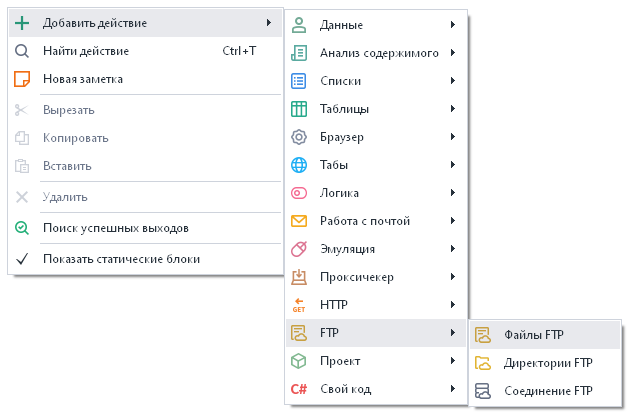
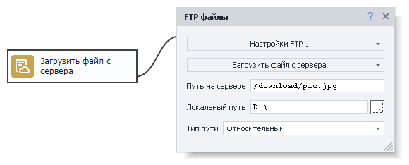
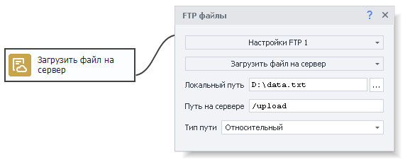
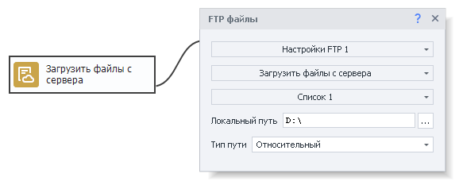
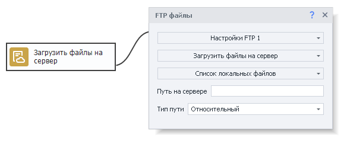
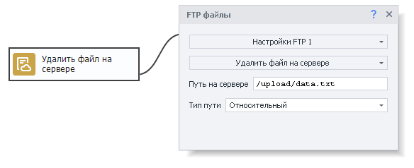
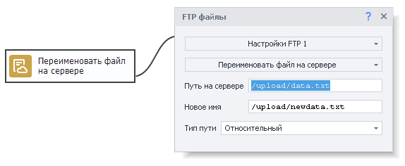
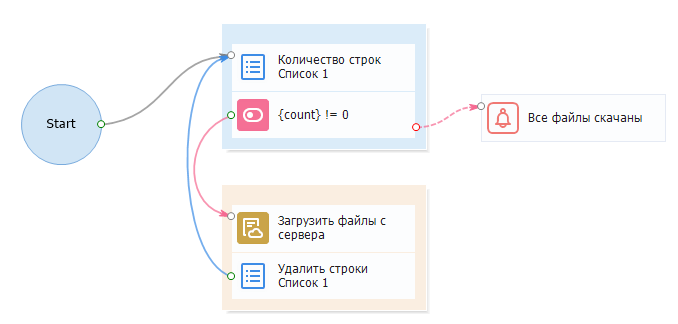

---
sidebar_position: 1
title: "Файлы FTP"
description: ""
date: "2025-08-04"
converted: true
originalFile: "Файлы FTP.txt"
targetUrl: "https://zennolab.atlassian.net/wiki/spaces/RU/pages/534315197/FTP"
---
import DisclaimerNotice from '@site/src/components/DisclaimerNotice';

<DisclaimerNotice />

> 🔗 **[Оригинальная страница](https://zennolab.atlassian.net/wiki/spaces/RU/pages/534315197/FTP)** — Источник данного материала

_______________________________________________  
## Описание
В ZennoPoster есть встроенные возможности для работы с FTP-ресурсами. Вы можете автоматически загружать файлы на FTP-сервер, создавать и удалять директории, а так же производить другие операции. Это удобно, когда файлы ваших проектов хранятся на FTP-сервере.  

Данный экшен позволяет вам работать с файлами, а именно:  
- ***Загрузить один** файл С или НА сервер;*  
- ***Загрузить несколько** файлов С или на сервер;*  
- ***Удалить** один или несколько файлов с сервера;*  
- ***Переименовать** файл на сервере.*  

### Как добавить действие в проект?
Через контекстное меню: **Добавить действие** → **FTP** → **файлы FTP**

_______________________________________________
## Принцип работы
> *Для работы с этим экшеном нужно сначала [настроить FTP соединение](/zennoposter/ProjectMaker/Project-editor/Static_blocks/FTP_Settings).* 

Экшен имеет следующие основные настройки:

- **Путь на сервере** — путь к нужному файлу на сервере.
- **Локальный путь** — путь на вашем компьютере, куда необходимо сохранить скачанный файл.
- **Тип пути** — *относительный* (относительно текущей папки) или *абсолютный* (от корня системы) путь на сервере.

### Загрузить файл с сервера
Позволяет скачать файл с сервера на свой компьютер.

### Загрузить файл на сервер
Загружает файл с вашего компьютера на сервер.

### Загрузить файлы с сервера
Нужен для скачивания нескольких файлов с сервера на компьютер.

> Пути к файлам указываются в [Списке](/zennoposter/ProjectMaker/Project-editor/Actions-in-ProjectMaker-Actions-Blocks/Lists/List_Operations). За один проход экшена берется только одна строка с путем из списка.

### Загрузить файлы на сервер
Используется для загрузки нескольких файлов с компьютера на сервер.  

> Пути к файлам указываются в [Списке](/zennoposter/ProjectMaker/Project-editor/Actions-in-ProjectMaker-Actions-Blocks/Lists/List_Operations). За один проход экшена берется только одна строка с путем из списка.

### Удалить файл на сервере
Удаляет файл с сервера. 

> Необходимо указать к нему путь.

### Переименовать файл на сервере
Нужен для изменения имени файла на сервере.  

> Указываем путь к файлу и его новое имя.
_______________________________________________
## Пример использования  
### Скачиваем файлы с FTP-сервера по списку

Пути к файлам, которые нам нужно скачать, хранятся в списке.  
**1.** Получаем количество строк из списка.   
**2.** Если список не пустой, то скачиваем файл с FTP-сервера.  
**3.** Затем удаляем строку, которая содержит путь к уже скачанному файлу.  
**4.** Возвращаемся в начало цикла (к 1 шагу).  
**5.** Как только строк в списке не останется, выводим оповещение о том, что все файлы скачаны.