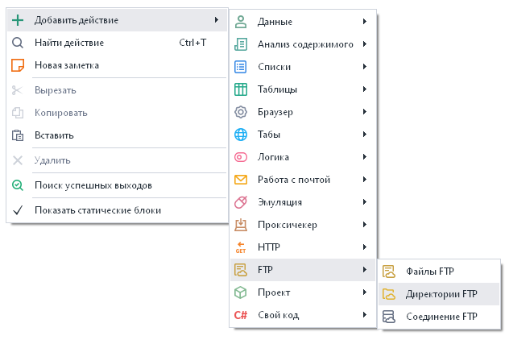
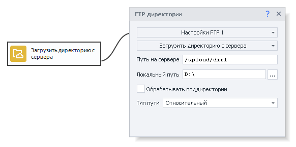
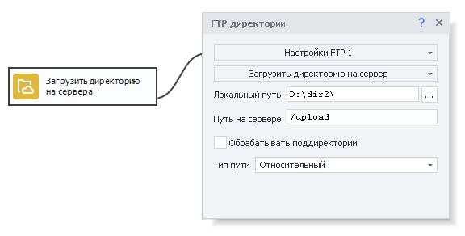
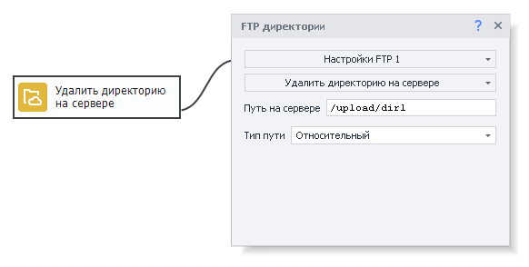
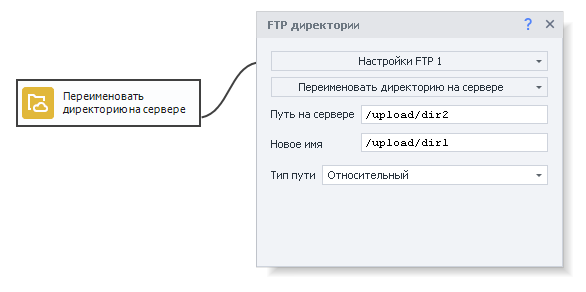
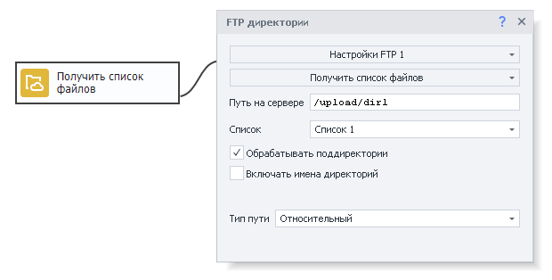
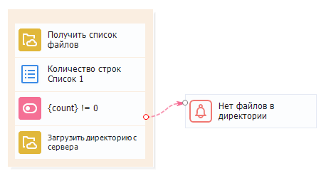

---
sidebar_position: 2
title: "Директории FTP"
description: ""
date: "2025-08-04"
converted: true
originalFile: "Директории FTP.txt"
targetUrl: "https://zennolab.atlassian.net/wiki/spaces/RU/pages/534085901/FTP"
---
:::info **Пожалуйста, ознакомьтесь с [*Правилами использования материалов на данном ресурсе*](../Disclaimer).**
:::

> 🔗 **[Оригинальная страница](https://zennolab.atlassian.net/wiki/spaces/RU/pages/534085901/FTP)** — Источник данного материала

_______________________________________________  
# Директории FTP

## Описание

Для работы с директориями на FTP сервере используется экшен «Директории FTP». С его помощью можно:

- Загрузить директорию с FTP сервера.
- Загрузить директорию на сервер.
- Удалить директорию на сервере.
- Переименовать директорию на сервере.
- Получить список файлов.

## Как добавить действие в проект?

Через контекстное меню **Добавить действие → FTP → директории FTP**

Либо воспользуйтесь [❗→ умным поиском](https://zennolab.atlassian.net/wiki/spaces/RU/pages/506200090/ProjectMaker+7#%D0%A3%D0%BC%D0%BD%D1%8B%D0%B9-%D0%BF%D0%BE%D0%B8%D1%81%D0%BA-%D0%B4%D0%B5%D0%B9%D1%81%D1%82%D0%B2%D0%B8%D0%B9 "https://zennolab.atlassian.net/wiki/spaces/RU/pages/506200090/ProjectMaker+7#%D0%A3%D0%BC%D0%BD%D1%8B%D0%B9-%D0%BF%D0%BE%D0%B8%D1%81%D0%BA-%D0%B4%D0%B5%D0%B9%D1%81%D1%82%D0%B2%D0%B8%D0%B9").

## Для чего это используется?

- Скачать директорию с файлами данных проекта, которая находятся на FTP сервере.
- Сохранить данные проекта на FTP сервер.
- Удалить директорию с файлами данных проекта с FTP сервера.
- Получить список рабочих файлов данных проекта, находящихся в определённой директории.

## Как работать с экшеном?

Для того чтобы начать работать с данным экшеном, необходимо произвести настройки FTP соединения. Как это сделать, описано в статье [❗→ Настройки FTP](https://zennolab.atlassian.net/wiki/spaces/RU/pages/534315484/FTP "https://zennolab.atlassian.net/wiki/spaces/RU/pages/534315484/FTP").

Экшен имеет следующие основные настройки:

- Путь на сервере - путь к нужной директории на сервере.
- Локальный путь - путь на своём компьютере, где необходимо сохранить скачанную директорию.
- Тип пути - Относительный или абсолютный путь на сервере. При относительном - путь будет строиться относительно текущей папки, при абсолютном - путь указывается от корня системы.
- Обрабатывать поддиректории - учитывать при работе поддиректории, если они есть в основной директории.

### Загрузить директорию с сервера

Используется для загрузки директории с сервера на свой компьютер.

  

### Загрузить директорию на сервер

Используется для загрузки файла со своего компьютера на сервер.

  

### Удалить директорию на сервере

Используется для удаления директории на сервере. Необходимо указать путь к директории.

  

### Переименовать директорию на сервере

Используется если необходимо переименовать директорию на сервере. Необходимо указать путь к директории и новое имя директории.

  

### Получить список файлов

Используется если необходимо получить список файлов, содержащихся в определённой директории на сервере. Необходимо указать список, в который будут сохраняться имена файлов. Работа со списком описана в статье [❗→ Список](https://zennolab.atlassian.net/wiki/spaces/RU/pages/534053375 "https://zennolab.atlassian.net/wiki/spaces/RU/pages/534053375"). Дополнительная настройка “Включать имена директорий“ позволяет включать в итоговый список файлов имена директорий, содержащихся в основной директории.

  

## Пример использования

### Скачиваем папку с файлами

Проверяем есть ли файлы в директории на FTP сервере, и если она не пустая, то скачиваем её для дальнейшей работы.

Получаем список файлов в список, проверяем количество строк в списке, если строк &gt; 0, то загружаем все файлы с FTP сервера и работаем с ними дальше. Если количество строк 0, то выводим соответствующее уведомление и завершаем работу.

