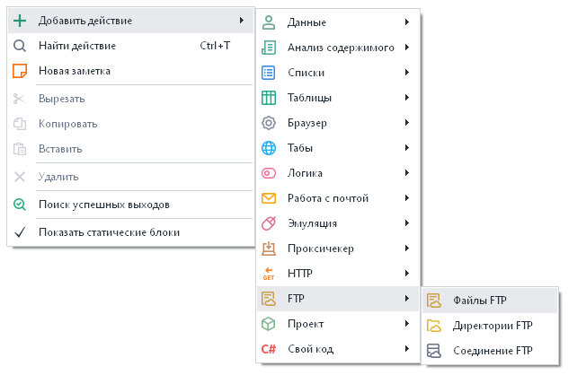
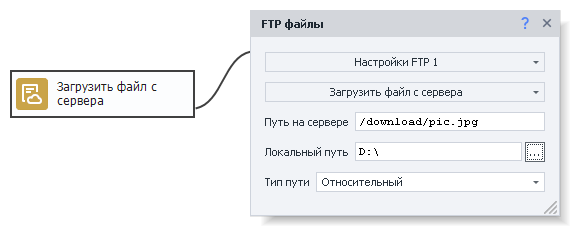
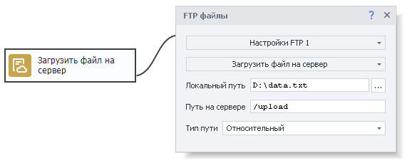
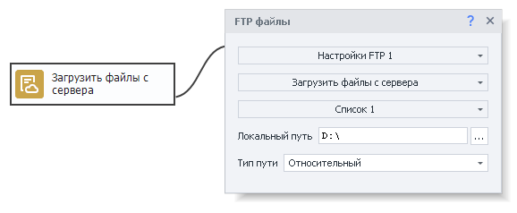
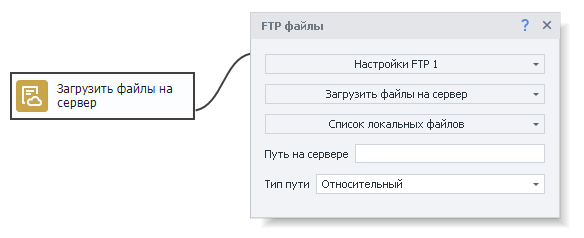
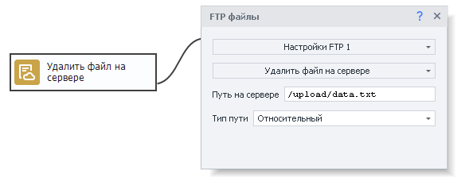
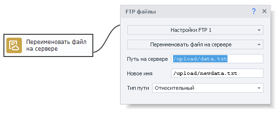
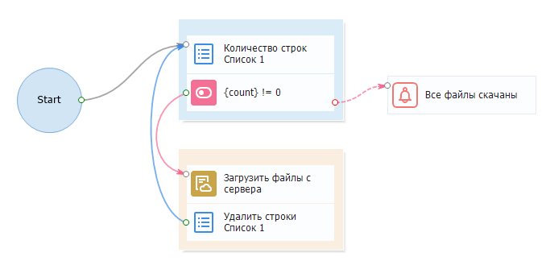

---
sidebar_position: 1
title: "Файлы FTP"
description: ""
date: "2025-08-04"
converted: true
originalFile: "Файлы FTP.txt"
targetUrl: "https://zennolab.atlassian.net/wiki/spaces/RU/pages/534315197/FTP"
---
:::info **Пожалуйста, ознакомьтесь с [*Правилами использования материалов на данном ресурсе*](../Disclaimer).**
:::

> 🔗 **[Оригинальная страница](https://zennolab.atlassian.net/wiki/spaces/RU/pages/534315197/FTP)** — Источник данного материала

_______________________________________________  
# Файлы FTP

## Описание

Для работы с файлами на FTP сервере используется экшен «Файлы FTP». С его помощью можно:

- Загрузить файл с сервера.
- Загрузить файл на сервер.
- Загрузить файлы с сервера.
- Загрузить файлы на сервер.
- Удалить файл на сервере.
- Переименовать файл на сервере.

## Как добавить действие в проект?

Через контекстное меню **Добавить действие** → **FTP** → **файлы FTP**

Либо воспользуйтесь [❗→ умным поиском](https://zennolab.atlassian.net/wiki/spaces/RU/pages/506200090/ProjectMaker+7#%D0%A3%D0%BC%D0%BD%D1%8B%D0%B9-%D0%BF%D0%BE%D0%B8%D1%81%D0%BA-%D0%B4%D0%B5%D0%B9%D1%81%D1%82%D0%B2%D0%B8%D0%B9 "https://zennolab.atlassian.net/wiki/spaces/RU/pages/506200090/ProjectMaker+7#%D0%A3%D0%BC%D0%BD%D1%8B%D0%B9-%D0%BF%D0%BE%D0%B8%D1%81%D0%BA-%D0%B4%D0%B5%D0%B9%D1%81%D1%82%D0%B2%D0%B8%D0%B9").

## Для чего это используется?

- Скачать файлы данных проекта, которые находятся на FTP сервере.
- Сохранить данные проекта на FTP сервер.
- Удалить файлы данных проекта с FTP сервера.
- Переименовать файлы на FTP сервере.

## Как работать с экшеном?

Для того чтобы начать работать с данным экшеном, необходимо произвести настройки FTP соединения. Как это сделать, описано в статье [❗→ Настройки FTP](https://zennolab.atlassian.net/wiki/spaces/RU/pages/534315484/FTP "https://zennolab.atlassian.net/wiki/spaces/RU/pages/534315484/FTP").

Экшен имеет следующие основные настройки:

- Путь на сервере - путь к нужному файлу на сервере.
- Локальный путь - путь на своём компьютере, где необходимо сохранить скачанный файл.
- Тип пути - Относительный или абсолютный путь на сервере. При относительном - путь будет строиться относительно текущей папки, при абсолютном - путь указывается от корня системы.

### Загрузить файл с сервера

Используется для загрузки файла с сервера на свой компьютер.

  

### Загрузить файл на сервер

Используется для загрузки файла со своего компьютера на сервер.

  

### Загрузить файлы с сервера

Используется для загрузки нескольких файлов с сервера на свой компьютер. Пути к файлам необходимо указать в списке. Работа со списком описана в статье [❗→ Список](https://zennolab.atlassian.net/wiki/spaces/RU/pages/534053375 "https://zennolab.atlassian.net/wiki/spaces/RU/pages/534053375"). За один проход берётся одна строка из списка, содержащая путь к файлу.

  

### Загрузить файлы на сервер

Используется для загрузки нескольких файлов со своего компьютера на сервер. Пути к файлам необходимо указать в списке. Работа со списком описана в статье [❗→ Список](https://zennolab.atlassian.net/wiki/spaces/RU/pages/534053375 "https://zennolab.atlassian.net/wiki/spaces/RU/pages/534053375"). За один проход берётся одна строка из списка, содержащая путь к файлу.

  

### Удалить файл на сервере

Используется для удаления файла на сервере. Необходимо указать путь к файлу.

  

### Переименовать файл на сервере

Используется если необходимо переименовать файл на сервере. Необходимо указать путь к файлу и новое имя файла.

  

## Пример использования

### Скачать файлы с FTP по списку

В списке находятся пути к файлам, которые необходимо скачать с FTP сервера.

1. Получаем количество строк в списке.
2. Если список не пустой, то загружаем с FTP сервера файл из списка
3. Удаляем строку содержащую скачанный файл из списка
4. Переходим к началу цикла (шаг 1).
5. Как только количество строк станет 0, выводим оповещение о том, что все файлы скачаны.

