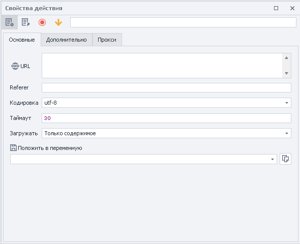
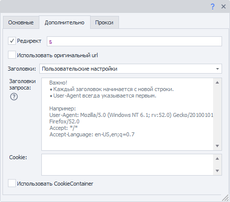
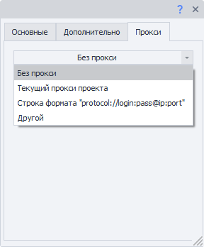

:::info **Пожалуйста, ознакомьтесь с [*Правилами использования материалов на данном ресурсе*](../Disclaimer).**
:::

> 🔗 **[Оригинальная страница](https://zennolab.atlassian.net/wiki/spaces/RU/pages/534315165/GET-)** — Источник данного материала

_______________________________________________  
# GET-запрос

  

## Описание

ZennoPoster позволяет использовать [❗→ HTTP запросы](https://zennolab.atlassian.net/wiki/spaces/RU/pages/534085713 "https://zennolab.atlassian.net/wiki/spaces/RU/pages/534085713") при работе с различными сайтами. Вы можете получать данные **GET** запросами, например, запрашивать результаты поиска по запросу в поисковой системе, скачивать файлы, парсить данные, работать с API веб-сервисов и приложений. 




  

## Как добавить экшен в проект?

Через контекстное меню **Добавить действие** → **HTTP** → **GET-запрос**


Либо воспользуйтесь [❗→ умным поиском](https://zennolab.atlassian.net/wiki/spaces/RU/pages/506200090/ProjectMaker+7#%D0%A3%D0%BC%D0%BD%D1%8B%D0%B9-%D0%BF%D0%BE%D0%B8%D1%81%D0%BA-%D0%B4%D0%B5%D0%B9%D1%81%D1%82%D0%B2%D0%B8%D0%B9 "https://zennolab.atlassian.net/wiki/spaces/RU/pages/506200090/ProjectMaker+7#%D0%A3%D0%BC%D0%BD%D1%8B%D0%B9-%D0%BF%D0%BE%D0%B8%D1%81%D0%BA-%D0%B4%D0%B5%D0%B9%D1%81%D1%82%D0%B2%D0%B8%D0%B9").

  

## Для чего это используется?

- Работа шаблонов без браузера
- Быстрый способ получения данных с сайта
- Скачивать файлы
- Работа с API сервисов

  

## Как работать с экшеном: Вкладка “Основные”


### URL

Адрес сайта, по которому будет отправлен запрос, можно использовать [❗→ переменную](https://zennolab.atlassian.net/wiki/spaces/RU/pages/486309922 "https://zennolab.atlassian.net/wiki/spaces/RU/pages/486309922").

### Referer

Заголовок запроса [*Referer*](https://developer.mozilla.org/ru/docs/Web/HTTP/Headers/Referer "https://developer.mozilla.org/ru/docs/Web/HTTP/Headers/Referer") содержит URL исходной страницы, с которой был осуществлён переход на текущую страницу. Заголовок *Referer позволяет серверу узнать откуда был осуществлён переход на запрашиваемую страницу. 
Можно использовать [❗→ макросы переменных](https://zennolab.atlassian.net/wiki/spaces/RU/pages/486309922 "https://zennolab.atlassian.net/wiki/spaces/RU/pages/486309922").

### Кодировка

Кодировка, в которой будет отправлен запрос.

### Таймаут

Максимальное время ожидания ответа от сайта в секундах. При достижении установленного времени, действие будет завершено ошибкой и выйдет по красной ветке.
Можно использовать [❗→ макросы переменных](https://zennolab.atlassian.net/wiki/spaces/RU/pages/486309922 "https://zennolab.atlassian.net/wiki/spaces/RU/pages/486309922").

### Загружать

#### Только содержимое

В переменную будет сохранено только тело ответа

<details>
<summary>Пример ответа при запросе https://httpbin.org/get</summary>

```json
{
  "args": {}, 
  "headers": {
    "Accept": "text/html,application/xhtml+xml,application/xml;q=0.9,image/avif,image/webp,image/apng,*/*;q=0.8,application/signed-exchange;v=b3;q=0.9", 
    "Accept-Encoding": "gzip, deflate", 
    "Accept-Language": "en-US,en;q=0.8", 
    "Host": "httpbin.org", 
    "Referer": "https://google.com", 
    "User-Agent": "Mozilla/5.0 (Windows NT 10.0; Win64; x64) AppleWebKit/537.36 (KHTML, like Gecko) Chrome/87.0.4280.141 Safari/537.36", 
    "X-Amzn-Trace-Id": "Root=1-26erb44t-465basaw0z2qwbji492yh5t3"
  }, 
  "origin": "1.2.3.4", 
  "url": "https://httpbin.org/get"
}
```


</details>
#### Только заголовки

Будут сохранены только заголовки ответа

<details>
<summary>Пример ответа при запросе https://httpbin.org/get</summary>
```text
HTTP/1.1 200 OK
Date: Sat, 23 May 2020 01:56:45 GMT
Content-Type: application/json
Content-Length: 613
Connection: keep-alive
Server: gunicorn/19.9.0
Access-Control-Allow-Origin: *
Access-Control-Allow-Credentials: true

```
</details>


#### Заголовки и содержимое

В переменную будут сохранены и заголовок ответа, и его тело. Разделены они будут двумя пустыми строками.

<details>
<summary>Пример ответа при запросе https://httpbin.org/get</summary>


```json
HTTP/1.1 200 OK
Date: Sat, 23 May 2020 01:56:45 GMT
Content-Type: application/json
Content-Length: 613
Connection: keep-alive
Server: gunicorn/19.9.0
Access-Control-Allow-Origin: 
Access-Control-Allow-Credentials: true

HTTP/1.1 200 OK
Date: Sat, 23 May 2020 01:56:45 GMT
Content-Type: application/json
Content-Length: 613
Connection: keep-alive
Server: gunicorn/19.9.0
Access-Control-Allow-Origin: *
Access-Control-Allow-Credentials: true


{
  "args": {}, 
  "headers": {
    "Accept": "text/html,application/xhtml+xml,application/xml;q=0.9,image/avif,image/webp,image/apng,*/*;q=0.8,application/signed-exchange;v=b3;q=0.9", 
    "Accept-Encoding": "gzip, deflate", 
    "Accept-Language": "en-US,en;q=0.8", 
    "Host": "httpbin.org", 
    "Referer": "https://google.com", 
    "User-Agent": "Mozilla/5.0 (Windows NT 10.0; Win64; x64) AppleWebKit/537.36 (KHTML, like Gecko) Chrome/87.0.4280.141 Safari/537.36", 
    "X-Amzn-Trace-Id": "Root=1-26erb44t-465basaw0z2qwbji492yh5t3"
  }, 
  "origin": "1.2.3.4", 
  "url": "https://httpbin.org/get"
}
```
</details>

#### Как файл

Этот режим стоит выбирать, если Вы пытаетесь скачать файл с помощью запроса.

В переменную сохранится путь к скачанному файлу.

:::note На заметку
По умолчанию файлы скачиваются в папку `Trash` в директории установленного ZennoPoster. Путь к ней может выглядеть так - `C:\Program Files\ZennoLab\RU\ZennoPoster Pro V7\7.4.0.0\Progs\Trash\googlelogo\_color\_92x30dp.png`. Изменить этот путь можно в настройках, глобально для всех проектов. Или с помощью экшена во время выполнения шаблона.
:::

#### Как файл + заголовки

В переменную сохранятся заголовки ответа и путь к скачанному файлу.

### Положить в переменную

Здесь надо выбрать (или создать новую) переменную, в которую будет сохранён результат запроса.

  

## Как работать с экшеном: Вкладка “Дополнительно”




### Редирект

Установить перенаправление - если ответ на запрос будет содержать код редиректа (пример. ответа 301, 302), Zennoposter используя заголовок *Location, перейдёт к следующей странице. Цифрами указываем максимальное количество переходов: 0 - остаться на исходной странице , 5 - количество переходов до конечного url.

### Использовать оригинальный URL

Отмена кодирования URL из вкладки "Основное" в urlencode.  
Пример:  
*Оригинальный url*: `https://ru.wikipedia.org/wiki/Приветствие`  
*По умолчанию*: `https://ru.wikipedia.org/wiki/%D0%9F%D1%80%D0%B8%D0%B2%D0%B5%D1%82%D1%81%D1%82%D0%B2%D0%B8%D0%B5`  

### Заголовки

#### Использовать по умолчанию

В запрос будут подставлены заголовки по умолчанию. Вот как они выглядят (на примере запроса к `https://httpbin.org/get`, заголовок `Host` будет меняться в зависимости от URL адреса в запросе)

```text
Host: httpbin.org
User-Agent: Mozilla/5.0 (Windows NT 10.0; WOW64; rv:45.0) Gecko/20100101 Firefox/45.0
Accept: text/html,application/xhtml+xml,application/xml;q=0.9,*/*;q=0.8
Accept-Encoding: gzip, deflate
Accept-Language: en-US,en;q=0.5
```

#### Текущий профиль

Будут подставлены заголовки из текущего [❗→ профиля проекта](https://zennolab.atlassian.net/wiki/spaces/RU/pages/483426308 "https://zennolab.atlassian.net/wiki/spaces/RU/pages/483426308").

#### Загрузить из профиля

Необходимо выбрать файл или указать [❗→ переменную](https://zennolab.atlassian.net/wiki/spaces/RU/pages/486309922 "https://zennolab.atlassian.net/wiki/spaces/RU/pages/486309922") содержащую путь до [❗→ профиля](https://zennolab.atlassian.net/wiki/spaces/RU/pages/483426308 "https://zennolab.atlassian.net/wiki/spaces/RU/pages/483426308") из которого будут загружены заголовки для запроса.

#### Пользовательские настройки

Позволяет самостоятельно указать каждый параметр заголовка запроса.

##### **Заголовки запроса**

:::warning Внимание
Первой всегда () указывается строка User-Agent! И только потом все остальные заголовки.
:::

- Каждый заголовок начинается с новой строчки.
- Можно указать *статичные значения*, свои [❗→ *переменные*](https://zennolab.atlassian.net/wiki/spaces/RU/pages/486309922 "https://zennolab.atlassian.net/wiki/spaces/RU/pages/486309922") или [❗→ *переменные профиля*](https://zennolab.atlassian.net/wiki/spaces/RU/pages/735608872#%D0%9F%D1%80%D0%BE%D1%84%D0%B8%D0%BB%D1%8C "https://zennolab.atlassian.net/wiki/spaces/RU/pages/735608872#%D0%9F%D1%80%D0%BE%D1%84%D0%B8%D0%BB%D1%8C").

##### **Cookie**


Можно указать готовые куки или из [❗→ переменной](https://zennolab.atlassian.net/wiki/spaces/RU/pages/486309922 "https://zennolab.atlassian.net/wiki/spaces/RU/pages/486309922").

Формат: `имя=значение` , несколько разделяются с помощью `;`(точка с запятой). Пример:

```text
user=1992103;session=f79fcadd847b80f9df78ba4fb276c867;id=889
```


:::note На заметку
Начиная с версии 7.1.6.0 (5.45.0.0) данное поле ввода отображается только в том случае, если вЫключена настройка Использовать CookieContainer (описан далее).
:::

##### **Использовать CookieContainer**

CookieContainer позволяет синхронизировать куки как с браузером, так и между отдельными запросами, без необходимости их ручного парсинга и подстановки.

<details>
<summary>Пример</summary>

Проект работает с сайтом используя запросы, но для работы нужно быть авторизованным. Представим, что процесс авторизации очень сложный, чтоб его повторить на запросах, поэтому, для входа на сайт используем браузерный режим.

Затем [❗→ отключаем браузер](https://zennolab.atlassian.net/wiki/spaces/RU/pages/489324572#%D0%97%D0%B0%D0%BF%D1%83%D1%81%D1%82%D0%B8%D1%82%D1%8C-%D0%B8%D0%BD%D1%81%D1%82%D0%B0%D0%BD%D1%81 "https://zennolab.atlassian.net/wiki/spaces/RU/pages/489324572#%D0%97%D0%B0%D0%BF%D1%83%D1%81%D1%82%D0%B8%D1%82%D1%8C-%D0%B8%D0%BD%D1%81%D1%82%D0%B0%D0%BD%D1%81") и начинаем работать с сайтом используя запросы. Включив настройку *Использовать CookieContainer* куки будут автоматически синхронизированы между браузером и запросами, Вам не надо ничего вручную делать - cookies будут подставлены автоматически.
И если при одном из запросов сайт вернёт новое значение для одной или нескольких кук, то эти новые значения будут автоматически синхронизированы. И при выполнении следующего запроса (или при открытии сайта через встроенный браузер) будет использовано обновлённое значение.

</details>
### Пример Пользовательских настроек

Используя переменные профиля для заголовков и ручную подстановку кук.


* * *

## Как работать с экшеном: Вкладка “Прокси”




### Без прокси

Работа экшена происходит используя реальный ip компьютера\сервера.

### Текущий прокси проекта

Используется [❗→ установленный в проекте прокси](https://zennolab.atlassian.net/wiki/spaces/RU/pages/489324572#%D0%A3%D1%81%D1%82%D0%B0%D0%BD%D0%BE%D0%B2%D0%B8%D1%82%D1%8C-%D0%BF%D1%80%D0%BE%D0%BA%D1%81%D0%B8 "https://zennolab.atlassian.net/wiki/spaces/RU/pages/489324572#%D0%A3%D1%81%D1%82%D0%B0%D0%BD%D0%BE%D0%B2%D0%B8%D1%82%D1%8C-%D0%BF%D1%80%D0%BE%D0%BA%D1%81%D0%B8").

### Строка формата


Указываем прокси в формате (можно указать [❗→ переменную](https://zennolab.atlassian.net/wiki/spaces/RU/pages/486309922 "https://zennolab.atlassian.net/wiki/spaces/RU/pages/486309922")): 
a) *С авторизацией* - `socks5://логин:пароль@ip:port` или `http://логин:пароль@ip:port`  
b) *Без авторизации* - `socks5://ip:port` или `http://ip:port`  
c) *Без указания протокола* (по умолчанию будет использован http://)- `логин:пароль@ip:port` или `ip:port`  

### Другой


Выбираем если необходимо указать детальные настройки прокси. Тип прокси, данные авторизации, адрес и порт. Информацию уточняйте у своего поставщика услуг.

:::note На заметку
Во всех полях ввода можно использовать переменные.
:::

:::warning Внимание
Если не указан протокол прокси, то по умолчанию будет использоваться http://
:::

  

## Создание экшенов из запросов монитора трафика

:::info Информация
Добавлено в ZennoPoster 7.1.5.0 (5.44.0.0)
:::

Готовый HTTP-запрос можно создать прямо из [❗→ Окна Трафика](https://zennolab.atlassian.net/wiki/spaces/RU/pages/735805465 "https://zennolab.atlassian.net/wiki/spaces/RU/pages/735805465").


1. Наводим курсор на нужный запрос и правой кнопкой мыши вызываем контекстное меню.
2. Нажимаем *Создать действие из запроса*.

На холсте проекта появится полностью заполненный экшен HTTP-запроса.


Измените статические значение или замените на перемененные - экшен полностью готов к работе.

  

## Выключение браузера

Если Вы работаете исключительно с помощью запросов, то можно отключить браузер, тем самым сэкономив ресурсы компьютера; сделать это можно либо в [❗→ настройках проекта](https://zennolab.atlassian.net/wiki/spaces/RU/pages/534315477#%D0%9D%D0%B5-%D0%B8%D1%81%D0%BF%D0%BE%D0%BB%D1%8C%D0%B7%D0%BE%D0%B2%D0%B0%D1%82%D1%8C-%D0%B1%D1%80%D0%B0%D1%83%D0%B7%D0%B5%D1%80 "https://zennolab.atlassian.net/wiki/spaces/RU/pages/534315477#%D0%9D%D0%B5-%D0%B8%D1%81%D0%BF%D0%BE%D0%BB%D1%8C%D0%B7%D0%BE%D0%B2%D0%B0%D1%82%D1%8C-%D0%B1%D1%80%D0%B0%D1%83%D0%B7%D0%B5%D1%80"), либо используя экшен [❗→ Настройки браузера](https://zennolab.atlassian.net/wiki/spaces/RU/pages/489324572#%D0%97%D0%B0%D0%BF%D1%83%D1%81%D1%82%D0%B8%D1%82%D1%8C-%D0%B8%D0%BD%D1%81%D1%82%D0%B0%D0%BD%D1%81 "https://zennolab.atlassian.net/wiki/spaces/RU/pages/489324572#%D0%97%D0%B0%D0%BF%D1%83%D1%81%D1%82%D0%B8%D1%82%D1%8C-%D0%B8%D0%BD%D1%81%D1%82%D0%B0%D0%BD%D1%81").


  

## Способ передачи запроса

В ZennoPoster есть два метода работы с запросами - сторонняя разработка (стандартный метод, библиотека Chilkat) и собственная (альтернативный метод). Если при работе с HTTP-запросами с использованием стандартного метода у Вас что-то работает не так, то попробуйте переключиться на альтернативный метод.

Изменить способ передачи запросов можно в [❗→ настройках программы](https://zennolab.atlassian.net/wiki/spaces/RU/pages/809074766#%D0%98%D1%81%D0%BF%D0%BE%D0%BB%D1%8C%D0%B7%D0%BE%D0%B2%D0%B0%D1%82%D1%8C-%D0%B0%D0%BB%D1%8C%D1%82%D0%B5%D1%80%D0%BD%D0%B0%D1%82%D0%B8%D0%B2%D0%BD%D1%8B%D0%B9-%D1%81%D0%BF%D0%BE%D1%81%D0%BE%D0%B1-%D0%BF%D0%B5%D1%80%D0%B5%D0%B4%D0%B0%D1%87%D0%B8-HTTP-%D0%B7%D0%B0%D0%BF%D1%80%D0%BE%D1%81%D0%BE%D0%B2 "https://zennolab.atlassian.net/wiki/spaces/RU/pages/809074766#%D0%98%D1%81%D0%BF%D0%BE%D0%BB%D1%8C%D0%B7%D0%BE%D0%B2%D0%B0%D1%82%D1%8C-%D0%B0%D0%BB%D1%8C%D1%82%D0%B5%D1%80%D0%BD%D0%B0%D1%82%D0%B8%D0%B2%D0%BD%D1%8B%D0%B9-%D1%81%D0%BF%D0%BE%D1%81%D0%BE%D0%B1-%D0%BF%D0%B5%D1%80%D0%B5%D0%B4%D0%B0%D1%87%D0%B8-HTTP-%D0%B7%D0%B0%D0%BF%D1%80%D0%BE%D1%81%D0%BE%D0%B2") (глобально для всех проектов) или в [❗→ настройках конкретного проекта](https://zennolab.atlassian.net/wiki/spaces/RU/pages/534315477#%D0%9D%D0%B0%D1%81%D1%82%D1%80%D0%BE%D0%B9%D0%BA%D0%B8-HTTP "https://zennolab.atlassian.net/wiki/spaces/RU/pages/534315477#%D0%9D%D0%B0%D1%81%D1%82%D1%80%D0%BE%D0%B9%D0%BA%D0%B8-HTTP").


  

## Пример использования

Узнаем текущий ip адрес, с которого работает проект. 
Для этого достаточно сделать GET-запрос по адресу `https://api.ipify.org/`, а во вкладке *Прокси выбрать *Текущий прокси проекта.


  

## Полезные ссылки

- [❗→ Настройки проекта](https://zennolab.atlassian.net/wiki/spaces/RU/pages/534315477 "https://zennolab.atlassian.net/wiki/spaces/RU/pages/534315477")
- [❗→ POST-запрос](https://zennolab.atlassian.net/wiki/spaces/RU/pages/534315180/POST- "https://zennolab.atlassian.net/wiki/spaces/RU/pages/534315180/POST-")
- [❗→ HTTP-запрос](https://zennolab.atlassian.net/wiki/spaces/RU/pages/489259052 "https://zennolab.atlassian.net/wiki/spaces/RU/pages/489259052")
- [❗→ Обработка JSON и XML](https://zennolab.atlassian.net/wiki/spaces/RU/pages/488964124 "https://zennolab.atlassian.net/wiki/spaces/RU/pages/488964124")
- [❗→ Обработка текста](https://zennolab.atlassian.net/wiki/spaces/RU/pages/488865793 "https://zennolab.atlassian.net/wiki/spaces/RU/pages/488865793")
- [❗→ Окно траффика](https://zennolab.atlassian.net/wiki/spaces/RU/pages/735805465 "https://zennolab.atlassian.net/wiki/spaces/RU/pages/735805465")
- [❗→ Инструменты web-разработчика (DevTools)](https://zennolab.atlassian.net/wiki/spaces/RU/pages/1331134465 "https://zennolab.atlassian.net/wiki/spaces/RU/pages/1331134465")