---
sidebar_position: 3
title: "HTTP-запрос"
description: ""
date: "2025-08-04"
converted: true
originalFile: "HTTP-запрос.txt"
targetUrl: "https://zennolab.atlassian.net/wiki/spaces/RU/pages/489259052/HTTP-"
---
import DisclaimerNotice from '@site/src/components/DisclaimerNotice';

<DisclaimerNotice />

> 🔗 **[Оригинальная страница](https://zennolab.atlassian.net/wiki/spaces/RU/pages/489259052/HTTP-)** — Источник данного материала

_______________________________________________  
## Описание
С помощью этого экшена можно создать любой тип HTTP-запроса:  
- **Put** — полностью обновляет информацию;   
- **Delete** — удаляет записи;  
- **Head** — получает только заголовки ответа, без содержимого;  
- **Options** — запрашивает информацию о поддерживаемых методах;  
- **Patch** — частично обновляет записи;  
- **Trace** — диагностический запрос для отладки.  

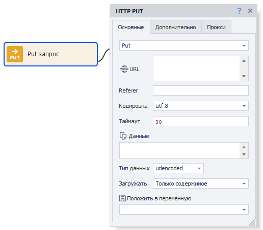

> *А для запросов [**GET**](./GET-request) и [**POST**](./POST-request) есть отдельные экшены.* 

### Как добавить экшен в проект?
Через контекстное меню: **Добавить действие** → **HTTP** → **HTTP-запрос**

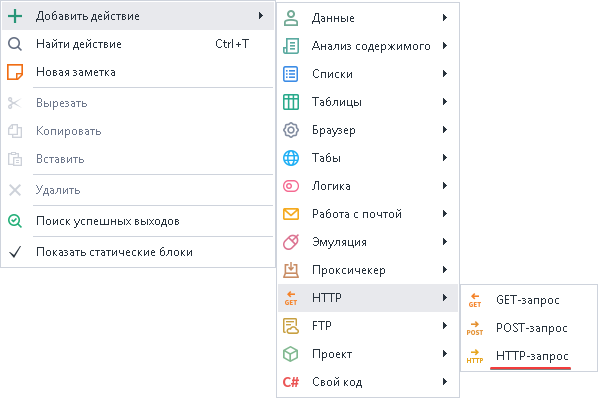
_______________________________________________ 
## Вкладка «Основные» 

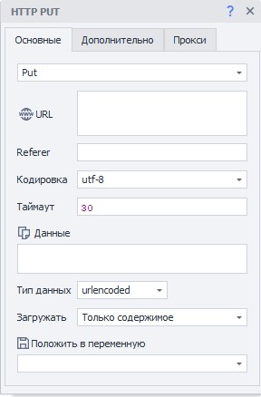

### Тип запроса
Выбираем необходимый запрос из списка.  

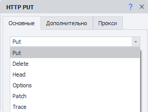  

### URL.  
Целевой адрес сайта (ссылка), по которому будет отправлен запрос. *Можно использовать переменную*.  

### Referer
Заголовок запроса [**Referer**](https://developer.mozilla.org/ru/docs/Web/HTTP/Headers/Referer) используется для указания URL-адрес, с которого пользователь пришел на текущую страницу. Он помогает анализировать трафик и узнавать, с какого ресурса переходят чаще всего.

:::warning **Заголовок *Referer* может раскрыть информацию об истории посещённых страниц**  
Это может привести к нарушению приватности.
:::  

### Кодировка
Выбираем кодировку для запроса.

### Таймаут
Максимальное время ожидания ответа от сайта в секундах.  

При достижении установленного времени, действие будет завершено ошибкой и выйдет по красной ветке.  

Можно использовать макросы переменных.
_______________________________________________
### Данные
Основное содержимое запроса.

### Тип данных
Определяем данные для текущего запроса.  

> Выбранный тип передаётся как заголовок [Content-Type](https://developer.mozilla.org/ru/docs/Web/HTTP/Headers/Content-Type "https://developer.mozilla.org/ru/docs/Web/HTTP/Headers/Content-Type").

#### urlencoded
> *`Content-Type: application/x-www-form-urlencoded`*  

Стоит использовать, когда на сервер отсылается **текстовая информация**.  

В поле **Данные** она указывается в формате: `имяпараметра1=значение1&имяпараметра2=значение2`

#### multipart
> *`Content-Type: multipart/form-data`*  

Этот тип стоит выбирать при отправке в запросе двоичных данных (файлов) на сервер.  

#### Другой
Вы можете указать данный тип данных, если описанные выше не подходят.

Например, для взаимодействия с [CapMonster Cloud API](https://docs.capmonster.cloud/ru/docs/category/api/) требуется отправлять данные POST запросом в формате JSON. Для этого выбираем **Другой** и в появившемся поле пишем: `application/json`

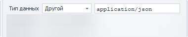
_______________________________________________
### Загружать
#### Только содержимое.  
В переменную будет сохранено только тело ответа.  
  
#### Только заголовки.  
Сохранятся только заголовки.   

#### Заголовки и содержимое.  
В переменную сохранятся и заголовок ответа, и его тело, разделенные двумя пустыми строками.    

#### Как файл.  
Выбирайте этот режим, если нужно скачать файл с помощью запроса.  
В переменную сохранится путь к скачанному файлу.  

:::info **По умолчанию файлы скачиваются в папку `Trash` в директории с программой.**  
Путь может выглядеть так:  
`C:\Program Files\ZennoLab\RU\ZennoPoster Pro V7\7.4.0.0\Progs\Trash\googlelogo_color_92x30dp.png`  

Изменить его можно в настройках, но только глобально для всех проектов. 
:::  

#### Как файл + заголовки.  
В переменную сохранятся заголовки ответа и путь к скачанному файлу.  
_______________________________________________  
### Положить в переменную.  
Здесь надо выбрать (или создать новую) переменную, в которую будет сохранён результат запроса. 
_______________________________________________
## Вкладка «Дополнительно»


### Редирект.  
Используется для установки перенаправления. Если ответ на запрос будет содержать *код редиректа*, то ZennoDroid перейдет к следующей странице, используя заголовок ***Location***.  

Здесь мы цифрами указываем максимальное количество переходов. К примеру, `0` — остаться на исходной странице, `5` — количество переходов до конечного URL.  

### Использовать оригинальный URL.  
Когда эта опция включена, кодирование URL из вкладки «Основные» будет отменено. Пример:  
- **URL по умолчанию (с кодированием)**:  
`https://ru.wikipedia.org/wiki/%D0%9F%D1%80%D0%B8%D0%B2%D0%B5%D1%82%D1%81%D1%82%D0%B2%D0%B8%D0%B5`  
- **Оригинальный URL**:  
`https://ru.wikipedia.org/wiki/Приветствие`  
_______________________________________________ 
### Заголовки.  
#### Использовать по умолчанию.  
В запрос будут подставлены заголовки по умолчанию. Заголовок `Host` меняется в зависимости от адреса в запросе.  

<details>
<summary>**Пример ответа при запросе *https://httpbin.org/get*.**</summary>
<!--All you need is a blank line-->

   ```
Host: httpbin.org
User-Agent: Mozilla/5.0 (Windows NT 10.0; WOW64; rv:45.0) Gecko/20100101 Firefox/45.0
Accept: text/html,application/xhtml+xml,application/xml;q=0.9,*/*;q=0.8
Accept-Encoding: gzip, deflate
Accept-Language: en-US,en;q=0.5
   ```
</details>  

#### Текущий профиль.  
Будут подставлены заголовки из текущего ***профиля проекта***.  

#### Загрузить из профиля.  
Необходимо выбрать файл или указать переменную, содержащую путь до профиля, из которого будут загружены заголовки для запроса.  

#### Пользовательские настройки.  
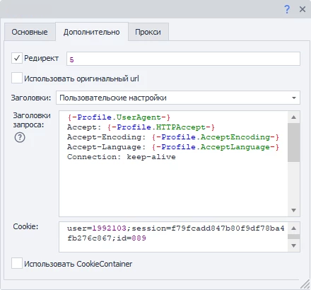  

Позволяет самостоятельно указать каждый параметр заголовка, следуя правилам:  
- :warning: Первой **всегда указывается строка User-Agent!** И только потом все остальные заголовки.  
- Каждый заголовок начинается с новой строчки.  
- Можно указать *статичные значения*, *свои переменные* или *переменные профиля*.  
_______________________________________________ 
### Использовать CookieContainer.  
С помощью этой опции можно синхронизировать куки с целым браузером или между отдельными запросами. Вам не понадобится вручную их парсить и подставлять.  

<details>
<summary>Пример</summary>

Представим, что наш проект работает с сайтом, используя запросы. Для работы нужно быть авторизованным. При этом процесс авторизации крайне сложен для повторения его через запросы. Поэтому для входа на сайт используем браузерный режим.  

После авторизации ***отключаем браузер*** и начинаем работать с запросами. С включенной опцией **Использовать CookieContainer** куки будут автоматически синхронизированы между браузером и запросами, их не придется подставлять вручную.    

Если при одном из запросов сайт вернет новое значение кук, то оно автоматически синхронизируется с браузером и будет использовано в дальнейшем.

</details>  

#### **Cookie**
:::info **Данное поле ввода отображается только при отключении прошлой опции.**
:::    

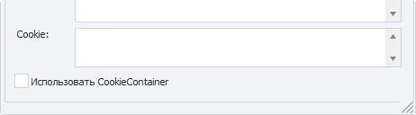 

Можно указать готовые куки или взять из переменной.  

**Формат:** `имя=значение`, несколько значений разделяются через `;`  
***Пример:*** `user=1992103;session=f79fcadd847b80f9df78ba4fb276c867;id=889`
_______________________________________________
## Вкладка «Прокси»


### Без прокси
Экшен будет работать через реальный IP компьютера или сервера.

### Текущий прокси проекта
Используется установленный в проекте прокси.

### Строка формата
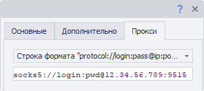

Указываем прокси в формате (можно указать переменную):  
- ***С авторизацией*** — `socks5://логин:пароль@ip:port` или `http://логин:пароль@ip:port`  
- ***Без авторизации*** — `socks5://ip:port` или `http://ip:port`  
- ***Без указания протокола (по умолчанию http://)*** — `логин:пароль@ip:port` или `ip:port` 

### Другой
Выбираем в том случае, если нужно указать детальные настройки прокси.  


> Тип прокси, данные авторизации, адрес и порт уточняйте у поставщика услуг.  

Во всех полях можно использовать переменные.

:::info ПО УМОЛЧАНИЮ ИСПОЛЬЗУЕТСЯ HTTP://
Если не указывать протокол прокси.
:::
_______________________________________________ 
## Создание экшенов из монитора трафика
:::info Добавлено в ZennoPoster 7.1.5.0 (5.44.0.0)
:::

Готовый HTTP-запрос можно создать прямо из [Окна Трафика](/zennoposter/ProjectMaker/Program-interface/Traffic_Window).

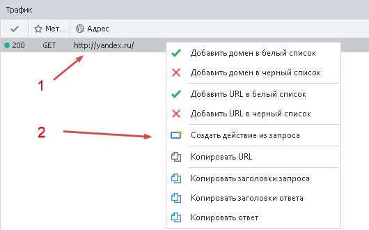

1. Наводим курсор на нужный запрос и правой кнопкой мыши вызываем контекстное меню.
2. Нажимаем **Создать действие из запроса**.

На холсте проекта появится полностью заполненный экшен HTTP-запроса:

| 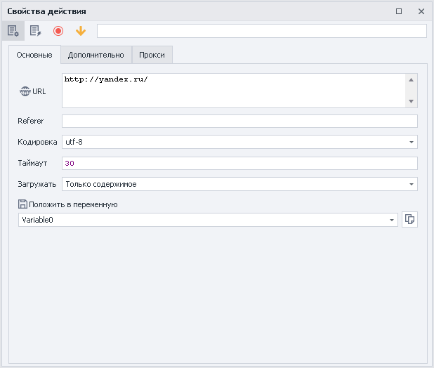 | 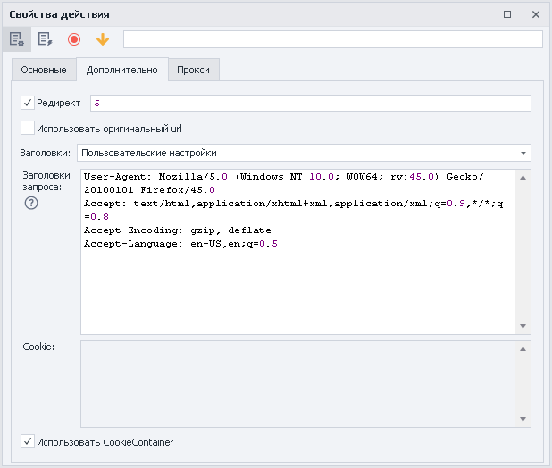 | 
|---|---|

Измените статические значение или замените на перемененные — теперь экшен полностью готов к работе.
_______________________________________________ 
## Вспомогательные настройки
### Выключение браузера
Если вы работаете исключительно на запросах, то можно отключить браузер, тем самым сэкономив ресурсы компьютера. Сделать это можно через [Настройки проекта](../../Static_blocks/Project_Settings) или в экшене [Настройки браузера](../Browser/Browser_settings).

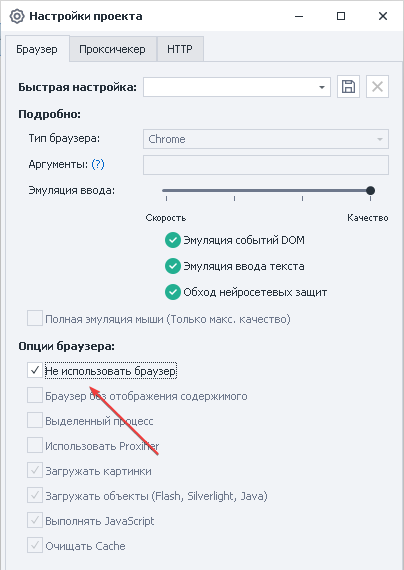

### Способ передачи запроса
В ZennoPoster есть два метода работы с запросами:  
- **Стандартный**. Стоит по умолчанию (библиотека Chilkat).  
- **Альтернативный**. Наша собственная разработка.  

Если при работе с HTTP-запросами что-то работает неправильно, то попробуйте переключиться на альтернативный метод.  
Сделать это можно через **Настройки →  Выполнение → Использовать альтернативный способ передачи HTTP-запросов**.  

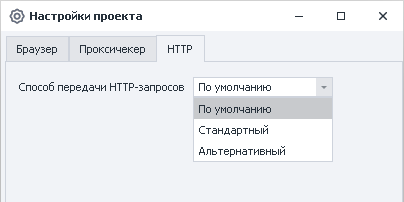
_______________________________________________
## Пример использования
Мы хотим загрузить файл в облако от Mail.


1. Выбираем файл.
2. Добавляем экшен HTTP-запрос.
3. Указываем метод передачи Options.
4. Заполняем поля и вкладки кубика.
5. Передаём файл на сервер.

* * *

## Полезные ссылки

- [❗→ Настройки проекта](https://zennolab.atlassian.net/wiki/spaces/RU/pages/534315477 "https://zennolab.atlassian.net/wiki/spaces/RU/pages/534315477")
- [❗→ GET-запрос](https://zennolab.atlassian.net/wiki/spaces/RU/pages/534315165/GET- "https://zennolab.atlassian.net/wiki/spaces/RU/pages/534315165/GET-")
- [❗→ POST-запрос](https://zennolab.atlassian.net/wiki/spaces/RU/pages/534315180/POST- "https://zennolab.atlassian.net/wiki/spaces/RU/pages/534315180/POST-")
- [❗→ Обработка JSON и XML](https://zennolab.atlassian.net/wiki/spaces/RU/pages/488964124 "https://zennolab.atlassian.net/wiki/spaces/RU/pages/488964124")
- [❗→ Обработка текста](https://zennolab.atlassian.net/wiki/spaces/RU/pages/488865793 "https://zennolab.atlassian.net/wiki/spaces/RU/pages/488865793")
- [❗→ Окно траффика](https://zennolab.atlassian.net/wiki/spaces/RU/pages/735805465 "https://zennolab.atlassian.net/wiki/spaces/RU/pages/735805465")
- [❗→ Инструменты web-разработчика (DevTools)](https://zennolab.atlassian.net/wiki/spaces/RU/pages/1331134465 "https://zennolab.atlassian.net/wiki/spaces/RU/pages/1331134465")