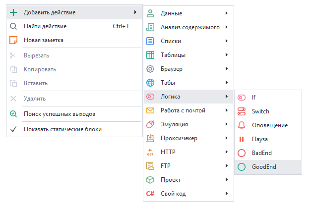
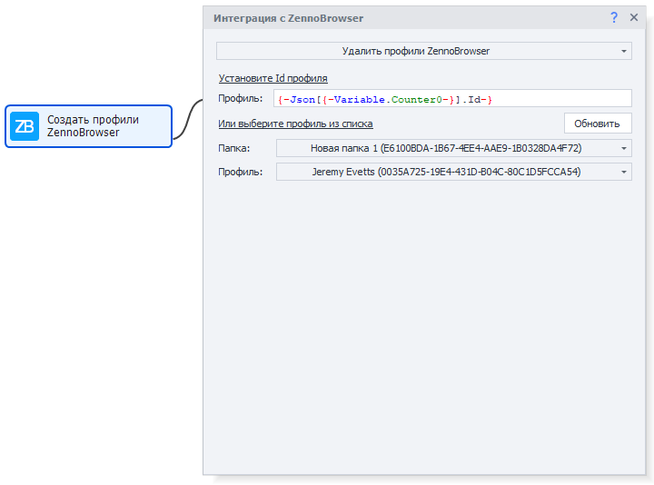
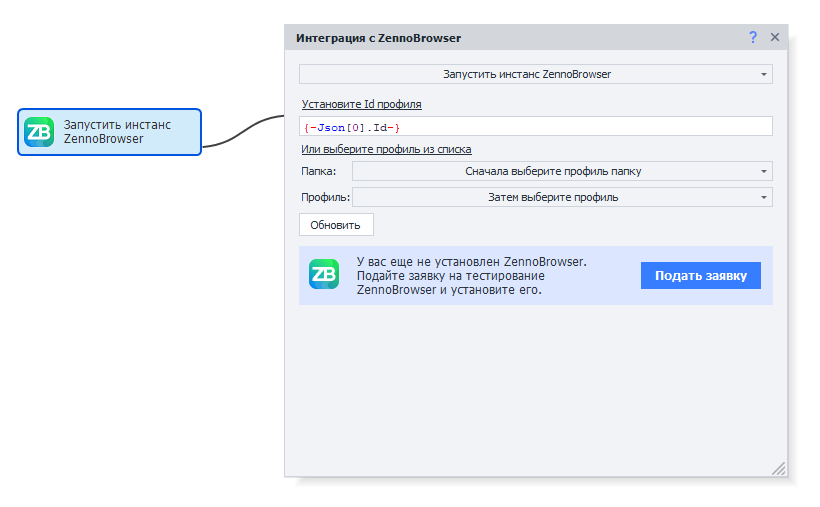
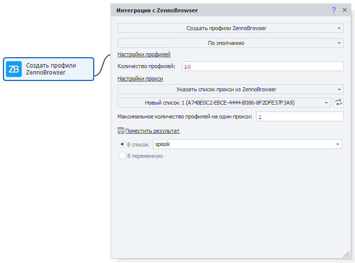
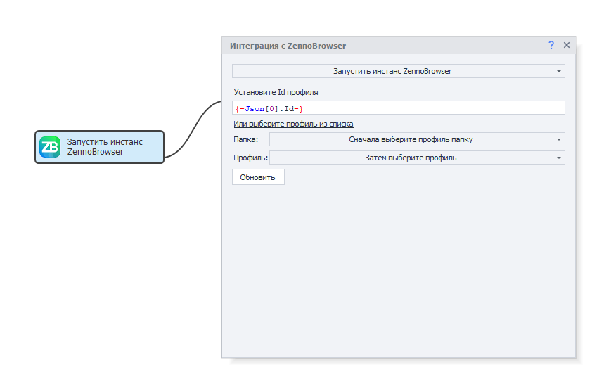
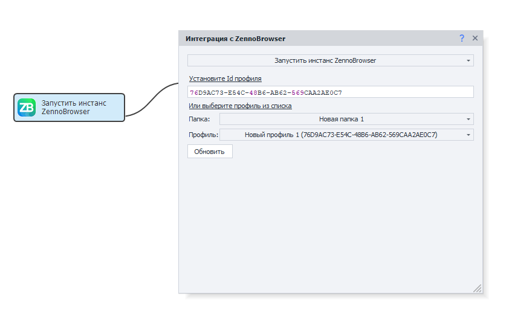
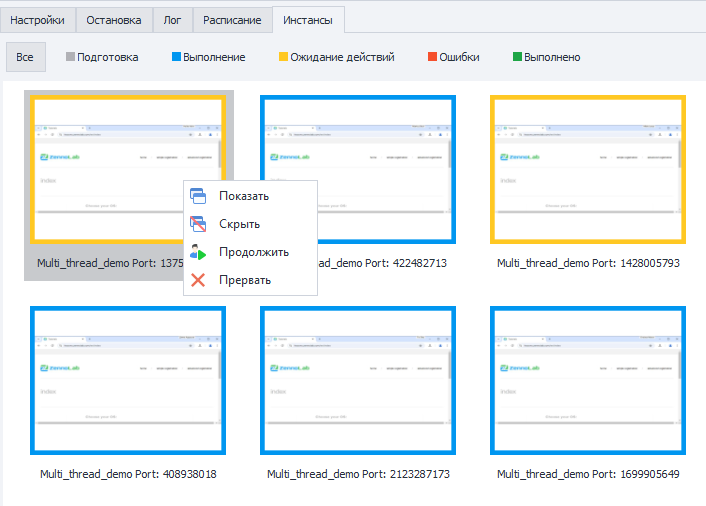

---
sidebar_position: 15
title: "Интеграция ZennoPoster с ZennoBrowser"
description: ""
date: "2025-08-04"
converted: true
originalFile: "Интеграция ZennoPoster с ZennoBrowser.txt"
targetUrl: "https://zennolab.atlassian.net/wiki/spaces/RU/pages/3641737224/ZennoPoster+ZennoBrowser"
---
import DisclaimerNotice from '@site/src/components/DisclaimerNotice';

<DisclaimerNotice />

> 🔗 **[Оригинальная страница](https://zennolab.atlassian.net/wiki/spaces/RU/pages/3641737224/ZennoPoster+ZennoBrowser)** — Источник данного материала

_______________________________________________  
## Описание
ZennoPoster 7 поддерживает прямую интеграцию с антидетект-браузером [**ZennoBrowser**](https://zennolab.com/ru/products/zennobrowser/). Это позволяет автоматизировать работу с множеством аккаунтов, используя продвинутую защиту цифровых отпечатков и изолированные среды.  

### Ключевые возможности интеграции:  
- **Управление профилями:** создание, удаление и настройка параметров прямо в ZennoPoster.  
- **Анонимность:** полноценная работа с прокси и подменой данных браузера.  
- **Привычный интерфейс:** все новые функции встроены в знакомую среду, что делает переход на ZennoBrowser бесшовным.  

## <ins>Получение профилей</ins>
Действие выполняет запрос к ZennoBrowser и возвращает полную информацию о всех доступных профилях в виде структурированных данных.

### Формат результата
Результат выполнения представляет собой **JSON-массив**, где каждый объект содержит детальную информацию об отдельном профиле:

- *ID профиля*
- *Имя профиля*
- *Настройки браузера*
- *Статус профиля*
- *Данные прокси*
- *Другие метаданные*

### Обработка результатов
Для корректной работы с полученными данными рекомендуем использовать экшен [**Парсинг JSON**](/zennoposter/ProjectMaker/Project-editor/Actions-in-ProjectMaker-Actions-Blocks/Data/JSON_and_XML_Processing#парсинг), которое позволит:

- **Извлечь** конкретные параметры профилей
- **Отфильтровать** профили по заданным критериям
- **Преобразовать** данные в удобный для работы формат

### Обработка ошибок
В случае проблем с подключением к ZennoBrowser (недоступность сервиса, неверные настройки соединения) действие вернёт соответствующую ошибку, которую необходимо обработать в логике проекта.

### Сохранение результата
Укажите переменную для сохранения JSON-ответа в поле **Поместить в переменную** для дальнейшего использования в проекте.

## <ins>Запуск инстанса</ins>
Действие принимает **ID профиля ZennoBrowser** и инициирует запуск браузерного инстанса с соответствующими настройками профиля, включая:

- Цифровые отпечатки браузера
- Настройки прокси
- Пользовательские данные
- Расширения и конфигурации

### Настройка профиля
При первом открытии настроек автоматически загружается актуальный список профилей из ZennoBrowser.  

Доступны два способа указания профиля:

**Ручной ввод ID:**

- Введите идентификатор профиля в соответствующее поле

**Выбор из списка:**

1. Сначала выберите **папку профилей** из выпадающего списка
2. Затем выберите конкретный **профиль** внутри выбранной папки

### Обновление списка профилей
Для получения актуальной информации о доступных профилях используйте кнопку **Обновить** в настройках действия.  

> *Это особенно полезно при добавлении новых профилей*.

## <ins>Создание профилей</ins>
Данное действие содержит два способа создания новых профилей браузера:

- **По умолчанию**. Профили создаются с оптимизированными настройками. Необходимо указать:  
    - *Количество профилей* — требуемое количество создаваемых профилей
    - *Настройки прокси* — параметры прокси-серверов для профилей

- **Создание на основе профиля-донора**.  
Новые профили будут наследовать все настройки указанного существующего донора.
    - Укажите **ID профиля-донора** или выберите его из списка
    - Будут скопированы настройки отпечатков браузера, расширения и другие параметры конфигурации

:::info Копируются настройки отпечатков, а не сами отпечатки
Каждый созданный профиль получит уникальные отпечатки в соответствии с настройками донора.
:::

### Настройки прокси
Система поддерживает гибкое управление прокси-серверами:
- **Указать список прокси** — выберите готовый список из ZennoBrowser.
- **Максимальное количество профилей на прокси** — ограничение для предотвращения перегрузки прокси.
- **Исключение повторений** — каждый прокси используется только один раз при создании профилей.

### Сохранение результатов
Данные созданных профилей обязательно должны быть сохранены для дальнейшего использования:
- **В список** — для работы с множественными профилями.
- **В переменную** — для сохранения информации об одном профиле.

## <ins>Удаление профилей</ins>
Это действие предназначено для безвозвратного удаления выбранных профилей браузера из системы.

### Способы указания профилей для удаления
**Ручной ввод:**
Нужно указать идентификатор в поле **Установите ID профиля**.

> *Поддерживается использование переменных для динамического указания ID*.

**Выбор из списка:**  
Укажите **папку профилей** из выпадающего списка → выберите **конкретный профиль** для удаления из выбранной папки.  

### Обновление списка профилей
Для получения актуального списка доступных профилей используйте кнопку **Обновить** в настройках действия.

## <ins>Особенности интеграции</ins>
### Работа с браузером
Интегрированный браузер функционирует в ZennoPoster аналогично другим, т.е. действия работы со страницами и элементами браузера работают нативно.  

Если у вас не установлен ZennoBrowser, то действие запуска инстанса предложит вам подать заявку на тестирование нового продукта, чтобы вы смогли установить его.

### Запуск и подключение
Для работы интеграции не обязательно, чтобы ZennoBrowser был запущен — ZennoPoster сможет запустить его самостоятельно. Однако при предварительном запуске получение профилей выполнятся быстрее.  

Когда ZennoPoster запустит браузер, в ZennoBrowser будет отображаться его состояние с доступной кнопкой Stop. Она позволяет остановить браузер и освободить профиль в любой момент, но это может привести к ошибкам в работе проекта.  

Если ZennoPoster не сможет подключиться к ZennoBrowser, то новые действия будут возвращать ошибку. Также ZennoBrowser может отклонить запуск по некоторым причинам — к примеру, профиль уже занят.

### Различия между ProjectMaker и ZennoPoster
#### ProjectMaker  
Браузер полностью интегрирован в интерфейс, что позволяет использовать все привычные инструменты отладки. Однако, как и в обычном Chromium, **GPU (аппаратное ускорение) здесь отключено**. 

#### ZennoPoster  
Браузер работает **с включенным GPU**. Это аналогично использованию режима «Альтернативная отрисовка браузера Chromium», что повышает производительность при выполнении задач.

### Работа с профилями
:::info Новый браузер использует исключительно профили и эмуляции ZennoBrowser
:::

- Настройки и экшены управления профилем старого образца (ZP7) полностью игнорируются.  
- При запуске таких команд ошибки не возникнет, но они не произведут никаких изменений.  
- Любые попытки модифицировать профиль через стандартные инструменты ZP7 будут неактивны.

### Управление окном браузера
В ZennoPoster 7 окно инстанса — это реальный браузер. Во избежание сбоев **не сворачивайте и не закрывайте его** через системные кнопки окна. Все необходимые действия вынесены в **специальное контекстное меню** превью.  

> *Полноценная поддержка системных кнопок появится в будущих обновлениях.*

## <ins>Контекстное меню превью инстанса</ins>
Для удобства работы с окнами Chromium из ZennoBrowser контекстное меню было расширено дополнительными функциями управления.  

Оно позволяет управлять всеми ключевыми функциями ZennoPoster прямо из интерфейса превью инстансов, обеспечивая полный контроль над браузерами без необходимости переключения между окнами приложения.

### Новые пункты меню
- **Показать**. Отображает окно браузера, если оно было скрыто.
- **Скрыть**. Скрывает окно браузера без завершения его работы.
- **Продолжить**. Используется для продолжения выполнения при *Ожидании действий пользователя*.

_______________________________________________ 