---
sidebar_position: 1
title: "Операции над списком"
description: " "
date: "2025-07-24"
converted: true
originalFile: "Операции над списком.txt"
targetUrl: "https://zennolab.atlassian.net/wiki/spaces/RU/pages/534085798"
---
import DisclaimerNotice from '@site/src/components/DisclaimerNotice';

<DisclaimerNotice />

> 🔗 **[Оригинальная страница](https://zennolab.atlassian.net/wiki/spaces/RU/pages/534085798)** — Источник данного материала

_______________________________________________  
## Описание
Списки нужны для получения строк данных из текстового документа, либо для записи данных в файл.  

Например, есть файл со списком URL, на которые нужно зайти по очереди. Или же вы парсите какие-то значения с сайта (например, e-mail адреса) и нужно их отсортировать, удалить дубли и сохранить в файл.

:::info Перед началом работы Список необходимо создать 
::: 

### Как создать список?
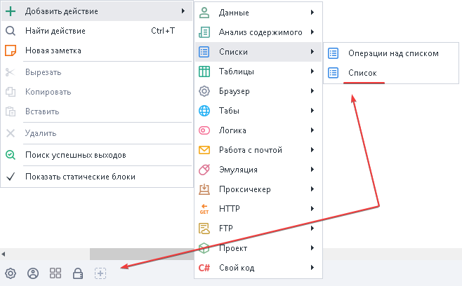

### Как добавить экшен в проект?
Через контекстное меню **Добавить действие → Списки → Операции над списком**

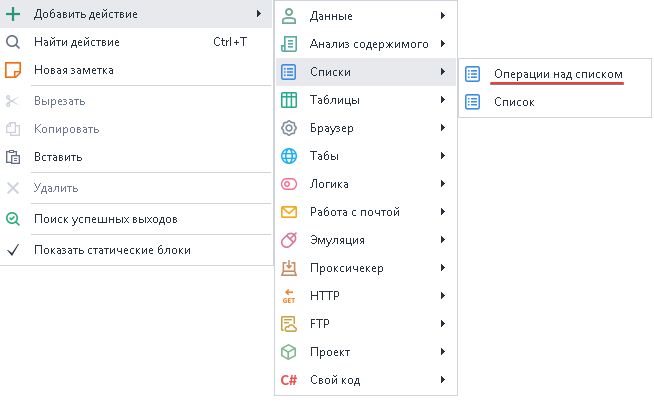

### Для чего используется?

- Добавление и получение элементов списка
- Удаление строк и дублей
- Привязка к файлу
- Получение количества строк
- Перемешивание
- Сортировка значений
_______________________________________________
## Принцип работы
После добавления экшена в проект в его свойствах нам нужно выбрать список, с которым будем работать, а затем действие для выполнения.  

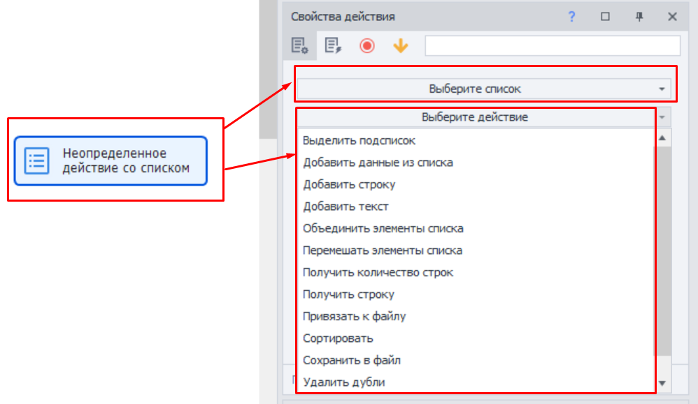
_______________________________________________
### Выделить подсписок
Выделение части строк из списка.

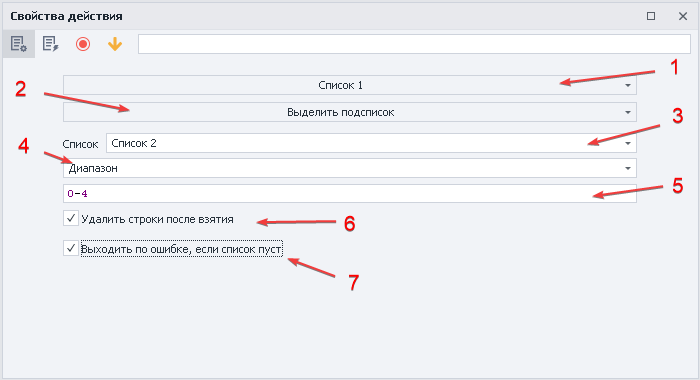

- **Список.** Выбираем список, в который будет сохранен результат.  
- **Диапазон.** Способ фильтрации подсписка. Также для выбора доступны:  
    - *Элементы, не содержащие текст.*  
    Выберет все строки которые не содержат заданный текст. Можно использовать переменные.  
    - *Элементы, не удовлетворяющие регулярному выражению.*  
    Критерии поиска задаются с помощью Regex (регулярных выражений).  
    - *Элементы, содержащие текст.*  
    Выберет значения, которые содержат необходимый текст. Можно использовать переменные.  
    - *Элементы, удовлетворяющие регулярному выражению.*  
    Критерии поиска задаются с помощью Regex (регулярных выражений).  
- **Поле для ввода критериев.** Указываются значения, соответствующие прошлому пункту.  
- **Удалить строки после взятия.** Будут удалены строки, которые попали под критерии поиска.  
- **Выходить по ошибке, если список пуст.** Если список пустой, то выполнение проекта пойдёт по красной ветке.   

Пример

Берём из первого списка **первые пять строк** *(нумерация с нуля)* и сохраняем во второй список

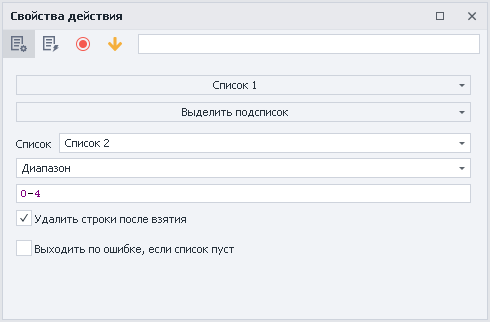

| Список 1 до обработки     | Список 1 после |  Список 2  |
| ----------- | ----------- | ----------- | 
| 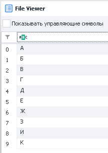      | 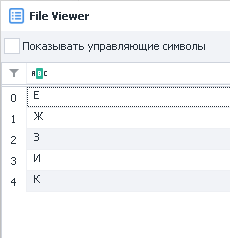   | 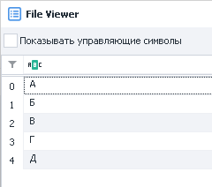 |

_______________________________________________ 
### Добавить данные из списка
Добавление данных из одного списка в другой.

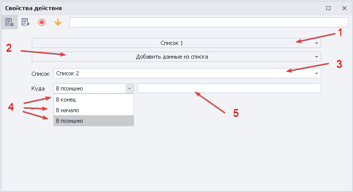

- **Список.** Выбираем список, в который будет сохранен результат.  
- **Куда.** В какую позицию поместим результат: `в конец`, `в начало`, `в позицию`.  
- **В позицию.** Если выбрали этот вариант, то в соседнем поле нужно указать номер строки или переменную.  

:::info *При копировании строки не удаляются из исходного списка.*
:::  

Пример
  

Добавим строки из второго списка в конец первого

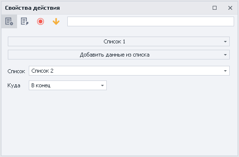

| Список 2     | Список 1 до обработки |  Список 1 после |
| ----------- | ----------- | ----------- | 
| 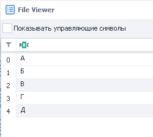      |    | 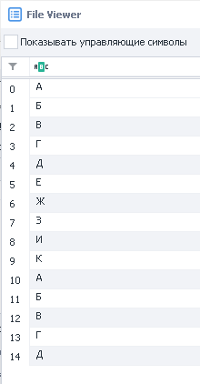 |

Элементы Списка 2 остаются на месте

  
_______________________________________________
### Добавить строку
Добавление строки в список.

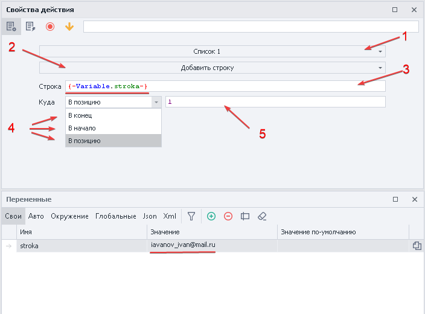

**1.** Выбираем список, в который будем добавлять строку.  
**2.** Устанавливаем функцию.  
**3.** Вносим значение или переменную.  
**4.** В какую позицию поместим результат: `в конец`, `в начало`, `в позицию`.  
**5.** Если выбрали `в позицию`, то в соседнем поле нужно указать номер строки или переменную.  
***Подчеркнуто красной линией***. Значение, которое копируем в данном примере.  

Пример

Положим значение в конец первого списка

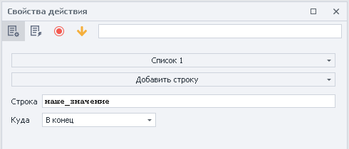

| Список 1 до обработки    | Список 1 после |  
| ----------- | ----------- | 
|       | 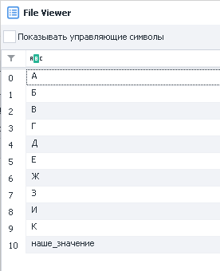  | 

  
_______________________________________________
### Добавить текст
Добавление текста в список.

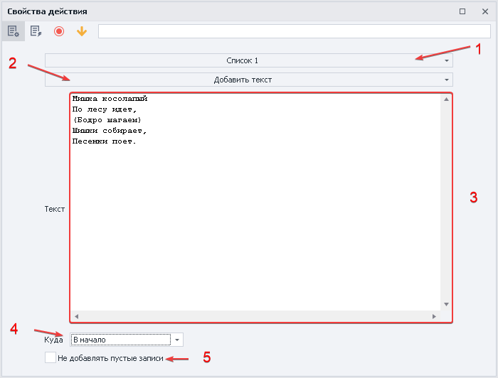

**1.** Выбираем список, в который будем добавлять текст.  
**2.** Устанавливаем функцию.  
**3.** Текст или набор символов для добавления в список, можно указать переменную. 
**4.** В какую позицию поместим результат: `в конец`, `в начало`, `в позицию`.  
**5.** Добавлять пустые строки в случае отсутствия текста.  

Пример

Добавим текст в первый список

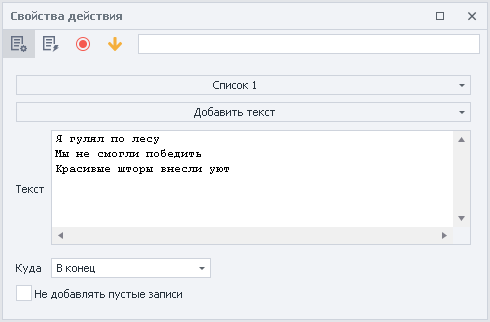

| Список 1 до обработки    | Список 1 после |  
| ----------- | ----------- | 
|       | 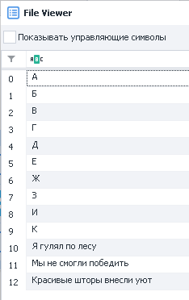  | 

Текст имел разделитель — новая строка, поэтому в список он добавлен построчно

  
_______________________________________________
### Объединить элементы списка
Объединение элементов списка с указанием разделителя и возможностью записи в переменную.

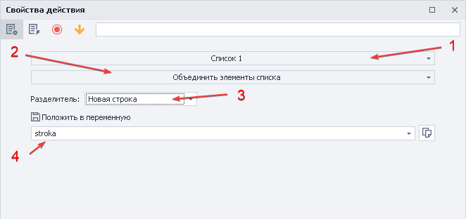

- **Разделитель.**  
    - *Новая строка.* Каждый элемент списка будет записан с новой строки.  
    - *Свой.* Указываем свой текст или символы, которые будут вставлены между элементами списка.  
    - *Указанный в списке.* Используется разделитель из настроек списка.  
- **Положить в переменную**. Переменная для записи данных после обработки.  

Пример

Объединяем элементы первого списка, используя *свой* разделить `-;`

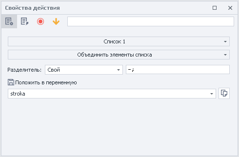

| Список 1   | Результат обработки списка в переменной `stroka`|  
| ----------- | ----------- | 
|    | 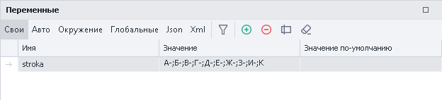  | 

  
_______________________________________________
### Перемешать элементы списка
В случайном порядке меняет расположение элементов в списке 

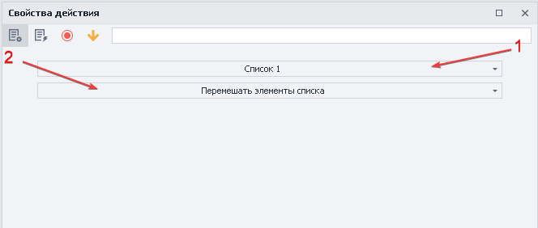

:::info *Изменение позиции не влечет за собой потери значений строки*
:::  

Пример

Перемешаем элементы Списка 1

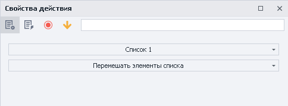

| До обработки  | После обработки|  
| ----------- | ----------- | 
|    | 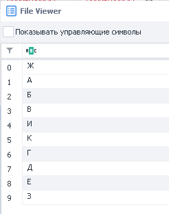  | 

_______________________________________________  
### Получить количество строк
Позволяет узнать количество строк в списке.

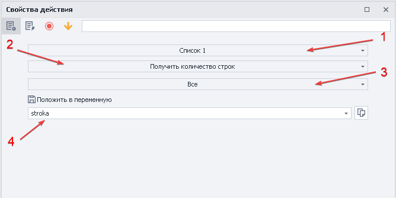

#### Критерии поиска:  
- Все;
- Не содержат текст;  
- Не удовлетворяет регулярному выражению;
- Со значением;
- Содержат текст;
- Удовлетворяет регулярному выражению;  

:::info *Переменная всегда будет содержать только цифровое значение.*
:::   

Пример

Посчитаем количество строк в Списке 1 и положим в переменную

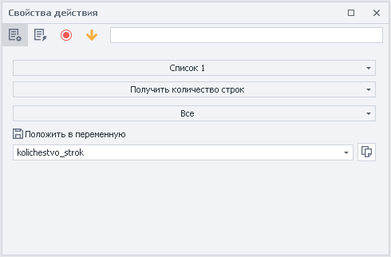

| Список 1   | Результат обработки списка в переменной `kolichestvo_strok`|  
| ----------- | ----------- | 
| 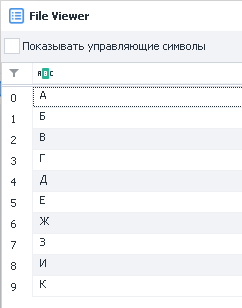   | 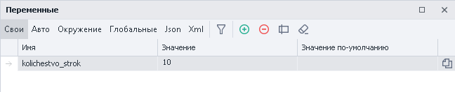  | 

  
_______________________________________________ 
### Получить строку
Эта функция получает строку, а также дает возможность удалить ее из списка и записать в переменную.

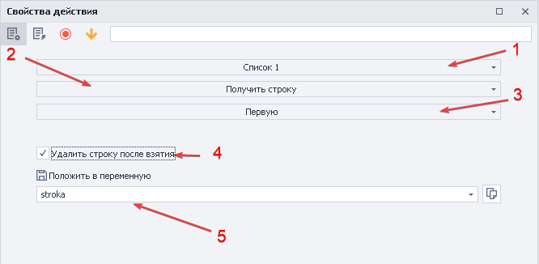

- **Критерии поиска:** 
    - *Не содержит текст*;
    - *Не удовлетворяет регулярному выражению*;
    - *Первую*;
    - *По номеру*;
    - *Случайную*;
    - *Удовлетворяет регулярному выражению*;  
- **Удалить строку после взятия**. Когда выбранная строка возьмется из списка, то после этого будет удалена.  
- **Положить в переменную**. Здесь указываем кастомную переменную, в которую мы положим скопированную строку.

Пример

Берём случайную строку из Списка 1 и кладём её в переменную

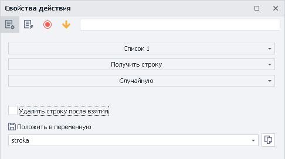

| Список 1   | Результат обработки списка в переменной `stroka`|  
| ----------- | ----------- | 
|    | 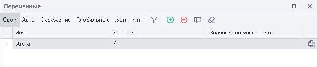  | 

  
_______________________________________________ 
### Привязать к файлу
Привязка списка к файлу в ходе выполнения проекта.

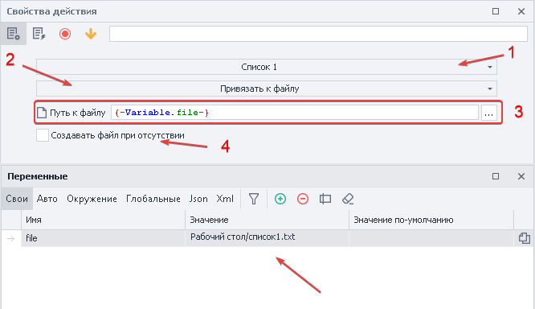

- **Путь к файлу**. Выбираем конкретный файл или указываем переменную, содержащую путь к нему.  
- **Создавать файл при отсутствии.** Если файл отсутствует по указанному пути, то он будет автоматически создан. 

Пример

Список 1 будет привязан файлу по указанному пути

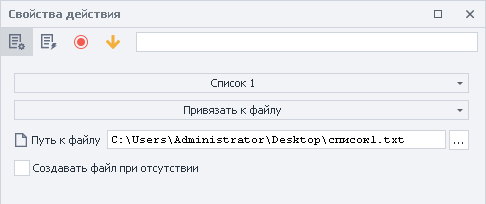

  
_______________________________________________ 
### Сортировать
Сортировка элементов списка по убыванию или возрастанию.

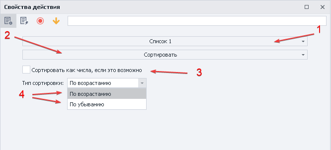

- **Сортировать как числа, если это возможно.** Использовать принцип сортировки как у чисел.  
- **Тип сортировки**. По возрастанию или убыванию.  

:::info *Не всегда буквенные и символьные строки можно упорядочить.*
:::  

Пример

Сортировать значения Списка 1 по убыванию

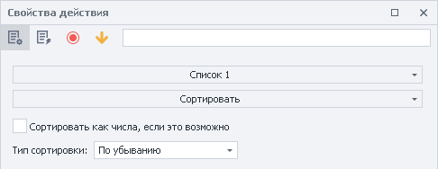

| До обработки  | После обработки|  
| ----------- | ----------- | 
| 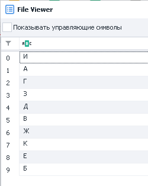   | 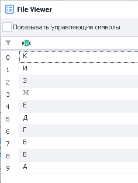  | 

  
_______________________________________________ 
### Сохранить в файл
Сохраняет список в файл.  

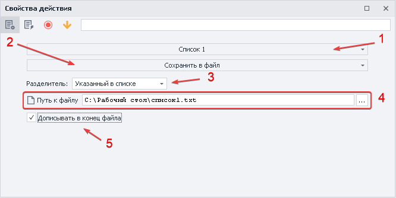

- **Разделитель**. Устанавливает разделитель:  
    - *Новая строка*;  
    - *Свой*;  
    - *Указанный в списке*;  
- **Путь к файлу**. Выбираем файл или указываем переменную, содержащую путь к файлу.    
- **Дописывать в конец файла**. Позволяет записывать новые данные в файл или перезаписывать его полностью.  

Пример

Сохраняем значения Списка 1 в файл

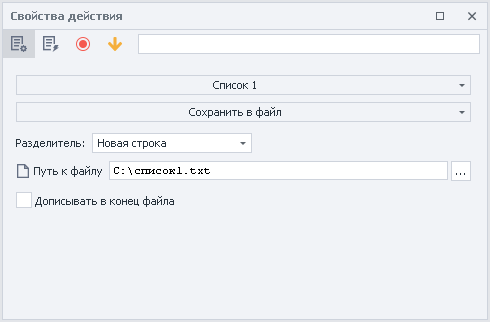

| Список 1   | Получившийся файл|  
| ----------- | ----------- | 
| 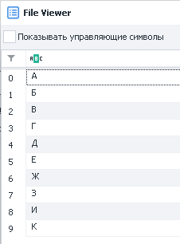   | 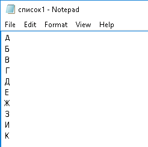  | 

  
_______________________________________________
### Удалить дубли
Удаление повторяющихся строк в списке.

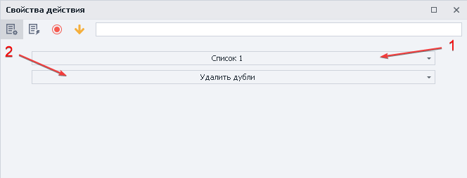

:::info *Для обработки файла с большим количеством строк может потребоваться время.*
:::  

Пример

Удаляем все дубли в Списке 1

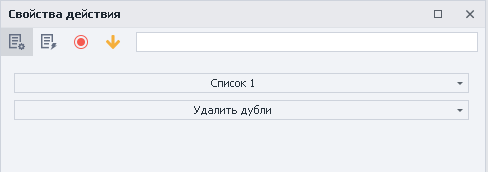

| До обработки  | После обработки|  
| ----------- | ----------- | 
| 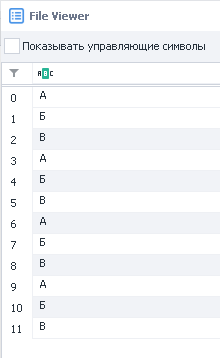   | 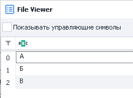 | 

  
_______________________________________________
### Удалить строки
Удаляет строки из списка с заданными критериями.

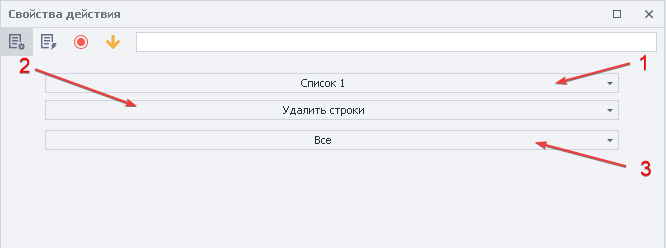

- **Критерии удаления строк:** 
    - *Все*;
    - *Не содержащие текст*;
    - *Не удовлетворяющие регулярному выражению*;
    - *Первую*;
    - *Под номерами (можно использовать диапазоны)*;
    - *Со значением*;  
    - *Содержащие текст*;
    - *Содержащие только пробельные символы*;
    - *Удовлетворяющие регулярному выражению*;  

Пример

Удаляем из Списка 1 все строки, содержащие символ `@` 

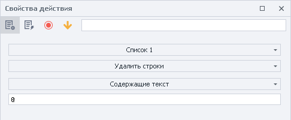

| До обработки  | После обработки|  
| ----------- | ----------- | 
| 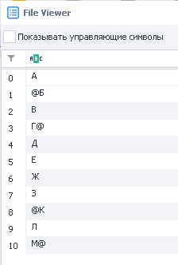   | 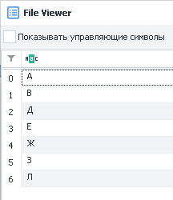 | 

_______________________________________________
## Пример использования
Представим, что нам необходимо перейти по всем страницам из списка + собрать их названия + положить в другой список. 

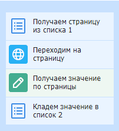

**1.** Создаём `Список_1` с несколькими страницами, предварительно привязав его к файлу.  
**2.** Удаляем дубли, чтобы не переходить на страницу дважды.  
**3.** Создаём `Список_2` и привязываем его к файлу.  
**4.** Парсим необходимую информацию со страниц `Список_1` и копируем ее в `Список_2`.  
**5.** Удаляем дубли.  

Таким образом можно наполнять списки нужной информации для дальнейшей обработки и использования.
_______________________________________________
## Полезные ссылки

1. [❗→ Окно переменных](/wiki/spaces/RU/pages/735608872 "/wiki/spaces/RU/pages/735608872")
2. [❗→ Тестер регулярных выражений](/wiki/spaces/RU/pages/534086111 "/wiki/spaces/RU/pages/534086111")
3. [❗→ Список](/wiki/spaces/RU/pages/534053375 "/wiki/spaces/RU/pages/534053375")