---
sidebar_position: 1
title: "Операции над списком"
description: "Конвертировано из HTML в MDX"
date: "2025-07-24"
converted: true
originalFile: "Операции над списком.txt"
targetUrl: "https://zennolab.atlassian.net/wiki/spaces/RU/pages/534085798"
---
:::info **Пожалуйста, ознакомьтесь с [*Правилами использования материалов на данном ресурсе*](../Disclaimer).**
:::

> 🔗 **[Оригинальная страница](https://zennolab.atlassian.net/wiki/spaces/RU/pages/534085798)** — Источник данного материала

_______________________________________________  

## Описание

[❗→ Списки](/wiki/spaces/RU/pages/534053375 "/wiki/spaces/RU/pages/534053375") в основном используются для получения строк данных из текстового документа или записей данных в файл. Например, у Вас есть файл со списком URL и нужно на них по очереди зайти, или Вы парсите какие-то значения с сайта и нужно их отсортировать, удалить дубли и сохранить в файл (к примеру, спарсенные e-mail адреса).

  

## Как добавить список в проект?

:::note На заметку
Перед началом работы необходимо создать Список
:::

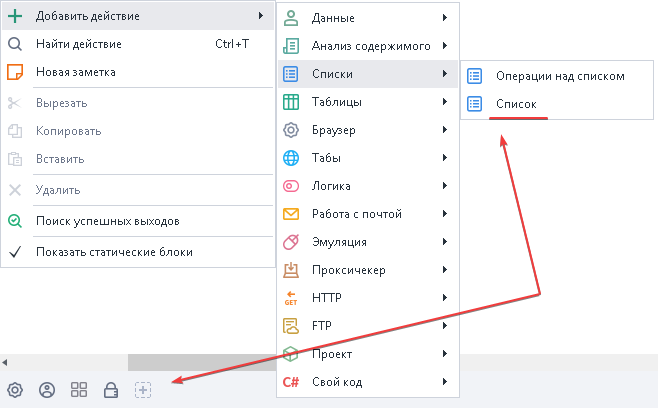

  

## Как добавить экшен в проект?

Через контекстное меню **Добавить действие** → **Списки** → **Операции над списком**

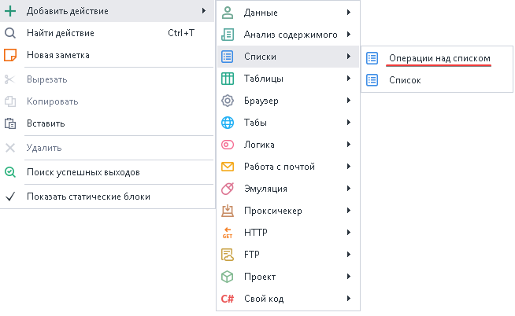

Либо воспользуйтесь [❗→ умным поиском](https://zennolab.atlassian.net/wiki/spaces/RU/pages/506200090/ProjectMaker+7#%D0%A3%D0%BC%D0%BD%D1%8B%D0%B9-%D0%BF%D0%BE%D0%B8%D1%81%D0%BA-%D0%B4%D0%B5%D0%B9%D1%81%D1%82%D0%B2%D0%B8%D0%B9 "https://zennolab.atlassian.net/wiki/spaces/RU/pages/506200090/ProjectMaker+7#%D0%A3%D0%BC%D0%BD%D1%8B%D0%B9-%D0%BF%D0%BE%D0%B8%D1%81%D0%BA-%D0%B4%D0%B5%D0%B9%D1%81%D1%82%D0%B2%D0%B8%D0%B9").

  

## Для чего это используется?

- Добавление и получение элементов списка
- Удаление строк и дублей
- Привязка к файлу
- Получение количества строк
- Перемешивание
- Сортировка значений

  

## Как работать с экшеном?

### Выделить подсписок

Выделение части строк из списка.

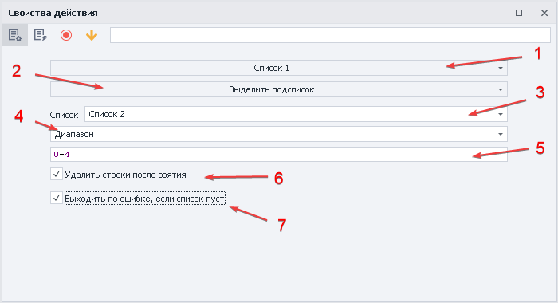

1. Выбираем список с которым будем работать.
2. Указываем функцию.
3. Указываем куда будет сохранён результат.
4. Способ фильтрации подсписка
a) [❗→ Диапазон](/wiki/spaces/RU/pages/488964137 "/wiki/spaces/RU/pages/488964137") - задаём интервал строк, которые нужно выделить. 
b) Элементы, не содержащие текст - выберет все строки которые не содержат заданный текст, можно использовать переменные.
c) Элементы, не удовлетворяющие [❗→ регулярному выражению](/wiki/spaces/RU/pages/534086111 "/wiki/spaces/RU/pages/534086111") - критерии поиска с помощью [❗→ регулярки](/wiki/spaces/RU/pages/534086111 "/wiki/spaces/RU/pages/534086111").
d) Элементы, содержащие текст - выберет значения, которые содержат необходимый текст, можно использовать переменные.
e) Элементы, удовлетворяющие [❗→ регулярному выражению](/wiki/spaces/RU/pages/534086111 "/wiki/spaces/RU/pages/534086111") - критерии поиска с помощью [❗→ регулярки](/wiki/spaces/RU/pages/534086111 "/wiki/spaces/RU/pages/534086111").
5. В этом поле указывается значение, соответствующее пункту из шага 4.
6. Будут удалены строки, которые попали под критерии поиска.
7. Если [❗→ список](/wiki/spaces/RU/pages/534053375 "/wiki/spaces/RU/pages/534053375") пустой, то **Zennoposter** пойдёт по красной ветке.

Пример

Берём из [❗→ списка](/wiki/spaces/RU/pages/534053375 "/wiki/spaces/RU/pages/534053375") первые пять строк (нумерация с нуля!) и сохраняем в [❗→ список](/wiki/spaces/RU/pages/534053375 "/wiki/spaces/RU/pages/534053375") 2

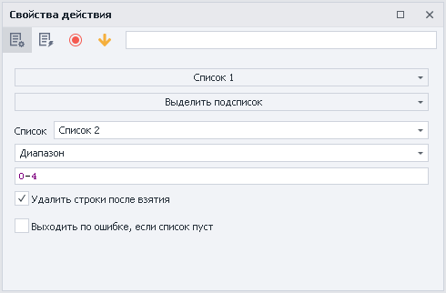

[❗→ Список](/wiki/spaces/RU/pages/534053375 "/wiki/spaces/RU/pages/534053375") 1

До обработки 

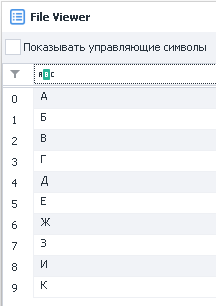

После отработки

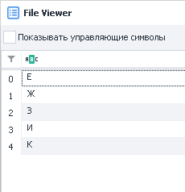

[❗→ Список](/wiki/spaces/RU/pages/534053375 "/wiki/spaces/RU/pages/534053375") 2

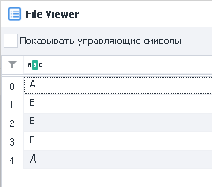

  

### Добавить данные из списка

Добавление данных из одного списка в другой.

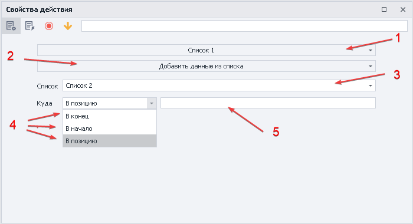

1. Выбираем список с которым будем работать
2. Устанавливаем функцию.
3. Указываем откуда будет перенесены строки.
4. В какую позицию помещен результат - *в конец, *в начало, *в позицию.
5. Если выбрали *в позицию, то указываем номер строки или переменную.

:::note На заметку
Строки копируются, но не удаляются из исходного списка.
:::

Пример

Добавим строки из [❗→ списка](/wiki/spaces/RU/pages/534053375 "/wiki/spaces/RU/pages/534053375") 2 в конец [❗→ списка](/wiki/spaces/RU/pages/534053375 "/wiki/spaces/RU/pages/534053375") 1

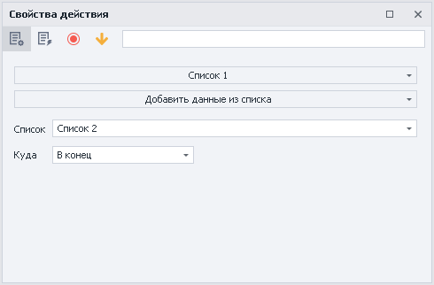

[❗→ Список](/wiki/spaces/RU/pages/534053375 "/wiki/spaces/RU/pages/534053375") 2

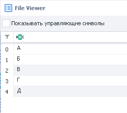

[❗→ Список](/wiki/spaces/RU/pages/534053375 "/wiki/spaces/RU/pages/534053375") 1

До обработки

После обработки

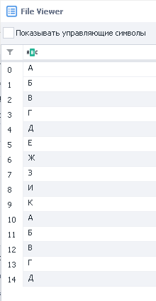

Элементы списка 2 остаются на месте

  

### Добавить строку

Добавление строки в список.

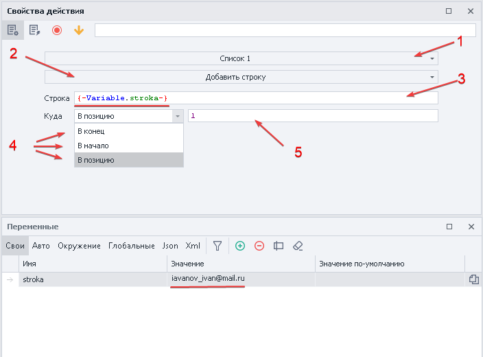

1. Выбираем список с которым будем работать
2. Устанавливаем функцию.
3. Вносим значение или переменную.
4. В какую позицию поместить результат - *в конец, *в начало, *в позицию.
5. Если выбрали *в позицию, то указываем номер строки или переменную.

Пример

Положим значение в конец [❗→ списка](/wiki/spaces/RU/pages/534053375 "/wiki/spaces/RU/pages/534053375") 1

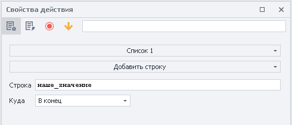

[❗→ Список](/wiki/spaces/RU/pages/534053375 "/wiki/spaces/RU/pages/534053375") 1

До обработки

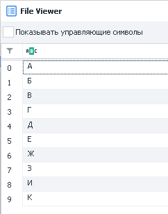

После обработки

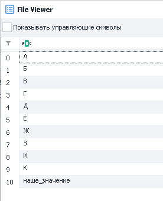

  

### Добавить текст

Добавление текста в список.

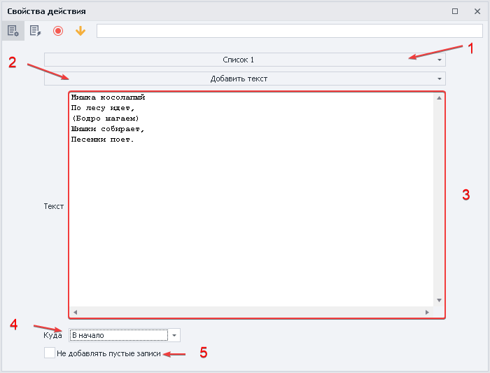

1. Выбираем список с которым будем работать
2. Устанавливаем функцию.
3. Текст или набор символов для добавления в список, можно указать переменную.
4. В какую позицию помещен результат - *в конец, *в начало, *в позицию.
5. Добавлять пустые строки в случае отсутствия текста.

Пример

Добавим текст в [❗→ список](/wiki/spaces/RU/pages/534053375 "/wiki/spaces/RU/pages/534053375") 1

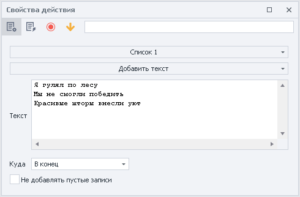

[❗→ Список](/wiki/spaces/RU/pages/534053375 "/wiki/spaces/RU/pages/534053375") 1

До обработки

После обработки

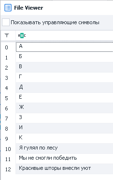

Текст имел разделитель - новая строка, поэтому в список он добавлен построчно

  

### Объединить элементы списка

Объединение элементов списка с указанием разделителя и возможностью записи в переменную.

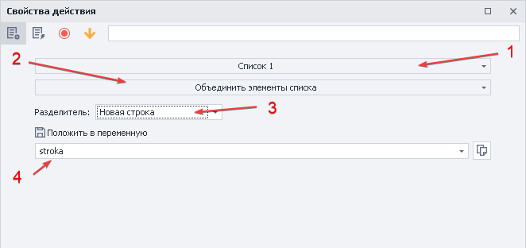

1. Выбираем список с которым будем работать
2. Устанавливаем функцию.
3. Разделитель строк 
a) *Новая строка - каждый элемент списка будет записан с новой строки.
b) *Свой - указываем свой текст или символы, которые будут вставлены между элементами списка.
c) *Указанный в списке - используется разделитель из [❗→ настроек списка](/wiki/spaces/RU/pages/534053375 "/wiki/spaces/RU/pages/534053375").
4. Переменная для записи данных после обработки.

Пример

Объединить элементы [❗→ списка](/wiki/spaces/RU/pages/534053375 "/wiki/spaces/RU/pages/534053375") 1, используя свой разделить “-;“

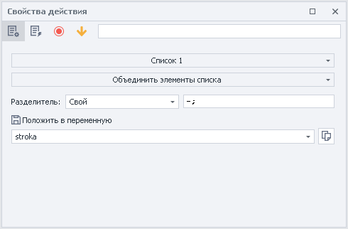

Содержание [❗→ списка](/wiki/spaces/RU/pages/534053375 "/wiki/spaces/RU/pages/534053375") 1

Результат обработки списка будет в переменной *stroka

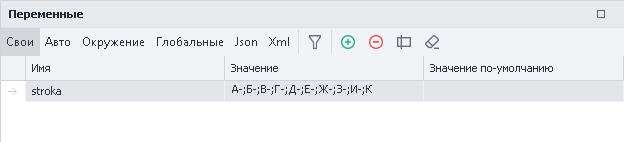

  

### Перемешать элементы списка

Расположение элементов в списке в случайном порядке.

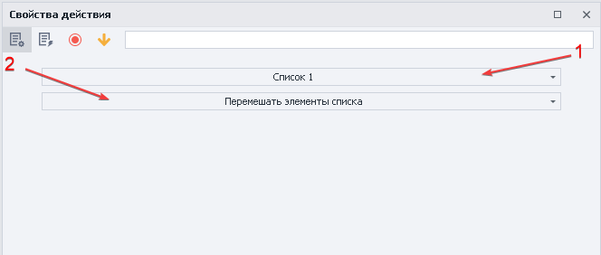

1. Выбираем список с которым будем работать
2. Устанавливаем функцию.

:::note На заметку
Изменение позиции не влечет за собой потери значений строки.
:::

Пример

Перемешать элементы [❗→ списка](/wiki/spaces/RU/pages/534053375 "/wiki/spaces/RU/pages/534053375") 1

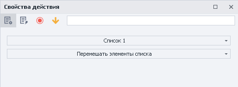

[❗→ Список](/wiki/spaces/RU/pages/534053375 "/wiki/spaces/RU/pages/534053375") 1

До обработки

После обработки

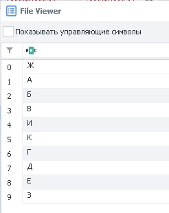

  

### Получить количество строк

Получение количества строк в списке.

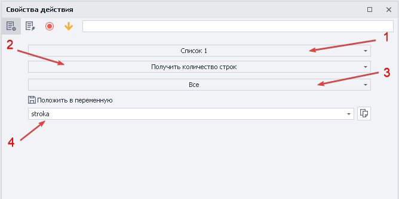

1. Выбираем список с которым будем работать
2. Устанавливаем функцию.
3. Критерии для поиска (можно указать переменную) : 
a) Все
b) Не содержат текст
c) Не удовлетворяет [❗→ регулярному выражению](/wiki/spaces/RU/pages/534086111 "/wiki/spaces/RU/pages/534086111")
d) Со значением
e) Содержат текст
f) Удовлетворяет [❗→ регулярному выражению](/wiki/spaces/RU/pages/534086111 "/wiki/spaces/RU/pages/534086111")
4. Переменная для записи данных после обработки.

:::note На заметку
Переменная всегда будет содержать только цифровое значение
:::

Пример

Посчитать количество строк [❗→ списка](/wiki/spaces/RU/pages/534053375 "/wiki/spaces/RU/pages/534053375") 1 и положить в переменную

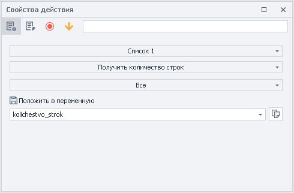

Содержание [❗→ списка](/wiki/spaces/RU/pages/534053375 "/wiki/spaces/RU/pages/534053375") 1

Результат обработки списка будет в переменной kolichestvo\_strok

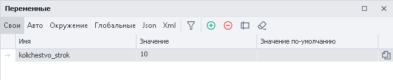

  

### Получить строку

Получение строки с возможностью удаления из списка и записью в переменную.

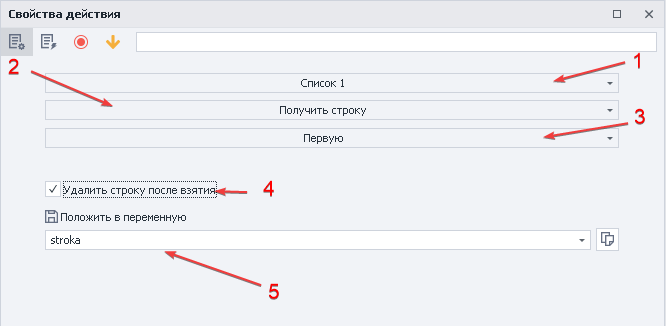

1. Выбираем список с которым будем работать
2. Устанавливаем функцию.
3. Критерии строки (можно указать переменную) : 
a) Не содержит текст
b) Не удовлетворяет [❗→ регулярному выражению](/wiki/spaces/RU/pages/534086111 "/wiki/spaces/RU/pages/534086111")
c) Первую
d) По номеру
e) Случайную
f) Удовлетворяет [❗→ регулярному выражению](/wiki/spaces/RU/pages/534086111 "/wiki/spaces/RU/pages/534086111")
4. Удалить строку после взятия
5. Переменная для записи значения.

Пример

Получить случайную строку из [❗→ списка](/wiki/spaces/RU/pages/534053375 "/wiki/spaces/RU/pages/534053375") 1 в переменную

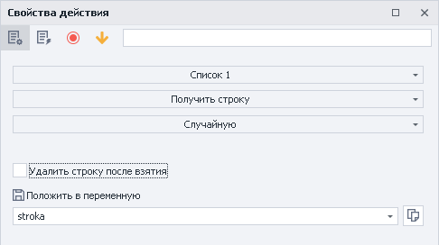

Содержание [❗→ списка](/wiki/spaces/RU/pages/534053375 "/wiki/spaces/RU/pages/534053375") 1

Результат обработки списка будет в переменной stroka

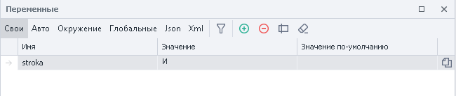

  

### Привязать к файлу

Привязка списка к файлу в ходе выполнения проекта.

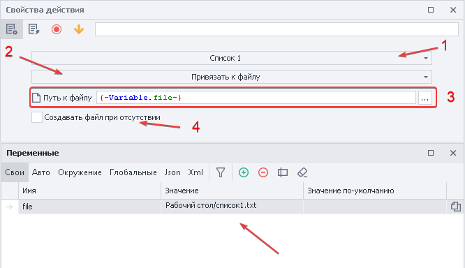

1. Выбираем список с которым будем работать
2. Устанавливаем функцию.
3. Выбираем файл или указываем переменную, содержащую путь к файлу.
4. Если файл отсутствует по указанному пути, **ZennoPoster** автоматически создаст его.

Пример

Привязать файл к [❗→ списку](/wiki/spaces/RU/pages/534053375 "/wiki/spaces/RU/pages/534053375") 1

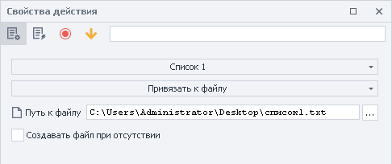

[❗→ Список](/wiki/spaces/RU/pages/534053375 "/wiki/spaces/RU/pages/534053375") 1 будет привязан к соответствующему файлу

  

### Сортировать

Сортировка элементов списка по убыванию или возрастанию.

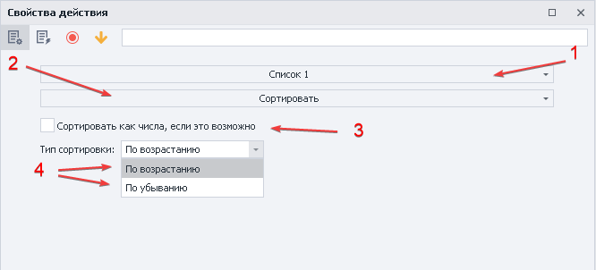

1. Выбираем список с которым будем работать
2. Устанавливаем функцию.
3. Использовать принцип как у чисел.
4. Задаём тип сортировки *по убыванию или *возрастанию.

:::info Информация
Не всегда буквенные и символьные строки можно упорядочить
:::

Пример

Сортировать значения [❗→ списка](/wiki/spaces/RU/pages/534053375 "/wiki/spaces/RU/pages/534053375") 1 по убыванию

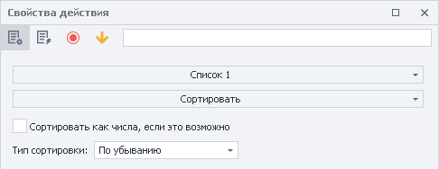

[❗→ Список](/wiki/spaces/RU/pages/534053375 "/wiki/spaces/RU/pages/534053375") 1

До обработки

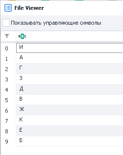

После обработки

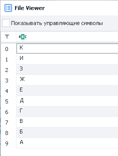

  

### Сохранить в файл

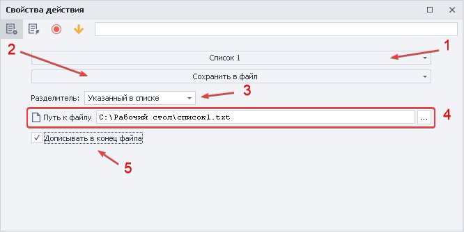

1. Выбираем список с которым будем работать
2. Устанавливаем функцию.
3. Устанавливаем разделитель (можно использовать переменные) : 
a) *Новая строка
b) *Свой
c) *Указанный в списке
4. Выбираем файл или указываем переменную, содержащую путь к файлу.
5. Чек-бокс позволяет записывать новые данные в файл или перезаписывать его полностью.

Пример

Сохранить значения [❗→ списка](/wiki/spaces/RU/pages/534053375 "/wiki/spaces/RU/pages/534053375") 1 в файл

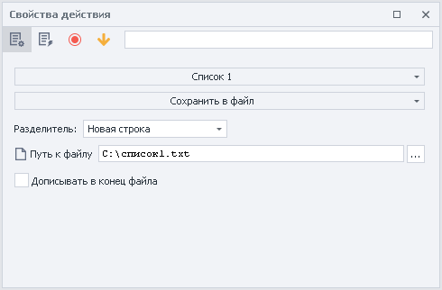

Содержание [❗→ списка](/wiki/spaces/RU/pages/534053375 "/wiki/spaces/RU/pages/534053375") 1

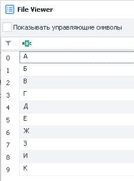

После выполнения в файл будут записаны все значения

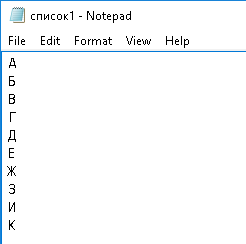

  

### Удалить дубли

Удаление повторяющихся строк в списке.

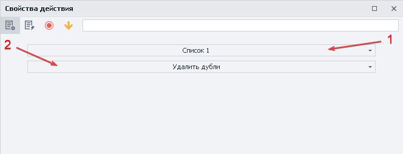

1. Выбираем список с которым будем работать
2. Устанавливаем функцию.

:::note На заметку
Для обработки файла с большим количеством строк может потребоваться время.
:::

Пример

Удалить все дубли в [❗→ списке](/wiki/spaces/RU/pages/534053375 "/wiki/spaces/RU/pages/534053375") 1

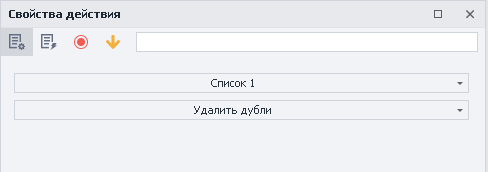

[❗→ Список](/wiki/spaces/RU/pages/534053375 "/wiki/spaces/RU/pages/534053375") 1

До обработки

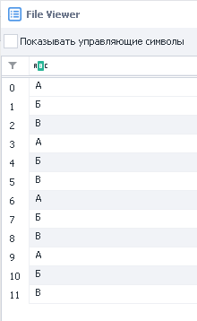

После обработки

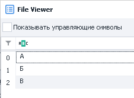

  

### Удалить строки

Удаление строк из списка с заданными критериями

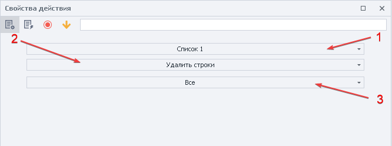

1. Выбираем список с которым будем работать
2. Устанавливаем функцию.
3. Критерии удаления строк (можно использовать переменные) :
a) Все
b) Не содержащие текст
c) Не удовлетворяющие [❗→ регулярному выражению](/wiki/spaces/RU/pages/534086111 "/wiki/spaces/RU/pages/534086111")
d) Первую
e) Под номерами (можно использовать [❗→ диапазоны](/wiki/spaces/RU/pages/488964137 "/wiki/spaces/RU/pages/488964137"))
f) Со значением
g) Содержащие текст
h) Содержащие только пробельные символы
i) Удовлетворяющие [❗→ регулярному выражению](/wiki/spaces/RU/pages/534086111 "/wiki/spaces/RU/pages/534086111")

Пример

Удалить из [❗→ списка](/wiki/spaces/RU/pages/534053375 "/wiki/spaces/RU/pages/534053375") 1 строки содержащие символ @ 

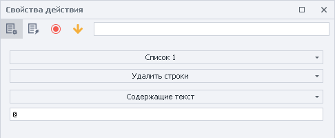

[❗→ Список](/wiki/spaces/RU/pages/534053375 "/wiki/spaces/RU/pages/534053375") 1

До обработки

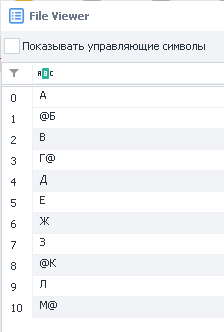

После обработки

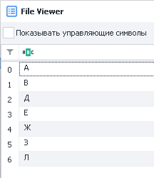

  

## Пример использования

Представим, что Вам необходимо перейти по всем страницам из списка, собрать их названия и положить в другой список.

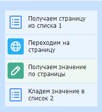

1. Создаём [❗→ Список](/wiki/spaces/RU/pages/534053375 "/wiki/spaces/RU/pages/534053375")\_1 со страницами предварительно привязав его к файлу.
2. Удаляем дубли, чтобы не переходить на страницу дважды.
3. Создаём и привязываем к файлу [❗→ Список](/wiki/spaces/RU/pages/534053375 "/wiki/spaces/RU/pages/534053375")\_2.
4. Парсим необходимую информацию со страниц в [❗→ Список](/wiki/spaces/RU/pages/534053375 "/wiki/spaces/RU/pages/534053375")\_2.
5. Удаляем дубли.

Таким образом, вы можете формировать списки нужной информации для дальнейшей обработки их или использования.

  

## Полезные ссылки

1. [❗→ Окно переменных](/wiki/spaces/RU/pages/735608872 "/wiki/spaces/RU/pages/735608872")
2. [❗→ Тестер регулярных выражений](/wiki/spaces/RU/pages/534086111 "/wiki/spaces/RU/pages/534086111")
3. [❗→ Список](/wiki/spaces/RU/pages/534053375 "/wiki/spaces/RU/pages/534053375")