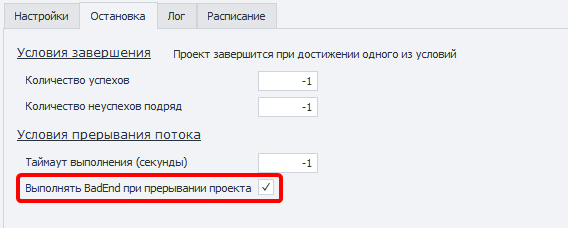

:::info **Пожалуйста, ознакомьтесь с [*Правилами использования материалов на данном ресурсе*](../Disclaimer).**
:::

> 🔗 **[Оригинальная страница](https://zennolab.atlassian.net/wiki/spaces/RU/pages/534020265/BadEnd)** — Источник данного материала

_______________________________________________  
# BadEnd (выход при возникновении ошибки в проекте)

## Описание

Если в каком-то из экшенов возникает ошибка или выход из кубика происходит по красной ветке, то выполнение проекта перейдёт в блок, который привязан к действию Bad End. Это необходимо для того, чтобы можно было задать какие-то дополнительные действия в случае завершения работы шаблона с ошибкой.

## Как добавить действие в проект?

Через контекстное меню **Добавить действие** → **Логика** → **BadEnd**


Либо воспользуйтесь [❗→ умным поиском](https://zennolab.atlassian.net/wiki/spaces/RU/pages/506200090/ProjectMaker+7#%D0%A3%D0%BC%D0%BD%D1%8B%D0%B9-%D0%BF%D0%BE%D0%B8%D1%81%D0%BA-%D0%B4%D0%B5%D0%B9%D1%81%D1%82%D0%B2%D0%B8%D0%B9 "https://zennolab.atlassian.net/wiki/spaces/RU/pages/506200090/ProjectMaker+7#%D0%A3%D0%BC%D0%BD%D1%8B%D0%B9-%D0%BF%D0%BE%D0%B8%D1%81%D0%BA-%D0%B4%D0%B5%D0%B9%D1%81%D1%82%D0%B2%D0%B8%D0%B9").

## Для чего это используется?

При работе шаблона могут возникнуть непредвиденные ошибки, например: 

- Если изменилась верстка на сайте и шаблон теперь не может найти нужный HTML элемент
- Не до конца продуманная логика шаблона, не предусматривающая определенные ситуации

Из-за этого проект не будет выполнен до конца и сразу завершит свою работу. Чтобы исключить такие ситуации, можно использовать Bad End для:

- Возврата данных обратно в списки / таблицы для последующего их использования без потери.
- Логирования ошибок
- Добавления в Blacklist невалидной информации
- Сохранения бэкапа

## Как работать с экшеном?

В случае завершения шаблона ошибкой, выполнятся действия, привязанные к Bad End:


Также, Bad End сработает при прерывании шаблона или по истечению глобального [❗→ таймаута выполнения](https://zennolab.atlassian.net/wiki/spaces/RU/pages/852885665 "https://zennolab.atlassian.net/wiki/spaces/RU/pages/852885665"). За это отвечает настройка в ZennoPoster - “[❗→ Выполнять BadEnd при прерывании проекта](https://zennolab.atlassian.net/wiki/spaces/RU/pages/852885665 "https://zennolab.atlassian.net/wiki/spaces/RU/pages/852885665")“:




:::info Информация
Bad End срабатывает 1 раз для каждого потока.
:::

  

## Многократный переход в BadEnd при отладке проекта

По умолчанию, при отладке проект переходит в Bad/GoodEnd только один раз. Затем нужно перезапустить проект кнопкой “С начала”.
Для возможности многократного перехода в эти экшены при отладке нужно включить опцию [❗→ Переходить в Bad/GoodEnd при многократной отладке](https://zennolab.atlassian.net/wiki/spaces/RU/pages/725352498#%D0%9F%D0%B5%D1%80%D0%B5%D1%85%D0%BE%D0%B4%D0%B8%D1%82%D1%8C-%D0%B2-Bad%2FGoodEnd-%D0%BF%D1%80%D0%B8-%D0%BC%D0%BD%D0%BE%D0%B3%D0%BE%D0%BA%D1%80%D0%B0%D1%82%D0%BD%D0%BE%D0%B9-%D0%BE%D1%82%D0%BB%D0%B0%D0%B4%D0%BA%D0%B5 "https://zennolab.atlassian.net/wiki/spaces/RU/pages/725352498#%D0%9F%D0%B5%D1%80%D0%B5%D1%85%D0%BE%D0%B4%D0%B8%D1%82%D1%8C-%D0%B2-Bad%2FGoodEnd-%D0%BF%D1%80%D0%B8-%D0%BC%D0%BD%D0%BE%D0%B3%D0%BE%D0%BA%D1%80%D0%B0%D1%82%D0%BD%D0%BE%D0%B9-%D0%BE%D1%82%D0%BB%D0%B0%D0%B4%D0%BA%D0%B5") в настройках программы.

  

## Пример использования

### Восстановление данных в случае ошибки

Например, для работы мы берём из списка строку с удалением. Если в процессе работы шаблон завершился с какой-либо ошибкой, до того, как мы обработали эту строку, то эти данные будут утеряны. Чтобы этого не произошло, используем Bad End и добавляем к нему действие добавления строки обратно в список. Таким образом при неудачном завершении работы необработанные данные будут сохранены назад в список для последующей обработки.

### Как отследить и исправить ошибку?

Каждый шаг в шаблоне имеет уникальный идентификатор, по которому его можно найти в ProjectMaker'e. Для того чтобы получить id шага с ошибкой, необходимо в логах ZennoPoster, кликнуть по ошибке правой кнопкой мыши и нажать «*скопировать id действия»:


Далее в ProjectMaker'e вызвать поиск (Ctrl + F), вставить полученный ID и нажать кнопку “Найти“. Программа выделит проблемный экшен синей рамкой:


Либо воспользоваться опцией “Показать ошибочное действие в PM“, которое сразу откроет проект в ProjectMaker с выделенным действием, которое вызвало ошибку при выполнении:


Но за всеми ошибками сложно уследить, поэтому мы рекомендуем логировать их в файл. Чтобы создать файл лога, в который запишется ошибка при выполнении проекта, необходимо после Bad End добавить кубик Записать в файл и вставить в него следующий текст:

```json
{ -TimeNow.Date- } { -Project.LastExecutedActionId- }
```


Теперь при возникновении ошибки в шаблоне, Bad End создаст файл log.txt, в который запишется время и ID ошибки. Если одного только идентификатора мало для устранения проблемы, Вы можете добавить сохранение [❗→ скриншота инстанса](https://zennolab.atlassian.net/wiki/spaces/RU/pages/488865806 "https://zennolab.atlassian.net/wiki/spaces/RU/pages/488865806"), [❗→ исходного кода страницы](https://zennolab.atlassian.net/wiki/spaces/RU/pages/735608872 "https://zennolab.atlassian.net/wiki/spaces/RU/pages/735608872") и [❗→ значения переменных](https://zennolab.atlassian.net/wiki/spaces/RU/pages/735608872 "https://zennolab.atlassian.net/wiki/spaces/RU/pages/735608872"). Это позволит максимально подробно восстановить картину, которая привела к ошибке, и внести необходимые правки для нормализации работы проекта.

### Добавление в Blacklist невалидной информации

Можно создать список для хранения невалидной информации, приводящей к ошибкам. Например, неверный логин \ пароль к аккаунту. При последующей работе шаблона проверять наличие данных в Blacklist’e и в случае совпадения производить замену.


### Сохранения бэкапа

Сохранить рабочий профиль, чтобы в случае возникновения ошибки не потерять его. А после устранения проблемы загрузить его и продолжить работу. 


  

## Полезные ссылки

- [❗→ GoodEnd (успешный выход в проекте)](https://zennolab.atlassian.net/wiki/spaces/RU/pages/534085881 "https://zennolab.atlassian.net/wiki/spaces/RU/pages/534085881")