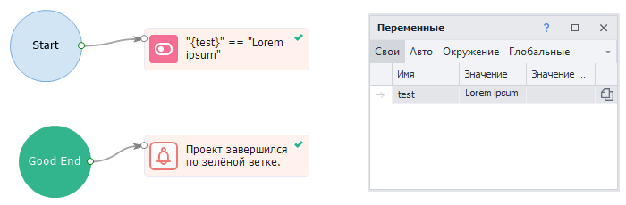

---
sidebar_position: 7
title: "GoodEnd"
description: ""
date: "2025-08-04"
converted: true
originalFile: "GoodEnd (успешный выход в проекте).txt"
targetUrl: "https://zennolab.atlassian.net/wiki/spaces/RU/pages/534085881/GoodEnd"
---
import DisclaimerNotice from '@site/src/components/DisclaimerNotice';

<DisclaimerNotice />

> 🔗 **[Оригинальная страница](https://zennolab.atlassian.net/wiki/spaces/RU/pages/534085881/GoodEnd)** — Источник данного материала

_______________________________________________  
## Описание
Данное действие предназначено для выполнения каких-либо дополнительных действий после удачного выполнения проекта.  
Может работать в связке с экшеном [**Bad End**](./BadEnd).  

### Как добавить действие в проект?
Через контекстное меню: **Добавить действие** → **Логика** → **GoodEnd**

_______________________________________________
## Принцип работы
Если последний кубик проекта завершится по зеленой ветке, то выполнение перейдет к действию, связанному с **GoodEnd**.  

### Многократный переход в GoodEnd.  
При отладке проект переходит в *GoodEnd* по умолчанию только один раз. Затем нужно перезапустить проект кнопкой **С начала**.  
Для возможности переходить в *GoodEnd* несколько раз подряд нужно включить в *Настройках* опцию [**Переходить в Bad/GoodEnd при многократной отладке**](../../Settings/Debugging).  

