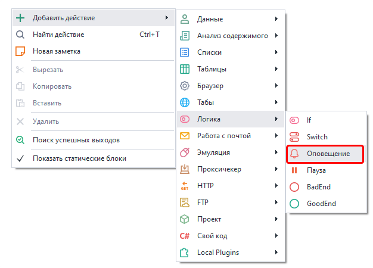
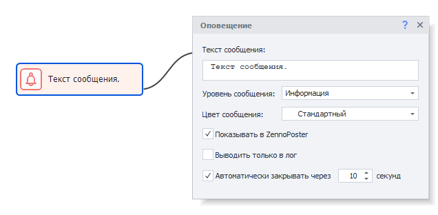
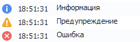
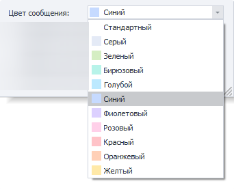
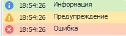
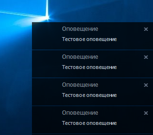

---
sidebar_position: 3
title: "Оповещение (Запись в лог)"
description: ""
date: "2025-08-04"
converted: true
originalFile: "Оповещение (NotificationЗапись в лог).txt"
targetUrl: "https://zennolab.atlassian.net/wiki/spaces/RU/pages/534053050/Notification"
---
import DisclaimerNotice from '@site/src/components/DisclaimerNotice';

<DisclaimerNotice />

> 🔗 **[Оригинальная страница](https://zennolab.atlassian.net/wiki/spaces/RU/pages/534053050/Notification)** — Источник данного материала

_______________________________________________  
## Описание
С помощью этого действия можно оповещать пользователя о событиях, происходящих в проекте. Сообщения будут отображаться в [**Окне лога**](../../pm/Interface/Log_window).  

Используется для:  
- Логирования действий в шаблоне;  
- Оповещения пользователей об изменениях;  
- Сообщения о версии шаблона и этапах его работы;  
- Уведомления о количестве обработанных данных.  

### Как добавить действие в проект?
Через контекстное меню: **Добавить действие** → **Логика** → **Оповещение**

_______________________________________________
## Принцип работы

### Текст сообщения
Сюда мы пишем текст, который отобразится у пользователя. Можно использовать макросы.

### Уровень сообщения
Они отличаются только иконками, которые отображаются перед сообщением.

:::tip В [Окне лога](/zennoposter/ProjectMaker/Program-interface/Log_Window) можно сортировать сообщения по типу.
:::

### Цвет сообщения
:::info Добавлено в ZennoPoster 7.2.1.0
:::

Задает цвет фона для оповещения. 

> В [Окне лога](/zennoposter/ProjectMaker/Program-interface/Log_Window) также можно сортировать по цвету. 

### Показывать в ZennoPoster
Если поставить галочку, то уведомления также будут приходить и в ZennoPoster, а не только в ProjectMaker.

### Выводить только в лог
Когда эта опция **выключена**, оповещения будут всплывать прямо на рабочем столе.

:::info **Важно.**  
Если же в настройках программы уже включена опция ***Выводить оповещение только в лог***, то уведомлений на рабочем столе вы не увидите в любом случае.  
:::  

#### Автоматически закрывать через N секунд.  
Задаем время, которое оповещение будет висеть на рабочем столе после всплытия.
_______________________________________________

## Полезные ссылки

- [❗→ Обработка переменных](https://zennolab.atlassian.net/wiki/spaces/RU/pages/486309922 "https://zennolab.atlassian.net/wiki/spaces/RU/pages/486309922")
- [❗→ Окно лога](https://zennolab.atlassian.net/wiki/spaces/RU/pages/725352532 "https://zennolab.atlassian.net/wiki/spaces/RU/pages/725352532")