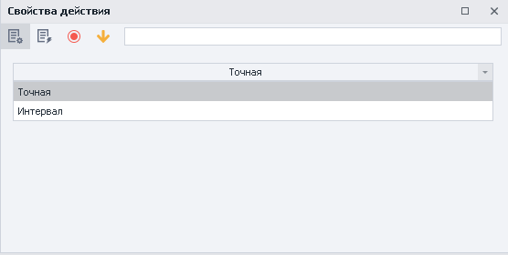
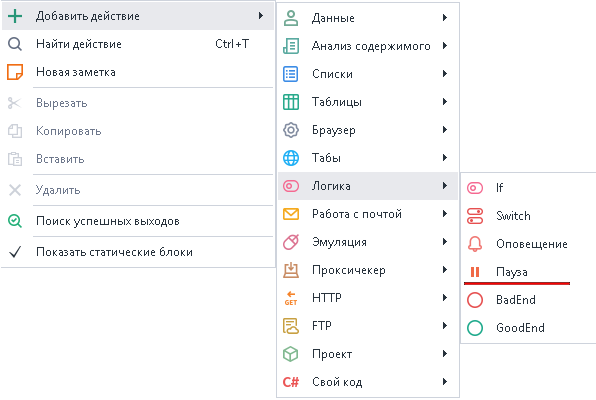
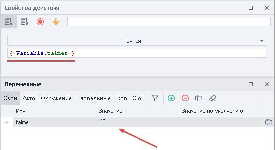
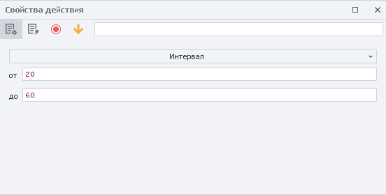
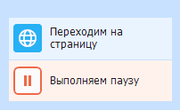

---
sidebar_position: 4
title: "Пауза"
description: ""
date: "2025-08-04"
converted: true
originalFile: "Пауза.txt"
targetUrl: "https://zennolab.atlassian.net/wiki/spaces/RU/pages/534053057"
---
import DisclaimerNotice from '@site/src/components/DisclaimerNotice';

<DisclaimerNotice />

> 🔗 **[Оригинальная страница](https://zennolab.atlassian.net/wiki/spaces/RU/pages/534053057)** — Источник данного материала

_______________________________________________  
## Описание
Данное действие позволяет останавливать выполнение проекта на заданный в секундах промежуток времени.  

Используется для:  
- Ожидания полной загрузки приложения;  
- Создания человеческого поведения с помощью случайных пауз;  
- Задания промежутка времени между выполнениями действий;  

### Как добавить действие в проект?
Через контекстное меню: **Добавить действие** → **Логика** → **Пауза**

_______________________________________________ 
## Принцип работы
:::info Устанавливается в секундах.
Поэтому значение должно быть цифровым, если используются переменные.
:::

### **Точная** 
Проект остановит выполнение на указанное количество секунд. Значение можно задать вручную или через переменную.

### **Интервал**
Указывается пауза в заданном цифровом промежутке, можно использовать переменные.

- **От** — минимальное время в секундах.
- **До** — максимальная пауза в секундах (**НЕ ВКЛЮЧИТЕЛЬНО**).

Например, после настроек со скриншота проект уйдет в ожидание на время, выбранное случайным образом из диапазона от 20 до 59 секунд.
_______________________________________________ 
## Пример использования
Допустим, что нам нужно сделать несколько однотипных действий в приложении. Чтобы они не выглядели роботизировано из-за молниеносного выполнения, мы рекомендуем делать случайные паузы между действиями.  

Это может выглядеть вот так:  
1. Открываем приложение.  
2. Выполняем необходимые действия.  
3. Задаем паузу в интервале.  
4. Снова выполняем действия.  

Таким образом, выдерживая паузы между действиями, мы даем понять сайту, что работает *живой* пользователь, а не бот.
_______________________________________________ 
## Полезные ссылки

1. [❗→ Переход на страницу](https://zennolab.atlassian.net/wiki/spaces/RU/pages/534052989/Navigate "https://zennolab.atlassian.net/wiki/spaces/RU/pages/534052989/Navigate")