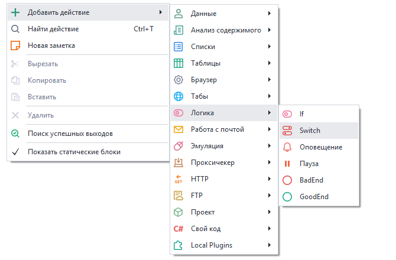
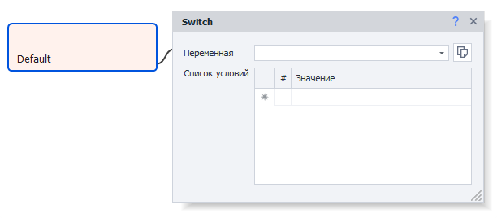
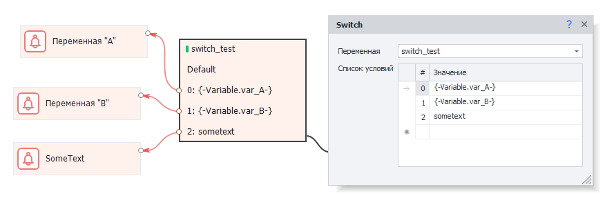
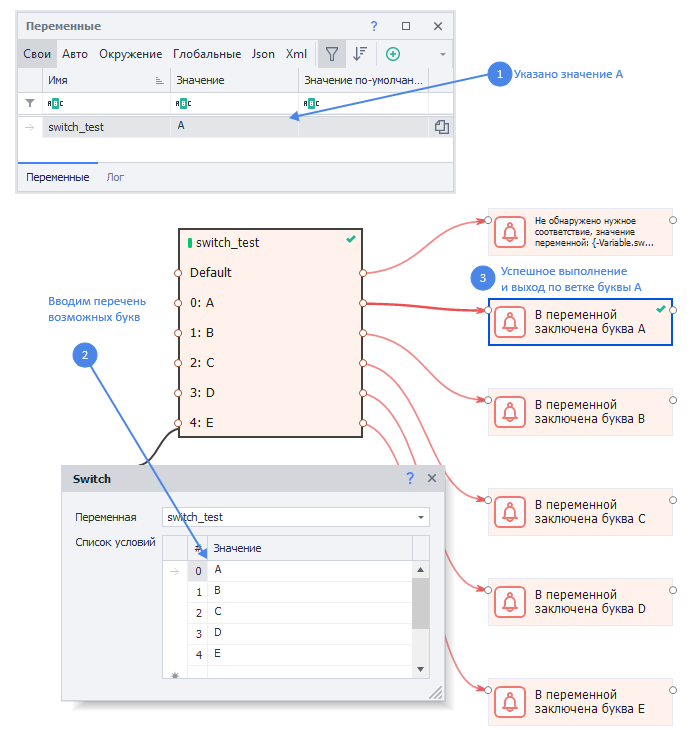

---
sidebar_position: 2
title: "Switch (выбор из нескольких вариантов)"
description: ""
date: "2025-08-04"
converted: true
originalFile: "Switch (выбор из нескольких вариантов).txt"
targetUrl: "https://zennolab.atlassian.net/wiki/spaces/RU/pages/534085864/Switch"
---
import DisclaimerNotice from '@site/src/components/DisclaimerNotice';

<DisclaimerNotice />

> 🔗 **[Оригинальная страница](https://zennolab.atlassian.net/wiki/spaces/RU/pages/534085864/Switch)** — Источник данного материала

_______________________________________________  

export const VideoSample = ({source}) => (
  <video controls playsInline muted preload="auto" className='docsVideo'>
    <source src={source} type="video/mp4" />
</video>
);

## Описание
Оператор Switch представляет собой расширенную версию [**IF**](./IF_Condition). Вместо двух выходов — ***True*** или ***False*** (*зеленая или красная ветви*), появляется возможность выбрать несколько разных вариантов.  

Если нужный вариант отстутствует, то кубик выйдет по ветке *Default*.  
  
### Как добавить действие в проект?
Через контекстное меню: **Добавить действие** → **Логика** → **Switch**


_______________________________________________ 
## Принцип работы



### Переменная 
Здесь указывается переменная, которую мы будем проверять.

:::tip Теперь в этом поле можно сразу создать переменную
До версии 7.4.0.0 выбор был только из уже существующих.
:::

### Список условий
Тут мы пишем условия для выхода. Значение из *переменной* будет сравниваться с каждым из условий и при нахождении совпадения выйдет по соответствующей ветке.  

В качестве условия для выхода можно использовать не только жестко заданный текст, но и переменные. Как в этом примере: 



#### Выход Default.  
Если не будет найдено ни одного совпадения, то экшен выйдет по ветке ***Default***. Если данная ветка при этом не соединена с экшеном, то появится ошибка.  
_______________________________________________ 
## Примеры использования



Представим ситуацию, в которой у нас существует какое-либо значение у переменной `switch_test`.

Далее создадим операции [Оповещение](./Notification) для каждого из вариантов.

### Видео с примером 
<VideoSample source={require("@site/static/video/Switch.mp4").default}/> 

### Пример на C#
Также подобный функционал можно реализовать через [C# код](../Custom_code/CSharp_Code):

```csharp
string switch_var = project.Variables["switch_test"].Value;
switch(switch_var){
case "A": 
	project.SendInfoToLog("В переменной заключена буква A", true);
	break;
case "B": 
	project.SendInfoToLog("В переменной заключена буква B", true);
	break;
case "C": 
	project.SendInfoToLog("В переменной заключена буква C", true);
	break;
case "D": 
	project.SendInfoToLog("В переменной заключена буква B", true);
	break;
case "E": 
	project.SendInfoToLog("В переменной заключена буква E", true);
	break;
default:
	project.SendInfoToLog("Не обнаружено нужное соответствие, значение переменной: " + project.Variables["switch_test"].Value, true);
	break;
}
```

_______________________________________________ 
## Полезные ссылки

- [❗→ Обработка переменных](https://zennolab.atlassian.net/wiki/spaces/RU/pages/486309922 "https://zennolab.atlassian.net/wiki/spaces/RU/pages/486309922")
- [❗→ Окно переменных](https://zennolab.atlassian.net/wiki/spaces/RU/pages/735608872 "https://zennolab.atlassian.net/wiki/spaces/RU/pages/735608872")
- [❗→ IF (условие "Если ... то ...")](https://zennolab.atlassian.net/wiki/spaces/RU/pages/534315151 "https://zennolab.atlassian.net/wiki/spaces/RU/pages/534315151")
- [❗→ Оповещение (Notification/Запись в лог)](https://zennolab.atlassian.net/wiki/spaces/RU/pages/534053050 "https://zennolab.atlassian.net/wiki/spaces/RU/pages/534053050")