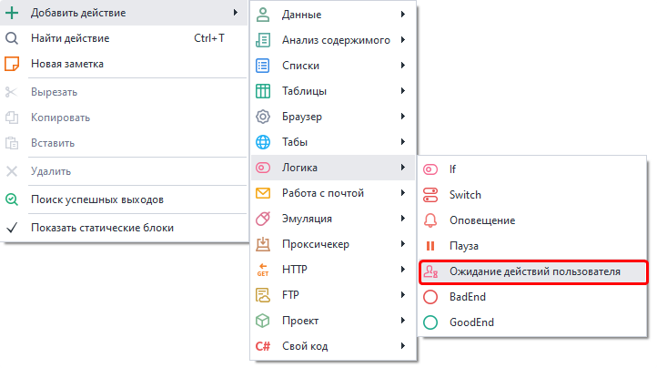
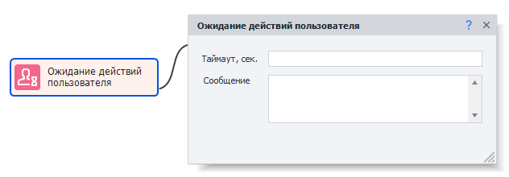
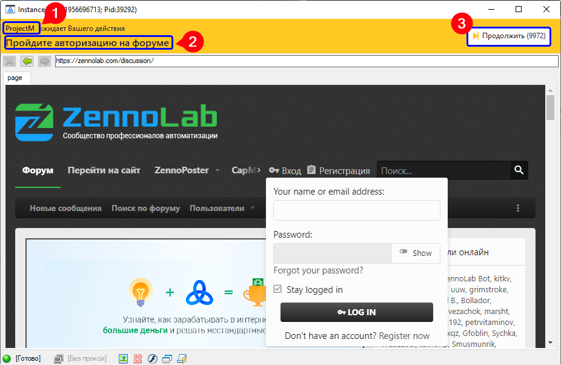

---
sidebar_position: 5
title: "Ожидание действий пользователя"
description: ""
date: "2025-08-04"
converted: true
originalFile: "Ожидание действий пользователя.txt"
targetUrl: "https://zennolab.atlassian.net/wiki/spaces/RU/pages/2110259201"
---
import DisclaimerNotice from '@site/src/components/DisclaimerNotice';

<DisclaimerNotice />

> 🔗 **[Оригинальная страница](https://zennolab.atlassian.net/wiki/spaces/RU/pages/2110259201)** — Источник данного материала

_______________________________________________  
:::info Добавлено в ZennoPoster 7.7.0.0  
В предыдущих версиях это действие было одной из подфункций экшена «Настройки браузера».
:::

## Описание
Экшен используется в тех случаях, когда нужно вручную провести какие-то действия внутри браузера ZennoPoster.  

Он полезен, например, когда пользователи шаблона боятся сохранять данные для входа на сайты или информацию кредитных карт.

### Как добавить действие в проект?
Через контекстное меню **Добавить действие** → **Логика** → **Ожидание действий пользователя**

_______________________________________________ 
## Принцип работы

### Таймаут
Устанавливаем количество секунд, в течение которых должны быть выполнены все необходимые действия. 

> *Если длительность неизвестна, просто укажите `99999`*.  

По истечению таймаута шаблон продолжит работу дальше.

### Сообщение
Данный текст будет показан пользователю в верхней части открывшегося окна инстанса.
_______________________________________________
## Окно ожидания действий  
После запуска экшена откроется окно браузера:  

В верхней части (на оранжевом фоне) находятся:  
- **название проекта(1)**, который вызвал это окно;  
- **текст, заданный в экшене(2)**;
- **кнопка «Продолжить»(3)** c количеством оставшихся секунд в скобках до автоматического закрытия.
_______________________________________________
## Полезные ссылки

- [❗→ Настройки браузера](https://zennolab.atlassian.net/wiki/spaces/RU/pages/489324572 "https://zennolab.atlassian.net/wiki/spaces/RU/pages/489324572")